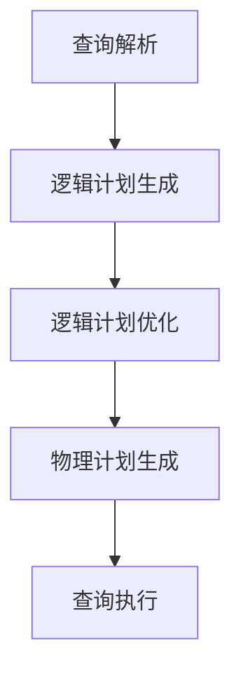

# Spark SQL原理与代码实例讲解

## 1.背景介绍

在大数据处理领域，Apache Spark 已经成为了一个不可或缺的工具。Spark SQL 是 Spark 生态系统中的一个重要组件，它提供了对结构化数据的支持，并且允许用户使用 SQL 查询来处理数据。Spark SQL 的出现极大地简化了大数据处理的复杂性，使得数据分析师和工程师能够更高效地进行数据操作。

Spark SQL 的核心在于其强大的查询优化器 Catalyst 和高效的执行引擎 Tungsten。通过这些组件，Spark SQL 能够在处理大规模数据时提供卓越的性能和灵活性。

## 2.核心概念与联系

### 2.1 DataFrame 和 Dataset

DataFrame 是 Spark SQL 中的核心数据结构，它类似于传统数据库中的表格。DataFrame 是一个分布式数据集合，具有命名列。Dataset 是 DataFrame 的扩展，提供了类型安全的 API。

### 2.2 Catalyst 优化器

Catalyst 是 Spark SQL 的查询优化器，它使用规则和代数转换来优化查询。Catalyst 的设计使得它能够轻松地扩展和添加新的优化规则。

### 2.3 Tungsten 执行引擎

Tungsten 是 Spark SQL 的执行引擎，旨在通过内存管理和代码生成来提高执行效率。Tungsten 通过减少内存开销和 CPU 使用率来优化查询执行。

### 2.4 Schema 和 Catalog

Schema 是数据的结构定义，Catalog 是存储表和数据库元数据的地方。Spark SQL 使用 Catalog 来管理表和数据库的元数据。

## 3.核心算法原理具体操作步骤

### 3.1 查询解析

查询解析是将 SQL 查询转换为逻辑计划的过程。解析器会将 SQL 查询解析为抽象语法树（AST）。

### 3.2 逻辑计划生成

逻辑计划生成是将 AST 转换为逻辑计划的过程。逻辑计划是查询的高层次表示，不包含具体的执行细节。

### 3.3 逻辑计划优化

逻辑计划优化是通过应用一系列规则来优化逻辑计划的过程。Catalyst 优化器会对逻辑计划进行多次优化，以生成更高效的执行计划。

### 3.4 物理计划生成

物理计划生成是将优化后的逻辑计划转换为物理计划的过程。物理计划包含具体的执行细节，如数据分区和任务调度。

### 3.5 查询执行

查询执行是将物理计划转换为可执行的任务，并在集群上执行这些任务的过程。Tungsten 执行引擎会负责具体的执行细节。



## 4.数学模型和公式详细讲解举例说明

### 4.1 逻辑计划优化中的代数转换

在逻辑计划优化中，Catalyst 使用代数转换来简化和优化查询。例如，投影下推（Projection Pushdown）是一种常见的优化技术，它将投影操作尽可能地提前，以减少数据传输量。

设 $P$ 为投影操作，$F$ 为过滤操作，$R$ 为关系操作，则投影下推可以表示为：

$$
P(F(R)) \rightarrow F(P(R))
$$

### 4.2 物理计划中的代价模型

物理计划生成过程中，Spark SQL 使用代价模型来选择最优的执行计划。代价模型会评估每个物理计划的执行代价，并选择代价最低的计划。

设 $C(p)$ 为物理计划 $p$ 的代价，则最优物理计划 $p^*$ 满足：

$$
p^* = \arg\min_{p} C(p)
$$

## 5.项目实践：代码实例和详细解释说明

### 5.1 环境配置

首先，我们需要配置 Spark SQL 的运行环境。可以使用以下代码来初始化 SparkSession：

```scala
import org.apache.spark.sql.SparkSession

val spark = SparkSession.builder
  .appName("Spark SQL Example")
  .config("spark.some.config.option", "some-value")
  .getOrCreate()
```

### 5.2 加载数据

接下来，我们加载一个示例数据集：

```scala
val df = spark.read.json("examples/src/main/resources/people.json")
```

### 5.3 执行 SQL 查询

我们可以使用 SQL 查询来操作数据：

```scala
df.createOrReplaceTempView("people")

val sqlDF = spark.sql("SELECT name, age FROM people WHERE age > 21")
sqlDF.show()
```

### 5.4 使用 DataFrame API

除了 SQL 查询，我们还可以使用 DataFrame API 来操作数据：

```scala
val filteredDF = df.filter("age > 21").select("name", "age")
filteredDF.show()
```

## 6.实际应用场景

### 6.1 数据仓库

Spark SQL 常用于构建数据仓库，支持复杂的查询和数据分析。通过与 Hive 的集成，Spark SQL 可以直接查询 Hive 表。

### 6.2 实时数据处理

Spark SQL 支持流式数据处理，可以与 Spark Streaming 结合使用，实现实时数据分析。

### 6.3 数据集成

Spark SQL 可以与多种数据源集成，如 HDFS、Cassandra、HBase 等，支持多种数据格式，如 JSON、Parquet、ORC 等。

## 7.工具和资源推荐

### 7.1 Spark 官方文档

Spark 官方文档是学习 Spark SQL 的最佳资源，包含详细的 API 文档和使用示例。

### 7.2 Databricks 社区版

Databricks 提供了一个免费的社区版，可以在线运行 Spark SQL，适合进行实验和学习。

### 7.3 书籍推荐

- 《Learning Spark》：一本全面介绍 Spark 的书籍，适合初学者。
- 《Spark: The Definitive Guide》：一本深入介绍 Spark 各个组件的书籍，适合进阶学习。

## 8.总结：未来发展趋势与挑战

Spark SQL 作为大数据处理的重要工具，未来的发展趋势包括：

### 8.1 性能优化

随着硬件和软件技术的发展，Spark SQL 将继续优化性能，特别是在内存管理和执行效率方面。

### 8.2 更好的集成

Spark SQL 将与更多的数据源和工具集成，提供更强大的数据处理能力。

### 8.3 增强的流处理能力

随着实时数据处理需求的增加，Spark SQL 将进一步增强其流处理能力，提供更高效的实时数据分析。

## 9.附录：常见问题与解答

### 9.1 如何处理数据倾斜？

数据倾斜是指某些分区的数据量过大，导致处理时间过长。可以通过以下方法来处理数据倾斜：

- 使用 `repartition` 或 `coalesce` 重新分区
- 使用 `salting` 技术，将数据分散到多个分区

### 9.2 如何优化查询性能？

可以通过以下方法来优化查询性能：

- 使用缓存（`cache` 或 `persist`）来缓存中间结果
- 使用广播变量（`broadcast`）来优化小表的连接操作
- 调整并行度（`spark.sql.shuffle.partitions`）来优化数据分区

### 9.3 如何处理内存溢出？

内存溢出是指任务执行过程中内存不足，导致任务失败。可以通过以下方法来处理内存溢出：

- 增加执行器内存（`spark.executor.memory`）
- 调整内存管理参数（`spark.memory.fraction` 和 `spark.memory.storageFraction`）
- 优化数据结构，减少内存占用

---

作者：禅与计算机程序设计艺术 / Zen and the Art of Computer Programming