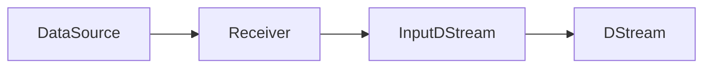

# SparkStreaming的数据源与接口

## 1. 背景介绍

### 1.1 大数据实时处理的重要性

在当今大数据时代,海量数据以前所未有的速度不断产生。企业需要对这些实时数据进行快速分析和处理,以便及时洞察业务趋势,优化决策过程。传统的批处理方式已无法满足实时性要求,因此实时流处理成为大数据领域的重要发展方向。

### 1.2 SparkStreaming的优势

SparkStreaming作为Apache Spark生态系统中的核心组件之一,为大数据实时处理提供了高效、易用的解决方案。它继承了Spark快速、通用、可扩展等特性,并提供了丰富的数据源接口和算子,使得开发者能够方便地构建端到端的实时应用。

### 1.3 数据源和接口的重要性

高质量的数据源和接口是流处理系统的基础。SparkStreaming提供了多样化的内置数据源,涵盖了从日志文件、消息队列到社交媒体等各种场景。同时,其灵活的接口机制也允许用户方便地集成自定义数据源。合理利用和扩展数据源,对于构建健壮的实时应用至关重要。

## 2. 核心概念与联系

### 2.1 DStream

DStream(Discretized Stream)是SparkStreaming的核心抽象,代表持续不断的数据流。它由一系列连续的RDD(弹性分布式数据集)组成,每个RDD包含一个时间间隔内的数据。DStream上的操作转化为对底层RDD的操作。

### 2.2 InputDStream和Receiver

InputDStream是所有输入流的基类,代表从数据源不断接收的输入数据流。具体的数据源由Receiver决定,每个InputDStream都有一个Receiver。系统从Receiver获取数据并封装成DStream进行后续处理。

### 2.3 数据源与DStream的关系

下图展示了SparkStreaming中数据源、Receiver、InputDStream和DStream之间的关系:



## 3. 核心算法原理与具体操作步骤

### 3.1 数据导入原理

SparkStreaming以并行、分布式的方式从数据源持续不断地接收数据并创建DStream。其核心原理可总结为:

1. Receiver以多线程方式并行接收数据,并按照一定的时间间隔(如1秒)将数据打包成数据块;
2. Receiver将数据块封装成RDD,并推送到SparkStreaming系统;  
3. SparkStreaming根据设定的批次间隔(如2秒),将对应时间窗口内的多个RDD合并成一个DStream;
4. 对DStream进行Transformation和Output操作,完成数据处理。

### 3.2 数据导入步骤

使用SparkStreaming接入数据源的一般步骤如下:

1. 创建输入DStream,指定数据源类型和相关参数;
2. 对DStream应用Transformation操作如map、filter等,进行数据转换; 
3. 使用Output操作如print、saveAsTextFiles等,输出和持久化处理结果;
4. 启动Streaming程序,开始接收和处理数据。

以使用socket数据源为例:

```scala
// 创建SparkConf和StreamingContext
val conf = new SparkConf().setAppName("SocketExample")  
val ssc = new StreamingContext(conf, Seconds(5))

// 创建socket输入流
val lines = ssc.socketTextStream("localhost", 9999)  

// 处理输入流数据
val words = lines.flatMap(_.split(" "))
val wordCounts = words.map(x => (x,1)).reduceByKey(_+_) 

// 打印结果
wordCounts.print()

// 启动流计算
ssc.start()
ssc.awaitTermination()
```

## 4. 数学模型和公式详细讲解举例说明

SparkStreaming的数据处理可以用下面的数学模型来描述:

设数据流 $D$ 由一系列的 RDD 组成,即 $D = \{r_1, r_2, ..., r_n\}$,其中 $r_i$ 代表第 $i$ 个时间间隔的数据。

对于Transformation操作 $f$,将其应用于 $D$ 上得到新的数据流 $D'$:

$$D' = f(D) = \{f(r_1), f(r_2), ..., f(r_n)\}$$

常见的Transformation操作包括:

- Map: 对每个元素应用函数 $f$,即 $map(f, r_i) = \{f(x) | x \in r_i\}$
- FlatMap: 对每个元素应用函数 $f$ 并将结果展平,即 $flatMap(f, r_i) = \{y | x \in r_i, y \in f(x)\}$  
- Filter: 过滤满足条件的元素,即 $filter(f, r_i) = \{x | x \in r_i, f(x) = true\}$
- ReduceByKey: 按key进行聚合,即 $reduceByKey(f, r_i) = \{(k,f(v)) | (k,v) \in r_i\}$

例如,对于wordcount应用,设输入数据流为:

$$D = \{r_1, r_2, r_3\}$$

其中,

$$
\begin{aligned}
r_1 &= \{("hello", 1), ("world", 1)\} \\
r_2 &= \{("hello", 1), ("spark", 1)\} \\ 
r_3 &= \{("hello", 1), ("world", 1), ("spark", 1)\}
\end{aligned}
$$

应用基于reduceByKey的Transformation操作:

$$
\begin{aligned}
f(r_1) &= \{("hello", 1), ("world", 1)\} \\  
f(r_2) &= \{("hello", 2), ("world", 1), ("spark", 1)\} \\
f(r_3) &= \{("hello", 3), ("world", 2), ("spark", 2)\}
\end{aligned}
$$

最终得到经过处理的数据流 $D'$:

$$D' = f(D) = \{f(r_1), f(r_2), f(r_3)\}$$

## 5. 项目实践:代码实例和详细解释说明

下面通过一个实际的项目案例,演示如何使用SparkStreaming处理实时数据流。

### 5.1 项目需求

假设我们需要实时统计一个网站的访问日志,每隔5秒统计最近10秒内每个URL的访问次数。

### 5.2 项目实现

```scala
import org.apache.spark._
import org.apache.spark.streaming._

// 定义日志样例类
case class ApacheAccessLog(ipAddress: String, 
                           clientIdentd: String,
                           userId: String,
                           dateTime: String,
                           method: String,
                           endpoint: String,
                           protocol: String,
                           responseCode: Int,
                           contentSize: Long) 

object LogAnalyzer {
  def main(args: Array[String]) {

    // 创建SparkConf和StreamingContext
    val conf = new SparkConf().setAppName("LogAnalyzer")
    val ssc = new StreamingContext(conf, Seconds(5))

    // 从目录读取访问日志文件
    val accessLogStream = ssc.textFileStream("/path/to/access/logs")
    
    // 解析日志
    val accessLogDStream = accessLogStream.map(ApacheAccessLog.parseLogLine)
    
    // 提取URL并统计访问次数
    val urlCountsDStream = accessLogDStream
      .map(_.endpoint)
      .map((_, 1))
      .reduceByKeyAndWindow((x:Int,y:Int) => x + y, Seconds(10), Seconds(5))
      
    // 打印结果  
    urlCountsDStream.print()

    // 启动流计算
    ssc.start()
    ssc.awaitTermination()
  }
}

object ApacheAccessLog {
  // 定义正则表达式解析日志
  private val PATTERN = """^(\S+) (\S+) (\S+) \[([\w:/]+\s[+\-]\d{4})\] "(\S+) (\S+) (\S+)" (\d{3}) (\d+)""".r

  // 解析日志行
  def parseLogLine(log: String): ApacheAccessLog = {
    val res = PATTERN.findFirstMatchIn(log)
    if (res.isEmpty) {
      throw new RuntimeException(s"Cannot parse log line: $log")
    }
    val m = res.get
    ApacheAccessLog(m.group(1), m.group(2), m.group(3), m.group(4), 
                    m.group(5), m.group(6), m.group(7), 
                    m.group(8).toInt, m.group(9).toLong)
  }
}
```

### 5.3 代码解释

1. 首先定义了表示访问日志的样例类ApacheAccessLog,包含了日志的各个字段。

2. 在main函数中,创建了SparkConf和StreamingContext,批次间隔为5秒。

3. 使用textFileStream方法读取指定目录下的日志文件,得到原始的日志输入流accessLogStream。

4. 对日志输入流进行map操作,使用自定义的parseLogLine函数解析每一行日志,将其转换为ApacheAccessLog对象,得到了解析后的日志流accessLogDStream。

5. 对accessLogDStream进行一系列Transformation操作:
   - 先用map提取出endpoint字段,即URL
   - 再用map将URL转换为(URL,1)的形式
   - 然后应用reduceByKeyAndWindow,在10秒的窗口内对URL进行计数,并且每5秒滑动一次窗口
   
6. 使用print()操作打印结果urlCountsDStream

7. 最后启动StreamingContext并等待计算结束

这样就实现了每隔5秒统计最近10秒内每个URL访问次数的需求。日志的解析通过正则表达式完成,Spark提供的流式API大大简化了实时计算的编程难度。

## 6. 实际应用场景

SparkStreaming的数据源和接口在多个行业和场景中有广泛应用,例如:

### 6.1 网站实时分析

通过实时接入Web服务器日志,可以实时统计网站的PV、UV、访问来源等指标,监控网站健康状态,及时发现和解决问题。

### 6.2 金融风控

接入交易数据流,实时计算各项风险指标,进行实时反欺诈、反洗钱等风控操作,保障业务安全。

### 6.3 物联网数据处理

对传感器和设备产生的海量实时数据进行接入和计算,实现智能监控、预警和优化。

### 6.4 社交媒体分析

对社交网络的用户消息、日志等数据进行实时分析,挖掘热点话题和用户行为模式,进行个性化推荐。

## 7. 工具和资源推荐

### 7.1 编程工具

- IntelliJ IDEA: Scala开发常用的集成开发环境
- Spark-shell: 交互式的Spark和Scala编程环境

### 7.2 学习资源

- 官方文档: SparkStreaming官网提供了详尽的编程指南和API文档
-《Spark大数据处理:技术、应用与性能优化》: 经典的Spark学习图书,对SparkStreaming有深入介绍
- edX在线课程: 由加州大学伯克利分校开设的Spark系列在线课程

## 8. 总结:未来发展趋势与挑战

### 8.1 发展趋势

- 流批一体化:流处理与批处理融合,简化架构,提高资源利用率
- 端到端exactly-once:从数据源端到输出端的端到端一致性保证
- SQL化:提供更高级的SQL语义,降低流处理的使用门槛

### 8.2 面临的挑战

- 大状态管理:高效管理TB/PB级别的状态数据,进行快照和恢复
- 低延迟:毫秒/秒级别的超低延迟处理能力,与Flink等竞品的竞争
- 易用性:进一步简化API,降低学习和使用门槛,吸引更多用户

SparkStreaming作为流处理领域的领先解决方案,在未来仍将不断突破创新,更好地满足用户日益增长的海量实时数据处理需求。

## 9. 附录:常见问题与解答

### 9.1 Q:SparkStreaming与Storm、Flink的区别是什么?

A: SparkStreaming采用微批次模型,将数据流切分成多个批次进行处理,对吞吐量进行优化;Storm和Flink采用纯流模型,以每个元素为单位进行处理,强调低延迟。SparkStreaming的优势在于与Spark生态的无缝集成以及高吞吐量,但在延迟性能上不如后两者。

### 9.2 Q:SparkStreaming支持exactly-once语义吗?

A:SparkStreaming支持端到端的exactly-once语义。在数据源端,可通过WAL机制和Kafka的ack机制来保证;在处理过程中,RDD的血统和checkpoint机制可以确保;在输出端,可通过幂等