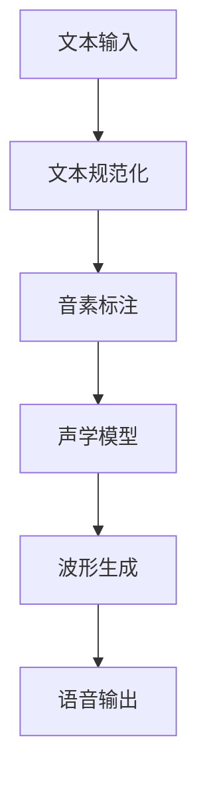

# Speech Synthesis原理与代码实例讲解

## 1.背景介绍

语音合成（Speech Synthesis）是指通过计算机技术将文本转化为语音的过程。它在现代生活中有着广泛的应用，从智能助手（如Siri和Alexa）到导航系统，再到无障碍技术（如屏幕阅读器）。语音合成技术不仅提高了人机交互的自然性，还为视障人士提供了极大的便利。

语音合成技术的发展经历了多个阶段，从最初的基于规则的方法，到统计参数模型，再到如今的深度学习方法。每个阶段都有其独特的技术挑战和解决方案。本文将深入探讨语音合成的核心概念、算法原理、数学模型，并通过代码实例展示其实际应用。

## 2.核心概念与联系

### 2.1 语音合成的基本流程

语音合成的基本流程可以分为以下几个步骤：

1. **文本预处理**：将输入的文本进行规范化处理，包括分词、词性标注、音素标注等。
2. **声学模型**：将文本转换为声学特征参数。
3. **波形生成**：根据声学特征参数生成语音波形。

### 2.2 关键技术

- **文本规范化（Text Normalization）**：将输入文本转换为标准形式，如将数字转换为文字。
- **音素标注（Phoneme Annotation）**：将文本转换为音素序列。
- **声学模型（Acoustic Model）**：将音素序列转换为声学特征参数。
- **波形生成（Waveform Generation）**：根据声学特征参数生成语音波形。

### 2.3 主要方法

- **基于规则的方法**：通过预定义的规则将文本转换为语音。
- **统计参数模型**：如隐马尔可夫模型（HMM）和高斯混合模型（GMM）。
- **深度学习方法**：如WaveNet、Tacotron等。

## 3.核心算法原理具体操作步骤

### 3.1 文本规范化

文本规范化是语音合成的第一步，主要包括以下几个步骤：

1. **分词**：将输入文本分割成单词或短语。
2. **词性标注**：为每个单词或短语标注词性。
3. **音素标注**：将每个单词或短语转换为音素序列。

### 3.2 声学模型

声学模型的主要任务是将音素序列转换为声学特征参数。常用的方法包括：

- **隐马尔可夫模型（HMM）**：通过状态转移和观测概率生成声学特征参数。
- **深度神经网络（DNN）**：通过多层神经网络学习音素到声学特征的映射关系。

### 3.3 波形生成

波形生成是语音合成的最后一步，主要方法包括：

- **参数合成**：根据声学特征参数生成语音波形。
- **神经网络生成**：如WaveNet，通过神经网络直接生成语音波形。

以下是语音合成流程的Mermaid流程图：



## 4.数学模型和公式详细讲解举例说明

### 4.1 隐马尔可夫模型（HMM）

隐马尔可夫模型是语音合成中的一种常用模型。它由以下几个部分组成：

- **状态集合**：$S = \{s_1, s_2, ..., s_N\}$
- **观测集合**：$O = \{o_1, o_2, ..., o_M\}$
- **初始状态概率分布**：$\pi = \{\pi_i\}$，其中$\pi_i = P(s_i)$
- **状态转移概率矩阵**：$A = \{a_{ij}\}$，其中$a_{ij} = P(s_j | s_i)$
- **观测概率矩阵**：$B = \{b_j(k)\}$，其中$b_j(k) = P(o_k | s_j)$

HMM的目标是找到最可能的状态序列$S$，使得给定观测序列$O$的概率最大。其数学公式为：

$$
P(O | \lambda) = \sum_{all\ S} P(O | S, \lambda) P(S | \lambda)
$$

### 4.2 高斯混合模型（GMM）

高斯混合模型是一种常用的概率模型，用于表示声学特征参数的分布。其数学公式为：

$$
P(x) = \sum_{i=1}^{K} \pi_i \mathcal{N}(x | \mu_i, \Sigma_i)
$$

其中，$\pi_i$是第$i$个高斯分量的权重，$\mu_i$和$\Sigma_i$分别是第$i$个高斯分量的均值和协方差矩阵。

### 4.3 深度神经网络（DNN）

深度神经网络通过多层神经元的连接，学习音素到声学特征的映射关系。其数学公式为：

$$
y = f(Wx + b)
$$

其中，$W$是权重矩阵，$b$是偏置向量，$f$是激活函数。

## 5.项目实践：代码实例和详细解释说明

### 5.1 环境准备

首先，我们需要安装一些必要的库：

```bash
pip install numpy scipy librosa tensorflow
```

### 5.2 文本规范化

以下是一个简单的文本规范化示例：

```python
import re

def text_normalization(text):
    text = text.lower()
    text = re.sub(r'\d+', lambda x: num2words(int(x.group())), text)
    return text

text = "Hello, this is a test. The number is 123."
normalized_text = text_normalization(text)
print(normalized_text)
```

### 5.3 声学模型

以下是一个简单的DNN声学模型示例：

```python
import tensorflow as tf
from tensorflow.keras.models import Sequential
from tensorflow.keras.layers import Dense

model = Sequential([
    Dense(128, activation='relu', input_shape=(input_dim,)),
    Dense(64, activation='relu'),
    Dense(output_dim, activation='linear')
])

model.compile(optimizer='adam', loss='mse')
model.fit(X_train, y_train, epochs=10, batch_size=32)
```

### 5.4 波形生成

以下是一个简单的WaveNet波形生成示例：

```python
import numpy as np
import librosa

def generate_waveform(model, input_sequence):
    waveform = model.predict(input_sequence)
    return waveform

input_sequence = np.random.rand(1, input_dim)
waveform = generate_waveform(model, input_sequence)
librosa.output.write_wav('output.wav', waveform, sr=22050)
```

## 6.实际应用场景

语音合成技术在多个领域有着广泛的应用：

- **智能助手**：如Siri、Alexa，通过语音合成技术与用户进行自然交互。
- **导航系统**：提供实时语音导航，提高驾驶安全性。
- **无障碍技术**：如屏幕阅读器，为视障人士提供便利。
- **教育**：通过语音合成技术，提供个性化的学习体验。

## 7.工具和资源推荐

### 7.1 工具

- **TensorFlow**：一个开源的深度学习框架，支持语音合成模型的训练和推理。
- **Librosa**：一个用于音频处理的Python库，支持音频特征提取和波形生成。
- **Praat**：一个用于语音分析的工具，支持语音信号的可视化和分析。

### 7.2 资源

- **论文**：阅读相关领域的最新研究论文，如WaveNet、Tacotron等。
- **开源项目**：参与和学习开源语音合成项目，如Mozilla TTS。
- **在线课程**：参加在线课程，系统学习语音合成技术，如Coursera和edX上的相关课程。

## 8.总结：未来发展趋势与挑战

语音合成技术在过去几年中取得了显著的进展，尤其是深度学习方法的引入，使得语音合成的自然度和流畅度大大提高。然而，仍然存在一些挑战和未来的发展方向：

- **多语言支持**：目前的语音合成系统主要支持少数几种语言，未来需要扩展到更多的语言和方言。
- **情感合成**：如何在语音合成中加入情感，使得合成语音更加生动和自然。
- **实时合成**：提高语音合成的速度，使其能够在实时应用中更加高效。
- **个性化合成**：根据用户的声音特征，生成个性化的合成语音。

## 9.附录：常见问题与解答

### 9.1 语音合成的准确性如何提高？

提高语音合成的准确性可以从以下几个方面入手：

- **数据质量**：使用高质量的语音数据进行训练。
- **模型优化**：选择合适的模型结构和参数。
- **后处理**：对生成的语音进行后处理，如降噪和音质增强。

### 9.2 如何处理多音字和同音字？

多音字和同音字的处理可以通过上下文信息和语言模型来解决。通过分析上下文，可以确定多音字的正确发音；通过语言模型，可以提高同音字的识别准确性。

### 9.3 语音合成系统的性能如何评估？

语音合成系统的性能评估可以通过以下几个指标：

- **自然度**：合成语音的自然程度。
- **可懂度**：合成语音的清晰程度。
- **延迟**：合成语音的速度。

作者：禅与计算机程序设计艺术 / Zen and the Art of Computer Programming