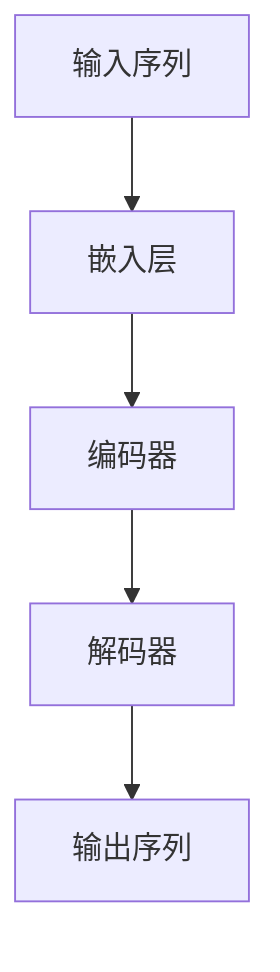
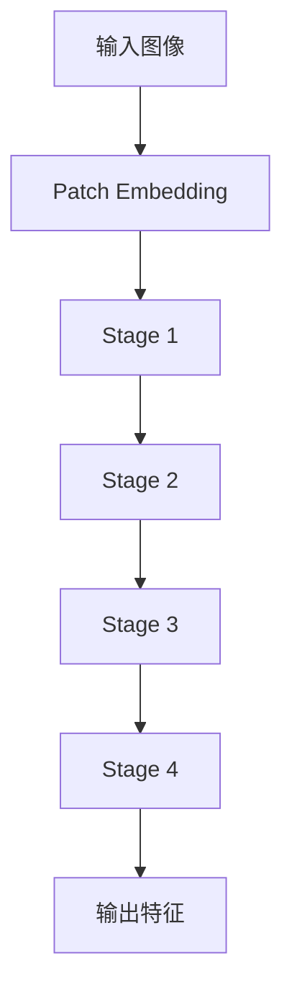

# SwinTransformer在金融数据分析任务中的应用

## 1.背景介绍

在金融数据分析领域，传统的机器学习和深度学习方法已经取得了显著的成果。然而，随着数据规模和复杂性的增加，传统方法在处理高维度、非结构化数据时面临诸多挑战。近年来，Transformer模型在自然语言处理和计算机视觉领域取得了突破性进展，尤其是SwinTransformer（Shifted Window Transformer），其在图像处理任务中的表现尤为突出。本文将探讨SwinTransformer在金融数据分析任务中的应用，旨在为金融数据分析提供新的思路和方法。

## 2.核心概念与联系

### 2.1 Transformer模型

Transformer模型最初由Vaswani等人在2017年提出，主要用于自然语言处理任务。其核心思想是通过自注意力机制（Self-Attention Mechanism）来捕捉序列数据中的长距离依赖关系。Transformer模型的结构如下：



### 2.2 SwinTransformer

SwinTransformer是Transformer在计算机视觉领域的一个变种，其核心思想是通过滑动窗口（Shifted Window）机制来处理图像数据。SwinTransformer的结构如下：



### 2.3 金融数据分析

金融数据分析涉及对金融市场数据的收集、处理和分析，以便做出投资决策。常见的金融数据包括股票价格、交易量、财务报表等。金融数据分析的目标是通过数据挖掘和机器学习技术，发现数据中的模式和规律，从而预测市场走势和风险。

## 3.核心算法原理具体操作步骤

### 3.1 数据预处理

在金融数据分析中，数据预处理是至关重要的一步。常见的数据预处理步骤包括数据清洗、归一化、特征提取等。

### 3.2 Patch Embedding

SwinTransformer的一个关键步骤是将输入数据划分为小块（Patch），并将每个小块嵌入到高维空间中。对于金融数据，可以将时间序列数据划分为固定长度的窗口，并对每个窗口进行嵌入。

### 3.3 Shifted Window Mechanism

SwinTransformer通过滑动窗口机制来捕捉局部和全局特征。具体操作步骤如下：

1. 将输入数据划分为多个窗口。
2. 对每个窗口应用自注意力机制。
3. 滑动窗口，重复步骤1和2。

### 3.4 多层结构

SwinTransformer采用多层结构，每一层都包含多个滑动窗口和自注意力机制。通过多层结构，模型能够捕捉到数据的多尺度特征。

## 4.数学模型和公式详细讲解举例说明

### 4.1 自注意力机制

自注意力机制的核心公式如下：

$$
\text{Attention}(Q, K, V) = \text{softmax}\left(\frac{QK^T}{\sqrt{d_k}}\right)V
$$

其中，$Q$、$K$、$V$分别表示查询矩阵、键矩阵和值矩阵，$d_k$表示键矩阵的维度。

### 4.2 Patch Embedding

Patch Embedding的公式如下：

$$
\text{PatchEmbedding}(x) = W_p x + b_p
$$

其中，$W_p$和$b_p$分别表示权重矩阵和偏置向量，$x$表示输入数据。

### 4.3 Shifted Window Mechanism

滑动窗口机制的公式如下：

$$
\text{ShiftedWindow}(x) = \text{WindowAttention}(x) + \text{Shift}(x)
$$

其中，$\text{WindowAttention}(x)$表示窗口内的自注意力机制，$\text{Shift}(x)$表示窗口的滑动操作。

## 5.项目实践：代码实例和详细解释说明

### 5.1 数据预处理

```python
import pandas as pd
from sklearn.preprocessing import MinMaxScaler

# 读取金融数据
data = pd.read_csv('financial_data.csv')

# 数据清洗
data = data.dropna()

# 数据归一化
scaler = MinMaxScaler()
data_scaled = scaler.fit_transform(data)

# 特征提取
window_size = 10
features = []
for i in range(len(data_scaled) - window_size):
    features.append(data_scaled[i:i+window_size])
features = np.array(features)
```

### 5.2 SwinTransformer模型构建

```python
import torch
import torch.nn as nn
from swin_transformer import SwinTransformer

# 定义SwinTransformer模型
class FinancialSwinTransformer(nn.Module):
    def __init__(self, input_dim, num_classes):
        super(FinancialSwinTransformer, self).__init__()
        self.swin_transformer = SwinTransformer(input_dim=input_dim)
        self.fc = nn.Linear(input_dim, num_classes)

    def forward(self, x):
        x = self.swin_transformer(x)
        x = self.fc(x)
        return x

# 初始化模型
model = FinancialSwinTransformer(input_dim=window_size, num_classes=1)
```

### 5.3 模型训练

```python
import torch.optim as optim

# 定义损失函数和优化器
criterion = nn.MSELoss()
optimizer = optim.Adam(model.parameters(), lr=0.001)

# 训练模型
num_epochs = 100
for epoch in range(num_epochs):
    model.train()
    optimizer.zero_grad()
    outputs = model(features)
    loss = criterion(outputs, labels)
    loss.backward()
    optimizer.step()
    print(f'Epoch [{epoch+1}/{num_epochs}], Loss: {loss.item():.4f}')
```

## 6.实际应用场景

### 6.1 股票价格预测

SwinTransformer可以用于股票价格预测，通过捕捉时间序列数据中的模式和规律，预测未来的股票价格。

### 6.2 风险管理

在风险管理中，SwinTransformer可以用于识别和预测市场风险，帮助投资者做出更明智的决策。

### 6.3 量化交易

量化交易中，SwinTransformer可以用于构建交易策略，通过分析历史数据，发现交易机会并执行交易。

## 7.工具和资源推荐

### 7.1 开源库

- [PyTorch](https://pytorch.org/): 一个流行的深度学习框架，支持SwinTransformer的实现。
- [SwinTransformer](https://github.com/microsoft/Swin-Transformer): SwinTransformer的官方实现。

### 7.2 数据集

- [Yahoo Finance](https://finance.yahoo.com/): 提供丰富的金融数据，包括股票价格、交易量等。
- [Kaggle](https://www.kaggle.com/): 提供各种金融数据集，适合用于模型训练和测试。

## 8.总结：未来发展趋势与挑战

SwinTransformer在金融数据分析中的应用展示了其强大的特征提取能力和灵活性。未来，随着金融数据的不断增长和复杂化，SwinTransformer有望在更多的金融应用场景中发挥重要作用。然而，SwinTransformer在金融数据分析中的应用也面临一些挑战，如数据的高维度性、噪声和不确定性等。未来的研究可以进一步优化SwinTransformer的结构和算法，以提高其在金融数据分析中的性能和鲁棒性。

## 9.附录：常见问题与解答

### 9.1 SwinTransformer与传统Transformer的区别是什么？

SwinTransformer通过滑动窗口机制来处理数据，而传统Transformer则是通过全局自注意力机制来处理数据。滑动窗口机制能够更好地捕捉局部特征，同时减少计算复杂度。

### 9.2 SwinTransformer在金融数据分析中的优势是什么？

SwinTransformer能够处理高维度、非结构化的金融数据，并通过多层结构捕捉数据的多尺度特征，从而提高预测精度和鲁棒性。

### 9.3 如何选择合适的窗口大小？

窗口大小的选择需要根据具体的金融数据和任务来确定。一般来说，可以通过交叉验证等方法来选择最优的窗口大小。

### 9.4 SwinTransformer是否适用于实时数据分析？

SwinTransformer可以用于实时数据分析，但需要考虑计算资源和延迟等因素。通过优化模型结构和算法，可以提高实时数据分析的性能。

---

作者：禅与计算机程序设计艺术 / Zen and the Art of Computer Programming