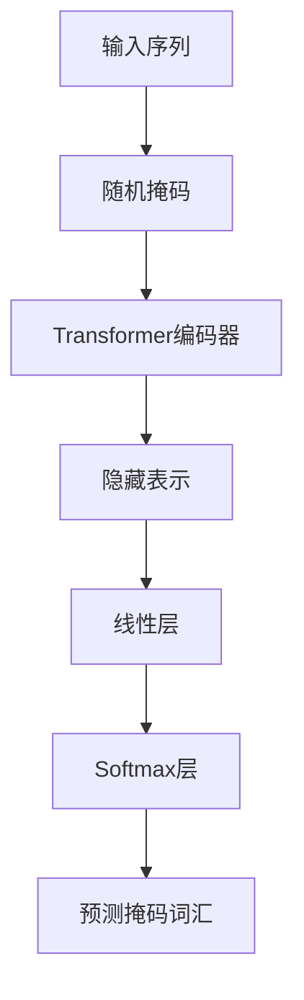
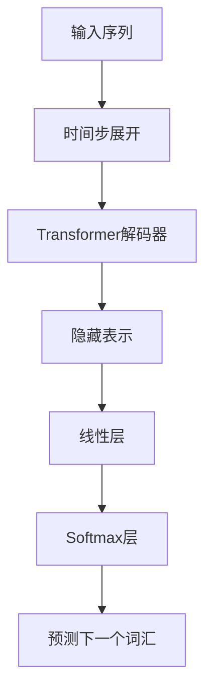
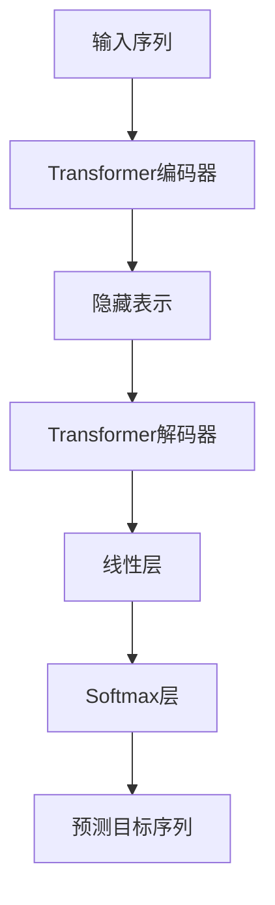

# Transformer大模型实战 比较不同的预训练目标

## 1.背景介绍

Transformer模型自从在2017年由Vaswani等人提出以来，已经成为自然语言处理（NLP）领域的主流架构。其核心思想是通过自注意力机制（Self-Attention）来捕捉序列中的长距离依赖关系。随着BERT、GPT等大模型的成功，预训练-微调（Pre-training and Fine-tuning）范式成为了NLP任务的标准流程。预训练目标的选择直接影响模型的性能和适用性，因此，深入理解和比较不同的预训练目标具有重要意义。

## 2.核心概念与联系

### 2.1 Transformer架构

Transformer模型由编码器（Encoder）和解码器（Decoder）组成。编码器负责将输入序列转换为隐藏表示，解码器则将隐藏表示转换为输出序列。其核心组件包括多头自注意力机制（Multi-Head Self-Attention）和前馈神经网络（Feed-Forward Neural Network）。

### 2.2 预训练目标

预训练目标是指在大规模无标签数据上训练模型时所采用的任务。常见的预训练目标包括：

- **掩码语言模型（Masked Language Model, MLM）**：如BERT，通过随机掩码部分输入词汇，训练模型预测被掩码的词汇。
- **自回归语言模型（Autoregressive Language Model, ARLM）**：如GPT，训练模型根据前面的词汇预测下一个词汇。
- **序列到序列（Sequence-to-Sequence, Seq2Seq）**：如T5，训练模型将输入序列转换为目标序列。

### 2.3 预训练与微调

预训练阶段通过大规模无标签数据学习通用语言表示，微调阶段则通过有标签数据进行特定任务的训练。预训练目标的选择直接影响模型在微调阶段的表现。

## 3.核心算法原理具体操作步骤

### 3.1 掩码语言模型（MLM）

MLM的核心思想是通过掩码部分输入词汇，训练模型预测被掩码的词汇。具体步骤如下：

1. **输入处理**：随机选择输入序列中的部分词汇进行掩码。
2. **模型训练**：通过Transformer编码器处理掩码后的序列，生成隐藏表示。
3. **预测掩码词汇**：通过线性层和Softmax层预测被掩码的词汇。



### 3.2 自回归语言模型（ARLM）

ARLM的核心思想是根据前面的词汇预测下一个词汇。具体步骤如下：

1. **输入处理**：将输入序列按时间步展开。
2. **模型训练**：通过Transformer解码器处理展开后的序列，生成隐藏表示。
3. **预测下一个词汇**：通过线性层和Softmax层预测下一个词汇。



### 3.3 序列到序列（Seq2Seq）

Seq2Seq的核心思想是将输入序列转换为目标序列。具体步骤如下：

1. **输入处理**：将输入序列和目标序列分别输入编码器和解码器。
2. **模型训练**：通过Transformer编码器和解码器处理输入序列和目标序列，生成隐藏表示。
3. **预测目标序列**：通过线性层和Softmax层预测目标序列中的词汇。



## 4.数学模型和公式详细讲解举例说明

### 4.1 掩码语言模型（MLM）

MLM的目标是最大化被掩码词汇的概率。假设输入序列为 $X = \{x_1, x_2, \ldots, x_n\}$，掩码后的序列为 $X' = \{x'_1, x'_2, \ldots, x'_n\}$，被掩码的词汇为 $M = \{m_1, m_2, \ldots, m_k\}$，则目标函数为：

$$
L_{MLM} = \sum_{i=1}^{k} \log P(m_i | X')
$$

### 4.2 自回归语言模型（ARLM）

ARLM的目标是最大化下一个词汇的概率。假设输入序列为 $X = \{x_1, x_2, \ldots, x_n\}$，则目标函数为：

$$
L_{ARLM} = \sum_{i=1}^{n} \log P(x_i | x_1, x_2, \ldots, x_{i-1})
$$

### 4.3 序列到序列（Seq2Seq）

Seq2Seq的目标是最大化目标序列的概率。假设输入序列为 $X = \{x_1, x_2, \ldots, x_n\}$，目标序列为 $Y = \{y_1, y_2, \ldots, y_m\}$，则目标函数为：

$$
L_{Seq2Seq} = \sum_{j=1}^{m} \log P(y_j | X, y_1, y_2, \ldots, y_{j-1})
$$

## 5.项目实践：代码实例和详细解释说明

### 5.1 掩码语言模型（MLM）

以下是一个使用PyTorch实现MLM的示例代码：

```python
import torch
import torch.nn as nn
import torch.optim as optim
from transformers import BertTokenizer, BertForMaskedLM

# 加载预训练的BERT模型和分词器
tokenizer = BertTokenizer.from_pretrained('bert-base-uncased')
model = BertForMaskedLM.from_pretrained('bert-base-uncased')

# 输入序列
text = "The quick brown fox jumps over the lazy dog"
inputs = tokenizer(text, return_tensors='pt')
labels = inputs.input_ids.clone()

# 随机掩码部分词汇
mask = torch.rand(inputs.input_ids.shape).lt(0.15)
inputs.input_ids[mask] = tokenizer.mask_token_id

# 模型训练
outputs = model(**inputs, labels=labels)
loss = outputs.loss
loss.backward()

# 优化器
optimizer = optim.Adam(model.parameters(), lr=1e-5)
optimizer.step()
```

### 5.2 自回归语言模型（ARLM）

以下是一个使用PyTorch实现ARLM的示例代码：

```python
import torch
import torch.nn as nn
import torch.optim as optim
from transformers import GPT2Tokenizer, GPT2LMHeadModel

# 加载预训练的GPT模型和分词器
tokenizer = GPT2Tokenizer.from_pretrained('gpt2')
model = GPT2LMHeadModel.from_pretrained('gpt2')

# 输入序列
text = "The quick brown fox jumps over the lazy dog"
inputs = tokenizer(text, return_tensors='pt')

# 模型训练
outputs = model(**inputs, labels=inputs.input_ids)
loss = outputs.loss
loss.backward()

# 优化器
optimizer = optim.Adam(model.parameters(), lr=1e-5)
optimizer.step()
```

### 5.3 序列到序列（Seq2Seq）

以下是一个使用PyTorch实现Seq2Seq的示例代码：

```python
import torch
import torch.nn as nn
import torch.optim as optim
from transformers import T5Tokenizer, T5ForConditionalGeneration

# 加载预训练的T5模型和分词器
tokenizer = T5Tokenizer.from_pretrained('t5-small')
model = T5ForConditionalGeneration.from_pretrained('t5-small')

# 输入序列和目标序列
input_text = "The quick brown fox jumps over the lazy dog"
target_text = "The fast brown fox leaps over the lazy dog"
inputs = tokenizer(input_text, return_tensors='pt')
targets = tokenizer(target_text, return_tensors='pt')

# 模型训练
outputs = model(input_ids=inputs.input_ids, labels=targets.input_ids)
loss = outputs.loss
loss.backward()

# 优化器
optimizer = optim.Adam(model.parameters(), lr=1e-5)
optimizer.step()
```

## 6.实际应用场景

### 6.1 自然语言理解

预训练的Transformer模型在自然语言理解任务中表现出色，如文本分类、情感分析和问答系统。通过预训练，模型能够捕捉语言的深层次语义信息，从而在微调阶段表现优异。

### 6.2 机器翻译

Seq2Seq模型在机器翻译任务中广泛应用。通过将源语言序列转换为目标语言序列，模型能够实现高质量的翻译效果。预训练的Seq2Seq模型在低资源语言对的翻译任务中表现尤为突出。

### 6.3 文本生成

自回归语言模型在文本生成任务中表现出色，如对话系统和自动写作。通过根据前面的词汇预测下一个词汇，模型能够生成连贯且富有创意的文本。

## 7.工具和资源推荐

### 7.1 预训练模型

- **BERT**：适用于掩码语言模型任务，提供多种预训练模型（如bert-base-uncased）。
- **GPT**：适用于自回归语言模型任务，提供多种预训练模型（如gpt2）。
- **T5**：适用于序列到序列任务，提供多种预训练模型（如t5-small）。

### 7.2 开源库

- **Transformers**：由Hugging Face提供的开源库，支持多种预训练模型和任务。
- **PyTorch**：深度学习框架，支持自定义模型和训练流程。
- **TensorFlow**：深度学习框架，支持多种预训练模型和任务。

### 7.3 数据集

- **Wikipedia**：大规模无标签文本数据，适用于预训练任务。
- **OpenWebText**：高质量的无标签文本数据，适用于预训练任务。
- **GLUE**：多任务基准数据集，适用于微调和评估模型性能。

## 8.总结：未来发展趋势与挑战

### 8.1 未来发展趋势

- **多模态预训练**：结合文本、图像和音频等多种模态的数据进行预训练，提升模型的泛化能力和适用性。
- **自监督学习**：通过设计更复杂和多样的自监督任务，进一步提升模型的预训练效果。
- **高效预训练**：通过模型压缩、知识蒸馏等技术，提升预训练的效率和模型的推理速度。

### 8.2 挑战

- **计算资源**：预训练大规模Transformer模型需要大量的计算资源和时间，如何降低预训练成本是一个重要挑战。
- **数据质量**：预训练数据的质量直接影响模型的性能，如何获取高质量的大规模数据是一个重要问题。
- **模型解释性**：Transformer模型的复杂性使得其内部机制难以解释，如何提升模型的可解释性是一个重要研究方向。

## 9.附录：常见问题与解答

### 9.1 预训练和微调的区别是什么？

预训练是在大规模无标签数据上训练模型，学习通用的语言表示；微调是在有标签数据上训练模型，适应特定任务。

### 9.2 如何选择预训练目标？

选择预训练目标需要根据具体任务的需求和数据特点进行权衡。掩码语言模型适用于理解任务，自回归语言模型适用于生成任务，序列到序列模型适用于转换任务。

### 9.3 预训练模型的参数如何设置？

预训练模型的参数设置需要根据具体任务和数据进行调整。常见的参数包括学习率、批量大小和训练轮数等。

### 9.4 如何评估预训练模型的性能？

预训练模型的性能评估通常通过微调后的任务表现进行评估。常见的评估指标包括准确率、F1分数和BLEU分数等。

### 9.5 预训练模型的应用场景有哪些？

预训练模型广泛应用于自然语言处理任务，如文本分类、情感分析、问答系统、机器翻译和文本生成等。

---

作者：禅与计算机程序设计艺术 / Zen and the Art of Computer Programming