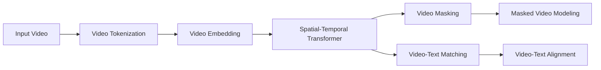

# Transformer大模型实战 预训练VideoBERT模型

## 1. 背景介绍

### 1.1 Transformer模型的发展历程

2017年，Google提出了Transformer模型，它是一种基于自注意力机制的神经网络模型。Transformer最初应用于自然语言处理领域，如机器翻译、文本摘要等任务。随后，研究者们发现Transformer模型具有强大的特征提取和表示学习能力，可以应用于各种模态的数据，如文本、图像、视频等。

### 1.2 VideoBERT的提出背景

近年来，随着视频数据的爆炸式增长，如何有效地理解和分析视频内容成为了一个重要的研究课题。传统的视频分析方法主要基于手工设计的特征，如HOG、SIFT等，然而这些特征很难捕捉视频中的高层语义信息。受BERT(Bidirectional Encoder Representations from Transformers)在NLP领域取得巨大成功的启发，研究者们尝试将Transformer模型应用于视频理解任务，VideoBERT就是其中的代表性工作之一。

### 1.3 VideoBERT的应用前景

VideoBERT通过自监督学习的方式，在大规模无标注视频数据上进行预训练，可以学习到视频的通用表示。在下游任务中，如视频分类、视频描述、视频问答等，只需在预训练模型的基础上进行微调，即可取得优异的性能。VideoBERT为视频理解任务提供了一种新的思路，有望推动视频理解技术的进一步发展。

## 2. 核心概念与联系

### 2.1 Transformer的核心概念

- Self-Attention：自注意力机制，让模型的每个位置都能attend到序列中的任意位置，捕捉长距离依赖关系。
- Multi-Head Attention：多头注意力机制，将Self-Attention扩展到多个子空间，增强模型的表示能力。  
- Positional Encoding：位置编码，为模型引入序列中元素的位置信息。
- Feed-Forward Network：前馈神经网络，对Self-Attention的输出进行非线性变换。

### 2.2 BERT的核心概念

- Masked Language Model (MLM)：掩码语言模型，随机掩盖一部分输入token，让模型预测被掩盖的token，学习上下文信息。
- Next Sentence Prediction (NSP)：下一句预测，让模型判断两个句子在原文中是否相邻，学习句子间的关系。

### 2.3 VideoBERT的核心概念

- Video Tokenization：视频切分，将视频切分成一系列的片段(segment)，每个片段包含固定数量的帧。
- Spatial-Temporal Attention：时空注意力，在时间和空间两个维度上应用Self-Attention，捕捉视频的时空依赖关系。
- Video Masking：视频掩码，随机掩盖一部分视频片段，让模型预测被掩盖的片段，学习视频的上下文信息。

### 2.4 各概念之间的联系

VideoBERT是将BERT的思想扩展到视频领域的尝试。它借鉴了BERT中MLM和NSP的预训练任务，设计了Video Masking和Video-Text Matching任务，让模型学习视频的内部结构和视频与文本的对齐关系。同时，VideoBERT在Transformer的基础上引入了Spatial-Temporal Attention，以更好地建模视频数据的时空特性。

## 3. 核心算法原理具体操作步骤

### 3.1 VideoBERT的整体架构

VideoBERT的整体架构如下图所示：



### 3.2 Video Tokenization

1. 将输入视频按照固定的时间间隔切分成一系列的片段(segment)。
2. 每个片段包含固定数量的帧(如16帧)。
3. 对每个片段中的帧进行特征提取(如使用预训练的CNN网络)，得到帧级别的特征表示。
4. 对帧级别的特征进行池化(如平均池化)，得到片段级别的特征表示。

### 3.3 Video Embedding

1. 将片段级别的特征通过线性变换映射到Transformer的输入维度。
2. 加入位置编码(Positional Encoding)，引入片段在视频中的位置信息。
3. 加入片段类型编码(Segment Type Embedding)，区分不同类型的片段(如视频片段和文本片段)。

### 3.4 Spatial-Temporal Transformer

1. 多层堆叠的Transformer Block，每个Block包含Multi-Head Attention和Feed-Forward Network。
2. 在时间维度上应用Self-Attention，捕捉视频片段之间的时序依赖关系。
3. 在空间维度上应用Self-Attention，捕捉同一片段内不同区域之间的关系。

### 3.5 Video Masking

1. 随机选择一部分视频片段，将其特征置为特殊的[MASK]向量。
2. 让模型预测被掩盖的片段的特征，学习视频的上下文信息。

### 3.6 Video-Text Matching

1. 将视频片段的特征和对应的文本描述的特征拼接在一起，输入到Transformer中。
2. 让模型预测视频片段和文本描述是否匹配，学习视频与文本的对齐关系。

## 4. 数学模型和公式详细讲解举例说明

### 4.1 Self-Attention

Self-Attention可以表示为：

$$
\text{Attention}(Q, K, V) = \text{softmax}(\frac{QK^T}{\sqrt{d_k}})V
$$

其中，$Q$, $K$, $V$分别表示查询(Query)、键(Key)、值(Value)矩阵，$d_k$表示键向量的维度。

例如，对于一个视频片段的特征矩阵$X \in \mathbb{R}^{n \times d}$，其中$n$表示时间步数，$d$表示特征维度。Self-Attention的计算过程如下：

$$
Q = XW_Q, K = XW_K, V = XW_V \\
\text{Attention}(Q, K, V) = \text{softmax}(\frac{(XW_Q)(XW_K)^T}{\sqrt{d_k}})(XW_V)
$$

其中，$W_Q$, $W_K$, $W_V$是可学习的权重矩阵。

### 4.2 Multi-Head Attention

Multi-Head Attention将Self-Attention扩展到多个子空间，可以表示为：

$$
\text{MultiHead}(Q, K, V) = \text{Concat}(\text{head}_1, ..., \text{head}_h)W^O \\
\text{head}_i = \text{Attention}(QW_i^Q, KW_i^K, VW_i^V)
$$

其中，$h$表示注意力头的数量，$W_i^Q$, $W_i^K$, $W_i^V$, $W^O$是可学习的权重矩阵。

### 4.3 Video Masking

Video Masking可以表示为：

$$
\tilde{x}_i = 
\begin{cases}
[MASK] & \text{if } i \in \mathcal{M} \\
x_i & \text{otherwise}
\end{cases}
$$

其中，$x_i$表示第$i$个视频片段的特征，$\mathcal{M}$表示被掩盖的片段集合，$[MASK]$表示特殊的掩码向量。

模型的目标是最小化被掩盖片段的重构误差：

$$
\mathcal{L}_{\text{mask}} = \frac{1}{|\mathcal{M}|}\sum_{i \in \mathcal{M}} ||x_i - f_{\theta}(\tilde{x}_i)||^2
$$

其中，$f_{\theta}$表示VideoBERT模型，$\theta$表示模型参数。

### 4.4 Video-Text Matching

Video-Text Matching可以表示为一个二分类问题，模型的目标是最小化交叉熵损失：

$$
\mathcal{L}_{\text{match}} = -\frac{1}{N}\sum_{i=1}^N [y_i \log p(y_i=1|v_i,t_i) + (1-y_i) \log p(y_i=0|v_i,t_i)]
$$

其中，$v_i$表示第$i$个视频片段的特征，$t_i$表示对应的文本描述的特征，$y_i \in \{0,1\}$表示视频片段和文本描述是否匹配，$N$表示样本数量。

## 5. 项目实践：代码实例和详细解释说明

下面是使用PyTorch实现VideoBERT的核心代码：

```python
import torch
import torch.nn as nn

class VideoBERT(nn.Module):
    def __init__(self, num_layers, num_heads, hidden_size, intermediate_size, vocab_size):
        super(VideoBERT, self).__init__()
        self.video_embeddings = nn.Linear(frame_feature_size, hidden_size)
        self.text_embeddings = nn.Embedding(vocab_size, hidden_size)
        self.position_embeddings = nn.Embedding(max_position_embeddings, hidden_size)
        self.segment_embeddings = nn.Embedding(2, hidden_size)
        
        self.spatial_transformer = Transformer(num_layers, num_heads, hidden_size, intermediate_size)
        self.temporal_transformer = Transformer(num_layers, num_heads, hidden_size, intermediate_size)
        
        self.video_pooler = nn.Linear(hidden_size, hidden_size)
        self.text_pooler = nn.Linear(hidden_size, hidden_size)
        
        self.video_mask_lm = nn.Linear(hidden_size, frame_feature_size)
        self.video_text_matching = nn.Linear(hidden_size, 2)
        
    def forward(self, video_features, text_ids, position_ids, segment_ids, masked_positions):
        # Video Embedding
        video_embeddings = self.video_embeddings(video_features)
        
        # Text Embedding
        text_embeddings = self.text_embeddings(text_ids)
        
        # Position Embedding
        position_embeddings = self.position_embeddings(position_ids)
        
        # Segment Embedding
        segment_embeddings = self.segment_embeddings(segment_ids)
        
        # Spatial-Temporal Transformer
        embeddings = video_embeddings + text_embeddings + position_embeddings + segment_embeddings
        spatial_output = self.spatial_transformer(embeddings)
        temporal_output = self.temporal_transformer(spatial_output)
        
        # Video Masking
        video_mask_output = self.video_mask_lm(temporal_output[masked_positions])
        
        # Video-Text Matching
        video_pooled_output = self.video_pooler(temporal_output[:, 0])
        text_pooled_output = self.text_pooler(temporal_output[:, -1])
        matching_output = self.video_text_matching(torch.cat([video_pooled_output, text_pooled_output], dim=-1))
        
        return video_mask_output, matching_output
```

代码解释：

1. `VideoBERT`类继承自`nn.Module`，是模型的主体。
2. `__init__`方法定义了模型的各个组件，包括视频嵌入层、文本嵌入层、位置嵌入层、片段嵌入层、时空Transformer、视频掩码预测层和视频文本匹配层。
3. `forward`方法定义了模型的前向传播过程。
   - 首先将视频特征、文本ID、位置ID和片段ID分别通过对应的嵌入层进行嵌入。
   - 将各种嵌入相加，得到输入的嵌入表示。
   - 将嵌入表示依次通过空间Transformer和时间Transformer，得到时空上下文信息。
   - 对于被掩盖的视频片段，通过视频掩码预测层进行重构预测。
   - 对于视频和文本的池化表示，通过视频文本匹配层进行匹配预测。
4. 最后返回视频掩码预测的输出和视频文本匹配的输出。

可以看到，VideoBERT的实现主要依赖于Transformer结构，通过引入时空注意力机制和自监督学习任务，实现了对视频数据的有效建模和表示学习。

## 6. 实际应用场景

VideoBERT可以应用于多种视频理解任务，包括但不限于：

### 6.1 视频分类

将VideoBERT预训练模型应用于视频分类任务，可以显著提高分类准确率。具体而言，可以将VideoBERT的输出接入一个分类器(如全连接层+Softmax)，并在标注数据上进行微调，即可得到一个高性能的视频分类模型。

### 6.2 视频描述

VideoBERT可以用于生成视频的自然语言描述。将VideoBERT的视频编码器的输出作为视频的表示，再接入一个文本解码器(如LSTM或Transformer)，通过端到端的方式训练整个模型，即可实现从视频到文本描