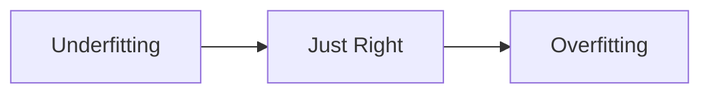
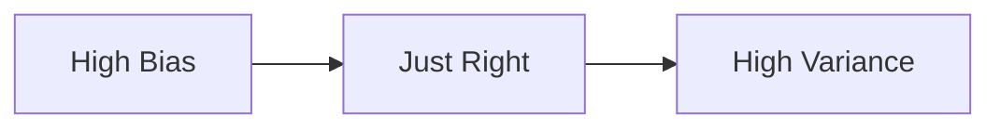

# Underfitting 原理与代码实战案例讲解

## 1. 背景介绍

在机器学习和深度学习中,我们经常会遇到模型性能不佳的问题。造成这种情况的原因有很多,其中之一就是 Underfitting(欠拟合)。Underfitting 是指模型过于简单,无法很好地捕捉训练数据中的规律和特征,导致在训练集和测试集上的表现都不理想。

理解 Underfitting 的原理和产生原因,并掌握解决 Underfitting 问题的方法,对于提升模型性能和避免浪费计算资源都有重要意义。本文将深入探讨 Underfitting 的相关概念、原理、数学模型,并给出代码实战案例,帮助读者全面理解和掌握这一重要话题。

## 2. 核心概念与联系

### 2.1 什么是 Underfitting

Underfitting,也称作欠拟合,是指机器学习模型过于简单,无法很好地拟合训练数据,导致模型在训练集和测试集上的表现都不理想的现象。

具体而言,Underfitting 表现为:

- 模型在训练集上的损失较大,准确率较低
- 模型在测试集上的损失较大,准确率较低
- 模型预测结果与真实值差异较大

### 2.2 Underfitting 与 Overfitting 的区别

与 Underfitting 相对的另一个概念是 Overfitting(过拟合)。它们的主要区别在于:

- Underfitting: 模型过于简单,无法很好地捕捉数据的规律,在训练集和测试集上表现都不理想。
- Overfitting: 模型过于复杂,过度拟合训练数据(包括噪声),在训练集上表现很好,但在测试集上表现较差。

下图直观地展示了 Underfitting 与 Overfitting 的区别:



### 2.3 Underfitting 的原因

Underfitting 的主要原因包括:

- 模型复杂度不足:模型的参数量太少,无法很好地拟合数据
- 训练不足:模型训练的轮数(Epoch)不够,还没有达到最优状态
- 特征不足:输入特征的数量和质量不够,无法提供足够的信息
- 正则化过强:正则化项(如 L1、L2)的系数过大,限制了模型的复杂度

## 3. 核心算法原理具体操作步骤

解决 Underfitting 问题的核心思路是增加模型复杂度,使其能够更好地拟合训练数据。以下是一些常用的方法:

### 3.1 增加模型参数量

对于神经网络模型,可以通过增加网络层数和每层的神经元数量来提高模型复杂度。例如,对于一个简单的全连接神经网络:

```python
model = Sequential([
    Dense(64, activation='relu', input_shape=(input_dim,)),
    Dense(32, activation='relu'),
    Dense(1, activation='sigmoid')
])
```

可以增加网络层数和每层神经元数量:

```python
model = Sequential([
    Dense(128, activation='relu', input_shape=(input_dim,)),
    Dense(64, activation='relu'),
    Dense(64, activation='relu'),  
    Dense(32, activation='relu'),
    Dense(1, activation='sigmoid')
])
```

### 3.2 延长训练时间

增加训练的轮数(Epoch)可以给模型更多的时间去学习数据的规律。例如:

```python
model.fit(X_train, y_train, epochs=10, batch_size=32)
```

可以增加 `epochs` 的值:

```python
model.fit(X_train, y_train, epochs=50, batch_size=32)
```

### 3.3 增加输入特征

通过特征工程的方法,可以从原始数据中提取更多有意义的特征,为模型提供更丰富的信息。常见的特征工程方法包括:

- 特征组合:将多个特征组合成新的特征
- 特征变换:对特征进行数学变换,如平方、开方、对数等
- 特征编码:将分类特征转换为数值特征,如 One-Hot 编码

### 3.4 减弱正则化

如果模型使用了正则化方法(如 L1、L2),可以尝试减小正则化项的系数,给模型更大的复杂度空间。例如:

```python
model = Sequential([
    Dense(64, activation='relu', kernel_regularizer=l2(0.01), input_shape=(input_dim,)),
    Dense(1, activation='sigmoid')
])
```

可以减小 `l2` 的系数值:

```python
model = Sequential([
    Dense(64, activation='relu', kernel_regularizer=l2(0.001), input_shape=(input_dim,)),
    Dense(1, activation='sigmoid')
])
```

## 4. 数学模型和公式详细讲解举例说明

Underfitting 可以用偏差-方差分解(Bias-Variance Decomposition)来理解。给定一个回归问题,我们的目标是找到一个函数 $f(x)$ 来近似真实的函数 $f^*(x)$。

假设我们有一个训练集 $\mathcal{D} = \{(x_1, y_1), (x_2, y_2), \cdots, (x_n, y_n)\}$,其中 $y_i = f^*(x_i) + \epsilon_i$,$\epsilon_i$ 是均值为0的随机噪声。我们的预测函数为 $\hat{f}(x)$。

对于一个新的输入 $x$,其真实输出为 $y = f^*(x) + \epsilon$。我们可以将预测误差分解为偏差、方差和噪声三个部分:

$$
\begin{aligned}
\mathbb{E}[(y - \hat{f}(x))^2] &= \mathbb{E}[(f^*(x) + \epsilon - \hat{f}(x))^2] \\
&= \underbrace{(\mathbb{E}[\hat{f}(x)] - f^*(x))^2}_{\text{Bias}^2} + \underbrace{\mathbb{E}[(\hat{f}(x) - \mathbb{E}[\hat{f}(x)])^2]}_{\text{Variance}} + \underbrace{\mathbb{E}[\epsilon^2]}_{\text{Noise}}
\end{aligned}
$$

其中:

- $\text{Bias}^2$: 偏差的平方,反映了模型的期望预测值与真实值之间的差距。Underfitting 通常具有高偏差。
- $\text{Variance}$: 方差,反映了模型预测的变化范围。Underfitting 通常具有低方差。
- $\text{Noise}$: 噪声,是数据本身的不可约误差,与模型无关。

下图展示了偏差和方差之间的关系:



Underfitting 对应于高偏差低方差的情况。我们的目标是找到偏差和方差的最佳平衡,使得总误差最小化。

## 5. 项目实践:代码实例和详细解释说明

下面以一个简单的回归问题为例,演示如何解决 Underfitting。

### 5.1 生成数据

首先,我们生成一个带有二次项的数据集:

```python
import numpy as np
import matplotlib.pyplot as plt

np.random.seed(42)
X = np.random.rand(100, 1)
y = 4 + 3 * X + 2 * X**2 + np.random.randn(100, 1)

plt.scatter(X, y)
plt.title("Generated Data")
plt.show()
```

### 5.2 欠拟合的模型

我们尝试用一个简单的线性模型去拟合数据:

```python
from sklearn.linear_model import LinearRegression
from sklearn.metrics import mean_squared_error

lin_reg = LinearRegression()
lin_reg.fit(X, y)

y_pred = lin_reg.predict(X)
mse = mean_squared_error(y, y_pred)
print(f"Mean Squared Error: {mse:.2f}")

plt.scatter(X, y)
plt.plot(X, y_pred, color='red')
plt.title("Underfitting Model")
plt.show()
```

输出结果:
```
Mean Squared Error: 5.63
```

从图中可以看出,线性模型无法很好地拟合数据,出现了明显的欠拟合。

### 5.3 增加模型复杂度

为了解决欠拟合问题,我们可以增加模型的复杂度,使用多项式特征:

```python
from sklearn.preprocessing import PolynomialFeatures

poly_features = PolynomialFeatures(degree=2, include_bias=False)
X_poly = poly_features.fit_transform(X)

lin_reg = LinearRegression()
lin_reg.fit(X_poly, y)

y_pred = lin_reg.predict(X_poly)
mse = mean_squared_error(y, y_pred)
print(f"Mean Squared Error: {mse:.2f}")

plt.scatter(X, y)
plt.plot(X, y_pred, color='red')
plt.title("Polynomial Model")
plt.show()
```

输出结果:
```
Mean Squared Error: 1.10
```

从图中可以看出,多项式模型能够很好地拟合数据,欠拟合问题得到了解决。

## 6. 实际应用场景

Underfitting 在实际应用中非常常见,下面是一些典型的场景:

- 广告点击率预测:使用逻辑回归等简单模型,可能无法很好地捕捉用户特征与点击行为之间的复杂关系。
- 图像分类:使用浅层神经网络,可能无法很好地提取图像的高层语义特征。
- 自然语言处理:使用简单的词袋模型,可能无法很好地理解文本的语义信息。
- 推荐系统:使用矩阵分解等简单模型,可能无法很好地刻画用户与物品之间的潜在关系。

在实践中,我们需要根据具体问题的复杂度和数据的特点,选择合适的模型和算法,并不断通过调参、特征工程等方法来优化模型性能,避免出现 Underfitting。

## 7. 工具和资源推荐

以下是一些有助于理解和解决 Underfitting 问题的工具和资源:

- Python 机器学习库:Scikit-Learn、TensorFlow、PyTorch 等
- 可视化工具:Matplotlib、Seaborn 等
- 在线课程:吴恩达的机器学习课程、Google 的机器学习速成课程等
- 书籍:《机器学习》(周志华)、《统计学习方法》(李航)、《深度学习》(Goodfellow et al.)等

## 8. 总结:未来发展趋势与挑战

Underfitting 是机器学习中的一个基本问题,虽然已有多种成熟的解决方案,但在实践中仍然面临许多挑战:

- 模型选择:如何根据问题的特点选择合适的模型类型和复杂度?
- 超参数调优:如何高效地搜索最优的超参数组合?
- 特征工程:如何自动化地构建高质量的特征?
- 数据质量:如何处理数据中的噪声和异常值?

未来,随着机器学习技术的不断发展,我们有望看到更多自动化、智能化的解决方案,如:

- AutoML:自动化的机器学习流程,包括模型选择、超参数调优等
- 元学习:利用以往的学习经验,快速适应新的任务
- 迁移学习:将已有模型的知识迁移到新的问题上,减少所需的数据和计算量
- 深度学习:利用更深、更复杂的神经网络结构,自动学习高层特征

总之,Underfitting 问题的研究还有很大的发展空间,也给机器学习实践者提供了广阔的创新舞台。

## 9. 附录:常见问题与解答

### Q1:如何判断模型是否出现了 Underfitting?

A1:主要通过以下几个指标:
- 在训练集和测试集上的损失都较大
- 在训练集和测试集上的准确率都较低
- 模型的预测结果与真实值差异较大,拟合曲线与数据点的吻合程度较差

### Q2:解决 Underfitting 问题的常用方法有哪些?

A2:常用的方法包括:
- 增加模型复杂度,如增加神经网络的层数和神经元数量
- 延长训练时间,给模型更多的学习机会
- 增加输入特征,为模型提供更丰富的信息
- 减弱正则化,放宽对模型复杂度的限制

### Q3:Underfitting 和 Overfitting 的区别是什么?

A3:它们的主要区别在于:
- Underfitting 是模型过于简单,在训练集和测试集上的表现都不理想
- Overfitting 是模型过于复