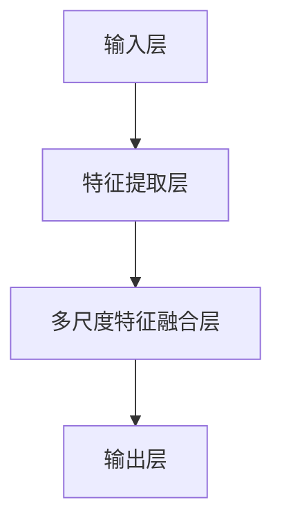

# YOLOv8原理与代码实例讲解

## 1.背景介绍

在计算机视觉领域，目标检测是一个重要的研究方向。目标检测不仅需要识别图像中的物体，还需要确定其位置。YOLO（You Only Look Once）系列算法因其高效的实时性能和较高的准确性，成为了目标检测领域的一个重要里程碑。YOLOv8是YOLO系列的最新版本，继承了前几代的优点，并在多个方面进行了改进。

YOLOv8的设计目标是提高检测精度和速度，同时简化模型的复杂性。它在网络结构、损失函数、数据增强等方面进行了优化，使其在各种应用场景中表现出色。

## 2.核心概念与联系

### 2.1 YOLO系列的演变

YOLO系列算法从YOLOv1到YOLOv8经历了多次迭代，每一代都有显著的改进。YOLOv1引入了单阶段检测的概念，YOLOv2和YOLOv3在网络结构和损失函数上进行了优化，YOLOv4和YOLOv5进一步提升了检测精度和速度。YOLOv8在此基础上，结合了最新的深度学习技术，进一步提升了性能。

### 2.2 YOLOv8的核心概念

YOLOv8的核心概念包括以下几个方面：

- **单阶段检测**：YOLOv8依然采用单阶段检测的方式，将目标检测任务简化为一个回归问题。
- **多尺度特征融合**：通过多尺度特征融合，YOLOv8能够更好地检测不同大小的目标。
- **改进的损失函数**：引入了新的损失函数，提高了模型的训练效果。
- **数据增强**：采用了多种数据增强技术，提升了模型的泛化能力。

### 2.3 YOLOv8与其他目标检测算法的对比

与其他目标检测算法（如Faster R-CNN、SSD等）相比，YOLOv8在速度和精度上具有明显的优势。YOLOv8通过单阶段检测和多尺度特征融合，实现了高效的目标检测。

## 3.核心算法原理具体操作步骤

### 3.1 网络结构

YOLOv8的网络结构包括以下几个部分：

- **输入层**：接收输入图像，并进行预处理。
- **特征提取层**：通过卷积神经网络提取图像的特征。
- **多尺度特征融合层**：将不同尺度的特征进行融合，提高检测效果。
- **输出层**：输出目标的类别和位置。



### 3.2 损失函数

YOLOv8的损失函数包括以下几个部分：

- **分类损失**：用于衡量目标类别的预测误差。
- **定位损失**：用于衡量目标位置的预测误差。
- **置信度损失**：用于衡量目标存在的置信度误差。

### 3.3 数据增强

YOLOv8采用了多种数据增强技术，包括随机裁剪、旋转、缩放等，提升了模型的泛化能力。

## 4.数学模型和公式详细讲解举例说明

### 4.1 YOLOv8的数学模型

YOLOv8的数学模型可以表示为：

$$
L = L_{cls} + L_{loc} + L_{conf}
$$

其中，$L_{cls}$ 是分类损失，$L_{loc}$ 是定位损失，$L_{conf}$ 是置信度损失。

### 4.2 分类损失

分类损失采用交叉熵损失函数：

$$
L_{cls} = -\sum_{i=1}^{N} y_i \log(p_i)
$$

其中，$y_i$ 是真实标签，$p_i$ 是预测概率。

### 4.3 定位损失

定位损失采用平滑L1损失函数：

$$
L_{loc} = \sum_{i=1}^{N} \text{smooth}_{L1}(t_i - \hat{t}_i)
$$

其中，$t_i$ 是真实位置，$\hat{t}_i$ 是预测位置。

### 4.4 置信度损失

置信度损失采用二元交叉熵损失函数：

$$
L_{conf} = -\sum_{i=1}^{N} [y_i \log(p_i) + (1 - y_i) \log(1 - p_i)]
$$

## 5.项目实践：代码实例和详细解释说明

### 5.1 环境配置

首先，确保你的环境中安装了以下依赖：

- Python 3.8+
- PyTorch 1.7+
- OpenCV

### 5.2 数据准备

下载并准备COCO数据集，确保数据集的路径正确。

### 5.3 模型训练

以下是YOLOv8的训练代码示例：

```python
import torch
import torchvision.transforms as transforms
from torch.utils.data import DataLoader
from dataset import COCODataset
from model import YOLOv8

# 数据预处理
transform = transforms.Compose([
    transforms.Resize((416, 416)),
    transforms.ToTensor(),
])

# 加载数据集
train_dataset = COCODataset(root='path/to/coco', transform=transform)
train_loader = DataLoader(train_dataset, batch_size=16, shuffle=True)

# 初始化模型
model = YOLOv8(num_classes=80)
model = model.to('cuda')

# 定义损失函数和优化器
criterion = model.loss
optimizer = torch.optim.Adam(model.parameters(), lr=0.001)

# 训练模型
for epoch in range(50):
    model.train()
    for images, targets in train_loader:
        images = images.to('cuda')
        targets = targets.to('cuda')

        # 前向传播
        outputs = model(images)
        loss = criterion(outputs, targets)

        # 反向传播
        optimizer.zero_grad()
        loss.backward()
        optimizer.step()

    print(f'Epoch [{epoch+1}/50], Loss: {loss.item():.4f}')
```

### 5.4 模型评估

训练完成后，可以使用以下代码进行模型评估：

```python
from utils import evaluate

# 加载测试数据集
test_dataset = COCODataset(root='path/to/coco', transform=transform, train=False)
test_loader = DataLoader(test_dataset, batch_size=16, shuffle=False)

# 评估模型
model.eval()
mAP = evaluate(model, test_loader)
print(f'mAP: {mAP:.4f}')
```

## 6.实际应用场景

YOLOv8在多个实际应用场景中表现出色，包括但不限于：

- **自动驾驶**：用于检测道路上的车辆、行人、交通标志等。
- **安防监控**：用于检测监控视频中的异常行为、入侵者等。
- **智能零售**：用于检测商品、顾客行为等。
- **医疗影像**：用于检测医学影像中的病变区域。

## 7.工具和资源推荐

### 7.1 开发工具

- **PyTorch**：YOLOv8的实现依赖于PyTorch，推荐使用最新版本。
- **OpenCV**：用于图像处理和数据增强。
- **Jupyter Notebook**：便于代码调试和展示。

### 7.2 数据集

- **COCO**：常用的目标检测数据集，包含多种类别的目标。
- **Pascal VOC**：另一个常用的目标检测数据集，适合初学者使用。

### 7.3 参考文献

- Redmon, J., & Farhadi, A. (2018). YOLOv3: An Incremental Improvement.
- Bochkovskiy, A., Wang, C. Y., & Liao, H. Y. M. (2020). YOLOv4: Optimal Speed and Accuracy of Object Detection.

## 8.总结：未来发展趋势与挑战

YOLOv8作为YOLO系列的最新版本，在目标检测领域取得了显著的进展。然而，随着应用场景的不断扩展，YOLOv8也面临着一些挑战：

- **实时性与精度的平衡**：在某些高精度要求的场景中，如何在保证实时性的同时提高检测精度是一个重要的研究方向。
- **小目标检测**：在一些应用场景中，小目标的检测仍然是一个难点，需要进一步优化模型结构和数据增强技术。
- **跨域泛化能力**：如何提升模型在不同数据集和应用场景中的泛化能力，是未来研究的一个重要方向。

## 9.附录：常见问题与解答

### 9.1 YOLOv8的训练时间需要多久？

训练时间取决于数据集的大小和硬件配置。一般来说，使用COCO数据集和高性能GPU（如NVIDIA V100），训练一个YOLOv8模型大约需要几天时间。

### 9.2 如何提高YOLOv8的检测精度？

可以尝试以下方法：

- 使用更大的数据集进行训练。
- 采用更复杂的数据增强技术。
- 调整模型的超参数，如学习率、批量大小等。

### 9.3 YOLOv8是否支持多GPU训练？

是的，YOLOv8支持多GPU训练。可以使用`torch.nn.DataParallel`或`torch.nn.parallel.DistributedDataParallel`进行多GPU训练。

### 9.4 YOLOv8是否支持实时检测？

是的，YOLOv8设计的初衷就是为了实现实时检测。在高性能GPU上，YOLOv8可以实现每秒数十帧的检测速度。

### 9.5 如何在嵌入式设备上部署YOLOv8？

可以使用TensorRT、OpenVINO等工具将YOLOv8模型转换为适合嵌入式设备的格式，并进行优化部署。

---

作者：禅与计算机程序设计艺术 / Zen and the Art of Computer Programming