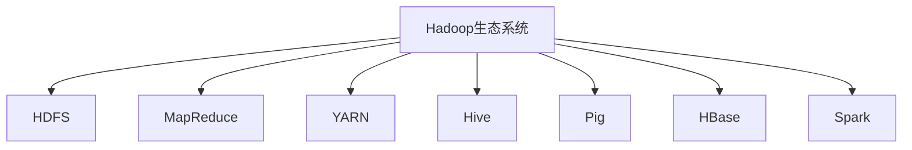
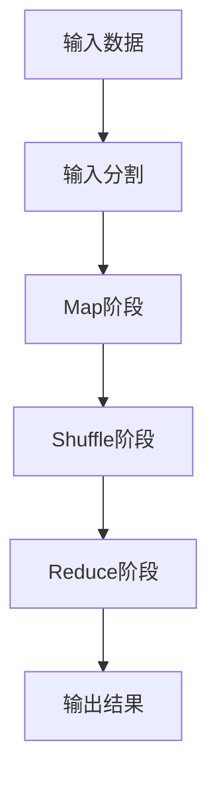
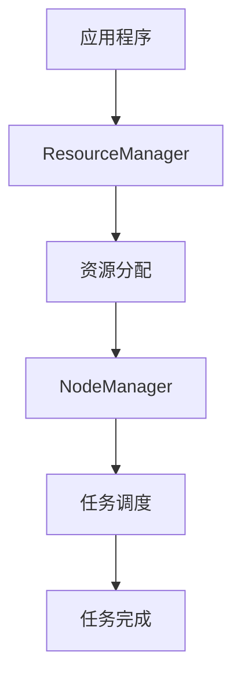

# 【AI大数据计算原理与代码实例讲解】Hadoop

## 1.背景介绍

在大数据时代，数据的爆炸性增长对传统的数据处理技术提出了巨大的挑战。Hadoop作为一个开源的分布式计算框架，因其高效的处理能力和扩展性，成为了大数据处理的核心工具之一。Hadoop的出现不仅改变了数据处理的方式，也为人工智能和大数据分析提供了坚实的基础。

Hadoop最初由Doug Cutting和Mike Cafarella在2005年开发，旨在支持Nutch搜索引擎项目。其核心组件包括Hadoop分布式文件系统（HDFS）和MapReduce编程模型。HDFS负责存储大规模数据，而MapReduce则负责数据的并行处理。随着时间的推移，Hadoop生态系统不断扩展，增加了如YARN、Hive、Pig等组件，进一步增强了其功能和应用范围。

## 2.核心概念与联系

### 2.1 Hadoop分布式文件系统（HDFS）

HDFS是Hadoop的存储基础，设计用于在廉价的硬件上存储大规模数据。其核心思想是将大文件分割成小块（通常为64MB或128MB），并将这些块分布存储在集群中的不同节点上。每个数据块会被复制多份（默认3份），以确保数据的可靠性和可用性。

### 2.2 MapReduce编程模型

MapReduce是Hadoop的核心计算模型，主要包括两个阶段：Map阶段和Reduce阶段。Map阶段负责将输入数据分割成键值对，并对其进行处理；Reduce阶段则负责对Map阶段的输出进行汇总和进一步处理。通过这种方式，MapReduce能够高效地处理大规模数据。

### 2.3 YARN（Yet Another Resource Negotiator）

YARN是Hadoop的资源管理框架，负责管理集群资源并调度任务。YARN将资源管理和任务调度分离，使得Hadoop能够更好地支持多种计算模型和应用。

### 2.4 Hadoop生态系统

Hadoop生态系统包括了许多其他工具和框架，如Hive、Pig、HBase、Spark等。这些工具和框架扩展了Hadoop的功能，使其能够支持更复杂的数据处理和分析任务。



## 3.核心算法原理具体操作步骤

### 3.1 HDFS的工作原理

HDFS的工作原理可以分为以下几个步骤：

1. **文件分块**：将大文件分割成多个小块。
2. **数据存储**：将数据块分布存储在集群中的不同节点上。
3. **数据复制**：每个数据块会被复制多份，以确保数据的可靠性。
4. **数据读取**：客户端通过NameNode获取数据块的位置信息，并直接从DataNode读取数据。

### 3.2 MapReduce的工作原理

MapReduce的工作原理可以分为以下几个步骤：

1. **输入分割**：将输入数据分割成多个小块。
2. **Map阶段**：每个Map任务处理一个数据块，生成键值对。
3. **Shuffle阶段**：将Map阶段生成的键值对按照键进行分组。
4. **Reduce阶段**：每个Reduce任务处理一个键的所有值，生成最终结果。



### 3.3 YARN的工作原理

YARN的工作原理可以分为以下几个步骤：

1. **资源请求**：应用程序向ResourceManager请求资源。
2. **资源分配**：ResourceManager根据资源情况分配资源。
3. **任务调度**：NodeManager启动任务并监控其运行状态。
4. **任务完成**：任务完成后，NodeManager释放资源。



## 4.数学模型和公式详细讲解举例说明

### 4.1 HDFS的可靠性模型

HDFS通过数据块的复制来保证数据的可靠性。假设每个数据块被复制 $r$ 份，集群中有 $n$ 个节点，每个节点的故障概率为 $p$，则数据块丢失的概率 $P_{loss}$ 可以表示为：

$$
P_{loss} = p^r
$$

例如，假设每个数据块被复制3份，节点的故障概率为0.01，则数据块丢失的概率为：

$$
P_{loss} = 0.01^3 = 0.000001
$$

### 4.2 MapReduce的性能模型

MapReduce的性能可以通过以下公式来估算：

$$
T_{total} = T_{map} + T_{shuffle} + T_{reduce}
$$

其中，$T_{map}$ 是Map阶段的时间，$T_{shuffle}$ 是Shuffle阶段的时间，$T_{reduce}$ 是Reduce阶段的时间。假设有 $m$ 个Map任务和 $r$ 个Reduce任务，每个任务的处理时间分别为 $t_{map}$ 和 $t_{reduce}$，则总时间可以表示为：

$$
T_{total} = m \cdot t_{map} + r \cdot t_{reduce}
$$

### 4.3 YARN的资源分配模型

YARN的资源分配可以通过以下公式来表示：

$$
R_{total} = \sum_{i=1}^{n} R_i
$$

其中，$R_{total}$ 是集群的总资源，$R_i$ 是第 $i$ 个节点的资源。假设每个节点的资源为 $r$，则总资源可以表示为：

$$
R_{total} = n \cdot r
$$

## 5.项目实践：代码实例和详细解释说明

### 5.1 HDFS操作示例

以下是一个简单的HDFS操作示例，展示如何在HDFS中创建目录、上传文件和读取文件。

```java
import org.apache.hadoop.conf.Configuration;
import org.apache.hadoop.fs.FileSystem;
import org.apache.hadoop.fs.Path;

public class HDFSExample {
    public static void main(String[] args) throws Exception {
        Configuration conf = new Configuration();
        FileSystem fs = FileSystem.get(conf);

        // 创建目录
        Path dirPath = new Path("/user/hadoop/example");
        fs.mkdirs(dirPath);

        // 上传文件
        Path localFilePath = new Path("/local/path/to/file.txt");
        Path hdfsFilePath = new Path("/user/hadoop/example/file.txt");
        fs.copyFromLocalFile(localFilePath, hdfsFilePath);

        // 读取文件
        FSDataInputStream inputStream = fs.open(hdfsFilePath);
        BufferedReader reader = new BufferedReader(new InputStreamReader(inputStream));
        String line;
        while ((line = reader.readLine()) != null) {
            System.out.println(line);
        }
        reader.close();
        fs.close();
    }
}
```

### 5.2 MapReduce示例

以下是一个简单的MapReduce示例，展示如何计算文本文件中的单词频率。

```java
import org.apache.hadoop.conf.Configuration;
import org.apache.hadoop.fs.Path;
import org.apache.hadoop.io.IntWritable;
import org.apache.hadoop.io.Text;
import org.apache.hadoop.mapreduce.Job;
import org.apache.hadoop.mapreduce.Mapper;
import org.apache.hadoop.mapreduce.Reducer;
import org.apache.hadoop.mapreduce.lib.input.FileInputFormat;
import org.apache.hadoop.mapreduce.lib.output.FileOutputFormat;

import java.io.IOException;
import java.util.StringTokenizer;

public class WordCount {

    public static class TokenizerMapper extends Mapper<Object, Text, Text, IntWritable> {
        private final static IntWritable one = new IntWritable(1);
        private Text word = new Text();

        public void map(Object key, Text value, Context context) throws IOException, InterruptedException {
            StringTokenizer itr = new StringTokenizer(value.toString());
            while (itr.hasMoreTokens()) {
                word.set(itr.nextToken());
                context.write(word, one);
            }
        }
    }

    public static class IntSumReducer extends Reducer<Text, IntWritable, Text, IntWritable> {
        private IntWritable result = new IntWritable();

        public void reduce(Text key, Iterable<IntWritable> values, Context context) throws IOException, InterruptedException {
            int sum = 0;
            for (IntWritable val : values) {
                sum += val.get();
            }
            result.set(sum);
            context.write(key, result);
        }
    }

    public static void main(String[] args) throws Exception {
        Configuration conf = new Configuration();
        Job job = Job.getInstance(conf, "word count");
        job.setJarByClass(WordCount.class);
        job.setMapperClass(TokenizerMapper.class);
        job.setCombinerClass(IntSumReducer.class);
        job.setReducerClass(IntSumReducer.class);
        job.setOutputKeyClass(Text.class);
        job.setOutputValueClass(IntWritable.class);
        FileInputFormat.addInputPath(job, new Path(args[0]));
        FileOutputFormat.setOutputPath(job, new Path(args[1]));
        System.exit(job.waitForCompletion(true) ? 0 : 1);
    }
}
```

### 5.3 YARN应用示例

以下是一个简单的YARN应用示例，展示如何提交一个YARN应用程序。

```java
import org.apache.hadoop.conf.Configuration;
import org.apache.hadoop.yarn.api.records.ApplicationId;
import org.apache.hadoop.yarn.api.records.ApplicationSubmissionContext;
import org.apache.hadoop.yarn.api.records.ContainerLaunchContext;
import org.apache.hadoop.yarn.client.api.YarnClient;
import org.apache.hadoop.yarn.client.api.YarnClientApplication;
import org.apache.hadoop.yarn.util.Records;

public class YarnAppExample {
    public static void main(String[] args) throws Exception {
        Configuration conf = new Configuration();
        YarnClient yarnClient = YarnClient.createYarnClient();
        yarnClient.init(conf);
        yarnClient.start();

        YarnClientApplication app = yarnClient.createApplication();
        ApplicationSubmissionContext appContext = app.getApplicationSubmissionContext();
        ApplicationId appId = appContext.getApplicationId();

        appContext.setApplicationName("YarnAppExample");

        ContainerLaunchContext amContainer = Records.newRecord(ContainerLaunchContext.class);
        // 设置AM容器的启动命令和资源
        // ...

        appContext.setAMContainerSpec(amContainer);
        yarnClient.submitApplication(appContext);

        // 等待应用程序完成
        // ...
    }
}
```

## 6.实际应用场景

### 6.1 数据仓库

Hadoop常用于构建数据仓库，支持大规模数据的存储和分析。通过Hive和Pig等工具，用户可以使用SQL或脚本语言对数据进行查询和处理。

### 6.2 日志分析

Hadoop可以用于处理和分析大规模日志数据。通过MapReduce，用户可以高效地计算日志中的统计信息，如访问量、错误率等。

### 6.3 机器学习

Hadoop可以与机器学习框架（如Spark MLlib）结合，支持大规模数据的机器学习任务。通过分布式计算，用户可以训练和评估复杂的机器学习模型。

### 6.4 图数据处理

Hadoop可以用于处理大规模图数据，如社交网络分析、推荐系统等。通过图计算框架（如Apache Giraph），用户可以高效地进行图数据的计算和分析。

## 7.工具和资源推荐

### 7.1 Hadoop发行版

- **Apache Hadoop**：官方开源版本，适合开发和测试。
- **Cloudera CDH**：企业级发行版，提供商业支持和增强功能。
- **Hortonworks HDP**：企业级发行版，提供商业支持和增强功能。

### 7.2 数据处理工具

- **Hive**：数据仓库工具，支持SQL查询。
- **Pig**：数据处理脚本语言，适合复杂数据处理任务。
- **HBase**：分布式NoSQL数据库，适合实时数据存储和查询。

### 7.3 机器学习工具

- **Spark MLlib**：分布式机器学习库，支持多种机器学习算法。
- **Mahout**：分布式机器学习库，支持推荐系统、分类、聚类等任务。

### 7.4 图计算工具

- **Apache Giraph**：分布式图计算框架，适合大规模图数据处理。
- **GraphX**：Spark的图计算库，支持图数据的处理和分析。

## 8.总结：未来发展趋势与挑战

Hadoop作为大数据处理的核心工具，已经在多个领域得到了广泛应用。然而，随着数据规模的不断增长和应用场景的不断扩展，Hadoop也面临着新的挑战和发展机遇。

### 8.1 发展趋势

- **云计算与Hadoop的结合**：随着云计算的普及，Hadoop在云环境中的应用将越来越广泛。通过云服务，用户可以更方便地部署和管理Hadoop集群。
- **实时数据处理**：随着实时数据处理需求的增加，Hadoop生态系统中的实时处理工具（如Spark Streaming、Flink）将得到更多关注和应用。
- **机器学习与人工智能**：Hadoop与机器学习和人工智能的结合将进一步推动大数据分析的发展。通过分布式计算，用户可以更高效地训练和评估复杂的机器学习模型。

### 8.2 挑战

- **数据安全与隐私**：随着数据规模的增加，数据安全和隐私保护变得越来越重要。Hadoop需要提供更强大的安全机制，以保护用户数据。
- **性能优化**：尽管Hadoop在处理大规模数据方面表现出色，但在某些场景下仍存在性能瓶颈。如何进一步优化Hadoop的性能是一个重要的研究方向。
- **易用性**：Hadoop的复杂性使得其学习和使用门槛较高。如何提高Hadoop的易用性，使其更容易被广泛接受和应用，是一个重要的挑战。

## 9.附录：常见问题与解答

### 9.1 HDFS中的数据块大小如何设置？

HDFS中的数据块大小可以通过配置参数 `dfs.blocksize` 来设置。默认值为128MB，用户可以根据具体需求进行调整。较大的数据块可以减少NameNode的负载，但可能会增加数据传输的延迟。

### 9.2 如何提高MapReduce任务的性能？

提高MapReduce任务性能的方法包括：

- **优化Map和Reduce任务的数量**：合理设置Map和Reduce任务的数量，可以提高任务的并行度和资源利用率。
- **使用Combiner**：在Map阶段使用Combiner，可以减少Shuffle阶段的数据传输量。
- **数据本地化**：尽量将任务调度到数据所在的节点，以减少数据传输的开销。

### 9.3 YARN中的资源调度策略有哪些？

YARN中的资源调度策略包括：

- **FIFO调度器**：按照任务提交的顺序进行调度。
- **容量调度器**：根据队列的容量进行资源分配，适合多租户环境。
- **公平调度器**：根据任务的资源需求进行公平分配，确保所有任务都能获得一定的资源。

### 9.4 如何监控Hadoop集群的运行状态？

监控Hadoop集群的方法包括：

- **Web UI**：Hadoop提供了多个Web UI（如NameNode、ResourceManager），用户可以通过Web UI查看集群的运行状态和任务的执行情况。
- **日志文件**：Hadoop生成的日志文件包含了详细的运行信息，用户可以通过分析日志文件来了解集群的运行状态。
- **监控工具**：可以使用第三方监控工具（如Ganglia、Nagios）对Hadoop集群进行监控，实时获取集群的运行状态和性能指标。

作者：禅与计算机程序设计艺术 / Zen and the Art of Computer Programming