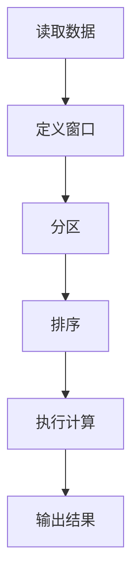

# 【AI大数据计算原理与代码实例讲解】窗口函数

## 1.背景介绍

在大数据和人工智能领域，数据处理和分析是至关重要的环节。随着数据量的爆炸性增长，传统的处理方法已经无法满足需求。窗口函数作为一种强大的数据处理工具，能够在不改变数据集结构的情况下，进行复杂的计算和分析。窗口函数广泛应用于数据库查询优化、数据分析、机器学习特征工程等领域。

## 2.核心概念与联系

### 2.1 窗口函数定义

窗口函数是一种在SQL查询中使用的函数，它能够在一个特定的窗口（即一组行）内执行计算。与聚合函数不同，窗口函数不会将多行数据合并成一行，而是保留原有的行数，并在每一行上附加计算结果。

### 2.2 窗口函数的基本语法

窗口函数的基本语法如下：

```sql
SELECT column1, column2, 
       window_function() OVER (PARTITION BY column1 ORDER BY column2)
FROM table_name;
```

### 2.3 窗口函数与聚合函数的区别

窗口函数和聚合函数的主要区别在于，聚合函数会将多行数据合并成一行，而窗口函数则会在每一行上附加计算结果，不改变原有的行数。

## 3.核心算法原理具体操作步骤

### 3.1 窗口函数的分类

窗口函数主要分为以下几类：

- 聚合窗口函数：如 `SUM()`, `AVG()`, `COUNT()`
- 排序窗口函数：如 `ROW_NUMBER()`, `RANK()`, `DENSE_RANK()`
- 偏移窗口函数：如 `LAG()`, `LEAD()`

### 3.2 窗口函数的操作步骤

1. **定义窗口**：使用 `OVER` 子句定义窗口的范围。
2. **分区**：使用 `PARTITION BY` 子句将数据分成不同的组。
3. **排序**：使用 `ORDER BY` 子句对每个分区内的数据进行排序。
4. **计算**：在定义好的窗口内执行计算。

### 3.3 窗口函数的执行流程



## 4.数学模型和公式详细讲解举例说明

### 4.1 窗口函数的数学模型

窗口函数的数学模型可以表示为：

$$
f(x_i) = g(x_{i-k}, x_{i-k+1}, \ldots, x_i, \ldots, x_{i+k})
$$

其中，$f(x_i)$ 是窗口函数的结果，$g$ 是窗口函数的计算方法，$x_i$ 是当前行的数据，$k$ 是窗口的大小。

### 4.2 具体举例说明

假设我们有一个包含销售数据的表 `sales`，其中包含 `date` 和 `amount` 两列。我们希望计算每一天的累计销售额，可以使用以下窗口函数：

```sql
SELECT date, amount,
       SUM(amount) OVER (ORDER BY date) AS cumulative_sales
FROM sales;
```

在这个例子中，`SUM(amount) OVER (ORDER BY date)` 就是一个窗口函数，它计算了每一天的累计销售额。

## 5.项目实践：代码实例和详细解释说明

### 5.1 数据准备

首先，我们创建一个包含销售数据的表 `sales`：

```sql
CREATE TABLE sales (
    date DATE,
    amount INT
);

INSERT INTO sales (date, amount) VALUES
('2023-01-01', 100),
('2023-01-02', 150),
('2023-01-03', 200),
('2023-01-04', 250),
('2023-01-05', 300);
```

### 5.2 使用窗口函数计算累计销售额

```sql
SELECT date, amount,
       SUM(amount) OVER (ORDER BY date) AS cumulative_sales
FROM sales;
```

### 5.3 代码解释

- `SUM(amount) OVER (ORDER BY date)`：定义了一个窗口函数，按照 `date` 列进行排序，并计算累计销售额。
- `AS cumulative_sales`：将计算结果命名为 `cumulative_sales`。

### 5.4 结果展示

执行上述查询后，结果如下：

| date       | amount | cumulative_sales |
|------------|--------|------------------|
| 2023-01-01 | 100    | 100              |
| 2023-01-02 | 150    | 250              |
| 2023-01-03 | 200    | 450              |
| 2023-01-04 | 250    | 700              |
| 2023-01-05 | 300    | 1000             |

## 6.实际应用场景

### 6.1 数据分析

窗口函数在数据分析中有广泛的应用，例如计算移动平均、累计和、排名等。

### 6.2 数据库查询优化

窗口函数可以用于优化复杂的数据库查询，减少数据处理的时间和资源消耗。

### 6.3 机器学习特征工程

在机器学习中，窗口函数可以用于生成特征，例如时间序列数据的移动平均、累计和等。

## 7.工具和资源推荐

### 7.1 数据库管理工具

- MySQL
- PostgreSQL
- SQL Server
- Oracle

### 7.2 数据分析工具

- Pandas（Python库）
- Apache Spark
- Hadoop

### 7.3 在线资源

- [SQL 官方文档](https://www.sql.org/)
- [LeetCode SQL 练习](https://leetcode.com/problemset/database/)

## 8.总结：未来发展趋势与挑战

窗口函数作为一种强大的数据处理工具，已经在多个领域得到了广泛应用。未来，随着数据量的不断增长和数据分析需求的不断增加，窗口函数的应用将更加广泛。然而，窗口函数的性能优化和复杂查询的处理仍然是一个挑战，需要不断的研究和改进。

## 9.附录：常见问题与解答

### 9.1 窗口函数与聚合函数的区别是什么？

窗口函数不会改变数据集的行数，而聚合函数会将多行数据合并成一行。

### 9.2 窗口函数的性能如何优化？

可以通过合理的分区和排序，以及使用索引来优化窗口函数的性能。

### 9.3 窗口函数可以嵌套使用吗？

窗口函数不能直接嵌套使用，但可以通过子查询的方式间接实现嵌套。

---

作者：禅与计算机程序设计艺术 / Zen and the Art of Computer Programming