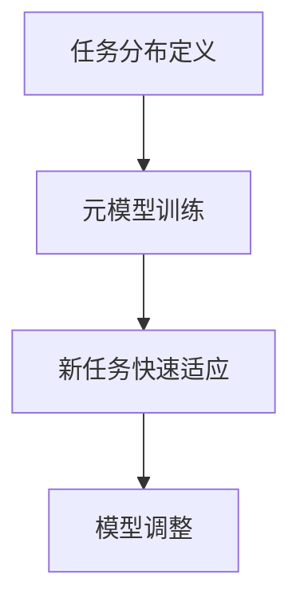

# 一切皆是映射：实现机器人快速适应性的元学习框架

## 1.背景介绍

在人工智能和机器人技术的快速发展中，如何使机器人能够快速适应新环境和新任务成为了一个重要的研究方向。传统的机器学习方法通常需要大量的数据和时间来训练模型，这在动态变化的环境中显得尤为不足。元学习（Meta-Learning）作为一种新兴的学习范式，旨在通过学习如何学习，使模型能够在少量数据和短时间内快速适应新任务。

元学习的核心思想是通过训练一个元模型，使其能够从多个任务中提取共性，从而在面对新任务时能够快速调整自身参数，实现快速适应性。本文将深入探讨元学习在机器人快速适应性中的应用，介绍其核心概念、算法原理、数学模型、实际应用场景以及未来的发展趋势和挑战。

## 2.核心概念与联系

### 2.1 元学习的定义

元学习，也称为“学习的学习”，是一种通过训练一个元模型，使其能够从多个任务中提取共性，从而在面对新任务时能够快速调整自身参数，实现快速适应性的学习范式。

### 2.2 元学习与传统机器学习的区别

传统机器学习方法通常需要大量的数据和时间来训练模型，而元学习则通过学习如何学习，使模型能够在少量数据和短时间内快速适应新任务。元学习的核心在于通过训练一个元模型，使其能够从多个任务中提取共性，从而在面对新任务时能够快速调整自身参数，实现快速适应性。

### 2.3 元学习的应用场景

元学习在机器人技术中的应用场景包括但不限于：
- 动态环境中的导航
- 多任务学习
- 自主决策
- 机器人手臂的精细操作

## 3.核心算法原理具体操作步骤

### 3.1 元学习的基本框架

元学习的基本框架可以分为三个主要步骤：
1. 任务分布的定义
2. 元模型的训练
3. 新任务的快速适应

### 3.2 任务分布的定义

在元学习中，我们首先需要定义一个任务分布 $\mathcal{T}$，从中采样出多个任务 $\tau_i$。每个任务 $\tau_i$ 包含一个训练集 $\mathcal{D}_{\tau_i}^{train}$ 和一个测试集 $\mathcal{D}_{\tau_i}^{test}$。

### 3.3 元模型的训练

元模型的训练过程可以表示为：
$$
\theta^* = \arg\min_{\theta} \sum_{\tau_i \sim \mathcal{T}} \mathcal{L}_{\tau_i} (f_{\theta} (\mathcal{D}_{\tau_i}^{train}), \mathcal{D}_{\tau_i}^{test})
$$
其中，$\theta$ 是元模型的参数，$\mathcal{L}_{\tau_i}$ 是任务 $\tau_i$ 的损失函数，$f_{\theta}$ 是元模型。

### 3.4 新任务的快速适应

在面对新任务 $\tau_{new}$ 时，元模型通过少量的训练数据 $\mathcal{D}_{\tau_{new}}^{train}$ 进行快速调整，实现快速适应性。具体过程可以表示为：
$$
\theta_{new} = \theta^* - \alpha \nabla_{\theta} \mathcal{L}_{\tau_{new}} (f_{\theta} (\mathcal{D}_{\tau_{new}}^{train}), \mathcal{D}_{\tau_{new}}^{test})
$$
其中，$\alpha$ 是学习率。

### 3.5 Mermaid 流程图



## 4.数学模型和公式详细讲解举例说明

### 4.1 任务分布的定义

在元学习中，我们首先需要定义一个任务分布 $\mathcal{T}$，从中采样出多个任务 $\tau_i$。每个任务 $\tau_i$ 包含一个训练集 $\mathcal{D}_{\tau_i}^{train}$ 和一个测试集 $\mathcal{D}_{\tau_i}^{test}$。

### 4.2 元模型的训练

元模型的训练过程可以表示为：
$$
\theta^* = \arg\min_{\theta} \sum_{\tau_i \sim \mathcal{T}} \mathcal{L}_{\tau_i} (f_{\theta} (\mathcal{D}_{\tau_i}^{train}), \mathcal{D}_{\tau_i}^{test})
$$
其中，$\theta$ 是元模型的参数，$\mathcal{L}_{\tau_i}$ 是任务 $\tau_i$ 的损失函数，$f_{\theta}$ 是元模型。

### 4.3 新任务的快速适应

在面对新任务 $\tau_{new}$ 时，元模型通过少量的训练数据 $\mathcal{D}_{\tau_{new}}^{train}$ 进行快速调整，实现快速适应性。具体过程可以表示为：
$$
\theta_{new} = \theta^* - \alpha \nabla_{\theta} \mathcal{L}_{\tau_{new}} (f_{\theta} (\mathcal{D}_{\tau_{new}}^{train}), \mathcal{D}_{\tau_{new}}^{test})
$$
其中，$\alpha$ 是学习率。

### 4.4 举例说明

假设我们有一个机器人需要在不同的房间中导航，每个房间的布局不同。我们可以将每个房间的导航任务视为一个任务 $\tau_i$，通过元学习框架训练一个元模型，使其能够快速适应新房间的导航任务。

## 5.项目实践：代码实例和详细解释说明

### 5.1 环境准备

在开始项目实践之前，我们需要准备好开发环境。本文将使用 Python 和 PyTorch 进行实现。

```python
import torch
import torch.nn as nn
import torch.optim as optim
from torch.utils.data import DataLoader, Dataset
```

### 5.2 数据集定义

我们需要定义一个数据集类，用于加载任务数据。

```python
class TaskDataset(Dataset):
    def __init__(self, data, labels):
        self.data = data
        self.labels = labels

    def __len__(self):
        return len(self.data)

    def __getitem__(self, idx):
        return self.data[idx], self.labels[idx]
```

### 5.3 元模型定义

我们定义一个简单的神经网络作为元模型。

```python
class MetaModel(nn.Module):
    def __init__(self, input_size, hidden_size, output_size):
        super(MetaModel, self).__init__()
        self.fc1 = nn.Linear(input_size, hidden_size)
        self.fc2 = nn.Linear(hidden_size, output_size)

    def forward(self, x):
        x = torch.relu(self.fc1(x))
        x = self.fc2(x)
        return x
```

### 5.4 元模型训练

我们定义元模型的训练过程。

```python
def train_meta_model(meta_model, tasks, num_epochs, learning_rate):
    optimizer = optim.Adam(meta_model.parameters(), lr=learning_rate)
    loss_fn = nn.MSELoss()

    for epoch in range(num_epochs):
        for task in tasks:
            train_loader = DataLoader(task['train'], batch_size=32, shuffle=True)
            test_loader = DataLoader(task['test'], batch_size=32, shuffle=False)

            for data, labels in train_loader:
                optimizer.zero_grad()
                outputs = meta_model(data)
                loss = loss_fn(outputs, labels)
                loss.backward()
                optimizer.step()

        print(f'Epoch {epoch+1}/{num_epochs}, Loss: {loss.item()}')
```

### 5.5 新任务的快速适应

我们定义新任务的快速适应过程。

```python
def adapt_to_new_task(meta_model, new_task, num_steps, learning_rate):
    optimizer = optim.Adam(meta_model.parameters(), lr=learning_rate)
    loss_fn = nn.MSELoss()

    train_loader = DataLoader(new_task['train'], batch_size=32, shuffle=True)

    for step in range(num_steps):
        for data, labels in train_loader:
            optimizer.zero_grad()
            outputs = meta_model(data)
            loss = loss_fn(outputs, labels)
            loss.backward()
            optimizer.step()

        print(f'Step {step+1}/{num_steps}, Loss: {loss.item()}')
```

### 5.6 代码实例运行

我们定义一些示例数据，并运行代码实例。

```python
# 示例数据
tasks = [
    {'train': TaskDataset(torch.randn(100, 10), torch.randn(100, 1)), 'test': TaskDataset(torch.randn(20, 10), torch.randn(20, 1))},
    {'train': TaskDataset(torch.randn(100, 10), torch.randn(100, 1)), 'test': TaskDataset(torch.randn(20, 10), torch.randn(20, 1))}
]

new_task = {'train': TaskDataset(torch.randn(100, 10), torch.randn(100, 1)), 'test': TaskDataset(torch.randn(20, 10), torch.randn(20, 1))}

# 元模型实例化
meta_model = MetaModel(input_size=10, hidden_size=20, output_size=1)

# 元模型训练
train_meta_model(meta_model, tasks, num_epochs=10, learning_rate=0.001)

# 新任务快速适应
adapt_to_new_task(meta_model, new_task, num_steps=5, learning_rate=0.001)
```

## 6.实际应用场景

### 6.1 动态环境中的导航

在动态环境中，机器人需要能够快速适应环境的变化，例如障碍物的移动、路径的改变等。元学习可以通过训练一个元模型，使其能够从多个导航任务中提取共性，从而在面对新环境时能够快速调整自身参数，实现快速适应性。

### 6.2 多任务学习

在多任务学习中，机器人需要同时处理多个任务，例如同时进行导航和物体识别。元学习可以通过训练一个元模型，使其能够从多个任务中提取共性，从而在面对新任务时能够快速调整自身参数，实现快速适应性。

### 6.3 自主决策

在自主决策中，机器人需要能够根据环境和任务的变化，快速做出决策。元学习可以通过训练一个元模型，使其能够从多个决策任务中提取共性，从而在面对新任务时能够快速调整自身参数，实现快速适应性。

### 6.4 机器人手臂的精细操作

在机器人手臂的精细操作中，机器人需要能够快速适应不同的操作任务，例如抓取不同形状和大小的物体。元学习可以通过训练一个元模型，使其能够从多个操作任务中提取共性，从而在面对新任务时能够快速调整自身参数，实现快速适应性。

## 7.工具和资源推荐

### 7.1 开发工具

- **Python**：一种广泛使用的编程语言，适用于机器学习和深度学习的开发。
- **PyTorch**：一个开源的深度学习框架，提供了灵活的神经网络构建和训练工具。
- **Jupyter Notebook**：一个交互式的开发环境，适用于数据分析和机器学习的实验。

### 7.2 数据集

- **OpenAI Gym**：一个提供多种强化学习环境的平台，适用于元学习的实验。
- **Meta-Dataset**：一个用于元学习研究的数据集，包含多个不同领域的任务。

### 7.3 参考文献

- **《Meta-Learning: A Survey》**：一篇关于元学习的综述文章，详细介绍了元学习的基本概念、算法和应用。
- **《Model-Agnostic Meta-Learning for Fast Adaptation of Deep Networks》**：一篇关于元学习的经典论文，提出了MAML算法。

## 8.总结：未来发展趋势与挑战

### 8.1 未来发展趋势

元学习作为一种新兴的学习范式，具有广阔的应用前景。未来，元学习在机器人技术中的应用将会更加广泛和深入，特别是在动态环境中的导航、多任务学习、自主决策和机器人手臂的精细操作等方面。

### 8.2 挑战

尽管元学习具有广阔的应用前景，但在实际应用中仍然面临一些挑战。例如，如何定义和采样任务分布、如何设计高效的元模型、如何处理任务之间的差异性等。这些问题需要进一步的研究和探索。

## 9.附录：常见问题与解答

### 9.1 什么是元学习？

元学习，也称为“学习的学习”，是一种通过训练一个元模型，使其能够从多个任务中提取共性，从而在面对新任务时能够快速调整自身参数，实现快速适应性的学习范式。

### 9.2 元学习与传统机器学习有什么区别？

传统机器学习方法通常需要大量的数据和时间来训练模型，而元学习则通过学习如何学习，使模型能够在少量数据和短时间内快速适应新任务。

### 9.3 元学习在机器人技术中的应用有哪些？

元学习在机器人技术中的应用场景包括但不限于动态环境中的导航、多任务学习、自主决策和机器人手臂的精细操作。

### 9.4 如何定义任务分布？

在元学习中，我们首先需要定义一个任务分布 $\mathcal{T}$，从中采样出多个任务 $\tau_i$。每个任务 $\tau_i$ 包含一个训练集 $\mathcal{D}_{\tau_i}^{train}$ 和一个测试集 $\mathcal{D}_{\tau_i}^{test}$。

### 9.5 如何训练元模型？

元模型的训练过程可以表示为：
$$
\theta^* = \arg\min_{\theta} \sum_{\tau_i \sim \mathcal{T}} \mathcal{L}_{\tau_i} (f_{\theta} (\mathcal{D}_{\tau_i}^{train}), \mathcal{D}_{\tau_i}^{test})
$$
其中，$\theta$ 是元模型的参数，$\mathcal{L}_{\tau_i}$ 是任务 $\tau_i$ 的损失函数，$f_{\theta}$ 是元模型。

### 9.6 如何实现新任务的快速适应？

在面对新任务 $\tau_{new}$ 时，元模型通过少量的训练数据 $\mathcal{D}_{\tau_{new}}^{train}$ 进行快速调整，实现快速适应性。具体过程可以表示为：
$$
\theta_{new} = \theta^* - \alpha \nabla_{\theta} \mathcal{L}_{\tau_{new}} (f_{\theta} (\mathcal{D}_{\tau_{new}}^{train}), \mathcal{D}_{\tau_{new}}^{test})
$$
其中，$\alpha$ 是学习率。

---

作者：禅与计算机程序设计艺术 / Zen and the Art of Computer Programming