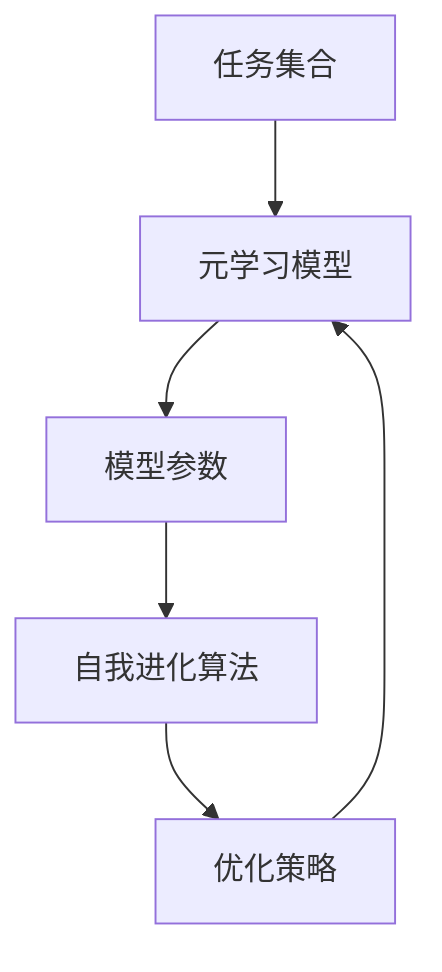

# 一切皆是映射：游戏AI的元学习与自我进化

## 1.背景介绍

在现代游戏开发中，人工智能（AI）扮演着越来越重要的角色。无论是敌人的行为模式、NPC的互动，还是玩家的个性化体验，AI都在其中发挥着关键作用。随着游戏复杂度的增加，传统的AI方法逐渐显得力不从心。元学习（Meta-Learning）和自我进化（Self-Evolution）作为新兴的AI技术，正在为游戏AI带来革命性的变化。

元学习是一种学习如何学习的技术，它使AI能够快速适应新任务和新环境。自我进化则是指AI通过自我优化和自我改进，不断提升自身性能。这两者结合，可以使游戏AI变得更加智能和灵活，提供更为丰富和逼真的游戏体验。

## 2.核心概念与联系

### 2.1 元学习

元学习的核心思想是通过学习多个任务，提取出共性的知识，从而在面对新任务时能够快速适应。元学习通常分为三类：基于模型的方法、基于优化的方法和基于记忆的方法。

### 2.2 自我进化

自我进化是指AI系统通过自我评估和自我改进，不断优化自身的性能。自我进化通常依赖于进化算法，如遗传算法（Genetic Algorithm）和进化策略（Evolution Strategies）。

### 2.3 映射关系

在元学习和自我进化中，映射关系是核心概念。元学习通过映射任务到模型参数，自我进化通过映射当前状态到优化策略。两者的结合可以形成一个闭环，使AI系统能够不断自我提升。

## 3.核心算法原理具体操作步骤

### 3.1 元学习算法

#### 3.1.1 基于模型的方法

基于模型的方法通过训练一个元模型来快速适应新任务。常见的算法有MAML（Model-Agnostic Meta-Learning）。

#### 3.1.2 基于优化的方法

基于优化的方法通过优化算法的改进来实现快速适应。常见的算法有Reptile和Meta-SGD。

#### 3.1.3 基于记忆的方法

基于记忆的方法通过记忆机制来存储和检索任务相关的信息。常见的算法有MetaNet和SNAIL。

### 3.2 自我进化算法

#### 3.2.1 遗传算法

遗传算法通过模拟自然选择和遗传变异来优化AI模型。主要步骤包括选择、交叉和变异。

#### 3.2.2 进化策略

进化策略通过模拟生物进化过程来优化AI模型。主要步骤包括生成、评估和选择。

### 3.3 结合元学习和自我进化

将元学习和自我进化结合，可以形成一个闭环，使AI系统能够在不断适应新任务的同时，自我优化和提升。



## 4.数学模型和公式详细讲解举例说明

### 4.1 元学习数学模型

元学习的数学模型可以表示为：

$$
\theta^* = \arg\min_{\theta} \sum_{T_i \sim p(T)} \mathcal{L}_{T_i}(f_{\theta})
$$

其中，$\theta$ 是模型参数，$T_i$ 是任务集合，$\mathcal{L}_{T_i}$ 是任务 $T_i$ 的损失函数。

### 4.2 自我进化数学模型

自我进化的数学模型可以表示为：

$$
\theta_{t+1} = \theta_t + \alpha \nabla_{\theta} \mathcal{F}(\theta_t)
$$

其中，$\theta_t$ 是当前模型参数，$\alpha$ 是学习率，$\mathcal{F}$ 是适应度函数。

### 4.3 结合模型

结合元学习和自我进化的数学模型可以表示为：

$$
\theta^* = \arg\min_{\theta} \sum_{T_i \sim p(T)} \mathcal{L}_{T_i}(f_{\theta}) + \beta \mathcal{F}(\theta)
$$

其中，$\beta$ 是权重参数，用于平衡元学习和自我进化的影响。

## 5.项目实践：代码实例和详细解释说明

### 5.1 元学习代码实例

以下是一个基于MAML的元学习代码实例：

```python
import torch
import torch.nn as nn
import torch.optim as optim

class MetaLearner(nn.Module):
    def __init__(self, model, lr):
        super(MetaLearner, self).__init__()
        self.model = model
        self.lr = lr

    def forward(self, x):
        return self.model(x)

    def meta_update(self, loss):
        grads = torch.autograd.grad(loss, self.model.parameters())
        for param, grad in zip(self.model.parameters(), grads):
            param.data -= self.lr * grad

# 定义模型和优化器
model = nn.Linear(10, 1)
meta_learner = MetaLearner(model, lr=0.01)
optimizer = optim.SGD(meta_learner.parameters(), lr=0.001)

# 训练过程
for epoch in range(100):
    for task in tasks:
        # 获取任务数据
        x_train, y_train = task.get_data()
        # 前向传播
        y_pred = meta_learner(x_train)
        # 计算损失
        loss = nn.MSELoss()(y_pred, y_train)
        # 元更新
        meta_learner.meta_update(loss)
    # 优化器更新
    optimizer.step()
```

### 5.2 自我进化代码实例

以下是一个基于遗传算法的自我进化代码实例：

```python
import random

def fitness_function(solution):
    # 定义适应度函数
    return sum(solution)

def mutate(solution):
    # 定义变异函数
    index = random.randint(0, len(solution) - 1)
    solution[index] = 1 - solution[index]
    return solution

def crossover(parent1, parent2):
    # 定义交叉函数
    index = random.randint(0, len(parent1) - 1)
    return parent1[:index] + parent2[index:]

# 初始化种群
population = [[random.randint(0, 1) for _ in range(10)] for _ in range(100)]

# 进化过程
for generation in range(100):
    # 选择
    population = sorted(population, key=fitness_function, reverse=True)
    population = population[:50]
    # 交叉和变异
    new_population = []
    for _ in range(50):
        parent1, parent2 = random.sample(population, 2)
        child = crossover(parent1, parent2)
        child = mutate(child)
        new_population.append(child)
    population += new_population
```

## 6.实际应用场景

### 6.1 游戏中的敌人AI

元学习和自我进化可以用于优化游戏中的敌人AI，使其能够根据玩家的行为模式进行自我调整，从而提供更具挑战性的游戏体验。

### 6.2 NPC互动

通过元学习和自我进化，NPC可以根据玩家的选择和行为进行自我调整，从而提供更加个性化和逼真的互动体验。

### 6.3 玩家个性化体验

元学习和自我进化可以用于分析玩家的行为数据，从而提供个性化的游戏内容和推荐，提高玩家的满意度和粘性。

## 7.工具和资源推荐

### 7.1 工具

- **PyTorch**：一个开源的深度学习框架，支持动态计算图和自动微分，适用于元学习和自我进化的实现。
- **TensorFlow**：另一个流行的深度学习框架，提供了丰富的工具和资源，适用于元学习和自我进化的实现。
- **OpenAI Gym**：一个用于开发和比较强化学习算法的工具包，提供了丰富的环境和任务，适用于元学习和自我进化的测试和验证。

### 7.2 资源

- **Meta-Learning Papers**：一个收集了最新元学习研究论文的网站，提供了丰富的理论和实践资源。
- **Evolutionary Computation Resources**：一个收集了进化计算相关资源的网站，提供了丰富的算法和工具。

## 8.总结：未来发展趋势与挑战

元学习和自我进化作为新兴的AI技术，正在为游戏AI带来革命性的变化。未来，随着计算能力的提升和算法的改进，元学习和自我进化将在更多的实际应用中发挥重要作用。然而，这些技术也面临着一些挑战，如计算复杂度高、数据需求大等。如何在实际应用中平衡性能和资源消耗，将是未来研究的重要方向。

## 9.附录：常见问题与解答

### 9.1 元学习和传统学习的区别是什么？

元学习通过学习多个任务，提取出共性的知识，从而在面对新任务时能够快速适应。传统学习则是针对单一任务进行训练，无法快速适应新任务。

### 9.2 自我进化和强化学习的区别是什么？

自我进化通过模拟生物进化过程来优化AI模型，主要依赖于进化算法。强化学习则是通过与环境的交互，学习最优策略，主要依赖于奖励机制。

### 9.3 如何选择元学习和自我进化的算法？

选择算法时需要考虑具体应用场景和需求。元学习算法适用于需要快速适应新任务的场景，自我进化算法适用于需要不断优化和提升性能的场景。

### 9.4 元学习和自我进化的结合有哪些优势？

元学习和自我进化的结合可以形成一个闭环，使AI系统能够在不断适应新任务的同时，自我优化和提升，从而提供更为智能和灵活的解决方案。

---

作者：禅与计算机程序设计艺术 / Zen and the Art of Computer Programming