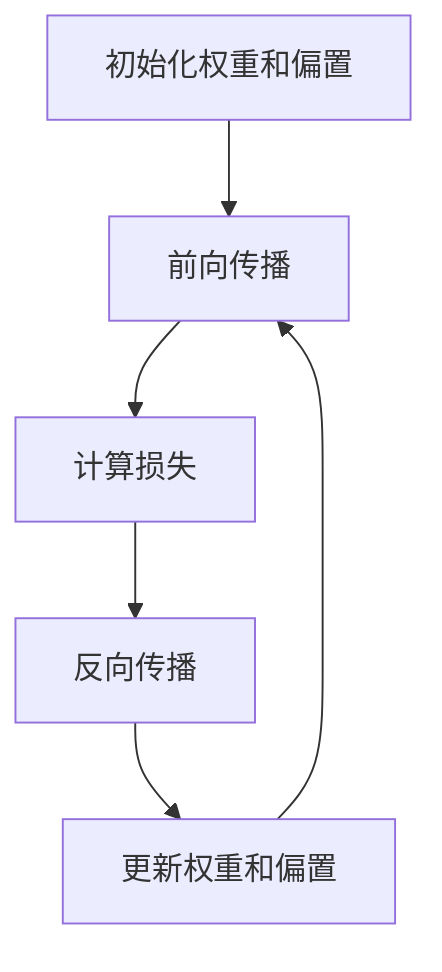

## 1.背景介绍

人工智能（Artificial Intelligence, AI）是计算机科学的一个重要分支，旨在研究和开发能够模拟或增强人类智能的系统。自20世纪50年代以来，AI经历了多次技术变革与突破，从最初的规则系统到如今的深度学习和强化学习，AI已经在多个领域取得了显著的成就，如自然语言处理、计算机视觉、自动驾驶和医疗诊断等。

## 2.核心概念与联系

在讨论AI时，几个核心概念是不可忽视的：

### 2.1 机器学习 (Machine Learning, ML)
机器学习是AI的一个子领域，主要研究如何通过数据来训练模型，使其能够进行预测或决策。机器学习算法通常分为监督学习、无监督学习和强化学习。

### 2.2 深度学习 (Deep Learning, DL)
深度学习是机器学习的一个分支，使用多层神经网络来模拟人脑的结构和功能。深度学习在图像识别、语音识别和自然语言处理等领域表现出色。

### 2.3 强化学习 (Reinforcement Learning, RL)
强化学习是一种通过奖励机制来训练智能体的方法，智能体通过与环境的交互来学习最优策略。

### 2.4 神经网络 (Neural Networks, NN)
神经网络是深度学习的基础结构，模仿生物神经元的连接方式，由输入层、隐藏层和输出层组成。

## 3.核心算法原理具体操作步骤

### 3.1 线性回归 (Linear Regression)
线性回归是一种简单的监督学习算法，用于预测连续型变量。其基本思想是通过最小化误差平方和来找到最佳拟合线。

操作步骤：
1. 数据准备：收集和清洗数据。
2. 特征选择：选择合适的特征作为输入。
3. 模型训练：使用训练数据拟合线性模型。
4. 模型评估：使用测试数据评估模型性能。

### 3.2 神经网络训练
神经网络训练涉及前向传播和反向传播两个步骤。

操作步骤：
1. 初始化权重和偏置。
2. 前向传播：计算每层的输出。
3. 计算损失：使用损失函数计算预测值与真实值的差异。
4. 反向传播：通过链式法则计算梯度，并更新权重和偏置。
5. 重复步骤2-4，直到损失收敛。

以下是一个简单的神经网络训练过程的Mermaid流程图：



## 4.数学模型和公式详细讲解举例说明

### 4.1 线性回归

线性回归模型可以表示为：
$$
y = \beta_0 + \beta_1x + \epsilon
$$
其中，$y$ 是目标变量，$x$ 是特征变量，$\beta_0$ 和 $\beta_1$ 是模型参数，$\epsilon$ 是误差项。

通过最小化均方误差 (Mean Squared Error, MSE)，我们可以找到最佳的参数：
$$
MSE = \frac{1}{n} \sum_{i=1}^n (y_i - (\beta_0 + \beta_1x_i))^2
$$

### 4.2 神经网络

对于一个简单的两层神经网络，其输出可以表示为：
$$
\hat{y} = f(W_2 \cdot f(W_1 \cdot x + b_1) + b_2)
$$
其中，$W_1$ 和 $W_2$ 是权重矩阵，$b_1$ 和 $b_2$ 是偏置向量，$f$ 是激活函数（如ReLU或Sigmoid）。

损失函数（如交叉熵损失）用于衡量预测值与真实值之间的差异：
$$
L = -\frac{1}{n} \sum_{i=1}^n [y_i \log(\hat{y}_i) + (1 - y_i) \log(1 - \hat{y}_i)]
$$

## 5.项目实践：代码实例和详细解释说明

### 5.1 线性回归代码实例

以下是使用Python和Scikit-Learn库实现线性回归的示例代码：

```python
import numpy as np
import matplotlib.pyplot as plt
from sklearn.model_selection import train_test_split
from sklearn.linear_model import LinearRegression
from sklearn.metrics import mean_squared_error

# 生成数据
X = np.random.rand(100, 1) * 10
y = 2 * X + 3 + np.random.randn(100, 1)

# 分割数据集
X_train, X_test, y_train, y_test = train_test_split(X, y, test_size=0.2, random_state=42)

# 创建线性回归模型
model = LinearRegression()

# 训练模型
model.fit(X_train, y_train)

# 预测
y_pred = model.predict(X_test)

# 评估模型
mse = mean_squared_error(y_test, y_pred)
print(f"Mean Squared Error: {mse}")

# 可视化
plt.scatter(X_test, y_test, color='blue')
plt.plot(X_test, y_pred, color='red')
plt.xlabel("X")
plt.ylabel("y")
plt.title("Linear Regression")
plt.show()
```

### 5.2 神经网络代码实例

以下是使用Python和TensorFlow库实现神经网络的示例代码：

```python
import tensorflow as tf
from tensorflow.keras.models import Sequential
from tensorflow.keras.layers import Dense
from sklearn.model_selection import train_test_split
from sklearn.datasets import load_iris

# 载入数据
data = load_iris()
X = data.data
y = data.target

# 分割数据集
X_train, X_test, y_train, y_test = train_test_split(X, y, test_size=0.2, random_state=42)

# 创建神经网络模型
model = Sequential([
    Dense(10, activation='relu', input_shape=(X_train.shape[1],)),
    Dense(10, activation='relu'),
    Dense(3, activation='softmax')
])

# 编译模型
model.compile(optimizer='adam', loss='sparse_categorical_crossentropy', metrics=['accuracy'])

# 训练模型
model.fit(X_train, y_train, epochs=50, batch_size=5, verbose=1)

# 评估模型
loss, accuracy = model.evaluate(X_test, y_test)
print(f"Test Accuracy: {accuracy}")
```

## 6.实际应用场景

### 6.1 医疗诊断
AI在医疗诊断中表现出色，尤其是在图像识别和自然语言处理方面。通过分析医疗影像和患者记录，AI可以辅助医生进行疾病诊断和治疗方案制定。

### 6.2 自动驾驶
自动驾驶汽车依赖于AI技术，如计算机视觉和强化学习。通过摄像头和传感器收集数据，自动驾驶系统可以实时分析道路状况并做出驾驶决策。

### 6.3 金融预测
在金融领域，AI被用于股票市场预测、风险评估和自动交易。通过分析历史数据和市场趋势，AI可以提供准确的投资建议。

## 7.工具和资源推荐

### 7.1 开发工具
- **TensorFlow**：一个开源的深度学习框架，支持多种平台。
- **PyTorch**：另一个流行的深度学习框架，具有动态计算图特性。
- **Scikit-Learn**：一个简单易用的机器学习库，适合初学者。

### 7.2 学习资源
- **Coursera和edX**：提供大量AI和机器学习的在线课程。
- **GitHub**：大量开源项目和代码实例。
- **arXiv**：最新的AI研究论文和技术报告。

## 8.总结：未来发展趋势与挑战

### 8.1 发展趋势
- **通用人工智能 (AGI)**：研究如何开发具备广泛认知能力的智能体。
- **边缘计算**：将AI算法部署在边缘设备上，实现实时数据处理和决策。
- **AI与量子计算结合**：探索量子计算在AI算法中的应用，提升计算效率。

### 8.2 挑战
- **数据隐私和安全**：如何在保护用户隐私的同时，使用数据训练AI模型。
- **模型解释性**：提升AI模型的可解释性，使其决策过程透明化。
- **伦理和法规**：制定合理的AI伦理和法规，确保AI技术的安全和公正。

## 9.附录：常见问题与解答

### 9.1 什么是过拟合和欠拟合？
过拟合是指模型在训练数据上表现良好，但在测试数据上表现不佳的情况，通常是因为模型过于复杂，捕捉到了训练数据中的噪声。而欠拟合则是指模型过于简单，无法捕捉到数据的内在规律，导致在训练数据和测试数据上都表现不佳。

### 9.2 如何解决过拟合问题？
常见的解决过拟合问题的方法包括：
- **使用更多的数据**：增加训练数据量，使模型能够学习到更多的特征。
- **正则化**：通过L1或L2正则化项来限制模型的复杂度。
- **交叉验证**：使用交叉验证来选择最佳模型参数。
- **剪枝**：对于决策树等模型，可以通过剪枝来减少模型复杂度。

### 9.3 什么是梯度消失和梯度爆炸问题？
梯度消失和梯度爆炸是深度神经网络训练过程中常见的问题。梯度消失是指在反向传播过程中，梯度逐层减小，导致前层权重更新缓慢；梯度爆炸则是指梯度逐层增大，导致前层权重更新过大。这两种问题都会影响模型训练效果。

### 9.4 如何解决梯度消失和梯度爆炸问题？
解决梯度消失和梯度爆炸问题的方法包括：
- **使用适当的激活函数**：例如ReLU激活函数可以有效缓解梯度消失问题。
- **权重初始化**：使用合适的权重初始化方法，如Xavier初始化或He初始化。
- **梯度裁剪**：限制梯度的最大值，防止梯度爆炸。
- **批归一化**：通过批归一化层来稳定训练过程。

### 9.5 什么是迁移学习？
迁移学习是一种通过将预训练模型应用到新任务中的方法。通过在大规模数据集上预训练模型，然后将其应用到特定任务中，可以显著减少训练时间和数据需求。迁移学习在计算机视觉和自然语言处理等领域表现出色。

### 9.6 什么是生成对抗网络 (GAN)？
生成对抗网络 (Generative Adversarial Networks, GAN) 是一种通过两个神经网络（生成器和判别器）相互竞争来生成数据的方法。生成器负责生成逼真的数据，而判别器负责区分生成数据和真实数据。通过不断的对抗训练，生成器可以生成越来越逼真的数据。

### 9.7 如何选择合适的机器学习算法？
选择合适的机器学习算法需要考虑以下几个因素：
- **数据规模和特征**：不同算法适用于不同的数据规模和特征类型。
- **模型复杂度**：根据问题的复杂度选择合适的模型，避免过拟合或欠拟合。
- **计算资源**：考虑算法的计算复杂度和可扩展性，选择适合现有资源的算法。
- **任务类型**：根据具体任务（分类、回归、聚类等）选择相应的算法。

### 9.8 如何评估机器学习模型的性能？
评估机器学习模型的性能通常使用以下指标：
- **准确率 (Accuracy)**：分类问题中，正确分类样本所占的比例。
- **精确率 (Precision) 和召回率 (Recall)**：用于评估分类模型在正负样本上的表现。
- **F1分数 (F1 Score)**：精确率和召回率的调和平均数。
- **均方误差 (MSE)**：回归问题中，预测值与真实值之间的平均平方误差。
- **AUC-ROC**：分类问题中，模型区分正负样本的能力。

## 作者信息
作者：禅与计算机程序设计艺术 / Zen and the Art of Computer Programming