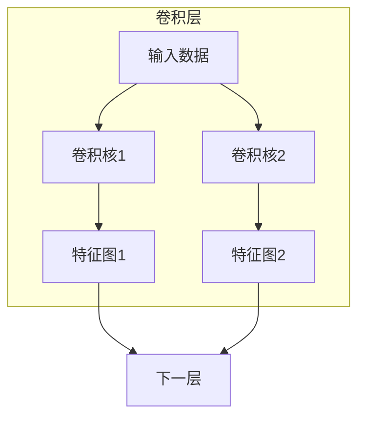
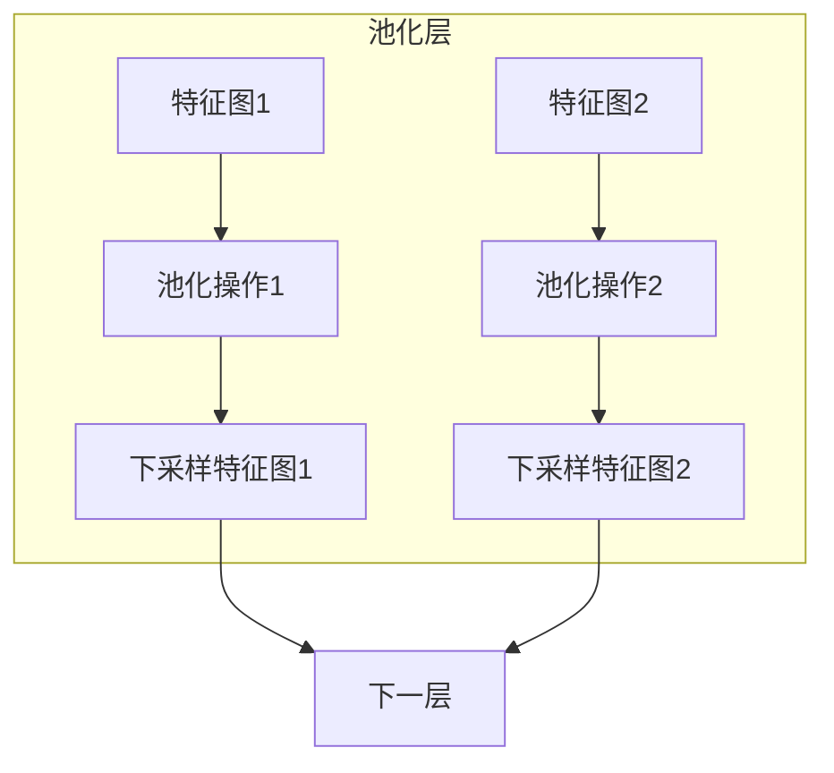
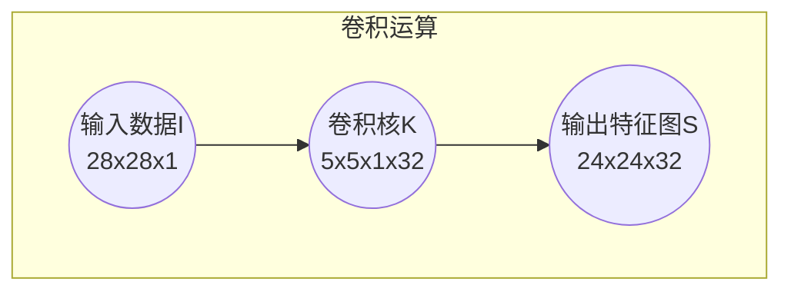
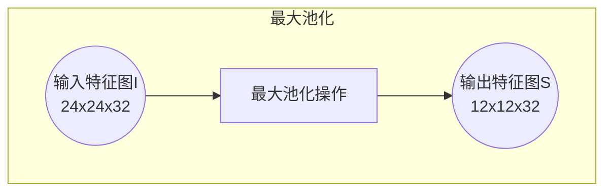

# 卷积神经网络(CNN)原理与代码实战案例讲解

## 1.背景介绍

### 1.1 神经网络简介

神经网络是一种受生物神经系统启发而设计的计算模型,旨在模拟人脑的工作原理。它由大量相互连接的节点(神经元)组成,能够从数据中学习并执行各种任务,如图像识别、自然语言处理和决策制定等。

传统的神经网络通常由全连接层组成,每个神经元与前一层的所有神经元相连。然而,这种结构在处理高维数据(如图像)时效率较低,因为它忽略了输入数据的局部关联性。

### 1.2 卷积神经网络的兴起

为了更好地处理图像等高维数据,卷积神经网络(Convolutional Neural Network, CNN)应运而生。CNN利用卷积运算来提取输入数据的局部特征,从而更有效地捕捉图像的空间和时间相关性。

CNN最早由生物学家Hubel和Wiesel在20世纪60年代提出,他们发现动物视觉皮层中存在一些神经元对特定局部图像模式高度敏感。1998年,LeCun等人成功将CNN应用于手写数字识别,取得了巨大成功,从此CNN在计算机视觉领域广为使用。

## 2.核心概念与联系

### 2.1 卷积层

卷积层是CNN的核心部分,它通过卷积运算在整个输入数据上滑动一个小窗口(卷积核),从而提取局部特征。卷积核由一组可学习的权重参数组成,在训练过程中不断调整以最大限度地激活特定的特征模式。



### 2.2 池化层

池化层通常与卷积层配合使用,目的是降低特征图的维度,减少计算量并提高模型的鲁棒性。常见的池化操作包括最大池化(Max Pooling)和平均池化(Average Pooling),它们分别取池化窗口中的最大值或平均值作为输出。



### 2.3 全连接层

在CNN的最后几层通常是全连接层,它将前面卷积层和池化层提取的高级特征进行整合,并输出最终的分类或回归结果。全连接层的工作方式类似于传统的神经网络。

## 3.核心算法原理具体操作步骤

### 3.1 卷积运算

卷积运算是CNN的核心,它通过在输入数据上滑动卷积核来提取局部特征。具体步骤如下:

1. 初始化一个卷积核(一个小的权重矩阵)
2. 将卷积核滑动到输入数据的每个位置
3. 在每个位置,计算卷积核与输入数据的元素wise乘积之和
4. 将该和作为输出特征图中该位置的值
5. 对输入数据的每个通道重复上述步骤
6. 将所有通道的输出特征图堆叠,形成新的特征图

卷积运算可以用数学公式表示为:

$$
S(i, j) = (I * K)(i, j) = \sum_{m}\sum_{n}I(i+m, j+n)K(m, n)
$$

其中$I$是输入数据,$K$是卷积核,$S$是输出特征图,$m$和$n$是卷积核的索引。

### 3.2 池化运算

池化运算通过下采样特征图来减少数据量和计算复杂度。常见的池化操作包括最大池化和平均池化。

最大池化的步骤:

1. 选择一个池化窗口大小(如2x2)
2. 将池化窗口滑动到特征图的每个位置
3. 在每个位置,取窗口内元素的最大值作为输出

平均池化的步骤类似,只是取窗口内元素的平均值作为输出。

池化运算可以用数学公式表示为:

$$
S(i, j) = \beta_{i,j}^{p}(I)
$$

其中$I$是输入特征图,$S$是输出特征图,$\beta$表示池化函数(最大或平均),$p$是池化窗口大小。

### 3.3 反向传播

CNN的训练过程采用反向传播算法,通过最小化损失函数来更新网络权重。反向传播的步骤如下:

1. 前向传播,计算输出
2. 计算输出与真实标签之间的损失
3. 计算损失对输出的梯度
4. 反向传播梯度,计算每层权重的梯度
5. 使用优化算法(如SGD)更新权重

在反向传播过程中,卷积层和池化层的梯度计算方式与全连接层有所不同,需要考虑局部连接和权重共享等特性。

## 4.数学模型和公式详细讲解举例说明

### 4.1 卷积层数学模型

卷积层的数学模型可以表示为:

$$
S(i, j) = (I * K)(i, j) = \sum_{m}\sum_{n}I(i+m, j+n)K(m, n)
$$

其中:

- $I$是输入数据,通常是一个三维张量(高度,宽度,通道数)
- $K$是卷积核,是一个四维张量(高度,宽度,输入通道数,输出通道数)
- $S$是输出特征图,也是一个三维张量(高度,宽度,输出通道数)
- $m$和$n$是卷积核的索引,用于遍历卷积核的每个元素

例如,假设输入数据$I$是一个28x28x1的图像,卷积核$K$的大小为5x5x1x32,则输出特征图$S$的大小为24x24x32。

卷积运算的示意图如下:



### 4.2 池化层数学模型

池化层的数学模型可以表示为:

$$
S(i, j) = \beta_{i,j}^{p}(I)
$$

其中:

- $I$是输入特征图,通常是一个三维张量(高度,宽度,通道数)
- $S$是输出特征图,也是一个三维张量(高度,宽度,通道数)
- $\beta$表示池化函数,如最大池化或平均池化
- $p$是池化窗口大小,如2x2

例如,假设输入特征图$I$的大小为24x24x32,使用2x2的最大池化,则输出特征图$S$的大小为12x12x32。

最大池化的示意图如下:



### 4.3 反向传播公式

在反向传播过程中,需要计算每层权重的梯度,以便进行权重更新。对于卷积层和全连接层,权重梯度的计算公式如下:

卷积层权重梯度:

$$
\frac{\partial L}{\partial K_{i,j,k,l}} = \sum_{m,n}\frac{\partial L}{\partial S_{m,n,l}}I_{m+i,n+j,k}
$$

全连接层权重梯度:

$$
\frac{\partial L}{\partial W_{i,j}} = \sum_{k}\frac{\partial L}{\partial y_k}x_i
$$

其中:

- $L$是损失函数
- $K$是卷积层权重张量
- $S$是卷积层输出特征图
- $I$是卷积层输入数据
- $W$是全连接层权重矩阵
- $y$是全连接层输出
- $x$是全连接层输入

通过计算每层权重的梯度,然后使用优化算法(如随机梯度下降)更新权重,从而最小化损失函数,提高模型的性能。

## 5.项目实践:代码实例和详细解释说明

### 5.1 使用PyTorch构建CNN

PyTorch是一个流行的深度学习框架,提供了简洁而强大的API来构建和训练神经网络。下面是一个使用PyTorch构建CNN的示例代码:

```python
import torch.nn as nn

class CNN(nn.Module):
    def __init__(self):
        super(CNN, self).__init__()
        self.conv1 = nn.Conv2d(1, 32, kernel_size=3, padding=1)
        self.pool = nn.MaxPool2d(2, 2)
        self.conv2 = nn.Conv2d(32, 64, kernel_size=3, padding=1)
        self.fc1 = nn.Linear(64 * 7 * 7, 128)
        self.fc2 = nn.Linear(128, 10)

    def forward(self, x):
        x = self.pool(nn.functional.relu(self.conv1(x)))
        x = self.pool(nn.functional.relu(self.conv2(x)))
        x = x.view(-1, 64 * 7 * 7)
        x = nn.functional.relu(self.fc1(x))
        x = self.fc2(x)
        return x
```

这个CNN模型包含两个卷积层、两个池化层和两个全连接层。让我们逐步解释代码:

1. `__init__`方法定义了网络的层次结构。
   - `nn.Conv2d`定义了一个二维卷积层,参数分别是输入通道数、输出通道数和卷积核大小。
   - `nn.MaxPool2d`定义了一个最大池化层,参数是池化窗口大小。
   - `nn.Linear`定义了一个全连接层,参数是输入特征数和输出特征数。
2. `forward`方法定义了数据在网络中的前向传播过程。
   - 输入数据先通过第一个卷积层和ReLU激活函数,然后进行最大池化。
   - 然后经过第二个卷积层、ReLU和最大池化。
   - 将特征图展平,输入到第一个全连接层。
   - 最后通过第二个全连接层输出分类结果。

### 5.2 训练CNN模型

下面是使用PyTorch训练CNN模型的示例代码:

```python
import torch
import torchvision
import torchvision.transforms as transforms

# 加载MNIST数据集
transform = transforms.Compose([transforms.ToTensor(), transforms.Normalize((0.5,), (0.5,))])
trainset = torchvision.datasets.MNIST(root='./data', train=True, download=True, transform=transform)
trainloader = torch.utils.data.DataLoader(trainset, batch_size=64, shuffle=True)

# 定义模型、损失函数和优化器
model = CNN()
criterion = nn.CrossEntropyLoss()
optimizer = torch.optim.SGD(model.parameters(), lr=0.01)

# 训练模型
for epoch in range(10):
    running_loss = 0.0
    for i, data in enumerate(trainloader, 0):
        inputs, labels = data
        optimizer.zero_grad()
        outputs = model(inputs)
        loss = criterion(outputs, labels)
        loss.backward()
        optimizer.step()
        running_loss += loss.item()
    print(f'Epoch {epoch + 1}, Loss: {running_loss / len(trainloader)}')
```

这段代码演示了如何使用PyTorch加载MNIST数据集、定义CNN模型、损失函数和优化器,并训练模型。让我们逐步解释:

1. 使用`torchvision.datasets.MNIST`加载MNIST数据集,并对数据进行归一化处理。
2. 定义CNN模型、交叉熵损失函数和随机梯度下降优化器。
3. 在训练循环中,对每个批次的数据:
   - 将模型梯度清零。
   - 前向传播计算输出。
   - 计算输出与标签之间的损失。
   - 反向传播计算梯度。
   - 使用优化器更新模型权重。
4. 打印每个epoch的平均损失。

通过上述代码,我们可以成功训练一个CNN模型来识别手写数字。您可以根据需要调整模型结构、超参数和数据预处理方式,以提高模型性能。

## 6.实际应用场景

卷积神经网络在计算机视觉领域有着广泛