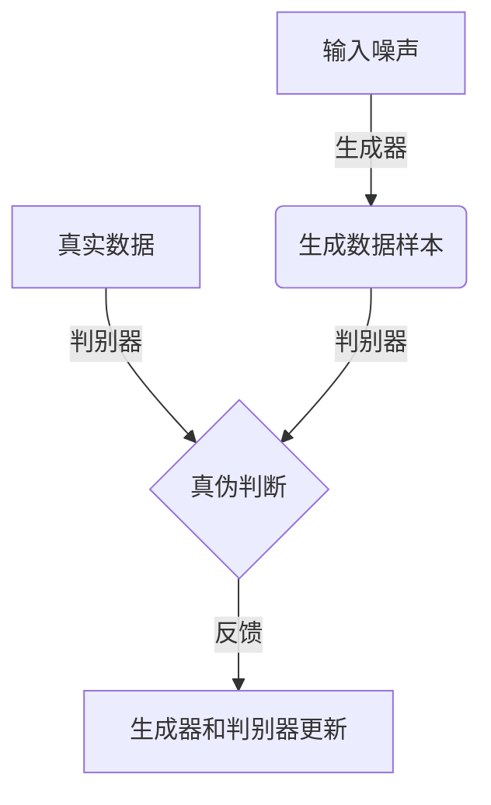
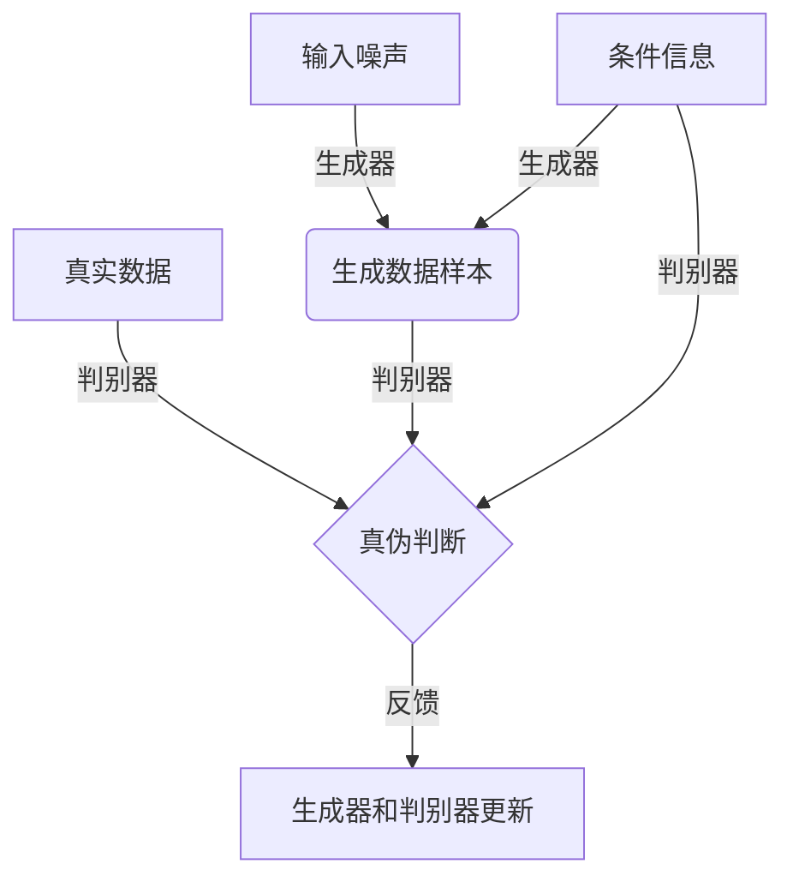

# 基于生成对抗网络的游戏世界风格化生成技术研究

## 1. 背景介绍

### 1.1 游戏世界的重要性

在当今游戏行业中,游戏世界的设计和创建是一个非常关键的环节。一个引人入胜、富有创意和独特风格的游戏世界,不仅能够吸引玩家,还能为玩家带来身临其境的沉浸式体验。然而,传统的游戏世界创建过程通常依赖于大量的人工制作,这不仅耗时耗力,而且难以满足日益增长的游戏多样性需求。

### 1.2 人工智能在游戏世界生成中的作用

随着人工智能技术的不断发展,尤其是深度学习和生成式对抗网络(Generative Adversarial Networks,GAN)的兴起,自动化的游戏世界生成成为可能。GAN能够从数据中学习到潜在的特征分布,并生成新的、具有相似特征的数据样本。利用GAN,我们可以自动生成具有特定风格和特征的游戏世界,从而大大提高游戏开发的效率和创意空间。

### 1.3 本文研究目标

本文将深入探讨基于GAN的游戏世界风格化生成技术,包括其核心概念、算法原理、数学模型、实现细节以及实际应用场景。我们将介绍如何利用GAN生成具有特定风格和特征的游戏世界,并分析其未来发展趋势和挑战。

## 2. 核心概念与联系

### 2.1 生成对抗网络(GAN)

生成对抗网络(GAN)是一种基于深度学习的生成式模型,由两个神经网络组成:生成器(Generator)和判别器(Discriminator)。生成器的目标是从随机噪声中生成逼真的数据样本,而判别器则负责区分生成的样本和真实数据样本。两个网络相互对抗,生成器试图欺骗判别器,而判别器则努力区分真伪。通过这种对抗训练过程,生成器最终能够生成与真实数据无法区分的样本。



### 2.2 条件生成对抗网络(CGAN)

传统的GAN生成的样本是无条件的,即生成器无法控制生成样本的特定属性或风格。为了解决这个问题,条件生成对抗网络(Conditional Generative Adversarial Networks,CGAN)被提出。在CGAN中,生成器和判别器都会接收一个额外的条件信息(如类别标签或风格代码),从而使生成的样本具有特定的属性或风格。



### 2.3 游戏世界风格化生成

在游戏世界生成中,我们可以将CGAN应用于生成具有特定风格的游戏世界。例如,我们可以使用风格代码作为条件信息,指导生成器生成具有特定艺术风格(如卡通风格、写实风格等)的游戏世界。同时,我们也可以利用其他条件信息,如游戏世界的类型(如城市、森林等)、时代背景等,从而生成更加多样化的游戏世界。

## 3. 核心算法原理具体操作步骤

### 3.1 GAN训练过程

GAN的训练过程可以概括为以下步骤:

1. 初始化生成器和判别器的权重参数。
2. 从真实数据集中采样一批真实样本。
3. 从噪声分布中采样一批噪声向量,输入生成器生成一批假样本。
4. 将真实样本和假样本输入判别器,计算判别器对于真实样本和假样本的判别损失。
5. 更新判别器的权重参数,使其能够更好地区分真实样本和假样本。
6. 固定判别器的权重参数,更新生成器的权重参数,使其能够生成更加逼真的假样本,从而欺骗判别器。
7. 重复步骤2-6,直到模型收敛或达到预设的训练轮数。

### 3.2 CGAN训练过程

CGAN的训练过程与GAN类似,不同之处在于:

1. 在生成器输入时,除了噪声向量,还需要输入条件信息(如风格代码)。
2. 在判别器输入时,除了真实样本和假样本,还需要输入对应的条件信息。
3. 判别器需要同时判断样本的真伪和条件信息是否匹配。
4. 生成器的目标是生成能够欺骗判别器的假样本,并且这些假样本需要与输入的条件信息相匹配。

### 3.3 游戏世界风格化生成算法

基于CGAN,我们可以设计一种游戏世界风格化生成算法,具体步骤如下:

1. 收集并预处理游戏世界数据集,包括不同风格、类型的游戏世界图像或模型。
2. 设计条件信息的编码方式,如使用一热编码表示风格类别,或使用连续向量表示风格特征。
3. 构建CGAN模型,包括生成器网络和判别器网络。生成器网络的输入为噪声向量和条件信息,输出为生成的游戏世界图像或模型。判别器网络的输入为真实或生成的游戏世界样本和对应的条件信息,输出为真伪判断和条件匹配度。
4. 训练CGAN模型,根据前述CGAN训练过程进行对抗训练。
5. 在推理阶段,输入期望的条件信息(如风格代码)和噪声向量,生成器即可生成满足该条件的游戏世界样本。

## 4. 数学模型和公式详细讲解举例说明

### 4.1 生成对抗网络的数学模型

生成对抗网络可以被视为一个min-max博弈问题,其目标函数可以表示为:

$$\min_G \max_D V(D, G) = \mathbb{E}_{x \sim p_{\text{data}}(x)}[\log D(x)] + \mathbb{E}_{z \sim p_z(z)}[\log (1 - D(G(z)))]$$

其中:
- $G$是生成器网络,将噪声$z$映射到数据空间$x = G(z)$
- $D$是判别器网络,对输入数据$x$进行真伪判断,输出$D(x) \in [0, 1]$
- $p_{\text{data}}(x)$是真实数据分布
- $p_z(z)$是噪声分布,通常为高斯分布或均匀分布

在训练过程中,生成器$G$试图最小化目标函数,即生成能够欺骗判别器的假样本;而判别器$D$则试图最大化目标函数,即能够正确区分真实样本和假样本。

### 4.2 条件生成对抗网络的数学模型

对于条件生成对抗网络,我们需要在目标函数中引入条件信息$y$,修改后的目标函数为:

$$\min_G \max_D V(D, G) = \mathbb{E}_{x \sim p_{\text{data}}(x)}[\log D(x|y)] + \mathbb{E}_{z \sim p_z(z)}[\log (1 - D(G(z|y)|y))]$$

其中:
- $G(z|y)$表示生成器在给定条件$y$的情况下,从噪声$z$生成数据样本
- $D(x|y)$表示判别器对输入数据$x$和条件$y$进行真伪判断和条件匹配度判断

通过引入条件信息,CGAN能够控制生成样本的特定属性或风格,从而实现游戏世界的风格化生成。

### 4.3 损失函数和优化

在实际训练中,我们通常使用替代损失函数来优化GAN/CGAN模型,例如最小二乘损失(Least Squares Loss)或Wasserstein损失(Wasserstein Loss)等。以最小二乘损失为例,生成器和判别器的损失函数分别为:

$$\begin{aligned}
\mathcal{L}_D &= \frac{1}{2}\mathbb{E}_{x \sim p_{\text{data}}(x)}[(D(x|y) - 1)^2] + \frac{1}{2}\mathbb{E}_{z \sim p_z(z)}[D(G(z|y)|y)^2] \\
\mathcal{L}_G &= \frac{1}{2}\mathbb{E}_{z \sim p_z(z)}[(D(G(z|y)|y) - 1)^2]
\end{aligned}$$

在训练过程中,我们使用优化算法(如Adam优化器)交替优化判别器和生成器的参数,以最小化相应的损失函数。

## 5. 项目实践:代码实例和详细解释说明

在这一部分,我们将提供一个基于PyTorch实现的CGAN游戏世界风格化生成示例,并对关键代码进行详细解释。

### 5.1 数据预处理

首先,我们需要准备游戏世界数据集,并对其进行预处理。以下是一个示例代码,展示如何加载和预处理游戏世界图像数据:

```python
import torch
from torchvision import transforms, datasets

# 定义图像预处理转换
transform = transforms.Compose([
    transforms.Resize((64, 64)),
    transforms.ToTensor(),
    transforms.Normalize((0.5, 0.5, 0.5), (0.5, 0.5, 0.5))
])

# 加载游戏世界图像数据集
dataset = datasets.ImageFolder('path/to/dataset', transform=transform)
dataloader = torch.utils.data.DataLoader(dataset, batch_size=64, shuffle=True)
```

在上述代码中,我们首先定义了一个图像预处理转换(`transform`),包括调整图像大小、转换为张量以及归一化操作。然后,我们使用PyTorch内置的`ImageFolder`类加载游戏世界图像数据集,并将其封装为一个`DataLoader`对象,方便后续的批量训练。

### 5.2 模型定义

接下来,我们定义CGAN模型的生成器和判别器网络。以下是一个简单的示例:

```python
import torch.nn as nn

# 生成器网络
class Generator(nn.Module):
    def __init__(self, noise_dim, cond_dim, img_channels):
        super().__init__()
        self.noise_dim = noise_dim
        self.cond_dim = cond_dim
        
        # 定义网络层
        self.model = nn.Sequential(
            # ...
        )
        
    def forward(self, noise, cond):
        # 连接噪声和条件信息
        input = torch.cat([noise, cond], dim=1)
        
        # 通过生成器网络生成图像
        img = self.model(input)
        
        return img

# 判别器网络
class Discriminator(nn.Module):
    def __init__(self, img_channels, cond_dim):
        super().__init__()
        self.cond_dim = cond_dim
        
        # 定义网络层
        self.model = nn.Sequential(
            # ...
        )
        
        # 输出层
        self.output = nn.Sequential(
            nn.Linear(..),
            nn.Sigmoid()
        )
        
    def forward(self, img, cond):
        # 连接图像和条件信息
        input = torch.cat([img, cond], dim=1)
        
        # 通过判别器网络提取特征
        features = self.model(input)
        
        # 输出真伪判断和条件匹配度
        output = self.output(features)
        
        return output
```

在上述代码中,我们定义了生成器网络(`Generator`)和判别器网络(`Discriminator`)。生成器网络的输入包括噪声向量(`noise`)和条件信息(`cond`),输出为生成的游戏世界图像。判别器网络的输入包括真实或生成的图像(`img`)和对应的条件信息(`cond`),输出为真伪判断和条件匹配度。

需要注意的是,上述代码只提供了一个简单的网络结构示例,在实际应用中,您可能需要根据具体任务和数据集调整网络架构。

### 5.3 训练过程

最后,我们实现CGAN模型的训练过程:

```python
import torch.optim as optim

# 初始化模型
generator = Generator(noise_dim=100, cond_dim=10