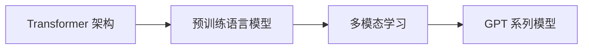

# 多模态大模型：技术原理与实战 GPT技术的发展历程

## 1. 背景介绍
### 1.1 人工智能的发展历程
#### 1.1.1 早期人工智能
#### 1.1.2 机器学习时代  
#### 1.1.3 深度学习的崛起

### 1.2 自然语言处理的演进
#### 1.2.1 基于规则的方法
#### 1.2.2 统计机器学习方法
#### 1.2.3 深度学习方法

### 1.3 大模型的出现
#### 1.3.1 大模型的定义
#### 1.3.2 大模型的特点
#### 1.3.3 大模型的应用前景

## 2. 核心概念与联系
### 2.1 Transformer 架构
#### 2.1.1 Transformer 的提出背景
#### 2.1.2 Transformer 的核心思想
#### 2.1.3 Transformer 的结构组成

### 2.2 预训练语言模型
#### 2.2.1 语言模型的基本概念
#### 2.2.2 预训练的意义
#### 2.2.3 常见的预训练语言模型

### 2.3 多模态学习
#### 2.3.1 多模态数据的特点
#### 2.3.2 多模态融合的方法
#### 2.3.3 多模态大模型的优势

### 2.4 GPT 系列模型
#### 2.4.1 GPT 模型的发展历程
#### 2.4.2 GPT 模型的技术特点
#### 2.4.3 GPT 模型的应用场景



## 3. 核心算法原理具体操作步骤
### 3.1 Transformer 的详细结构
#### 3.1.1 Encoder 层
#### 3.1.2 Decoder 层
#### 3.1.3 Multi-Head Attention 机制

### 3.2 预训练任务
#### 3.2.1 语言模型任务
#### 3.2.2 掩码语言模型任务
#### 3.2.3 对比学习任务

### 3.3 多模态融合策略
#### 3.3.1 早期融合
#### 3.3.2 晚期融合 
#### 3.3.3 交互式融合

### 3.4 GPT 模型的训练过程
#### 3.4.1 数据准备
#### 3.4.2 模型初始化
#### 3.4.3 训练迭代

## 4. 数学模型和公式详细讲解举例说明
### 4.1 Transformer 中的数学原理
#### 4.1.1 Self-Attention 计算
给定一个序列 $\mathbf{X} = (\mathbf{x}_1, \mathbf{x}_2, \dots, \mathbf{x}_n)$，Self-Attention 的计算过程如下：

$$
\begin{aligned}
\mathbf{Q} &= \mathbf{X} \mathbf{W}^Q \\
\mathbf{K} &= \mathbf{X} \mathbf{W}^K \\ 
\mathbf{V} &= \mathbf{X} \mathbf{W}^V
\end{aligned}
$$

$$
\text{Attention}(\mathbf{Q}, \mathbf{K}, \mathbf{V}) = \text{softmax}\left(\frac{\mathbf{Q}\mathbf{K}^T}{\sqrt{d_k}}\right) \mathbf{V}
$$

其中，$\mathbf{W}^Q, \mathbf{W}^K, \mathbf{W}^V$ 是可学习的参数矩阵，$d_k$ 是 $\mathbf{K}$ 的维度。

#### 4.1.2 Multi-Head Attention
Multi-Head Attention 将 Self-Attention 计算多次，然后拼接结果：

$$
\begin{aligned}
\text{MultiHead}(\mathbf{Q}, \mathbf{K}, \mathbf{V}) &= \text{Concat}(\text{head}_1, \dots, \text{head}_h) \mathbf{W}^O \\
\text{head}_i &= \text{Attention}(\mathbf{Q}\mathbf{W}_i^Q, \mathbf{K}\mathbf{W}_i^K, \mathbf{V}\mathbf{W}_i^V)
\end{aligned}
$$

其中，$\mathbf{W}_i^Q, \mathbf{W}_i^K, \mathbf{W}_i^V, \mathbf{W}^O$ 是可学习的参数矩阵。

### 4.2 语言模型的概率计算
给定一个文本序列 $\mathbf{x} = (x_1, x_2, \dots, x_n)$，语言模型的目标是估计序列的概率：

$$
P(\mathbf{x}) = \prod_{i=1}^n P(x_i | x_1, \dots, x_{i-1})
$$

其中，$P(x_i | x_1, \dots, x_{i-1})$ 表示在给定前 $i-1$ 个词的情况下，第 $i$ 个词出现的条件概率。

### 4.3 对比学习的目标函数
对比学习的目标是最大化正样本对的相似度，同时最小化负样本对的相似度。常用的损失函数包括：

- InfoNCE Loss:

$$
\mathcal{L}_{\text{InfoNCE}} = -\mathbb{E}_{(x, y) \sim \mathcal{D}} \left[ \log \frac{\exp(f(x)^T f(y) / \tau)}{\exp(f(x)^T f(y) / \tau) + \sum_{y' \in \mathcal{N}} \exp(f(x)^T f(y') / \tau)} \right]
$$

- Triplet Loss:

$$
\mathcal{L}_{\text{Triplet}} = \mathbb{E}_{(x, y, y') \sim \mathcal{D}} \left[ \max(0, m + d(f(x), f(y)) - d(f(x), f(y'))) \right]
$$

其中，$f(\cdot)$ 表示编码器，$\tau$ 是温度参数，$\mathcal{N}$ 是负样本集合，$m$ 是边界参数，$d(\cdot, \cdot)$ 是距离度量函数。

## 5. 项目实践：代码实例和详细解释说明
### 5.1 使用 PyTorch 实现 Transformer
```python
import torch
import torch.nn as nn

class MultiHeadAttention(nn.Module):
    def __init__(self, d_model, num_heads):
        super().__init__()
        self.d_model = d_model
        self.num_heads = num_heads
        self.head_dim = d_model // num_heads
        
        self.q_linear = nn.Linear(d_model, d_model)
        self.k_linear = nn.Linear(d_model, d_model)
        self.v_linear = nn.Linear(d_model, d_model)
        self.out_linear = nn.Linear(d_model, d_model)
    
    def forward(self, query, key, value, mask=None):
        batch_size = query.size(0)
        
        q = self.q_linear(query).view(batch_size, -1, self.num_heads, self.head_dim).transpose(1, 2)
        k = self.k_linear(key).view(batch_size, -1, self.num_heads, self.head_dim).transpose(1, 2)
        v = self.v_linear(value).view(batch_size, -1, self.num_heads, self.head_dim).transpose(1, 2)
        
        scores = torch.matmul(q, k.transpose(-2, -1)) / (self.head_dim ** 0.5)
        if mask is not None:
            scores = scores.masked_fill(mask == 0, float('-inf'))
        attn_weights = torch.softmax(scores, dim=-1)
        
        attn_output = torch.matmul(attn_weights, v)
        attn_output = attn_output.transpose(1, 2).contiguous().view(batch_size, -1, self.d_model)
        attn_output = self.out_linear(attn_output)
        
        return attn_output

class TransformerBlock(nn.Module):
    def __init__(self, d_model, num_heads, dim_feedforward, dropout=0.1):
        super().__init__()
        self.attn = MultiHeadAttention(d_model, num_heads)
        self.linear1 = nn.Linear(d_model, dim_feedforward)
        self.dropout = nn.Dropout(dropout)
        self.linear2 = nn.Linear(dim_feedforward, d_model)
        self.norm1 = nn.LayerNorm(d_model)
        self.norm2 = nn.LayerNorm(d_model)
        self.dropout1 = nn.Dropout(dropout)
        self.dropout2 = nn.Dropout(dropout)
        
    def forward(self, x, mask=None):
        attn_output = self.attn(x, x, x, mask)
        x = x + self.dropout1(attn_output)
        x = self.norm1(x)
        
        ff_output = self.linear2(self.dropout(torch.relu(self.linear1(x))))
        x = x + self.dropout2(ff_output)
        x = self.norm2(x)
        
        return x
```

以上代码实现了 Transformer 中的 Multi-Head Attention 和 Transformer Block。其中，`MultiHeadAttention` 类实现了多头注意力机制，`TransformerBlock` 类实现了 Transformer 的基本组成单元，包括多头注意力和前馈神经网络。

### 5.2 使用 HuggingFace 的 Transformers 库进行预训练
```python
from transformers import AutoTokenizer, AutoModelForMaskedLM, DataCollatorForLanguageModeling, TrainingArguments, Trainer

# 加载预训练模型和分词器
model_name = "bert-base-uncased"
tokenizer = AutoTokenizer.from_pretrained(model_name)
model = AutoModelForMaskedLM.from_pretrained(model_name)

# 准备数据集
train_dataset = ...  # 自定义训练数据集
data_collator = DataCollatorForLanguageModeling(tokenizer=tokenizer, mlm=True, mlm_probability=0.15)

# 设置训练参数
training_args = TrainingArguments(
    output_dir="./results",
    overwrite_output_dir=True,
    num_train_epochs=3,
    per_device_train_batch_size=32,
    save_steps=10_000,
    save_total_limit=2,
    prediction_loss_only=True,
)

# 创建 Trainer 并开始训练
trainer = Trainer(
    model=model,
    args=training_args,
    data_collator=data_collator,
    train_dataset=train_dataset,
)

trainer.train()
```

以上代码展示了如何使用 HuggingFace 的 Transformers 库对 BERT 模型进行预训练。首先加载预训练模型和分词器，然后准备自定义的训练数据集。接着设置训练参数，创建 `Trainer` 对象，并调用 `train()` 方法开始训练。

### 5.3 使用 CLIP 模型进行多模态学习
```python
import torch
import clip

# 加载预训练的 CLIP 模型
model, preprocess = clip.load("ViT-B/32")

# 准备图像和文本数据
image = preprocess(PIL.Image.open("image.jpg")).unsqueeze(0)
text = clip.tokenize(["a photo of a cat", "a photo of a dog"])

# 计算图像和文本的特征向量
with torch.no_grad():
    image_features = model.encode_image(image)
    text_features = model.encode_text(text)

# 计算图像和文本的相似度
similarity = torch.cosine_similarity(image_features, text_features)
print(similarity)
```

以上代码演示了如何使用 CLIP 模型进行多模态学习。首先加载预训练的 CLIP 模型，然后准备图像和文本数据。接着使用模型的 `encode_image()` 和 `encode_text()` 方法分别计算图像和文本的特征向量。最后使用余弦相似度计算图像和文本之间的相似度。

## 6. 实际应用场景
### 6.1 智能问答系统
多模态大模型可以用于构建智能问答系统，根据用户提供的文本或图像信息，生成相关的答案。例如，用户上传一张图片，系统可以识别图片中的物体、场景等信息，并根据图片生成相应的文字描述或回答用户的问题。

### 6.2 内容生成与创作
多模态大模型可以应用于内容生成和创作领域，例如根据文本描述自动生成图像、根据图像生成文字描述、根据主题或关键词生成文章、诗歌、剧本等。这可以极大地提高内容创作的效率和质量，为创作者提供灵感和素材。

### 6.3 多模态搜索与推荐
多模态大模型可以增强搜索和推荐系统的能力，支持跨模态的信息检索和匹配。用户可以使用文本、图像、语音等不同形式的查询，系统可以在多模态数据中找到相关的结果。同时，多模态大模型还可以根据用户的历史行为和偏好，提供个性化的内容推荐。

### 6.4 医疗诊断与辅助
多模态大模型在医疗领域有广泛的应用前景，可以辅助医生进行疾病诊断和治疗决策。例如，通