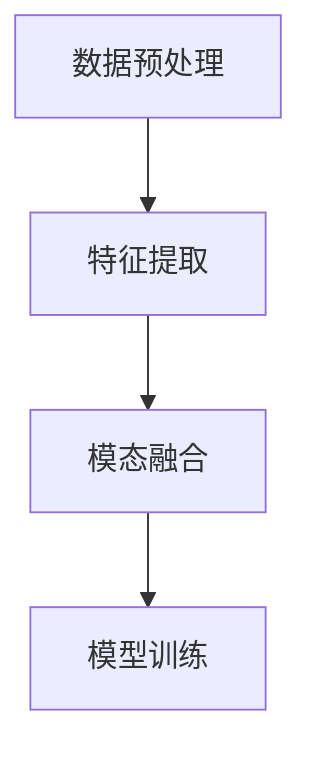

# 多模态大模型：技术原理与实战 多模态大模型在工业设计与生产领域中的应用

## 1.背景介绍

### 1.1 多模态大模型的兴起

随着人工智能技术的迅猛发展，多模态大模型（Multimodal Large Models, MLMs）逐渐成为研究和应用的热点。多模态大模型能够处理和理解多种类型的数据，如文本、图像、音频和视频，从而在多个领域展现出强大的应用潜力。特别是在工业设计与生产领域，多模态大模型的应用前景广阔，能够显著提升设计效率、优化生产流程和提高产品质量。

### 1.2 工业设计与生产领域的需求

工业设计与生产领域对数据的需求日益增加，传统的单一数据模式已经无法满足复杂的工业需求。多模态大模型通过融合多种数据模式，能够提供更全面、更准确的分析和预测，从而帮助企业在设计和生产过程中做出更明智的决策。

### 1.3 文章目的与结构

本文旨在深入探讨多模态大模型的技术原理与实际应用，特别是在工业设计与生产领域中的应用。文章将从核心概念、算法原理、数学模型、项目实践、实际应用场景、工具和资源推荐、未来发展趋势与挑战等多个方面进行详细讲解。

## 2.核心概念与联系

### 2.1 多模态数据

多模态数据是指包含多种类型信息的数据集，如文本、图像、音频和视频等。在工业设计与生产中，多模态数据可以包括设计图纸、产品照片、生产视频、传感器数据等。

### 2.2 大模型

大模型是指具有大量参数和复杂结构的深度学习模型，通常需要大量数据和计算资源进行训练。大模型在处理复杂任务时表现出色，能够捕捉数据中的细微特征和复杂关系。

### 2.3 多模态大模型

多模态大模型是结合多模态数据和大模型技术的产物，能够同时处理和理解多种类型的数据，从而在多个领域展现出强大的应用潜力。

### 2.4 多模态大模型的联系

多模态大模型通过融合多种数据模式，能够提供更全面、更准确的分析和预测。这种融合不仅能够提高模型的性能，还能够提供更丰富的上下文信息，从而帮助企业在设计和生产过程中做出更明智的决策。

## 3.核心算法原理具体操作步骤

### 3.1 数据预处理

数据预处理是多模态大模型训练的第一步，主要包括数据清洗、数据增强和数据格式转换等步骤。数据预处理的目的是提高数据质量，减少噪声和冗余信息，从而提高模型的训练效果。

### 3.2 特征提取

特征提取是多模态大模型训练的关键步骤，主要包括从多模态数据中提取有用的特征。常用的特征提取方法包括卷积神经网络（CNN）、循环神经网络（RNN）和自注意力机制（Self-Attention）等。

### 3.3 模态融合

模态融合是多模态大模型训练的核心步骤，主要包括将不同模态的数据特征进行融合。常用的模态融合方法包括加权平均、拼接和自注意力机制等。

### 3.4 模型训练

模型训练是多模态大模型训练的最后一步，主要包括模型的构建、训练和优化。常用的模型训练方法包括梯度下降、随机梯度下降和自适应梯度优化等。



## 4.数学模型和公式详细讲解举例说明

### 4.1 卷积神经网络（CNN）

卷积神经网络（CNN）是一种常用的特征提取方法，主要用于处理图像数据。CNN通过卷积层、池化层和全连接层的组合，能够提取图像中的局部特征和全局特征。

$$
y = f(W * x + b)
$$

其中，$y$ 是输出，$f$ 是激活函数，$W$ 是卷积核，$x$ 是输入，$b$ 是偏置。

### 4.2 循环神经网络（RNN）

循环神经网络（RNN）是一种常用的特征提取方法，主要用于处理序列数据。RNN通过循环结构，能够捕捉序列数据中的时间依赖关系。

$$
h_t = f(W_h h_{t-1} + W_x x_t + b)
$$

其中，$h_t$ 是当前时刻的隐藏状态，$h_{t-1}$ 是前一时刻的隐藏状态，$x_t$ 是当前时刻的输入，$W_h$ 和 $W_x$ 是权重矩阵，$b$ 是偏置。

### 4.3 自注意力机制（Self-Attention）

自注意力机制是一种常用的模态融合方法，主要用于处理多模态数据。自注意力机制通过计算输入数据的自相关性，能够捕捉数据中的全局依赖关系。

$$
\text{Attention}(Q, K, V) = \text{softmax}\left(\frac{QK^T}{\sqrt{d_k}}\right)V
$$

其中，$Q$ 是查询矩阵，$K$ 是键矩阵，$V$ 是值矩阵，$d_k$ 是键矩阵的维度。

## 5.项目实践：代码实例和详细解释说明

### 5.1 数据预处理

```python
import numpy as np
import pandas as pd
from sklearn.preprocessing import StandardScaler

# 加载数据
data = pd.read_csv('data.csv')

# 数据清洗
data = data.dropna()

# 数据增强
data['new_feature'] = data['feature1'] * data['feature2']

# 数据格式转换
scaler = StandardScaler()
data_scaled = scaler.fit_transform(data)
```

### 5.2 特征提取

```python
import torch
import torch.nn as nn

class CNNFeatureExtractor(nn.Module):
    def __init__(self):
        super(CNNFeatureExtractor, self).__init__()
        self.conv1 = nn.Conv2d(1, 32, kernel_size=3, stride=1, padding=1)
        self.pool = nn.MaxPool2d(kernel_size=2, stride=2, padding=0)
        self.fc1 = nn.Linear(32 * 14 * 14, 128)

    def forward(self, x):
        x = self.pool(F.relu(self.conv1(x)))
        x = x.view(-1, 32 * 14 * 14)
        x = F.relu(self.fc1(x))
        return x
```

### 5.3 模态融合

```python
class MultimodalFusion(nn.Module):
    def __init__(self):
        super(MultimodalFusion, self).__init__()
        self.fc1 = nn.Linear(256, 128)
        self.fc2 = nn.Linear(128, 64)
        self.fc3 = nn.Linear(64, 1)

    def forward(self, x1, x2):
        x = torch.cat((x1, x2), dim=1)
        x = F.relu(self.fc1(x))
        x = F.relu(self.fc2(x))
        x = self.fc3(x)
        return x
```

### 5.4 模型训练

```python
import torch.optim as optim

# 初始化模型
cnn = CNNFeatureExtractor()
fusion = MultimodalFusion()

# 定义损失函数和优化器
criterion = nn.MSELoss()
optimizer = optim.Adam(list(cnn.parameters()) + list(fusion.parameters()), lr=0.001)

# 训练模型
for epoch in range(100):
    optimizer.zero_grad()
    outputs = fusion(cnn(data1), cnn(data2))
    loss = criterion(outputs, labels)
    loss.backward()
    optimizer.step()
```

## 6.实际应用场景

### 6.1 产品设计优化

多模态大模型可以通过分析设计图纸、产品照片和用户反馈等多种数据，帮助设计师优化产品设计，提高产品的用户体验和市场竞争力。

### 6.2 生产流程优化

多模态大模型可以通过分析生产视频、传感器数据和生产日志等多种数据，帮助企业优化生产流程，提高生产效率和产品质量。

### 6.3 质量检测

多模态大模型可以通过分析产品照片、传感器数据和生产日志等多种数据，帮助企业进行质量检测，及时发现和解决生产中的质量问题。

## 7.工具和资源推荐

### 7.1 开源框架

- TensorFlow
- PyTorch
- Keras

### 7.2 数据集

- ImageNet
- COCO
- OpenAI Gym

### 7.3 资源网站

- GitHub
- Kaggle
- Papers with Code

## 8.总结：未来发展趋势与挑战

### 8.1 未来发展趋势

多模态大模型在工业设计与生产领域的应用前景广阔，未来将会有更多的企业和研究机构投入到多模态大模型的研究和应用中。随着技术的不断进步，多模态大模型将会在更多的领域展现出强大的应用潜力。

### 8.2 挑战

多模态大模型在实际应用中仍然面临着一些挑战，如数据的获取和处理、模型的训练和优化、模型的解释性和可解释性等。未来需要更多的研究和实践来解决这些挑战，从而推动多模态大模型的发展和应用。

## 9.附录：常见问题与解答

### 9.1 多模态大模型的优势是什么？

多模态大模型能够处理和理解多种类型的数据，从而提供更全面、更准确的分析和预测。这种融合不仅能够提高模型的性能，还能够提供更丰富的上下文信息，从而帮助企业在设计和生产过程中做出更明智的决策。

### 9.2 多模态大模型的应用场景有哪些？

多模态大模型在工业设计与生产领域的应用场景包括产品设计优化、生产流程优化和质量检测等。

### 9.3 多模态大模型的训练需要哪些资源？

多模态大模型的训练通常需要大量的数据和计算资源，常用的计算资源包括高性能计算集群和GPU等。

### 9.4 如何选择合适的多模态大模型？

选择合适的多模态大模型需要考虑多个因素，如数据的类型和规模、任务的复杂性和模型的性能等。常用的多模态大模型包括卷积神经网络（CNN）、循环神经网络（RNN）和自注意力机制（Self-Attention）等。

### 9.5 多模态大模型的未来发展趋势是什么？

多模态大模型的未来发展趋势包括技术的不断进步、应用场景的不断扩展和研究的不断深入。未来将会有更多的企业和研究机构投入到多模态大模型的研究和应用中，从而推动多模态大模型的发展和应用。

---

作者：禅与计算机程序设计艺术 / Zen and the Art of Computer Programming