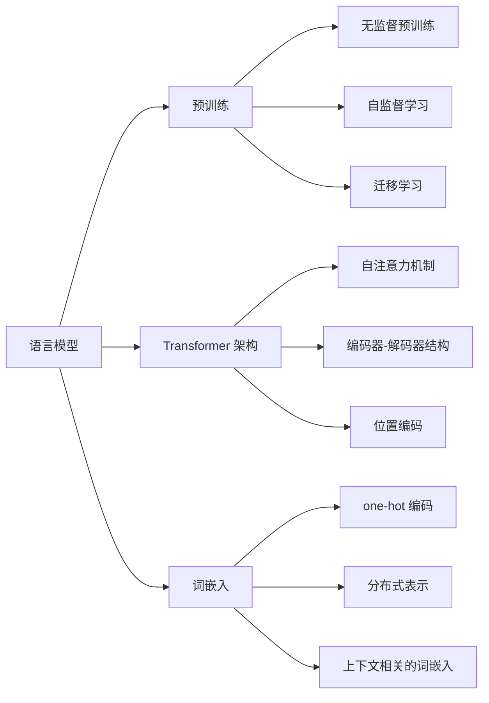

# 大规模语言模型从理论到实践 基础概念

## 1. 背景介绍
### 1.1 语言模型的发展历程
#### 1.1.1 早期语言模型
#### 1.1.2 神经网络语言模型
#### 1.1.3 大规模预训练语言模型
### 1.2 大规模语言模型的重要性
#### 1.2.1 自然语言处理的关键技术
#### 1.2.2 推动人工智能发展的重要力量
#### 1.2.3 改变人机交互方式的潜力

## 2. 核心概念与联系
### 2.1 语言模型
#### 2.1.1 定义与目标
#### 2.1.2 概率语言模型
#### 2.1.3 神经网络语言模型
### 2.2 预训练
#### 2.2.1 无监督预训练
#### 2.2.2 自监督学习
#### 2.2.3 迁移学习
### 2.3 Transformer 架构
#### 2.3.1 自注意力机制
#### 2.3.2 编码器-解码器结构
#### 2.3.3 位置编码
### 2.4 词嵌入
#### 2.4.1 one-hot 编码
#### 2.4.2 分布式表示
#### 2.4.3 上下文相关的词嵌入



## 3. 核心算法原理具体操作步骤
### 3.1 Transformer 的自注意力机制
#### 3.1.1 计算查询、键、值
#### 3.1.2 计算注意力权重
#### 3.1.3 计算注意力输出
### 3.2 Masked Language Model (MLM) 预训练
#### 3.2.1 随机遮挡词语
#### 3.2.2 预测被遮挡的词语
#### 3.2.3 计算损失函数并优化
### 3.3 Next Sentence Prediction (NSP) 预训练
#### 3.3.1 生成句子对
#### 3.3.2 预测句子对是否相邻
#### 3.3.3 计算损失函数并优化

## 4. 数学模型和公式详细讲解举例说明
### 4.1 语言模型的概率公式
$$P(w_1, w_2, ..., w_n) = \prod_{i=1}^n P(w_i | w_1, w_2, ..., w_{i-1})$$
其中，$w_i$ 表示第 $i$ 个词，$P(w_i | w_1, w_2, ..., w_{i-1})$ 表示在给定前 $i-1$ 个词的条件下，第 $i$ 个词出现的概率。

### 4.2 Transformer 的自注意力计算公式
$$Attention(Q, K, V) = softmax(\frac{QK^T}{\sqrt{d_k}})V$$
其中，$Q$、$K$、$V$ 分别表示查询、键、值，$d_k$ 表示键的维度，$softmax$ 函数用于将注意力权重归一化。

### 4.3 MLM 预训练的损失函数
$$L_{MLM} = -\sum_{i=1}^n \log P(w_i | w_1, ..., w_{i-1}, w_{i+1}, ..., w_n)$$
其中，$w_i$ 表示被遮挡的词，$P(w_i | w_1, ..., w_{i-1}, w_{i+1}, ..., w_n)$ 表示在给定上下文的条件下，预测被遮挡词的概率。

## 5. 项目实践：代码实例和详细解释说明
### 5.1 使用 PyTorch 实现 Transformer 模型
```python
import torch
import torch.nn as nn

class Transformer(nn.Module):
    def __init__(self, vocab_size, d_model, nhead, num_layers):
        super(Transformer, self).__init__()
        self.embedding = nn.Embedding(vocab_size, d_model)
        self.pos_encoder = PositionalEncoding(d_model)
        encoder_layer = nn.TransformerEncoderLayer(d_model, nhead)
        self.transformer_encoder = nn.TransformerEncoder(encoder_layer, num_layers)
        
    def forward(self, src):
        src = self.embedding(src) * math.sqrt(self.d_model)
        src = self.pos_encoder(src)
        output = self.transformer_encoder(src)
        return output
```
上述代码定义了一个 Transformer 模型，包括词嵌入层、位置编码层和 Transformer 编码器。其中，`vocab_size` 表示词表大小，`d_model` 表示词嵌入维度，`nhead` 表示自注意力头的数量，`num_layers` 表示编码器层的数量。

### 5.2 使用 TensorFlow 实现 MLM 预训练
```python
import tensorflow as tf

def masked_language_model(inputs, mask, vocab_size):
    embedding = tf.keras.layers.Embedding(vocab_size, d_model)(inputs)
    transformer_output = transformer(embedding, mask)
    output = tf.keras.layers.Dense(vocab_size)(transformer_output)
    return output

def compute_loss(labels, logits):
    loss = tf.keras.losses.sparse_categorical_crossentropy(labels, logits, from_logits=True)
    return tf.reduce_mean(loss)

optimizer = tf.keras.optimizers.Adam()

@tf.function
def train_step(inputs, mask, labels):
    with tf.GradientTape() as tape:
        logits = masked_language_model(inputs, mask, vocab_size)
        loss = compute_loss(labels, logits)
    gradients = tape.gradient(loss, model.trainable_variables)
    optimizer.apply_gradients(zip(gradients, model.trainable_variables))
    return loss
```
上述代码实现了 MLM 预训练的核心部分，包括定义 MLM 模型、计算损失函数和定义训练步骤。其中，`inputs` 表示输入的词语序列，`mask` 表示遮挡位置的掩码，`vocab_size` 表示词表大小，`labels` 表示被遮挡词语的真实标签。

## 6. 实际应用场景
### 6.1 机器翻译
#### 6.1.1 基于 Transformer 的神经机器翻译
#### 6.1.2 无监督机器翻译
#### 6.1.3 多语言机器翻译
### 6.2 文本摘要
#### 6.2.1 抽取式摘要
#### 6.2.2 生成式摘要
#### 6.2.3 多文档摘要
### 6.3 问答系统
#### 6.3.1 基于知识库的问答
#### 6.3.2 基于阅读理解的问答
#### 6.3.3 对话式问答

## 7. 工具和资源推荐
### 7.1 开源工具包
#### 7.1.1 Hugging Face Transformers
#### 7.1.2 Google BERT
#### 7.1.3 Facebook fairseq
### 7.2 预训练模型
#### 7.2.1 BERT
#### 7.2.2 GPT
#### 7.2.3 XLNet
### 7.3 数据集
#### 7.3.1 Wikipedia
#### 7.3.2 BookCorpus
#### 7.3.3 Common Crawl

## 8. 总结：未来发展趋势与挑战
### 8.1 模型规模的增长
#### 8.1.1 参数量的增加
#### 8.1.2 计算资源的需求
#### 8.1.3 训练效率的提升
### 8.2 多模态语言模型
#### 8.2.1 文本-图像语言模型
#### 8.2.2 文本-视频语言模型
#### 8.2.3 跨模态信息融合
### 8.3 可解释性和可控性
#### 8.3.1 模型决策过程的可解释性
#### 8.3.2 生成内容的可控性
#### 8.3.3 偏见和公平性问题

## 9. 附录：常见问题与解答
### 9.1 如何选择合适的预训练模型？
预训练模型的选择取决于具体的任务和数据集。一般来说，在大规模通用语料上预训练的模型（如 BERT、GPT）适用于大多数自然语言处理任务。对于特定领域的任务，可以考虑在相关领域的语料上进行预训练或微调。此外，还需要考虑模型的大小、计算资源需求等因素。

### 9.2 预训练和微调的区别是什么？
预训练是在大规模无标注语料上训练语言模型，学习语言的通用表示。微调是在预训练的基础上，使用任务特定的标注数据对模型进行进一步训练，使其适应特定任务。预训练侧重于学习通用的语言知识，而微调侧重于学习任务特定的知识。

### 9.3 大规模语言模型存在哪些局限性？
大规模语言模型虽然在许多自然语言处理任务上取得了显著进展，但仍然存在一些局限性：
1. 对于一些需要深度推理和常识知识的任务，语言模型的表现仍有待提高。
2. 语言模型可能会生成有偏见、不恰当或有害的内容，需要进一步研究如何提高模型的可控性和公平性。
3. 训练大规模语言模型需要大量的计算资源和数据，对于资源有限的场景可能不太适用。
4. 语言模型对于一些特定领域的任务（如医疗、法律）可能需要结合领域知识进行适配和优化。

总之，大规模语言模型是自然语言处理领域的重要突破，为许多任务提供了强大的基础模型。然而，如何进一步提高模型的性能、可解释性和可控性，如何降低模型的资源需求，以及如何将语言模型与其他技术（如知识图谱、因果推理）相结合，仍然是未来研究的重要方向。相信通过学术界和工业界的共同努力，语言模型技术将不断发展和完善，为人工智能的进步做出更大的贡献。

作者：禅与计算机程序设计艺术 / Zen and the Art of Computer Programming