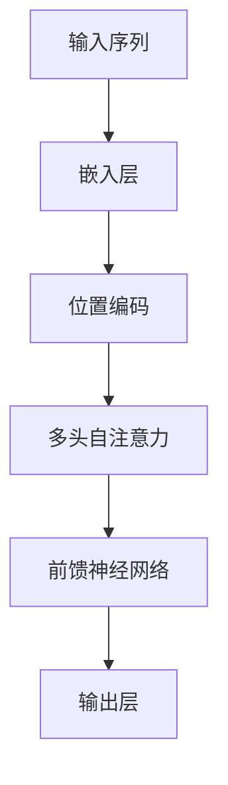

# 大规模语言模型从理论到实践 开源数据集

## 1.背景介绍

大规模语言模型（Large Language Models, LLMs）近年来在自然语言处理（NLP）领域取得了显著的进展。自从OpenAI发布了GPT系列模型以来，LLMs在文本生成、翻译、问答系统等多个应用场景中展现了强大的能力。本文将深入探讨大规模语言模型的理论基础、核心算法、数学模型、实际应用以及未来发展趋势，并提供开源数据集和工具资源，帮助读者更好地理解和应用LLMs。

## 2.核心概念与联系

### 2.1 语言模型

语言模型是用于预测文本序列中下一个词的概率分布的模型。传统的语言模型包括n-gram模型和基于统计的方法，而现代的语言模型则主要基于神经网络，特别是变换器（Transformer）架构。

### 2.2 变换器架构

变换器架构是由Vaswani等人在2017年提出的一种神经网络架构，主要用于处理序列数据。其核心组件包括自注意力机制（Self-Attention）和前馈神经网络（Feed-Forward Neural Network）。

### 2.3 预训练与微调

预训练（Pre-training）是指在大规模无标签数据上训练模型，使其学习通用的语言表示。微调（Fine-tuning）则是在特定任务的数据集上进一步训练模型，以适应特定任务的需求。

### 2.4 开源数据集

开源数据集是指公开可用的数据集，研究人员和开发者可以自由使用这些数据集进行模型训练和评估。常见的开源数据集包括Wikipedia、Common Crawl、OpenWebText等。

## 3.核心算法原理具体操作步骤

### 3.1 变换器架构详解

变换器架构的核心在于其自注意力机制和多头注意力机制。以下是变换器架构的Mermaid流程图：



### 3.2 自注意力机制

自注意力机制通过计算输入序列中每个词与其他词的相关性来捕捉全局信息。其计算公式如下：

$$
\text{Attention}(Q, K, V) = \text{softmax}\left(\frac{QK^T}{\sqrt{d_k}}\right)V
$$

其中，$Q$、$K$、$V$分别表示查询（Query）、键（Key）和值（Value）矩阵，$d_k$表示键的维度。

### 3.3 多头注意力机制

多头注意力机制通过并行计算多个自注意力机制来捕捉不同的语义信息。其计算公式如下：

$$
\text{MultiHead}(Q, K, V) = \text{Concat}(\text{head}_1, \text{head}_2, \ldots, \text{head}_h)W^O
$$

其中，$\text{head}_i = \text{Attention}(QW_i^Q, KW_i^K, VW_i^V)$，$W_i^Q$、$W_i^K$、$W_i^V$和$W^O$为可训练的权重矩阵。

## 4.数学模型和公式详细讲解举例说明

### 4.1 语言模型的数学定义

语言模型的目标是估计给定词序列$w_1, w_2, \ldots, w_T$的联合概率分布$P(w_1, w_2, \ldots, w_T)$。根据链式法则，该联合概率可以分解为条件概率的乘积：

$$
P(w_1, w_2, \ldots, w_T) = \prod_{t=1}^T P(w_t | w_1, w_2, \ldots, w_{t-1})
```

### 4.2 变换器的损失函数

变换器模型的训练目标是最小化负对数似然损失（Negative Log-Likelihood Loss）：

$$
\mathcal{L} = -\sum_{t=1}^T \log P(w_t | w_1, w_2, \ldots, w_{t-1})
```

### 4.3 示例：GPT模型

GPT（Generative Pre-trained Transformer）模型是基于变换器架构的生成式预训练模型。其训练过程包括两个阶段：预训练和微调。在预训练阶段，模型在大规模无标签数据上进行自回归训练；在微调阶段，模型在特定任务的数据集上进行监督训练。

## 5.项目实践：代码实例和详细解释说明

### 5.1 环境配置

首先，确保安装了必要的Python库，如Transformers、Torch等：

```bash
pip install transformers torch
```

### 5.2 预训练模型加载

使用Transformers库加载预训练的GPT模型：

```python
from transformers import GPT2LMHeadModel, GPT2Tokenizer

model_name = 'gpt2'
model = GPT2LMHeadModel.from_pretrained(model_name)
tokenizer = GPT2Tokenizer.from_pretrained(model_name)
```

### 5.3 文本生成示例

使用预训练模型生成文本：

```python
input_text = "大规模语言模型的应用"
input_ids = tokenizer.encode(input_text, return_tensors='pt')
output = model.generate(input_ids, max_length=50, num_return_sequences=1)

generated_text = tokenizer.decode(output[0], skip_special_tokens=True)
print(generated_text)
```

### 5.4 微调模型

在特定任务数据集上微调模型：

```python
from transformers import Trainer, TrainingArguments

training_args = TrainingArguments(
    output_dir='./results',
    num_train_epochs=3,
    per_device_train_batch_size=4,
    save_steps=10_000,
    save_total_limit=2,
)

trainer = Trainer(
    model=model,
    args=training_args,
    train_dataset=train_dataset,
    eval_dataset=eval_dataset,
)

trainer.train()
```

## 6.实际应用场景

### 6.1 文本生成

大规模语言模型可以用于生成高质量的文本内容，如新闻报道、小说、技术文档等。

### 6.2 机器翻译

通过预训练和微调，大规模语言模型可以实现高精度的机器翻译，支持多种语言之间的翻译。

### 6.3 问答系统

大规模语言模型可以用于构建智能问答系统，提供准确的答案和信息检索服务。

### 6.4 情感分析

通过对文本进行情感分析，大规模语言模型可以帮助企业了解用户情感，优化产品和服务。

## 7.工具和资源推荐

### 7.1 开源数据集

- [Wikipedia](https://www.wikipedia.org/)
- [Common Crawl](https://commoncrawl.org/)
- [OpenWebText](https://skylion007.github.io/OpenWebTextCorpus/)

### 7.2 开源工具

- [Transformers](https://github.com/huggingface/transformers)
- [Torch](https://pytorch.org/)
- [TensorFlow](https://www.tensorflow.org/)

### 7.3 在线资源

- [ArXiv](https://arxiv.org/)
- [Papers with Code](https://paperswithcode.com/)

## 8.总结：未来发展趋势与挑战

大规模语言模型在NLP领域展现了巨大的潜力，但也面临着一些挑战。未来的发展趋势包括：

### 8.1 模型规模与计算资源

随着模型规模的不断增大，训练和推理所需的计算资源也在增加。如何高效地利用计算资源是一个重要的研究方向。

### 8.2 数据隐私与安全

大规模语言模型的训练数据通常来自互联网，可能包含敏感信息。如何保护数据隐私和安全是一个亟待解决的问题。

### 8.3 模型解释性

大规模语言模型的复杂性使得其内部机制难以解释。提高模型的可解释性对于增强用户信任和应用推广至关重要。

## 9.附录：常见问题与解答

### 9.1 如何选择合适的预训练模型？

选择预训练模型时，应考虑模型的规模、性能和适用场景。常见的预训练模型包括GPT、BERT、T5等。

### 9.2 如何处理大规模数据集？

处理大规模数据集时，可以使用分布式计算框架（如Spark）和高效的数据存储格式（如Parquet）来提高数据处理效率。

### 9.3 如何评估模型性能？

评估模型性能时，可以使用常见的评估指标（如准确率、F1分数）和基准数据集（如GLUE、SQuAD）进行评估。

### 9.4 如何优化模型训练？

优化模型训练时，可以使用学习率调度、梯度裁剪和混合精度训练等技术来提高训练效率和稳定性。

---

作者：禅与计算机程序设计艺术 / Zen and the Art of Computer Programming