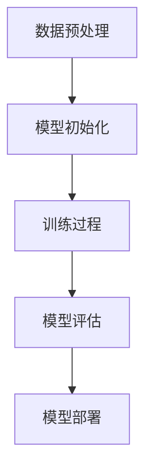

# 大语言模型原理与工程实践：手把手教你训练 7B 大语言模型 自动化训练框架

## 1.背景介绍

在人工智能领域，语言模型（Language Model, LM）是自然语言处理（NLP）的核心技术之一。近年来，随着深度学习和计算能力的提升，语言模型的规模和性能得到了显著提高。特别是大语言模型（Large Language Model, LLM），如GPT-3，已经展示了其在生成文本、回答问题、翻译等任务中的强大能力。

训练一个7B参数的大语言模型需要大量的计算资源和复杂的工程实践。本文将详细介绍大语言模型的原理、核心算法、数学模型、项目实践、实际应用场景、工具和资源推荐，并探讨未来的发展趋势与挑战。

## 2.核心概念与联系

### 2.1 语言模型

语言模型是通过统计语言中的词汇和句子结构来预测下一个词或生成文本的模型。其核心任务是计算一个给定序列的概率分布。

### 2.2 大语言模型

大语言模型是指参数规模达到数十亿甚至上百亿的语言模型。它们通常基于Transformer架构，通过大规模数据训练，能够生成高质量的自然语言文本。

### 2.3 Transformer架构

Transformer是目前最流行的深度学习模型架构之一，特别适用于处理序列数据。其核心组件包括自注意力机制（Self-Attention）和前馈神经网络（Feed-Forward Neural Network）。

### 2.4 自动化训练框架

自动化训练框架是指通过编写脚本和使用工具，自动化地完成数据预处理、模型训练、评估和部署等步骤，以提高效率和减少人为错误。

## 3.核心算法原理具体操作步骤

### 3.1 数据预处理

数据预处理是训练大语言模型的第一步。包括数据清洗、分词、去重等步骤。

### 3.2 模型初始化

模型初始化是指设置模型的初始参数。通常使用预训练模型作为初始参数，以加速训练过程。

### 3.3 训练过程

训练过程包括前向传播、损失计算、反向传播和参数更新。使用优化算法（如Adam）来最小化损失函数。

### 3.4 模型评估

模型评估是通过验证集来评估模型的性能。常用的评估指标包括困惑度（Perplexity）和准确率（Accuracy）。

### 3.5 模型部署

模型部署是将训练好的模型应用到实际场景中。包括模型压缩、优化和部署到服务器或边缘设备。



## 4.数学模型和公式详细讲解举例说明

### 4.1 语言模型的数学定义

语言模型的目标是计算一个给定序列 $w_1, w_2, ..., w_n$ 的概率 $P(w_1, w_2, ..., w_n)$。根据链式法则，这个概率可以分解为：

$$
P(w_1, w_2, ..., w_n) = P(w_1) \cdot P(w_2|w_1) \cdot P(w_3|w_1, w_2) \cdots P(w_n|w_1, w_2, ..., w_{n-1})
$$

### 4.2 Transformer的自注意力机制

自注意力机制的核心是计算输入序列中每个词对其他词的注意力权重。给定输入序列 $X = [x_1, x_2, ..., x_n]$，自注意力机制的计算过程如下：

1. 计算查询（Query）、键（Key）和值（Value）矩阵：

$$
Q = XW_Q, \quad K = XW_K, \quad V = XW_V
$$

2. 计算注意力权重：

$$
\text{Attention}(Q, K, V) = \text{softmax}\left(\frac{QK^T}{\sqrt{d_k}}\right)V
$$

其中，$W_Q, W_K, W_V$ 是可训练的权重矩阵，$d_k$ 是键向量的维度。

### 4.3 损失函数

常用的损失函数是交叉熵损失（Cross-Entropy Loss），其定义为：

$$
L = -\sum_{i=1}^{N} y_i \log(\hat{y}_i)
$$

其中，$y_i$ 是真实标签，$\hat{y}_i$ 是模型的预测概率。

## 5.项目实践：代码实例和详细解释说明

### 5.1 数据预处理

```python
import os
import re
import json
from transformers import GPT2Tokenizer

def preprocess_data(input_file, output_file):
    with open(input_file, 'r', encoding='utf-8') as f:
        data = f.read()
    
    # 数据清洗
    data = re.sub(r'\s+', ' ', data)
    
    # 分词
    tokenizer = GPT2Tokenizer.from_pretrained('gpt2')
    tokens = tokenizer.encode(data)
    
    # 保存预处理后的数据
    with open(output_file, 'w', encoding='utf-8') as f:
        json.dump(tokens, f)

preprocess_data('raw_data.txt', 'processed_data.json')
```

### 5.2 模型训练

```python
import torch
from transformers import GPT2LMHeadModel, GPT2Tokenizer, AdamW

# 加载预训练模型和分词器
model = GPT2LMHeadModel.from_pretrained('gpt2')
tokenizer = GPT2Tokenizer.from_pretrained('gpt2')

# 加载预处理后的数据
with open('processed_data.json', 'r', encoding='utf-8') as f:
    tokens = json.load(f)

# 创建数据集和数据加载器
dataset = torch.utils.data.TensorDataset(torch.tensor(tokens))
dataloader = torch.utils.data.DataLoader(dataset, batch_size=8, shuffle=True)

# 设置优化器
optimizer = AdamW(model.parameters(), lr=5e-5)

# 训练模型
model.train()
for epoch in range(3):
    for batch in dataloader:
        inputs = batch[0].to(torch.device('cuda'))
        outputs = model(inputs, labels=inputs)
        loss = outputs.loss
        loss.backward()
        optimizer.step()
        optimizer.zero_grad()
    print(f'Epoch {epoch+1}, Loss: {loss.item()}')
```

### 5.3 模型评估

```python
from sklearn.metrics import accuracy_score

def evaluate_model(model, dataloader):
    model.eval()
    all_preds = []
    all_labels = []
    with torch.no_grad():
        for batch in dataloader:
            inputs = batch[0].to(torch.device('cuda'))
            outputs = model(inputs)
            preds = torch.argmax(outputs.logits, dim=-1)
            all_preds.extend(preds.cpu().numpy())
            all_labels.extend(inputs.cpu().numpy())
    accuracy = accuracy_score(all_labels, all_preds)
    return accuracy

accuracy = evaluate_model(model, dataloader)
print(f'Model Accuracy: {accuracy}')
```

### 5.4 模型部署

```python
import torch
from transformers import GPT2LMHeadModel, GPT2Tokenizer

# 加载训练好的模型
model = GPT2LMHeadModel.from_pretrained('path_to_trained_model')
tokenizer = GPT2Tokenizer.from_pretrained('gpt2')

# 模型推理
def generate_text(prompt, max_length=50):
    inputs = tokenizer.encode(prompt, return_tensors='pt').to(torch.device('cuda'))
    outputs = model.generate(inputs, max_length=max_length, num_return_sequences=1)
    text = tokenizer.decode(outputs[0], skip_special_tokens=True)
    return text

prompt = "Once upon a time"
generated_text = generate_text(prompt)
print(generated_text)
```

## 6.实际应用场景

### 6.1 文本生成

大语言模型可以用于生成高质量的自然语言文本，如新闻报道、小说、技术文档等。

### 6.2 问答系统

大语言模型可以用于构建智能问答系统，回答用户提出的问题。

### 6.3 机器翻译

大语言模型可以用于机器翻译，将一种语言的文本翻译成另一种语言。

### 6.4 情感分析

大语言模型可以用于情感分析，识别文本中的情感倾向。

## 7.工具和资源推荐

### 7.1 开源框架

- **Transformers**：由Hugging Face提供的开源库，支持多种预训练语言模型。
- **TensorFlow**：谷歌开发的开源深度学习框架，支持大规模分布式训练。
- **PyTorch**：Facebook开发的开源深度学习框架，易于使用和调试。

### 7.2 数据集

- **Common Crawl**：一个包含大量网页数据的开源数据集，适用于训练大语言模型。
- **Wikipedia**：维基百科的文本数据，适用于语言模型的预训练。

### 7.3 计算资源

- **Google Colab**：提供免费的GPU资源，适用于小规模实验。
- **AWS EC2**：亚马逊提供的云计算服务，支持大规模分布式训练。

## 8.总结：未来发展趋势与挑战

### 8.1 发展趋势

- **模型规模继续扩大**：未来的大语言模型将继续扩大规模，参数数量可能达到数万亿。
- **多模态模型**：结合文本、图像、音频等多种模态的数据，构建更强大的多模态模型。
- **自监督学习**：通过自监督学习方法，进一步提升模型的性能和泛化能力。

### 8.2 挑战

- **计算资源需求**：训练大语言模型需要大量的计算资源，成本高昂。
- **数据隐私和安全**：大规模数据的使用涉及数据隐私和安全问题，需要妥善处理。
- **模型解释性**：大语言模型的复杂性使得其内部机制难以解释，需要进一步研究。

## 9.附录：常见问题与解答

### 9.1 如何选择合适的数据集？

选择数据集时，应考虑数据的质量、规模和多样性。高质量的数据有助于提升模型的性能。

### 9.2 如何优化模型的训练速度？

可以通过使用分布式训练、混合精度训练和模型压缩等方法来优化模型的训练速度。

### 9.3 如何评估模型的性能？

常用的评估指标包括困惑度、准确率和BLEU分数。可以根据具体任务选择合适的评估指标。

### 9.4 如何处理数据不平衡问题？

可以通过数据增强、重采样和调整损失函数等方法来处理数据不平衡问题。

### 9.5 如何部署大语言模型？

可以使用Docker、Kubernetes等容器化技术，将模型部署到云端或边缘设备，提供高效的推理服务。

---

作者：禅与计算机程序设计艺术 / Zen and the Art of Computer Programming