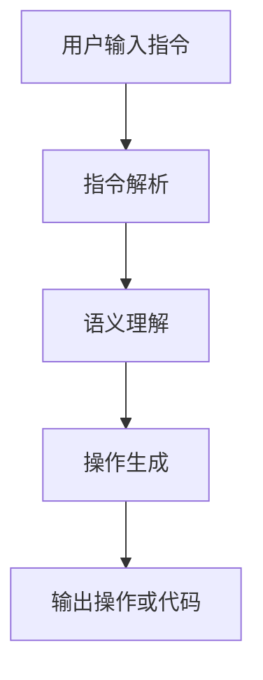

# 大语言模型原理基础与前沿 指令生成

## 1.背景介绍

大语言模型（Large Language Models, LLMs）是近年来人工智能领域的一个重要突破。它们通过大量的文本数据进行训练，能够生成高质量的自然语言文本，完成各种复杂的语言任务。大语言模型的应用范围广泛，从自动文本生成、翻译、到对话系统和代码生成等，几乎涵盖了所有需要自然语言处理的领域。

大语言模型的成功离不开深度学习技术的发展，尤其是基于Transformer架构的模型，如GPT（Generative Pre-trained Transformer）系列。本文将深入探讨大语言模型的原理基础与前沿技术，特别是指令生成的相关内容。

## 2.核心概念与联系

### 2.1 大语言模型的定义

大语言模型是一种通过大量文本数据训练的深度学习模型，能够理解和生成自然语言。其核心在于通过学习文本数据中的模式和结构，生成符合语法和语义的文本。

### 2.2 Transformer架构

Transformer是大语言模型的基础架构。它通过自注意力机制（Self-Attention Mechanism）实现对输入序列的全局依赖建模，解决了传统RNN（Recurrent Neural Network）在长序列处理上的局限性。

### 2.3 预训练与微调

大语言模型通常采用预训练和微调（Fine-tuning）相结合的训练策略。预训练阶段，模型在大规模无监督数据上进行训练，学习通用的语言表示。微调阶段，模型在特定任务的数据上进行有监督训练，以适应具体任务的需求。

### 2.4 指令生成

指令生成是大语言模型的一项重要应用。它通过理解用户输入的自然语言指令，生成相应的操作或代码。指令生成在智能助手、自动化编程等领域有着广泛的应用前景。

## 3.核心算法原理具体操作步骤

### 3.1 数据预处理

数据预处理是大语言模型训练的第一步。包括文本清洗、分词、词向量表示等步骤。数据预处理的质量直接影响模型的训练效果。

### 3.2 模型训练

模型训练分为预训练和微调两个阶段。预训练阶段，模型在大规模无监督数据上进行训练，学习通用的语言表示。微调阶段，模型在特定任务的数据上进行有监督训练，以适应具体任务的需求。

### 3.3 自注意力机制

自注意力机制是Transformer架构的核心。它通过计算输入序列中每个位置与其他位置的相关性，实现对输入序列的全局依赖建模。自注意力机制的计算公式如下：

$$
\text{Attention}(Q, K, V) = \text{softmax}\left(\frac{QK^T}{\sqrt{d_k}}\right)V
$$

其中，$Q$、$K$、$V$分别表示查询（Query）、键（Key）和值（Value）矩阵，$d_k$表示键的维度。

### 3.4 指令生成流程

指令生成的流程包括指令解析、语义理解、操作生成等步骤。具体操作步骤如下：

1. **指令解析**：将用户输入的自然语言指令解析为结构化的表示。
2. **语义理解**：通过大语言模型理解指令的语义，生成相应的操作。
3. **操作生成**：根据语义理解的结果，生成相应的操作或代码。

以下是指令生成流程的Mermaid流程图：



## 4.数学模型和公式详细讲解举例说明

### 4.1 词向量表示

词向量表示是大语言模型的基础。通过将词语表示为向量，模型能够捕捉词语之间的语义关系。常用的词向量表示方法包括Word2Vec、GloVe等。

### 4.2 Transformer的自注意力机制

自注意力机制是Transformer的核心。通过计算输入序列中每个位置与其他位置的相关性，实现对输入序列的全局依赖建模。自注意力机制的计算公式如下：

$$
\text{Attention}(Q, K, V) = \text{softmax}\left(\frac{QK^T}{\sqrt{d_k}}\right)V
$$

其中，$Q$、$K$、$V$分别表示查询（Query）、键（Key）和值（Value）矩阵，$d_k$表示键的维度。

### 4.3 预训练与微调

预训练阶段，模型在大规模无监督数据上进行训练，学习通用的语言表示。微调阶段，模型在特定任务的数据上进行有监督训练，以适应具体任务的需求。预训练的目标函数通常是最大化语言模型的似然函数：

$$
L(\theta) = \sum_{i=1}^{N} \log P(x_i | x_{<i}; \theta)
$$

其中，$x_i$表示第$i$个词，$x_{<i}$表示第$i$个词之前的所有词，$\theta$表示模型参数。

## 5.项目实践：代码实例和详细解释说明

### 5.1 数据预处理

以下是一个简单的数据预处理示例，使用Python和NLTK库进行文本清洗和分词：

```python
import nltk
from nltk.tokenize import word_tokenize
from nltk.corpus import stopwords

# 下载NLTK数据
nltk.download('punkt')
nltk.download('stopwords')

# 文本清洗和分词
def preprocess_text(text):
    # 转换为小写
    text = text.lower()
    # 分词
    words = word_tokenize(text)
    # 去除停用词
    stop_words = set(stopwords.words('english'))
    words = [word for word in words if word.isalnum() and word not in stop_words]
    return words

# 示例文本
text = "Hello, world! This is a test sentence."
preprocessed_text = preprocess_text(text)
print(preprocessed_text)
```

### 5.2 模型训练

以下是一个使用PyTorch实现的简单Transformer模型训练示例：

```python
import torch
import torch.nn as nn
import torch.optim as optim

class TransformerModel(nn.Module):
    def __init__(self, input_dim, model_dim, num_heads, num_layers, output_dim):
        super(TransformerModel, self).__init__()
        self.embedding = nn.Embedding(input_dim, model_dim)
        self.transformer = nn.Transformer(model_dim, num_heads, num_layers)
        self.fc = nn.Linear(model_dim, output_dim)

    def forward(self, src, tgt):
        src = self.embedding(src)
        tgt = self.embedding(tgt)
        output = self.transformer(src, tgt)
        output = self.fc(output)
        return output

# 模型参数
input_dim = 10000
model_dim = 512
num_heads = 8
num_layers = 6
output_dim = 10000

# 创建模型
model = TransformerModel(input_dim, model_dim, num_heads, num_layers, output_dim)

# 损失函数和优化器
criterion = nn.CrossEntropyLoss()
optimizer = optim.Adam(model.parameters(), lr=0.001)

# 示例训练数据
src = torch.randint(0, input_dim, (10, 32))  # (sequence_length, batch_size)
tgt = torch.randint(0, input_dim, (20, 32))  # (sequence_length, batch_size)

# 模型训练
model.train()
for epoch in range(10):
    optimizer.zero_grad()
    output = model(src, tgt[:-1, :])
    loss = criterion(output.view(-1, output_dim), tgt[1:, :].view(-1))
    loss.backward()
    optimizer.step()
    print(f'Epoch {epoch+1}, Loss: {loss.item()}')
```

### 5.3 指令生成

以下是一个简单的指令生成示例，使用GPT-3模型生成代码：

```python
import openai

# 设置API密钥
openai.api_key = 'your-api-key'

# 用户输入指令
instruction = "生成一个Python函数，计算两个数的和"

# 调用GPT-3模型生成代码
response = openai.Completion.create(
    engine="davinci-codex",
    prompt=instruction,
    max_tokens=100
)

# 输出生成的代码
generated_code = response.choices[0].text.strip()
print(generated_code)
```

## 6.实际应用场景

### 6.1 智能助手

大语言模型在智能助手中的应用非常广泛。通过理解用户的自然语言指令，智能助手能够执行各种操作，如设置提醒、查询信息、发送消息等。

### 6.2 自动化编程

大语言模型在自动化编程中的应用前景广阔。通过理解用户的编程需求，模型能够生成相应的代码，极大地提高了编程效率。

### 6.3 文本生成

大语言模型在文本生成中的应用包括自动写作、新闻生成、对话系统等。通过学习大量的文本数据，模型能够生成高质量的自然语言文本。

## 7.工具和资源推荐

### 7.1 开源工具

- **Hugging Face Transformers**：一个开源的自然语言处理库，提供了多种预训练的大语言模型。
- **OpenAI GPT-3**：一个强大的大语言模型，支持多种自然语言处理任务。

### 7.2 数据集

- **Common Crawl**：一个大规模的网页抓取数据集，常用于大语言模型的预训练。
- **Wikipedia**：一个高质量的百科全书数据集，常用于大语言模型的预训练。

### 7.3 学习资源

- **《深度学习》**：一本经典的深度学习教材，详细介绍了深度学习的基本原理和应用。
- **《自然语言处理入门》**：一本入门级的自然语言处理教材，适合初学者学习。

## 8.总结：未来发展趋势与挑战

大语言模型在自然语言处理领域取得了显著的进展，但仍面临一些挑战。未来的发展趋势包括：

### 8.1 模型规模与计算资源

随着模型规模的不断增大，训练大语言模型所需的计算资源也在不断增加。如何在保证模型性能的同时，降低计算资源的消耗，是一个重要的研究方向。

### 8.2 模型解释性

大语言模型的黑箱特性使得其解释性较差。如何提高模型的解释性，使其能够更好地被人类理解和信任，是一个重要的研究方向。

### 8.3 多模态学习

未来的大语言模型将不仅限于处理文本数据，还将能够处理图像、音频等多种模态的数据。多模态学习将是大语言模型的重要发展方向。

## 9.附录：常见问题与解答

### 9.1 大语言模型的训练数据有哪些？

大语言模型的训练数据通常包括大规模的文本数据，如网页抓取数据、百科全书数据、新闻数据等。

### 9.2 大语言模型的应用场景有哪些？

大语言模型的应用场景包括智能助手、自动化编程、文本生成、翻译等。

### 9.3 如何提高大语言模型的性能？

提高大语言模型性能的方法包括增加模型规模、优化训练算法、使用更高质量的训练数据等。

### 9.4 大语言模型的未来发展趋势是什么？

大语言模型的未来发展趋势包括模型规模与计算资源的优化、模型解释性的提高、多模态学习的发展等。

---

作者：禅与计算机程序设计艺术 / Zen and the Art of Computer Programming