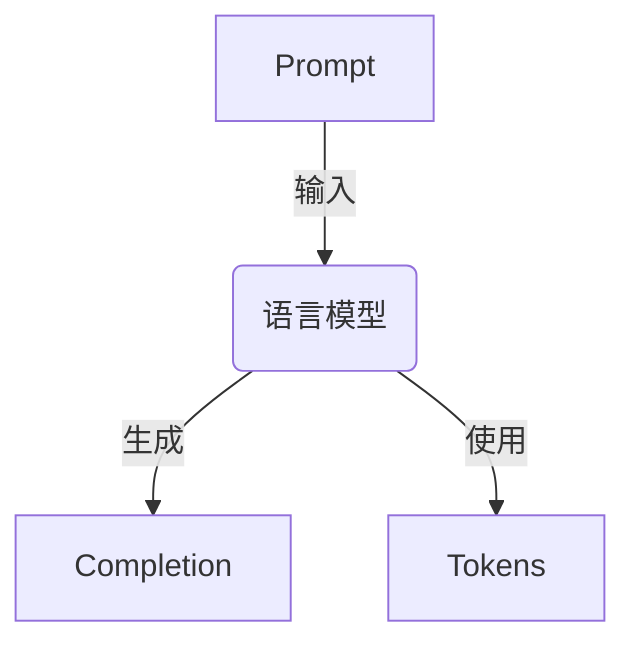
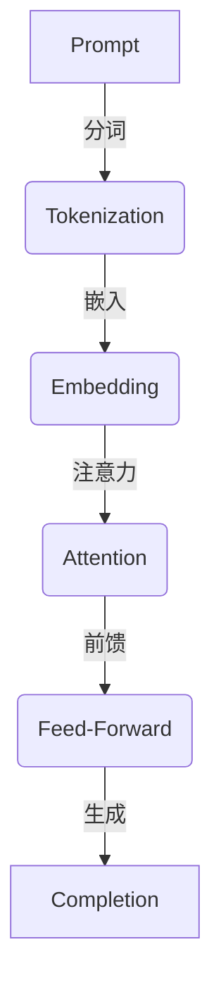
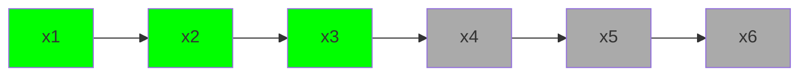

# 大语言模型应用指南：Chat Completion接口参数详解

## 1.背景介绍

随着人工智能技术的不断发展,大型语言模型(Large Language Models, LLMs)已经成为当前最热门的研究领域之一。这些模型通过在海量文本数据上进行预训练,能够理解和生成看似人类写作的自然语言,在自然语言处理、问答系统、内容生成等领域展现出了令人惊叹的能力。

其中,OpenAI推出的GPT-3(Generative Pre-trained Transformer 3)是目前最知名的大型语言模型之一。它由1750亿个参数组成,在40TB的文本数据上进行了预训练,可以生成高质量、内容丰富的自然语言文本。随后,OpenAI又推出了更强大的GPT-4模型。

为了方便开发者利用这些大型语言模型的强大功能,OpenAI提供了一系列API接口,其中最常用的就是Chat Completion接口。本文将详细介绍如何使用该接口及其参数的用法,帮助开发者更好地整合大型语言模型到自己的应用程序中。

## 2.核心概念与联系

在深入探讨Chat Completion接口之前,我们先来了解一些核心概念:

### 2.1 Prompt(提示词)

Prompt是指提供给语言模型的输入文本,用于指导模型生成所需的输出。在Chat Completion接口中,Prompt通常是用户的问题或指令。

### 2.2 Completion(完成)

Completion指的是语言模型根据Prompt生成的输出文本。在对话场景中,它就是模型对用户提问的回答。

### 2.3 Tokens(词元)

Tokens是语言模型内部使用的基本单元,通常是将文本分词后的单词或子词。不同的语言模型使用不同的Tokenizer(分词器)来将文本转换为Tokens。Tokens的数量直接影响模型的计算成本和输出长度。

### 2.4 Chat Completion接口

Chat Completion接口是OpenAI提供的一种API接口,允许开发者与大型语言模型进行对话式交互。它基于GPT-3或GPT-4模型,可以根据用户的输入生成自然、连贯的回复。

这些核心概念之间的关系如下所示:



用户通过Prompt将输入提供给语言模型,模型使用内部的Tokens对Prompt进行理解和表示,然后生成相应的Completion作为输出。

## 3.核心算法原理具体操作步骤

Chat Completion接口背后的核心算法是一种基于Transformer的自回归(Auto-Regressive)语言模型。它的工作原理可以概括为以下几个步骤:

1. **Tokenization(分词)**: 将输入的Prompt文本转换为一系列Tokens,作为模型的输入。

2. **Embedding(嵌入)**: 将每个Token映射到一个连续的向量空间中,得到对应的Embedding向量表示。

3. **Attention(注意力机制)**: 模型使用多头自注意力(Multi-Head Self-Attention)机制,捕捉Tokens之间的长程依赖关系。

4. **Feed-Forward(前馈网络)**: 对注意力输出进行非线性变换,提取更高层次的特征表示。

5. **Generation(生成)**: 模型根据当前已生成的Tokens,自回归地预测下一个最可能的Token,重复这个过程直到达到指定的长度或生成终止符号。

这个过程可以用下面的流程图来概括:



值得注意的是,在生成过程中,模型会根据已生成的Tokens和Prompt,动态地调整注意力分布,从而捕捉上下文信息,生成更加连贯、相关的输出。

## 4.数学模型和公式详细讲解举例说明

### 4.1 Transformer模型

Chat Completion接口所使用的语言模型是基于Transformer架构的。Transformer是一种全新的序列到序列(Sequence-to-Sequence)模型,它完全依赖于注意力机制,不再使用循环神经网络(RNN)或卷积神经网络(CNN)。

Transformer模型的核心是多头自注意力机制,它允许模型在编码输入序列时捕捉远程依赖关系。具体来说,给定一个长度为 $n$ 的输入序列 $\boldsymbol{x} = (x_1, x_2, \ldots, x_n)$,自注意力机制会计算每个位置 $i$ 的注意力向量 $\boldsymbol{a}_i$,它是所有位置 $j$ 的值 $x_j$ 的加权和:

$$\boldsymbol{a}_i = \sum_{j=1}^n \alpha_{ij}(\boldsymbol{x}_j \boldsymbol{W}^V)$$

其中,权重 $\alpha_{ij}$ 表示位置 $i$ 对位置 $j$ 的注意力分数,它是通过以下公式计算得到的:

$$\alpha_{ij} = \frac{\exp(e_{ij})}{\sum_{k=1}^n \exp(e_{ik})}$$
$$e_{ij} = \frac{(\boldsymbol{x}_i \boldsymbol{W}^Q)(\boldsymbol{x}_j \boldsymbol{W}^K)^\top}{\sqrt{d_k}}$$

这里,$ \boldsymbol{W}^Q $、$ \boldsymbol{W}^K $ 和 $ \boldsymbol{W}^V $ 分别是查询(Query)、键(Key)和值(Value)的可学习的线性投影矩阵,$ d_k $ 是缩放因子。

多头注意力机制是将多个注意力头的结果进行拼接:

$$\text{MultiHead}(\boldsymbol{X}) = \text{Concat}(\text{head}_1, \ldots, \text{head}_h)\boldsymbol{W}^O$$
$$\text{head}_i = \text{Attention}(\boldsymbol{X}\boldsymbol{W}_i^Q, \boldsymbol{X}\boldsymbol{W}_i^K, \boldsymbol{X}\boldsymbol{W}_i^V)$$

其中,$ \boldsymbol{W}_i^Q $、$ \boldsymbol{W}_i^K $、$ \boldsymbol{W}_i^V $ 和 $ \boldsymbol{W}^O $ 都是可学习的线性变换矩阵。

### 4.2 掩码自注意力机制

在生成任务中,模型需要根据已生成的Tokens和Prompt来预测下一个Token。为了防止模型"窥视"(Peeking)未来的Tokens,Transformer使用了掩码自注意力机制(Masked Self-Attention)。

具体来说,对于位置 $i$,它只能关注 $1, 2, \ldots, i-1$ 位置的Tokens,而被"掩码"掉无法看到 $i+1, i+2, \ldots, n$ 位置的Tokens。这可以通过在计算注意力分数时,将未来位置的分数设置为负无穷来实现:

$$\alpha_{ij} = \begin{cases}
\frac{\exp(e_{ij})}{\sum_{k=1}^n \exp(e_{ik})} & \text{if }j < i\\
0 & \text{if }j \geq i
\end{cases}$$

这种掩码机制确保了模型在生成第 $i$ 个Token时,只依赖于之前的Tokens和Prompt,而不会"窥视"未来的信息。

以下是掩码自注意力机制的可视化示例,其中阴影部分表示被掩码的未来Tokens:



通过掩码自注意力机制,语言模型可以有效地捕捉上下文依赖关系,并根据已生成的Tokens和Prompt,自回归地生成连贯的输出序列。

## 5.项目实践:代码实例和详细解释说明

为了更好地理解如何使用Chat Completion接口,我们来看一个使用Python和OpenAI API的实例代码:

```python
import openai

# 设置API密钥
openai.api_key = "YOUR_API_KEY"

# 定义Prompt
prompt = "请解释一下什么是Transformer模型?"

# 调用Chat Completion接口
response = openai.ChatCompletion.create(
    model="gpt-3.5-turbo",
    messages=[
        {"role": "user", "content": prompt}
    ],
    max_tokens=1024,
    n=1,
    stop=None,
    temperature=0.7,
)

# 获取生成的Completion
completion = response.choices[0].message.content

# 输出结果
print(completion)
```

让我们逐步解释这段代码:

1. 首先,我们需要导入OpenAI的Python库,并设置API密钥。

2. 接下来,我们定义了一个Prompt,即"请解释一下什么是Transformer模型?"。

3. 然后,我们调用`openai.ChatCompletion.create()`函数,传入以下参数:

   - `model`: 指定使用的语言模型,这里我们使用"gpt-3.5-turbo"。
   - `messages`: 一个列表,包含了用户的Prompt和之前的对话历史(如果有的话)。这里我们只传入了用户的Prompt。
   - `max_tokens`: 指定生成的Completion的最大Token数量,这里我们设置为1024。
   - `n`: 指定要生成的Completion的数量,这里我们只生成一个。
   - `stop`: 指定生成的终止序列,如果为None则由模型自动判断终止。
   - `temperature`: 一个介于0和1之间的值,控制生成的随机性和多样性。较高的温度会产生更多样化的输出,而较低的温度会产生更加确定和集中的输出。这里我们设置为0.7。

4. 调用API后,我们从响应中获取生成的Completion文本。

5. 最后,我们将Completion输出到控制台。

运行这段代码,你将看到模型生成的关于Transformer模型的解释。根据你设置的参数,输出的内容可能会有所不同。

通过这个简单的例子,你应该能够了解如何使用Chat Completion接口与大型语言模型进行交互。在实际项目中,你可以根据需求调整参数,或者将该接口集成到你的应用程序中,以提供更加智能和自然的对话体验。

## 6.实际应用场景

Chat Completion接口的应用场景非常广泛,包括但不限于:

1. **智能助手**: 可以开发基于对话的智能助手,为用户提供问答服务、任务协助、信息查询等功能。

2. **客户服务**: 在客户服务领域,可以使用该接口构建智能客服系统,提供7x24小时的在线问答和支持服务。

3. **内容生成**: 利用语言模型的文本生成能力,可以自动生成新闻报道、故事情节、营销文案等内容。

4. **教育辅助**: 开发智能教学助手,为学生提供个性化的学习辅导和解答疑问。

5. **语音交互**: 将Chat Completion接口与语音识别和合成技术相结合,可以实现基于语音的对话系统。

6. **数据分析**: 通过提示词与语言模型进行交互,可以快速分析和总结大量文本数据。

7. **创作辅助**: 为作家、诗人等创作者提供灵感和创意,辅助创作过程。

8. **游戏开发**: 在游戏中引入基于对话的智能非玩家角色(NPC),提升游戏的互动性和沉浸感。

总的来说,Chat Completion接口为开发者提供了一种强大的工具,可以将大型语言模型的自然语言理解和生成能力融入到各种应用程序中,极大地扩展了人工智能在实际场景中的应用范围。

## 7.工具和资源推荐

在使用Chat Completion接口时,以下工具和资源可以为你提供帮助:

1. **OpenAI API文档**: OpenAI提供了详细的API文档,涵盖了所有接口的用法和参数说明。这是学习和使用API的重要参考资料。

2. **OpenAI Playground**: OpenAI的在线Playground允许你直接在浏览器中与语言模型进行交互,非常适合快速测试和调试。

3. **Anthropic**: