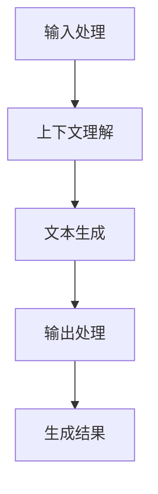

# 大语言模型应用指南：Completion交互格式

## 1.背景介绍

大语言模型（Large Language Models, LLMs）近年来在自然语言处理（NLP）领域取得了显著的进展。它们不仅在生成文本、翻译、问答等任务中表现出色，还在各种应用场景中展现了强大的潜力。Completion交互格式是大语言模型的一种重要应用形式，它通过预测和生成文本来完成用户输入的片段，从而实现智能对话、自动写作等功能。

## 2.核心概念与联系

### 2.1 大语言模型简介

大语言模型是基于深度学习的模型，通常使用大量的文本数据进行训练。它们能够理解和生成自然语言文本，具有强大的语言理解和生成能力。常见的大语言模型包括GPT-3、BERT、T5等。

### 2.2 Completion交互格式

Completion交互格式是指用户输入一个不完整的文本片段，模型根据上下文预测并生成后续的文本。这个过程可以用于自动补全、对话生成、代码补全等多种场景。

### 2.3 核心联系

Completion交互格式依赖于大语言模型的强大生成能力，通过对上下文的理解和预测，生成符合语义和语法的文本。这种交互形式不仅提高了用户体验，还能在多种应用场景中提高效率。

## 3.核心算法原理具体操作步骤

### 3.1 预训练

大语言模型的预训练阶段通常使用无监督学习方法，模型通过大量的文本数据进行训练，学习语言的结构和语义。常见的预训练任务包括语言模型任务（如GPT系列）和掩码语言模型任务（如BERT）。

### 3.2 微调

在预训练完成后，模型需要进行微调，以适应特定的任务和应用场景。微调通常使用有监督学习方法，通过标注数据进行训练，使模型在特定任务上表现更好。

### 3.3 Completion生成

在实际应用中，用户输入一个不完整的文本片段，模型根据上下文生成后续的文本。这个过程可以通过以下步骤实现：

1. **输入处理**：将用户输入的文本片段进行预处理，如分词、编码等。
2. **上下文理解**：模型根据输入的文本片段理解上下文语义。
3. **文本生成**：模型根据上下文预测并生成后续的文本。
4. **输出处理**：将生成的文本进行后处理，如解码、拼接等，最终输出完整的文本。

以下是一个Mermaid流程图，展示了Completion生成的具体操作步骤：



## 4.数学模型和公式详细讲解举例说明

### 4.1 语言模型

语言模型的目标是根据给定的上下文预测下一个词的概率。对于一个给定的词序列 $w_1, w_2, ..., w_T$，语言模型的目标是最大化以下概率：

$$
P(w_1, w_2, ..., w_T) = \prod_{t=1}^{T} P(w_t | w_1, w_2, ..., w_{t-1})
$$

### 4.2 GPT模型

GPT（Generative Pre-trained Transformer）模型是一种基于Transformer架构的自回归语言模型。它通过最大化条件概率来生成文本。具体来说，GPT模型的目标是最大化以下条件概率：

$$
P(w_t | w_1, w_2, ..., w_{t-1}) = \text{softmax}(W h_t)
$$

其中，$h_t$ 是Transformer的隐藏状态，$W$ 是输出层的权重矩阵。

### 4.3 BERT模型

BERT（Bidirectional Encoder Representations from Transformers）模型是一种双向编码器表示模型。它通过掩码语言模型任务进行预训练，目标是预测被掩码的词。具体来说，BERT模型的目标是最大化以下条件概率：

$$
P(w_i | w_1, ..., w_{i-1}, w_{i+1}, ..., w_T)
$$

其中，$w_i$ 是被掩码的词，模型通过上下文信息预测该词。

### 4.4 举例说明

假设我们有一个句子 "The quick brown fox jumps over the lazy dog"，我们希望模型生成后续的文本。以下是GPT模型的生成过程：

1. **输入处理**：将句子编码为词向量。
2. **上下文理解**：模型通过Transformer架构理解句子的上下文。
3. **文本生成**：模型根据上下文生成下一个词的概率分布，并从中采样生成下一个词。
4. **输出处理**：将生成的词拼接到原句子中，继续生成下一个词，直到生成完整的文本。

## 5.项目实践：代码实例和详细解释说明

### 5.1 环境准备

在开始项目实践之前，我们需要准备好开发环境。以下是所需的工具和库：

- Python 3.7+
- PyTorch
- Transformers库（Hugging Face）

### 5.2 安装依赖

首先，我们需要安装所需的库：

```bash
pip install torch transformers
```

### 5.3 代码实例

以下是一个使用GPT-3模型进行Completion生成的代码实例：

```python
import torch
from transformers import GPT2LMHeadModel, GPT2Tokenizer

# 加载预训练的GPT-3模型和分词器
model_name = 'gpt2'
model = GPT2LMHeadModel.from_pretrained(model_name)
tokenizer = GPT2Tokenizer.from_pretrained(model_name)

# 输入文本
input_text = "The quick brown fox jumps over the lazy dog"

# 编码输入文本
input_ids = tokenizer.encode(input_text, return_tensors='pt')

# 生成后续文本
output = model.generate(input_ids, max_length=50, num_return_sequences=1)

# 解码生成的文本
generated_text = tokenizer.decode(output[0], skip_special_tokens=True)

print(generated_text)
```

### 5.4 详细解释

1. **加载模型和分词器**：我们使用Hugging Face的Transformers库加载预训练的GPT-3模型和分词器。
2. **编码输入文本**：将输入的文本片段编码为词向量。
3. **生成后续文本**：使用模型生成后续的文本，设置最大生成长度为50。
4. **解码生成的文本**：将生成的词向量解码为文本，并输出结果。

## 6.实际应用场景

### 6.1 智能对话

Completion交互格式在智能对话系统中有广泛的应用。通过预测和生成对话内容，模型可以与用户进行自然流畅的对话，提高用户体验。

### 6.2 自动写作

在自动写作领域，Completion交互格式可以帮助用户生成文章、报告、邮件等文本内容，提高写作效率。

### 6.3 代码补全

在编程领域，Completion交互格式可以用于代码补全，帮助程序员快速编写代码，提高开发效率。

### 6.4 翻译和摘要

Completion交互格式还可以用于文本翻译和摘要生成，通过预测和生成目标语言的文本，实现高质量的翻译和摘要。

## 7.工具和资源推荐

### 7.1 开发工具

- **PyCharm**：一款功能强大的Python集成开发环境（IDE），适用于大语言模型的开发和调试。
- **Jupyter Notebook**：一个交互式的计算环境，适用于数据分析和模型训练。

### 7.2 资源推荐

- **Hugging Face Transformers**：一个开源的NLP库，提供了多种预训练的大语言模型和工具。
- **OpenAI GPT-3**：一个强大的大语言模型，适用于多种NLP任务和应用场景。

## 8.总结：未来发展趋势与挑战

### 8.1 未来发展趋势

大语言模型在未来将继续发展，模型的规模和性能将不断提升。随着计算资源的增加和算法的改进，大语言模型将在更多的应用场景中展现出强大的潜力。

### 8.2 挑战

尽管大语言模型在许多任务中表现出色，但它们仍面临一些挑战：

- **计算资源**：训练和部署大语言模型需要大量的计算资源，成本较高。
- **数据隐私**：大语言模型需要大量的训练数据，如何保护数据隐私是一个重要问题。
- **模型偏见**：大语言模型可能会学习到训练数据中的偏见，如何消除模型偏见是一个亟待解决的问题。

## 9.附录：常见问题与解答

### 9.1 大语言模型的训练需要多长时间？

大语言模型的训练时间取决于模型的规模和计算资源。通常情况下，训练一个大规模的语言模型需要数周甚至数月的时间。

### 9.2 如何选择合适的大语言模型？

选择大语言模型时，需要考虑模型的性能、应用场景和计算资源。对于一般的NLP任务，可以选择预训练的模型进行微调；对于特定任务，可以选择专门优化的模型。

### 9.3 如何处理大语言模型的偏见问题？

处理大语言模型的偏见问题可以从数据和算法两个方面入手。在数据方面，可以使用多样化和公平的数据进行训练；在算法方面，可以使用去偏见技术和公平性评估方法。

### 9.4 大语言模型的未来发展方向是什么？

大语言模型的未来发展方向包括提高模型的性能和效率、解决数据隐私和模型偏见问题、扩展应用场景等。随着技术的不断进步，大语言模型将在更多领域展现出强大的潜力。

---

作者：禅与计算机程序设计艺术 / Zen and the Art of Computer Programming