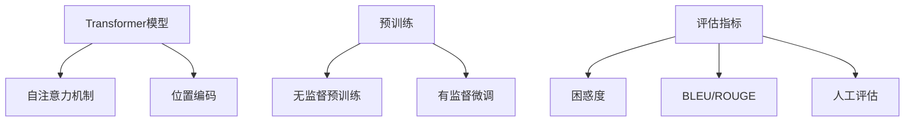

# 大语言模型应用指南：GPTs功能详解

## 1. 背景介绍

### 1.1 大语言模型的发展历程

#### 1.1.1 早期的语言模型
#### 1.1.2 Transformer模型的出现
#### 1.1.3 GPT系列模型的崛起

### 1.2 GPTs在自然语言处理领域的影响

#### 1.2.1 GPTs带来的革命性变化
#### 1.2.2 GPTs在各个NLP任务上的出色表现
#### 1.2.3 GPTs推动了自然语言处理技术的发展

### 1.3 GPTs的应用前景

#### 1.3.1 GPTs在智能客服、问答系统等领域的应用
#### 1.3.2 GPTs在内容生成、文本摘要等方面的应用
#### 1.3.3 GPTs在其他领域的潜在应用价值

## 2. 核心概念与联系

### 2.1 Transformer模型

#### 2.1.1 Transformer的核心思想
#### 2.1.2 自注意力机制（Self-Attention）
#### 2.1.3 位置编码（Positional Encoding）

### 2.2 预训练与微调

#### 2.2.1 无监督预训练的意义
#### 2.2.2 有监督微调的过程
#### 2.2.3 迁移学习在GPTs中的应用

### 2.3 语言模型的评估指标

#### 2.3.1 困惑度（Perplexity）
#### 2.3.2 BLEU、ROUGE等评估指标
#### 2.3.3 人工评估与自动评估的比较



## 3. 核心算法原理具体操作步骤

### 3.1 Transformer的编码器（Encoder）

#### 3.1.1 输入嵌入（Input Embedding）
#### 3.1.2 多头自注意力（Multi-Head Attention）
#### 3.1.3 前馈神经网络（Feed-Forward Network）

### 3.2 Transformer的解码器（Decoder）

#### 3.2.1 掩码多头自注意力（Masked Multi-Head Attention）
#### 3.2.2 编码-解码注意力（Encoder-Decoder Attention）
#### 3.2.3 前馈神经网络与softmax输出

### 3.3 GPT模型的训练过程

#### 3.3.1 语言建模目标函数
#### 3.3.2 训练数据的准备与处理
#### 3.3.3 模型参数的优化与更新

## 4. 数学模型和公式详细讲解举例说明

### 4.1 自注意力机制的数学表示

#### 4.1.1 查询（Query）、键（Key）、值（Value）的计算
$$Attention(Q,K,V) = softmax(\frac{QK^T}{\sqrt{d_k}})V$$
其中，$Q$、$K$、$V$分别表示查询、键、值矩阵，$d_k$为键向量的维度。

#### 4.1.2 多头自注意力的并行计算
$$MultiHead(Q,K,V) = Concat(head_1, ..., head_h)W^O$$
$$head_i = Attention(QW_i^Q, KW_i^K, VW_i^V)$$
其中，$W_i^Q$、$W_i^K$、$W_i^V$为第$i$个头的权重矩阵，$W^O$为输出的线性变换矩阵。

### 4.2 位置编码的数学表示

#### 4.2.1 正弦和余弦函数的位置编码
$$PE_{(pos,2i)} = sin(pos/10000^{2i/d_{model}})$$
$$PE_{(pos,2i+1)} = cos(pos/10000^{2i/d_{model}})$$
其中，$pos$为位置索引，$i$为维度索引，$d_{model}$为嵌入维度。

#### 4.2.2 位置编码与输入嵌入的结合
$$Embedding_{pos} = Embedding + PE_{pos}$$

### 4.3 语言模型的目标函数

#### 4.3.1 极大似然估计（MLE）
$$L(\theta) = \sum_{i=1}^{n} log P(x_i|x_{<i};\theta)$$
其中，$\theta$为模型参数，$x_i$为第$i$个token，$x_{<i}$为$x_i$之前的所有token。

#### 4.3.2 交叉熵损失（Cross-Entropy Loss）
$$Loss = -\frac{1}{n}\sum_{i=1}^{n} y_i log(\hat{y}_i)$$
其中，$y_i$为真实标签，$\hat{y}_i$为预测概率。

## 5. 项目实践：代码实例和详细解释说明

### 5.1 使用PyTorch实现Transformer模型

#### 5.1.1 定义Transformer编码器与解码器
```python
class TransformerEncoder(nn.Module):
    def __init__(self, d_model, nhead, dim_feedforward, num_layers):
        super(TransformerEncoder, self).__init__()
        encoder_layer = nn.TransformerEncoderLayer(d_model, nhead, dim_feedforward)
        self.transformer_encoder = nn.TransformerEncoder(encoder_layer, num_layers)

    def forward(self, src):
        return self.transformer_encoder(src)

class TransformerDecoder(nn.Module):
    def __init__(self, d_model, nhead, dim_feedforward, num_layers):
        super(TransformerDecoder, self).__init__()
        decoder_layer = nn.TransformerDecoderLayer(d_model, nhead, dim_feedforward)
        self.transformer_decoder = nn.TransformerDecoder(decoder_layer, num_layers)

    def forward(self, tgt, memory):
        return self.transformer_decoder(tgt, memory)
```

#### 5.1.2 定义GPT模型
```python
class GPT(nn.Module):
    def __init__(self, vocab_size, d_model, nhead, dim_feedforward, num_layers, max_seq_length):
        super(GPT, self).__init__()
        self.embedding = nn.Embedding(vocab_size, d_model)
        self.pos_encoder = PositionalEncoding(d_model, max_seq_length)
        self.transformer = TransformerDecoder(d_model, nhead, dim_feedforward, num_layers)
        self.fc = nn.Linear(d_model, vocab_size)

    def forward(self, src):
        src = self.embedding(src) * math.sqrt(d_model)
        src = self.pos_encoder(src)
        output = self.transformer(src, src)
        output = self.fc(output)
        return output
```

### 5.2 使用TensorFlow实现GPT模型训练

#### 5.2.1 数据预处理
```python
def preprocess_data(text, tokenizer, max_seq_length):
    input_ids = []
    for i in range(len(text) - max_seq_length):
        input_ids.append(tokenizer.encode(text[i:i+max_seq_length]))
    return np.array(input_ids)
```

#### 5.2.2 定义训练循环
```python
def train_gpt(model, data, optimizer, epochs, batch_size):
    for epoch in range(epochs):
        for i in range(0, len(data), batch_size):
            batch = data[i:i+batch_size]
            with tf.GradientTape() as tape:
                logits = model(batch[:, :-1])
                loss = tf.reduce_mean(tf.nn.sparse_softmax_cross_entropy_with_logits(labels=batch[:, 1:], logits=logits))
            gradients = tape.gradient(loss, model.trainable_variables)
            optimizer.apply_gradients(zip(gradients, model.trainable_variables))
        print(f"Epoch {epoch+1}, Loss: {loss.numpy():.4f}")
```

## 6. 实际应用场景

### 6.1 智能客服与问答系统

#### 6.1.1 GPTs在客服对话生成中的应用
#### 6.1.2 基于GPTs的智能问答系统构建
#### 6.1.3 GPTs在个性化推荐中的应用

### 6.2 内容生成与文本摘要

#### 6.2.1 GPTs在文章写作辅助中的应用
#### 6.2.2 基于GPTs的自动文本摘要系统
#### 6.2.3 GPTs在创意写作中的应用

### 6.3 机器翻译与多语言处理

#### 6.3.1 GPTs在机器翻译任务中的应用
#### 6.3.2 GPTs在跨语言文本生成中的应用
#### 6.3.3 GPTs在多语言文本分类中的应用

## 7. 工具和资源推荐

### 7.1 开源的GPT模型与代码库

#### 7.1.1 OpenAI的GPT系列模型
#### 7.1.2 Hugging Face的Transformers库
#### 7.1.3 Google的BERT与T5模型

### 7.2 GPT相关的数据集与评测基准

#### 7.2.1 WikiText与BookCorpus数据集
#### 7.2.2 GLUE与SuperGLUE基准测试
#### 7.2.3 SQuAD与CoQA问答数据集

### 7.3 GPT应用开发的工具与平台

#### 7.3.1 OpenAI的API与Playground
#### 7.3.2 微软的Azure Cognitive Services
#### 7.3.3 Google的Cloud AI Platform

## 8. 总结：未来发展趋势与挑战

### 8.1 GPTs的发展趋势

#### 8.1.1 模型规模与性能的持续提升
#### 8.1.2 多模态与跨领域的GPT模型
#### 8.1.3 GPTs在垂直领域的专业化应用

### 8.2 GPTs面临的挑战

#### 8.2.1 计算资源与训练成本的挑战
#### 8.2.2 模型解释性与可控性的挑战
#### 8.2.3 数据隐私与安全的挑战

### 8.3 GPTs的未来展望

#### 8.3.1 GPTs与其他AI技术的融合发展
#### 8.3.2 GPTs在认知智能领域的突破
#### 8.3.3 GPTs推动自然语言处理的进一步发展

## 9. 附录：常见问题与解答

### 9.1 如何选择合适的GPT模型？

根据具体任务和应用场景，选择合适规模和性能的GPT模型。对于资源有限的情况，可以考虑使用预训练的模型进行微调。

### 9.2 如何处理GPT生成文本中的错误或不合理之处？

可以通过设置适当的生成参数（如温度、top-k等）来控制生成文本的多样性和相关性。同时，可以结合其他技术（如规则、过滤等）对生成的文本进行后处理。

### 9.3 GPT模型能否适用于所有的自然语言处理任务？

GPT模型在许多自然语言处理任务上表现出色，但并非适用于所有任务。对于某些需要特定领域知识或推理能力的任务，可能需要结合其他技术或专门设计的模型架构。

### 9.4 如何平衡GPT模型的性能和计算效率？

可以通过知识蒸馏、模型压缩等技术来减小GPT模型的规模，提高推理效率。同时，也可以探索模型并行、数据并行等分布式训练方法，以提升训练效率。

### 9.5 GPT生成的文本是否存在版权问题？

GPT生成的文本是基于大规模语料训练得到的，并非直接抄袭或复制原有的文本。但在某些应用场景下，仍需要考虑生成文本的原创性和版权归属问题，以避免潜在的法律风险。

作者：禅与计算机程序设计艺术 / Zen and the Art of Computer Programming