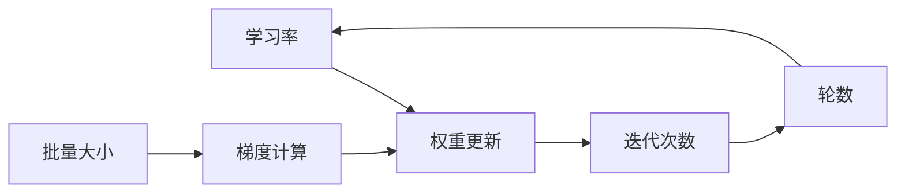

# 学习率衰减Learning Rate Decay原理与代码实例讲解

## 1. 背景介绍
在深度学习模型的训练过程中,学习率(Learning Rate)是一个非常重要的超参数。它决定了每次梯度下降时,权重更新的步长大小。学习率设置得太小,模型收敛速度会很慢;而学习率设置得太大,模型可能会在最优解附近震荡甚至发散。因此,选择一个合适的学习率对模型的性能至关重要。

学习率衰减(Learning Rate Decay)是一种在训练过程中动态调整学习率的方法。其核心思想是随着训练的进行,逐渐减小学习率的值。这样可以在训练初期快速收敛,而在训练后期小幅调整,更好地收敛到最优解。本文将深入探讨学习率衰减的原理,并给出详细的代码实例。

### 1.1 为什么需要学习率衰减
- 加速模型收敛:在训练初期使用较大的学习率,可以快速逼近最优解所在的区域。
- 防止模型震荡:在训练后期使用较小的学习率,可以减小权重更新的步长,避免模型在最优解附近来回震荡。
- 更精细调整:逐渐减小学习率,可以在接近最优解时进行更精细的调整,提高模型性能。

### 1.2 学习率衰减的常见策略
- 分段常数衰减:根据训练轮数,分段降低学习率。
- 指数衰减:学习率按指数函数持续衰减。
- 自适应调整:根据模型性能自动调整学习率,如AdaGrad,RMSProp,Adam等优化器。

## 2. 核心概念与联系
要理解学习率衰减,首先需要了解以下几个核心概念:
- 学习率(Learning Rate):权重更新的步长,决定了每次参数调整的幅度。
- 批量大小(Batch Size):每次迭代时,参与梯度计算和参数更新的样本数量。
- 迭代次数(Iterations):完成一次前向传播和反向传播的过程。
- 轮数(Epochs):所有训练样本都参与一次训练的过程。

这些概念之间的关系可以用下面的 Mermaid 流程图表示:



## 3. 核心算法原理具体操作步骤
学习率衰减的核心算法可以分为以下几个步骤:
1. 设置初始学习率 $\eta_0$ 和衰减策略的超参数。
2. 在每个迭代步 $t$,根据衰减策略计算当前学习率 $\eta_t$。
3. 使用当前学习率 $\eta_t$ 更新模型权重 $w$:

$$w_{t+1} = w_t - \eta_t \cdot \nabla_w L(w_t)$$

其中 $L(w_t)$ 为损失函数,$\nabla_w L(w_t)$ 为损失函数对权重 $w_t$ 的梯度。

4. 重复步骤2-3,直到满足停止条件(如达到预设的迭代次数或模型性能不再提升)。

## 4. 数学模型和公式详细讲解举例说明
下面以几种常见的学习率衰减策略为例,详细讲解其数学模型和公式。

### 4.1 分段常数衰减
分段常数衰减是将训练过程分为几个阶段,每个阶段使用不同的学习率。其数学表达式为:

$$
\eta_t = 
\begin{cases}
\eta_0 & \text{if } t \leq t_1 \\
\eta_1 & \text{if } t_1 < t \leq t_2 \\
\vdots & \vdots \\
\eta_n & \text{if } t > t_n
\end{cases}
$$

其中 $\eta_0$ 为初始学习率,$t_1, t_2, \dots, t_n$ 为学习率改变的时间点。

例如,假设初始学习率为0.1,每50个epoch衰减为原来的0.1倍,总共训练100个epoch。则学习率变化如下:

```
Epoch 1-50: 学习率为0.1
Epoch 51-100: 学习率为0.01
```

### 4.2 指数衰减
指数衰减是将学习率按指数函数持续衰减。其数学表达式为:

$$\eta_t = \eta_0 \cdot e^{-kt}$$

其中 $\eta_0$ 为初始学习率,$k$ 为衰减率,$t$ 为当前迭代步。

例如,假设初始学习率为0.1,衰减率为0.01,总共训练100个epoch。则学习率变化如下:

```
Epoch 1: 学习率为0.1
Epoch 2: 学习率为0.1 * e^(-0.01) ≈ 0.099
Epoch 3: 学习率为0.1 * e^(-0.02) ≈ 0.098
...
Epoch 100: 学习率为0.1 * e^(-0.99) ≈ 0.037
```

### 4.3 自适应调整
自适应调整是根据模型训练过程中的反馈信息,自动调整学习率。常见的自适应优化器有AdaGrad,RMSProp,Adam等。以Adam优化器为例,其学习率调整公式为:

$$\eta_t = \frac{\eta_0}{\sqrt{1-\beta_2^t}} \cdot \frac{\sqrt{\hat{v}_t}}{\sqrt{\hat{m}_t}+\epsilon}$$

其中 $\eta_0$ 为初始学习率,$\beta_1,\beta_2$ 为一阶矩和二阶矩的指数衰减率,$\hat{m}_t,\hat{v}_t$ 分别为一阶矩和二阶矩的偏差修正估计,$\epsilon$ 为平滑项。

## 5. 项目实践:代码实例和详细解释说明
下面以PyTorch为例,给出学习率衰减的代码实现。

### 5.1 分段常数衰减
```python
import torch
import torch.optim as optim

model = ...  # 定义模型
optimizer = optim.SGD(model.parameters(), lr=0.1)  # 设置初始学习率为0.1
scheduler = optim.lr_scheduler.MultiStepLR(optimizer, milestones=[50,80], gamma=0.1)  # 设置学习率衰减策略

for epoch in range(100):
    for batch in dataloader:
        # 训练代码
        ...
        
    scheduler.step()  # 在每个epoch结束时更新学习率
```

其中,`optim.lr_scheduler.MultiStepLR` 定义了分段常数衰减策略。`milestones` 参数指定了学习率改变的epoch数,`gamma` 参数指定了每次衰减的倍率。在每个epoch结束时调用 `scheduler.step()` 更新学习率。

### 5.2 指数衰减
```python
import torch
import torch.optim as optim

model = ...  # 定义模型
optimizer = optim.SGD(model.parameters(), lr=0.1)  # 设置初始学习率为0.1
scheduler = optim.lr_scheduler.ExponentialLR(optimizer, gamma=0.99)  # 设置学习率衰减策略

for epoch in range(100):
    for batch in dataloader:
        # 训练代码
        ...
        
    scheduler.step()  # 在每个epoch结束时更新学习率
```

其中,`optim.lr_scheduler.ExponentialLR` 定义了指数衰减策略。`gamma` 参数指定了衰减率。在每个epoch结束时调用 `scheduler.step()` 更新学习率。

### 5.3 自适应调整
```python
import torch
import torch.optim as optim

model = ...  # 定义模型
optimizer = optim.Adam(model.parameters(), lr=0.001, betas=(0.9, 0.999))  # 使用Adam优化器

for epoch in range(100):
    for batch in dataloader:
        # 训练代码
        ...
        
        optimizer.step()  # Adam优化器会自动调整学习率,无需额外的学习率调度器
```

使用Adam优化器时,无需显式设置学习率衰减策略。Adam会根据梯度的一阶矩和二阶矩自适应地调整每个参数的学习率。

## 6. 实际应用场景
学习率衰减在深度学习模型训练中有广泛的应用,适用于各种类型的任务和模型:

- 图像分类:如ResNet,VGG等卷积神经网络模型。
- 目标检测:如Faster R-CNN,YOLO等检测模型。
- 自然语言处理:如BERT,Transformer等语言模型。
- 语音识别:如DeepSpeech,Wav2Letter等语音模型。

在实际应用中,可以根据任务特点和模型复杂度,选择合适的学习率衰减策略。一般来说,较复杂的模型和较大的数据集,可以使用更小的初始学习率和更缓慢的衰减速度。而较简单的模型和较小的数据集,可以使用较大的初始学习率和较快的衰减速度。

## 7. 工具和资源推荐
- PyTorch官方文档:提供了详细的学习率衰减策略API说明和使用示例。
  https://pytorch.org/docs/stable/optim.html#how-to-adjust-learning-rate
- TensorFlow官方文档:提供了详细的学习率衰减策略API说明和使用示例。
  https://www.tensorflow.org/api_docs/python/tf/keras/optimizers/schedules
- 论文 "Cyclical Learning Rates for Training Neural Networks":提出了循环学习率的思想,在训练过程中周期性地调整学习率。
  https://arxiv.org/abs/1506.01186
- 论文 "Adaptive Gradient Methods with Dynamic Bound of Learning Rate":提出了自适应梯度方法,根据梯度信息自动调整学习率。
  https://arxiv.org/abs/1902.09843

## 8. 总结:未来发展趋势与挑战
学习率衰减是深度学习优化中的重要技术,可以加速模型收敛,提高训练效率和模型性能。未来,学习率衰减技术可能有以下几个发展趋势:

- 自动化:利用AutoML技术,自动搜索最优的学习率衰减策略和超参数组合。
- 自适应:设计更加智能的自适应学习率调整算法,根据模型训练过程中的反馈信息实时调整学习率。
- 任务特定:针对不同类型的任务(如图像、语音、文本等),设计专门的学习率衰减策略。
- 理论支持:加强学习率衰减策略的理论分析和证明,为实践提供更可靠的指导。

同时,学习率衰减技术也面临一些挑战:

- 超参数选择:如何选择最优的初始学习率、衰减方式和衰减速率等超参数,仍然是一个开放的问题。
- 鲁棒性:不同的学习率衰减策略对模型初始化、数据噪声等因素的鲁棒性有待进一步研究。
- 计算效率:某些自适应学习率调整算法(如AdaGrad,Adam等)需要额外的计算和存储开销,如何在保证性能的同时提高计算效率,是一个值得探索的方向。

## 9. 附录:常见问题与解答
### 9.1 学习率衰减和Batch Size的关系是什么?
学习率和Batch Size是相互影响的。一般来说,Batch Size越大,每次更新时的梯度估计越准确,学习率可以设置得更大。反之,Batch Size越小,学习率也应该相应减小,以避免梯度估计的噪声对模型的影响。在实践中,可以通过交叉验证来寻找Batch Size和学习率的最佳组合。

### 9.2 学习率衰减和正则化的关系是什么?
学习率衰减和正则化都可以起到控制模型复杂度,防止过拟合的作用。学习率衰减通过减小权重更新的步长,使模型在训练后期更倾向于收敛到平滑的解。而正则化通过在损失函数中引入权重的惩罚项,直接限制模型的复杂度。在实践中,学习率衰减和正则化常常结合使用,以达到更好的效果。

### 9.3 如何选择学习率衰减策略?
选择学习率衰减策略需要考虑以下几个因素:
- 模型复杂度:较复杂的模型一般需要更小的初始学习率和更缓慢的衰减速度。
- 数据规模:较大的数据集一般需要更多的训练轮数和更缓慢的学习率衰减。
- 收敛速