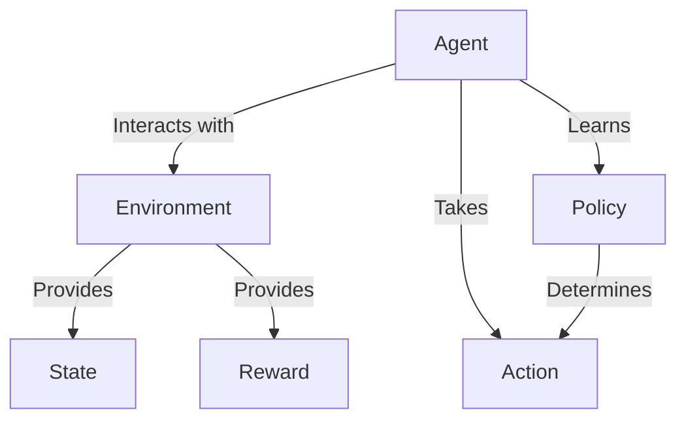

# 强化学习Reinforcement Learning与机器人的互动学习机制

## 1. 背景介绍
### 1.1 强化学习的起源与发展
#### 1.1.1 强化学习的起源
#### 1.1.2 强化学习的发展历程
#### 1.1.3 强化学习的重要里程碑

### 1.2 机器人互动学习的需求
#### 1.2.1 传统机器人控制方法的局限性
#### 1.2.2 机器人互动学习的优势
#### 1.2.3 强化学习在机器人互动学习中的应用前景

### 1.3 强化学习与机器人互动学习的结合
#### 1.3.1 强化学习为机器人互动学习提供了新的思路
#### 1.3.2 机器人互动学习为强化学习提供了新的应用场景
#### 1.3.3 两者的结合将推动人工智能的进一步发展

## 2. 核心概念与联系
### 2.1 强化学习的核心概念
#### 2.1.1 Agent：智能体
#### 2.1.2 Environment：环境
#### 2.1.3 State：状态
#### 2.1.4 Action：动作
#### 2.1.5 Reward：奖励
#### 2.1.6 Policy：策略

### 2.2 机器人互动学习的核心概念
#### 2.2.1 Perception：感知
#### 2.2.2 Planning：规划
#### 2.2.3 Control：控制
#### 2.2.4 Learning：学习
#### 2.2.5 Interaction：交互

### 2.3 强化学习与机器人互动学习的关系
#### 2.3.1 强化学习为机器人提供了一种自主学习的方法
#### 2.3.2 机器人互动学习为强化学习提供了一个实践平台
#### 2.3.3 两者相辅相成，共同推进人工智能的发展



## 3. 核心算法原理具体操作步骤
### 3.1 Q-Learning算法
#### 3.1.1 Q-Learning的基本思想
#### 3.1.2 Q-Learning的更新公式
#### 3.1.3 Q-Learning的算法流程

### 3.2 SARSA算法
#### 3.2.1 SARSA的基本思想
#### 3.2.2 SARSA的更新公式
#### 3.2.3 SARSA的算法流程

### 3.3 Policy Gradient算法
#### 3.3.1 Policy Gradient的基本思想
#### 3.3.2 Policy Gradient的目标函数
#### 3.3.3 Policy Gradient的算法流程

### 3.4 Actor-Critic算法
#### 3.4.1 Actor-Critic的基本思想
#### 3.4.2 Actor-Critic的架构
#### 3.4.3 Actor-Critic的算法流程

## 4. 数学模型和公式详细讲解举例说明
### 4.1 马尔可夫决策过程(MDP)
#### 4.1.1 MDP的定义
一个马尔可夫决策过程由一个五元组 $\langle S, A, P, R, \gamma \rangle$ 组成：

- $S$：状态集合
- $A$：动作集合 
- $P$：状态转移概率矩阵，$P(s'|s,a)$表示在状态$s$下执行动作$a$后转移到状态$s'$的概率
- $R$：奖励函数，$R(s,a)$表示在状态$s$下执行动作$a$获得的即时奖励
- $\gamma$：折扣因子，$\gamma \in [0,1]$，表示未来奖励的折扣程度

#### 4.1.2 MDP的最优策略
在MDP中，我们的目标是寻找一个最优策略$\pi^*$，使得从任意初始状态$s_0$出发，执行该策略获得的期望累积奖励最大：

$$\pi^* = \arg\max_{\pi} \mathbb{E}\left[\sum_{t=0}^{\infty} \gamma^t R(s_t,a_t) | s_0, \pi \right]$$

其中，$s_t$和$a_t$分别表示在时刻$t$的状态和动作。

### 4.2 值函数
#### 4.2.1 状态值函数
状态值函数$V^{\pi}(s)$表示从状态$s$出发，执行策略$\pi$获得的期望累积奖励：

$$V^{\pi}(s) = \mathbb{E}\left[\sum_{t=0}^{\infty} \gamma^t R(s_t,a_t) | s_0=s, \pi \right]$$

#### 4.2.2 动作值函数
动作值函数$Q^{\pi}(s,a)$表示在状态$s$下执行动作$a$，然后继续执行策略$\pi$获得的期望累积奖励：

$$Q^{\pi}(s,a) = \mathbb{E}\left[\sum_{t=0}^{\infty} \gamma^t R(s_t,a_t) | s_0=s, a_0=a, \pi \right]$$

#### 4.2.3 值函数的贝尔曼方程
状态值函数和动作值函数满足以下贝尔曼方程：

$$V^{\pi}(s) = \sum_{a} \pi(a|s) \sum_{s'} P(s'|s,a) \left[R(s,a) + \gamma V^{\pi}(s')\right]$$

$$Q^{\pi}(s,a) = \sum_{s'} P(s'|s,a) \left[R(s,a) + \gamma \sum_{a'} \pi(a'|s') Q^{\pi}(s',a')\right]$$

### 4.3 时序差分学习
#### 4.3.1 TD误差
时序差分(TD)学习是一种基于值函数的强化学习方法，其核心思想是利用TD误差来更新值函数的估计。TD误差定义为：

$$\delta_t = R_{t+1} + \gamma V(s_{t+1}) - V(s_t)$$

其中，$R_{t+1}$是在状态$s_t$下执行动作$a_t$后获得的即时奖励，$V(s_{t+1})$是下一个状态$s_{t+1}$的估计值。

#### 4.3.2 值函数的更新
利用TD误差，我们可以对值函数进行更新：

$$V(s_t) \leftarrow V(s_t) + \alpha \delta_t$$

其中，$\alpha$是学习率。

## 5. 项目实践：代码实例和详细解释说明
### 5.1 基于Q-Learning的机器人避障
#### 5.1.1 环境设置
我们考虑一个简单的2D网格环境，机器人的目标是从起点移动到终点，同时避开障碍物。状态空间为网格中的所有位置，动作空间为{上，下，左，右}。

#### 5.1.2 Q-Learning算法实现
```python
import numpy as np

# 初始化Q表
Q = np.zeros((n_states, n_actions))

# 设置超参数
alpha = 0.1 # 学习率
gamma = 0.9 # 折扣因子
epsilon = 0.1 # 探索率

# Q-Learning主循环
for episode in range(n_episodes):
    state = env.reset()
    done = False
    
    while not done:
        # 选择动作
        if np.random.uniform() < epsilon:
            action = env.action_space.sample() # 随机探索
        else:
            action = np.argmax(Q[state]) # 贪心策略
        
        # 执行动作，观察下一个状态和奖励
        next_state, reward, done, _ = env.step(action)
        
        # 更新Q表
        Q[state][action] += alpha * (reward + gamma * np.max(Q[next_state]) - Q[state][action])
        
        state = next_state
        
    print(f"Episode {episode}: Total Reward = {env.total_reward}")
```

在每个episode中，机器人从初始状态出发，根据当前的Q表选择动作（有一定概率进行探索），执行动作后观察下一个状态和奖励，并利用Q-Learning的更新公式更新Q表。不断重复这个过程，直到机器人到达终点或者episode结束。

### 5.2 基于Policy Gradient的机器人运动控制
#### 5.2.1 环境设置
我们考虑一个连续控制的环境，如MuJoCo中的Hopper，机器人的目标是向前移动，同时保持平衡。状态空间为机器人的关节角度和角速度，动作空间为连续的关节力矩。

#### 5.2.2 Policy Gradient算法实现
```python
import numpy as np
import tensorflow as tf

# 定义策略网络
class PolicyNetwork(tf.keras.Model):
    def __init__(self, state_dim, action_dim):
        super(PolicyNetwork, self).__init__()
        self.fc1 = tf.keras.layers.Dense(64, activation='relu')
        self.fc2 = tf.keras.layers.Dense(64, activation='relu') 
        self.fc3 = tf.keras.layers.Dense(action_dim, activation='tanh')
        
    def call(self, state):
        x = self.fc1(state)
        x = self.fc2(x)
        x = self.fc3(x)
        return x
        
# 定义值函数网络
class ValueNetwork(tf.keras.Model):
    def __init__(self, state_dim):
        super(ValueNetwork, self).__init__()
        self.fc1 = tf.keras.layers.Dense(64, activation='relu')
        self.fc2 = tf.keras.layers.Dense(64, activation='relu')
        self.fc3 = tf.keras.layers.Dense(1)
        
    def call(self, state):
        x = self.fc1(state)
        x = self.fc2(x)
        x = self.fc3(x)
        return x
        
# 初始化网络
state_dim = env.observation_space.shape[0]
action_dim = env.action_space.shape[0]
policy_net = PolicyNetwork(state_dim, action_dim)
value_net = ValueNetwork(state_dim)

# 设置超参数
alpha = 0.0005 # 策略学习率
beta = 0.0005 # 值函数学习率

# Policy Gradient主循环
for episode in range(n_episodes):
    state = env.reset()
    done = False
    rewards = []
    states = []
    actions = []
    
    while not done:
        state_tensor = tf.convert_to_tensor(state, dtype=tf.float32)
        action = policy_net(state_tensor)
        action = action.numpy()
        
        next_state, reward, done, _ = env.step(action)
        
        rewards.append(reward)
        states.append(state)
        actions.append(action)
        
        state = next_state
        
    # 计算折扣累积奖励
    discounted_rewards = []
    cumulative_reward = 0
    for r in rewards[::-1]:
        cumulative_reward = r + gamma * cumulative_reward
        discounted_rewards.insert(0, cumulative_reward)
    discounted_rewards = np.array(discounted_rewards)
    discounted_rewards = (discounted_rewards - np.mean(discounted_rewards)) / (np.std(discounted_rewards) + 1e-8)
    
    # 计算值函数估计
    values = value_net(tf.convert_to_tensor(states, dtype=tf.float32))
    
    # 计算优势函数
    advantages = discounted_rewards - values
    
    # 更新策略网络
    with tf.GradientTape() as tape:
        log_probs = tf.math.log(policy_net(tf.convert_to_tensor(states, dtype=tf.float32)))
        policy_loss = -tf.math.reduce_mean(log_probs * advantages)
    policy_grads = tape.gradient(policy_loss, policy_net.trainable_variables)
    policy_optimizer = tf.keras.optimizers.Adam(learning_rate=alpha)
    policy_optimizer.apply_gradients(zip(policy_grads, policy_net.trainable_variables))
    
    # 更新值函数网络  
    with tf.GradientTape() as tape:
        value_loss = tf.math.reduce_mean(tf.square(discounted_rewards - value_net(tf.convert_to_tensor(states, dtype=tf.float32))))
    value_grads = tape.gradient(value_loss, value_net.trainable_variables)
    value_optimizer = tf.keras.optimizers.Adam(learning_rate=beta)  
    value_optimizer.apply_gradients(zip(value_grads, value_net.trainable_variables))

    print(f"Episode {episode}: Total Reward = {np.sum(rewards)}")
```

在每个episode中，机器人从初始状态出发，根据当前的策略网络选择动作，执行动作后观察下一个状态和奖励，并记录下来。episode结束后，计算折扣累积奖励和值函数估计，得到优势函数。然后利用优势函数更新策略网络，利用折扣累积奖励更新值函数网络。不断重复这个过程，使策略网络朝着累积奖励最大化的方向优化。

## 6. 实际应用场景
### 6.1 自动驾驶
强化学习可以用于训练自动驾驶系统，通过与环境的交互学习如何在复杂的交通场景中做出最优决策，如避障、车道保持、速度控制等。

### 6.2 智能家居
强化