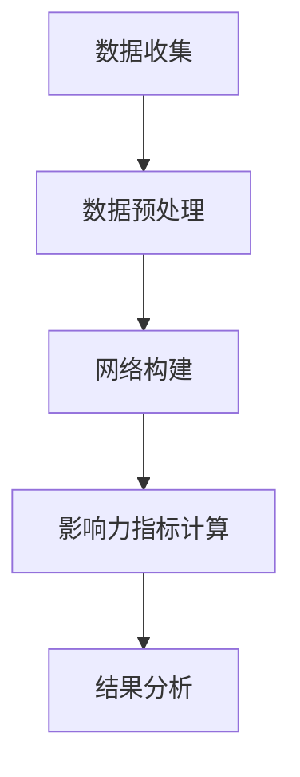

# 影响力分析与社会网络：AI代理的工作流研究

## 1.背景介绍

在当今信息化社会中，社会网络已经成为人们日常生活中不可或缺的一部分。无论是社交媒体平台、电子商务网站，还是专业的学术交流平台，社会网络都在其中扮演着重要角色。影响力分析作为社会网络研究中的一个重要分支，旨在通过分析网络中的节点和边，揭示个体或群体在网络中的影响力。随着人工智能技术的迅猛发展，AI代理在影响力分析中的应用也越来越广泛。

## 2.核心概念与联系

### 2.1 社会网络

社会网络是由节点（个体或实体）和边（关系或互动）组成的图结构。节点可以是人、组织、产品等，而边则表示这些节点之间的关系，如朋友关系、合作关系等。

### 2.2 影响力分析

影响力分析是通过研究社会网络中的节点和边，评估个体或群体在网络中的影响力。常见的影响力指标包括度中心性、接近中心性、中介中心性等。

### 2.3 AI代理

AI代理是指能够自主执行任务的人工智能系统。在影响力分析中，AI代理可以通过机器学习、深度学习等技术，自动化地进行数据收集、处理和分析。

### 2.4 核心联系

影响力分析与社会网络研究密不可分，而AI代理的引入则为影响力分析提供了强大的技术支持。通过AI代理，可以实现对大规模社会网络数据的高效处理和分析，从而更准确地评估节点的影响力。

## 3.核心算法原理具体操作步骤

### 3.1 数据收集

数据收集是影响力分析的第一步。AI代理可以通过爬虫技术、API接口等方式，从社交媒体、电子商务平台等渠道收集数据。

### 3.2 数据预处理

数据预处理包括数据清洗、数据转换和数据归一化等步骤。AI代理可以通过自然语言处理技术，对文本数据进行清洗和转换。

### 3.3 网络构建

根据预处理后的数据，构建社会网络图。节点表示个体或实体，边表示它们之间的关系。

### 3.4 影响力指标计算

使用不同的算法计算节点的影响力指标。常见的算法包括PageRank、HITS等。

### 3.5 结果分析

对计算结果进行分析，识别出网络中的关键节点和重要关系。



## 4.数学模型和公式详细讲解举例说明

### 4.1 度中心性

度中心性是指一个节点的度数，即与该节点直接相连的边的数量。度中心性公式为：

$$
C_D(v) = \deg(v)
$$

其中，$\deg(v)$ 表示节点 $v$ 的度数。

### 4.2 接近中心性

接近中心性衡量一个节点与其他节点的平均最短路径长度。接近中心性公式为：

$$
C_C(v) = \frac{1}{\sum_{u \neq v} d(v, u)}
$$

其中，$d(v, u)$ 表示节点 $v$ 和节点 $u$ 之间的最短路径长度。

### 4.3 中介中心性

中介中心性衡量一个节点在网络中作为其他节点之间桥梁的程度。中介中心性公式为：

$$
C_B(v) = \sum_{s \neq v \neq t} \frac{\sigma_{st}(v)}{\sigma_{st}}
$$

其中，$\sigma_{st}$ 表示节点 $s$ 和节点 $t$ 之间的最短路径数量，$\sigma_{st}(v)$ 表示经过节点 $v$ 的最短路径数量。

### 4.4 PageRank算法

PageRank算法用于衡量网页的重要性，其公式为：

$$
PR(v) = \frac{1-d}{N} + d \sum_{u \in M(v)} \frac{PR(u)}{\deg(u)}
$$

其中，$d$ 是阻尼因子，$N$ 是节点总数，$M(v)$ 是指向节点 $v$ 的节点集合。

## 5.项目实践：代码实例和详细解释说明

### 5.1 数据收集

```python
import requests

def collect_data(api_url):
    response = requests.get(api_url)
    data = response.json()
    return data

api_url = "https://api.example.com/social_network"
data = collect_data(api_url)
```

### 5.2 数据预处理

```python
import pandas as pd

def preprocess_data(data):
    df = pd.DataFrame(data)
    df = df.dropna()  # 删除缺失值
    df = df.drop_duplicates()  # 删除重复值
    return df

df = preprocess_data(data)
```

### 5.3 网络构建

```python
import networkx as nx

def build_network(df):
    G = nx.Graph()
    for index, row in df.iterrows():
        G.add_edge(row['source'], row['target'])
    return G

G = build_network(df)
```

### 5.4 影响力指标计算

```python
def calculate_centrality(G):
    degree_centrality = nx.degree_centrality(G)
    closeness_centrality = nx.closeness_centrality(G)
    betweenness_centrality = nx.betweenness_centrality(G)
    return degree_centrality, closeness_centrality, betweenness_centrality

degree_centrality, closeness_centrality, betweenness_centrality = calculate_centrality(G)
```

### 5.5 结果分析

```python
def analyze_results(degree_centrality, closeness_centrality, betweenness_centrality):
    # 识别关键节点
    key_nodes = sorted(degree_centrality, key=degree_centrality.get, reverse=True)[:10]
    return key_nodes

key_nodes = analyze_results(degree_centrality, closeness_centrality, betweenness_centrality)
print("关键节点:", key_nodes)
```

## 6.实际应用场景

### 6.1 社交媒体

在社交媒体平台上，影响力分析可以帮助识别关键意见领袖（KOL），从而优化营销策略。

### 6.2 电子商务

在电子商务平台上，影响力分析可以帮助识别重要的产品和用户，从而优化推荐系统。

### 6.3 学术研究

在学术交流平台上，影响力分析可以帮助识别重要的研究人员和研究成果，从而促进学术交流和合作。

### 6.4 公共安全

在公共安全领域，影响力分析可以帮助识别潜在的威胁和关键人物，从而提高安全防范能力。

## 7.工具和资源推荐

### 7.1 工具

- **NetworkX**：一个用于创建、操作和研究复杂网络结构的Python库。
- **Gephi**：一个开源的图形化网络分析工具。
- **Pandas**：一个强大的数据处理和分析库。

### 7.2 资源

- **《Social Network Analysis: Methods and Applications》**：一本经典的社会网络分析书籍。
- **Kaggle**：一个提供各种数据集和竞赛的平台，适合进行社会网络数据的收集和分析。

## 8.总结：未来发展趋势与挑战

### 8.1 未来发展趋势

随着人工智能技术的不断进步，AI代理在影响力分析中的应用将会越来越广泛。未来，AI代理将能够处理更加复杂和大规模的社会网络数据，从而提供更准确和全面的影响力分析结果。

### 8.2 挑战

尽管AI代理在影响力分析中具有巨大的潜力，但也面临一些挑战。例如，数据隐私和安全问题、算法的公平性和透明性问题等。这些问题需要在未来的研究和应用中得到解决。

## 9.附录：常见问题与解答

### 9.1 什么是影响力分析？

影响力分析是通过研究社会网络中的节点和边，评估个体或群体在网络中的影响力。

### 9.2 AI代理在影响力分析中的作用是什么？

AI代理可以通过机器学习、深度学习等技术，自动化地进行数据收集、处理和分析，从而提高影响力分析的效率和准确性。

### 9.3 常见的影响力指标有哪些？

常见的影响力指标包括度中心性、接近中心性、中介中心性等。

### 9.4 如何构建社会网络？

社会网络是由节点和边组成的图结构。节点表示个体或实体，边表示它们之间的关系。

### 9.5 影响力分析的实际应用场景有哪些？

影响力分析在社交媒体、电子商务、学术研究、公共安全等领域都有广泛的应用。

---

作者：禅与计算机程序设计艺术 / Zen and the Art of Computer Programming