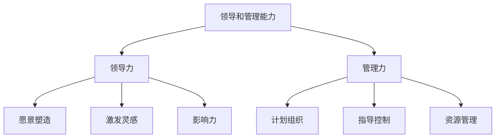

# 怎样培养出色的领导和管理能力

## 1.背景介绍

在当今瞬息万变的商业环境中，拥有出色的领导和管理能力对于个人事业发展和组织成功至关重要。无论是创业者、高管还是项目经理,都需要掌握有效的领导和管理技巧,以激励团队、推动创新并实现组织目标。然而,培养出色的领导和管理能力绝非一蹴而就,需要持续的学习、实践和自我反思。

## 2.核心概念与联系

领导力和管理力虽然密切相关,但也有着本质区别。领导力侧重于塑造愿景、激发灵感和影响他人,而管理力则着眼于计划、组织、指导和控制资源以达成目标。出色的领导者需要具备卓越的沟通能力、决策力、创新思维和人际关系管理技巧,而优秀的管理者则需要掌握项目管理、时间管理、风险管理等硬实力。



## 3.核心算法原理具体操作步骤

培养出色的领导和管理能力需要系统的方法论和持续的实践,可以遵循以下几个关键步骤:

1. **自我认知**:通过自我评估、反馈收集等方式,了解自身的优势、劣势和领导风格,从而制定改进计划。

2. **持续学习**:通过培训课程、导师指导、书籍学习等方式,不断提升领导和管理理论知识。

3. **实战演练**:积极参与实际项目,在实践中锻炼领导和管理技能,并及时总结经验教训。

4. **反馈与调整**:主动征求上级、同事和下属的反馈意见,并根据反馈持续优化领导和管理方式。

5. **塑造领导品格**:培养正直、勇气、同理心等领导品质,树立良好的职业操守和价值观。

## 4.数学模型和公式详细讲解举例说明

在领导和管理实践中,我们可以借助一些数学模型和公式来量化和优化决策过程。例如,我们可以使用决策树模型来评估不同决策方案的风险和收益,从而做出最优选择。

$$
\text{Expected Value}(X) = \sum_{i=1}^n p_i x_i
$$

其中,$X$表示决策变量,$p_i$表示结果$i$发生的概率,$x_i$表示结果$i$的收益或损失。通过计算每个决策方案的期望值,我们可以比较不同方案的风险和收益。

另一个常用的模型是排队理论模型,它可以帮助我们优化资源分配和流程管理。例如,在呼叫中心的运营中,我们可以使用埃尔朗公式来确定所需的服务窗口数量:

$$
P_0 = \left[ \sum_{n=0}^{c-1} \frac{\rho^n}{n!} + \frac{\rho^c}{c!(1-\rho/c)} \right]^{-1}
$$

其中,$P_0$表示系统空闲的概率,$\rho$表示到达率与服务率的比值,$c$表示服务窗口数量。通过计算不同窗口数量下的系统空闲概率,我们可以权衡服务水平和成本,做出最优决策。

## 5.项目实践:代码实例和详细解释说明

在实际项目管理中,我们可以使用各种工具和技术来提高效率和协作能力。以下是一个使用Python和Trello API实现的简单项目管理系统示例:

```python
import trello

# 连接Trello API
client = trello.TrelloClient(
    api_key='YOUR_API_KEY',
    api_secret='YOUR_API_SECRET'
)

# 创建新的项目板
board = client.add_board('Project Management Demo', idOrganization='YOUR_ORG_ID')

# 创建列表
todo = board.add_list('To Do', 0)
doing = board.add_list('Doing', 1)
done = board.add_list('Done', 2)

# 创建任务卡片
task1 = todo.add_card('Task 1', 'This is the first task.')
task2 = todo.add_card('Task 2', 'This is the second task.')

# 移动任务卡片
task1.change_list(doing.id)

# 获取板块信息
print(f'Board: {board.name}')
print('Lists:')
for lst in board.open_lists():
    print(f'- {lst.name}')
    for card in lst.list_cards():
        print(f'    - {card.name}')
```

在这个示例中,我们首先连接到Trello API,然后创建一个新的项目板块。接下来,我们添加了三个列表("To Do"、"Doing"和"Done")来表示任务的不同状态。然后,我们创建了两个任务卡片,并将其中一个卡片移动到"Doing"列表中。最后,我们打印出板块信息,包括列表名称和每个列表中的任务卡片。

通过使用Trello API,我们可以轻松地管理项目任务,跟踪进度,并与团队成员协作。这只是一个简单的示例,在实际项目中,我们可以进一步扩展功能,例如自动化任务分配、集成问题跟踪系统等。

## 6.实际应用场景

出色的领导和管理能力在各个领域都有广泛的应用场景,包括但不限于:

- **企业管理**:企业高管需要具备卓越的领导力和管理力,以制定战略方向、激励员工、优化流程、控制成本等。

- **项目管理**:项目经理需要有效地领导跨部门团队,管理项目进度、资源和风险,确保项目按时按质按量交付。

- **创业管理**:创业者不仅需要拥有独特的创业愿景,还需要具备出色的领导力和管理力,以吸引投资、组建团队并高效运营公司。

- **政府管理**:政府官员需要展现卓越的领导力,制定政策方针、协调利益相关方,并有效管理公共资源和服务。

- **教育领导**:校长和教育管理者需要具备领导力和管理力,以激发师生的潜能、营造良好的学习环境并推动教育创新。

## 7.工具和资源推荐

培养出色的领导和管理能力需要持续的学习和实践,以下是一些推荐的工具和资源:

- **在线课程**:诸如Coursera、edX等在线学习平台提供了大量优质的领导力和管理课程,涵盖理论和实践。

- **书籍资料**:《高效能人士的七个习惯》、《精力管理》、《第五项修炼》等经典著作都是领导力和管理力培养的绝佳读物。

- **导师指导**:寻找经验丰富的导师,可以获得宝贵的指导和反馈,加速成长。

- **领导力培训**:参加专业的领导力培训课程,通过案例分析、角色扮演等方式锻炼实战能力。

- **项目管理工具**:Trello、Asana、Jira等项目管理工具可以帮助优化任务分配、进度跟踪和团队协作。

- **数据分析工具**:Power BI、Tableau等数据分析工具可以帮助领导者洞察数据趋势,做出数据驱动的决策。

## 8.总结:未来发展趋势与挑战

随着商业环境的不断变化和技术的快速发展,领导和管理能力的要求也在不断提高。未来,领导者和管理者将面临以下几个主要趋势和挑战:

1. **数字化转型**:企业数字化转型将加速,领导者需要拥抱新技术,推动组织变革并培养员工的数字化能力。

2. **远程协作**:随着远程办公和虚拟团队的兴起,领导者需要掌握有效的远程领导和协作技巧。

3. **敏捷管理**:传统的层级式管理模式将逐渐被敏捷管理所取代,领导者需要建立扁平化的组织结构,赋予员工更多自主权。

4. **多元化与包容性**:组织日益多元化,领导者需要拥抱多元文化,促进包容性,充分发挥团队的多元优势。

5. **持续学习**:技术和商业模式的快速迭代要求领导者保持终身学习的心态,不断更新知识和技能。

6. **人本管理**:未来的领导和管理将更加注重人本理念,关注员工的身心健康、工作生活平衡和个人发展。

面对这些趋势和挑战,领导者和管理者需要保持开放的心态,勇于创新,与时俱进,不断提升自身的领导和管理能力,从而引领组织在瞬息万变的环境中保持竞争优势。

## 9.附录:常见问题与解答

1. **如何培养自我意识和自我反思能力?**
   
   自我意识和自我反思对于领导者和管理者至关重要。一种有效的方法是定期进行自我评估,收集上级、同事和下属的反馈意见,并根据反馈制定改进计划。另外,保持日志记录习惯也有助于自我反思。

2. **如何处理团队冲突和沟通障碍?**
   
   领导者需要掌握有效的沟通技巧,倾听每一方的观点,理解冲突的根源。在此基础上,通过开放、诚实的对话,寻求共识和妥协。同时,领导者还需要营造包容、信任的团队氛围,鼓励不同观点的表达。

3. **如何在压力和变革中保持积极乐观?**
   
   面对压力和变革,领导者需要保持积极乐观的心态,以身作则,为团队树立榜样。同时,领导者也需要关注自身的身心健康,通过运动、冥想等方式释放压力。此外,与导师或同行分享经验,寻求建议和支持也是不错的选择。

4. **如何确定合适的决策模型和工具?**
   
   不同的决策场景需要采用不同的模型和工具。领导者需要根据决策的复杂性、风险程度和可用数据等因素,选择合适的模型和工具,如决策树、多准则决策等。同时,也要注意模型和工具的局限性,结合实际情况和经验做出最终决策。

5. **如何在保持控制和授权之间取得平衡?**
   
   领导者需要在保持控制和授权之间找到适当的平衡点。一方面,需要对关键决策和流程保持一定程度的控制,确保组织运作有序;另一方面,也需要授权下属,赋予他们一定的自主权,激发主人翁意识和创造力。这需要领导者具备出色的判断力和信任度。

总之,培养出色的领导和管理能力是一个持续的过程,需要不断学习、实践和反思。相信只要付出努力,每个人都能成为卓越的领导者和管理者,引领组织走向成功。

作者:禅与计算机程序设计艺术 / Zen and the Art of Computer Programming