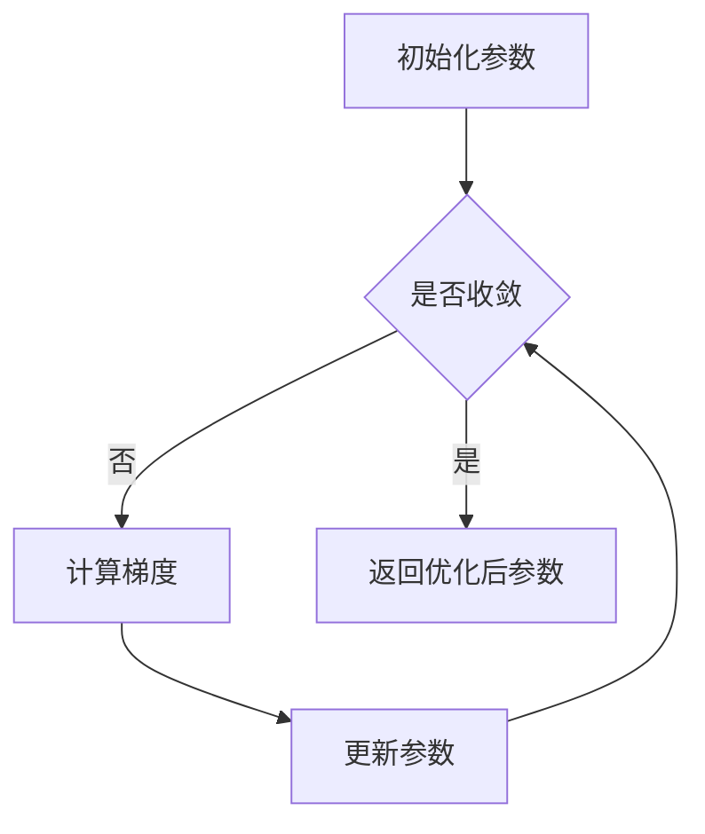

# 批量梯度下降法(BGD)原理与代码实战案例讲解

## 1.背景介绍
### 1.1 机器学习中的优化问题
在机器学习中,我们经常需要解决各种优化问题,比如线性回归、逻辑回归、支持向量机等算法,都需要通过最小化某个损失函数来求解最优模型参数。而梯度下降法就是解决这类优化问题的常用方法之一。

### 1.2 梯度下降法的发展历程
梯度下降法最早由 Cauchy 在1847年提出,经过不断发展和完善,已经成为求解无约束优化问题的重要算法。目前主要有批量梯度下降(BGD)、随机梯度下降(SGD)、小批量梯度下降(Mini-batch GD)等变种。本文将重点介绍批量梯度下降法。

### 1.3 批量梯度下降法的重要性
批量梯度下降是最基础、最常用的梯度下降形式。深入理解 BGD 的原理和实现,不仅有助于我们掌握机器学习的基础优化算法,还能帮助我们更好地学习其他改进的梯度下降变种。因此,学习 BGD 对机器学习算法的理解和应用至关重要。

## 2.核心概念与联系
### 2.1 梯度的概念
在微积分中,梯度是一个向量,表示多元函数在某点处沿着每个坐标方向变化最快的方向。对于函数 $f(x_1,x_2,...,x_n)$, 其梯度为:

$$\nabla f=\left(\frac{\partial f}{\partial x_1}, \frac{\partial f}{\partial x_2},...,\frac{\partial f}{\partial x_n}\right)$$

梯度的方向指出了函数值增长最快的方向,而梯度的模则表示函数值变化的速率。

### 2.2 梯度下降法的基本思想
梯度下降法的基本思想是:沿着目标函数梯度下降的方向,不断迭代更新参数,直到函数值达到局部最小点。

设要优化的目标函数为 $J(\theta)$, 其中 $\theta$ 为待优化参数向量。梯度下降法的参数更新公式为:

$$\theta := \theta - \alpha \nabla_{\theta} J(\theta)$$

其中 $\alpha$ 为学习率(learning rate),控制每次参数更新的步长。

### 2.3 批量梯度下降法与其他梯度下降变种的区别
批量梯度下降法(BGD)在每次迭代时使用整个训练集计算梯度,参数更新公式为:

$$\theta := \theta - \alpha \frac{1}{m} \sum_{i=1}^m \nabla_{\theta} J(\theta; x^{(i)}, y^{(i)})$$

其中 $m$ 为训练样本数量,$x^{(i)}, y^{(i)}$ 为第 $i$ 个训练样本的特征和标签。

相比之下,随机梯度下降(SGD)每次只用一个样本更新参数,小批量梯度下降(Mini-batch GD)每次使用一个小批量样本更新参数。它们的参数更新频率更高,但每次使用的样本数少,因此单次迭代的计算量小于 BGD。

## 3.核心算法原理具体操作步骤
批量梯度下降法的具体步骤如下:

1. 初始化待优化参数 $\theta$
2. 重复直到收敛: 
   a. 计算目标函数关于整个训练集的梯度:
      $$\nabla_{\theta} J(\theta) = \frac{1}{m} \sum_{i=1}^m \nabla_{\theta} J(\theta; x^{(i)}, y^{(i)})$$
   b. 根据学习率更新参数:
      $$\theta := \theta - \alpha \nabla_{\theta} J(\theta)$$
3. 返回优化后的参数 $\theta$

可以用下面的 Mermaid 流程图来表示 BGD 的算法流程:



## 4.数学模型和公式详细讲解举例说明
下面以线性回归为例,详细说明批量梯度下降法的数学原理。

考虑一个简单的线性回归模型:$h_{\theta}(x)=\theta_0+\theta_1 x$,其中 $\theta_0,\theta_1$ 为待优化参数。给定训练集 $\{(x^{(1)},y^{(1)}),(x^{(2)},y^{(2)}),...,(x^{(m)},y^{(m)})\}$,我们的目标是最小化均方误差损失函数:

$$J(\theta_0,\theta_1)=\frac{1}{2m}\sum_{i=1}^m (h_{\theta}(x^{(i)})-y^{(i)})^2$$

根据梯度下降法,参数更新公式为:

$$
\begin{aligned}
\theta_0 &:= \theta_0 - \alpha \frac{1}{m} \sum_{i=1}^m (h_{\theta}(x^{(i)})-y^{(i)}) \\
\theta_1 &:= \theta_1 - \alpha \frac{1}{m} \sum_{i=1}^m (h_{\theta}(x^{(i)})-y^{(i)})x^{(i)}
\end{aligned}
$$

其中偏导数项 $\frac{\partial J}{\partial \theta_0} = \frac{1}{m} \sum_{i=1}^m (h_{\theta}(x^{(i)})-y^{(i)})$, $\frac{\partial J}{\partial \theta_1} = \frac{1}{m} \sum_{i=1}^m (h_{\theta}(x^{(i)})-y^{(i)})x^{(i)}$。

重复迭代上述参数更新过程,直到损失函数收敛到一个较小值,即可得到优化后的模型参数 $\theta_0,\theta_1$。

## 5.项目实践:代码实例和详细解释说明
下面用 Python 实现批量梯度下降法,并用其求解线性回归问题。

```python
import numpy as np

def bgd(X, y, theta, alpha, num_iters):
    """
    批量梯度下降法
    
    输入:
    X - 输入特征矩阵,形状为 (m,n)
    y - 输出标签向量,形状为 (m,)  
    theta - 初始参数向量,形状为 (n,)
    alpha - 学习率
    num_iters - 迭代次数
    
    输出:
    theta - 优化后的参数向量,形状为 (n,)
    """
    m = len(y) 
    
    for i in range(num_iters):
        grad = 1/m * X.T @ (X @ theta - y)
        theta = theta - alpha * grad
        
    return theta

# 测试
X = 2 * np.random.rand(100,1) 
y = 4 + 3 * X + np.random.randn(100,1)

X_b = np.c_[np.ones((100,1)), X]
theta = np.random.randn(2,1)

theta = bgd(X_b, y, theta, alpha=0.01, num_iters=1000)
print(theta) # 结果接近 [[4],[3]]
```

代码说明:
- bgd 函数实现了批量梯度下降算法,输入为特征矩阵 X、标签向量 y、初始参数 theta、学习率 alpha 和迭代次数 num_iters,输出为优化后的参数。
- 在每次迭代中,先计算整个训练集上的梯度 grad,然后根据学习率更新参数 theta。
- 测试部分先随机生成一个线性回归数据集,然后用 BGD 进行优化求解,最终得到的参数与真实参数 [4,3] 接近。

可以看到,批量梯度下降法代码实现简洁,但在大数据集上运行效率较低,因为每次迭代都要遍历整个数据集。实际应用中,可以根据数据规模和算力等因素,选择合适的梯度下降变种。

## 6.实际应用场景
批量梯度下降法可应用于各种机器学习优化问题,比如:
- 线性回归:求解连续型变量的预测问题,如房价预测、销量预测等。
- 逻辑回归:求解二分类问题,如垃圾邮件识别、信用卡欺诈检测等。  
- 神经网络:用于训练浅层和深层神经网络,如手写数字识别、图像分类等。
- 支持向量机:求解分类和回归问题,在小样本场景性能突出。
- 主成分分析:用于数据降维和特征提取。
- 矩阵分解:用于推荐系统、话题模型等。

总之,只要问题能够建模为连续可导的损失函数优化,批量梯度下降法就可以高效求解。但对于海量数据集,BGD 的计算效率较低,需要选择 SGD 等变种。

## 7.工具和资源推荐
- Scikit-learn:机器学习算法库,提供了多种梯度下降优化器。
- TensorFlow、PyTorch:深度学习框架,支持自动求导和多种梯度下降变种。
- 吴恩达《Machine Learning》课程:详细讲解了梯度下降原理和应用。
- 《统计学习方法》(李航):从统计学角度系统阐述了批量梯度下降法。
- 《Deep Learning》(Goodfellow et al):深入探讨了深度学习中的优化问题。

## 8.总结:未来发展趋势与挑战
批量梯度下降法是机器学习优化的基础算法,在可预见的未来仍将在各类模型训练中扮演重要角色。但随着数据规模和模型复杂度的增长,BGD 面临计算效率瓶颈,亟需从以下几方面改进:
- 数据并行和模型并行:通过分布式计算加速梯度计算。
- 梯度压缩:通过量化、稀疏化等技术减少通信量。
- 二阶优化:引入二阶梯度信息,加快收敛速度。
- 自适应学习率:根据梯度历史自动调整学习率。

此外,针对非凸优化等特定问题,还需要设计更加高效、稳定的优化算法。优化领域仍大有可为。

## 9.附录:常见问题与解答
Q:批量梯度下降法收敛速度慢的原因是什么?
A:BGD 每次迭代都需要遍历整个训练集,计算量大。且当数据集存在冗余时,梯度方差小,收敛慢。

Q:BGD 容易收敛到局部最优的原因是什么?
A:BGD 基于梯度信息寻优,容易陷入局部极小值点。且当损失函数非凸时,梯度为零的点不一定是全局最优。

Q:BGD 的学习率如何选取?
A:学习率过大会导致参数在最优解附近震荡,过小则收敛慢。可先尝试 0.1,0.01,0.001 等数量级,再细调。或采用自适应学习率策略。

Q:BGD 的迭代次数如何确定?
A:可根据验证集性能或损失函数变化,设置早停条件。过多的无效迭代会浪费时间。

Q:对于非凸优化问题,如何改进 BGD?
A:可尝试引入随机性(如 SGD),或使用 Adam 等自适应优化器。多次重复优化有助于逃离局部极小值。

作者:禅与计算机程序设计艺术 / Zen and the Art of Computer Programming