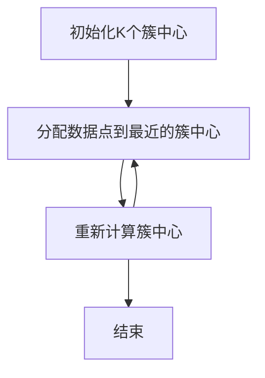
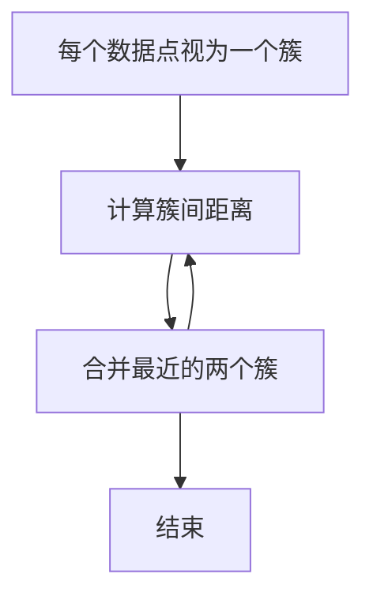
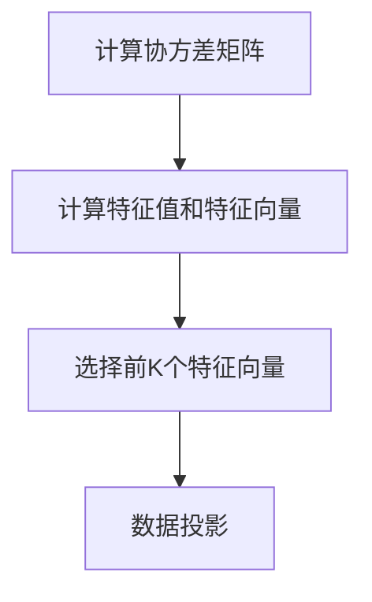
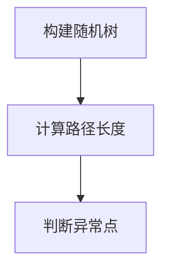

# 无监督学习在金融领域的应用

## 1.背景介绍

在金融领域，数据的复杂性和多样性使得传统的监督学习方法在某些场景下显得力不从心。无监督学习作为一种无需标签数据的机器学习方法，能够在数据中发现隐藏的模式和结构，因而在金融领域有着广泛的应用前景。本文将深入探讨无监督学习在金融领域的应用，涵盖核心概念、算法原理、数学模型、项目实践、实际应用场景、工具和资源推荐、未来发展趋势与挑战等方面。

## 2.核心概念与联系

### 2.1 无监督学习的定义

无监督学习是一种机器学习方法，它在没有预先标注的情况下，通过分析和建模数据的内在结构来发现数据中的模式和关系。与监督学习不同，无监督学习不依赖于标签数据，而是通过数据本身的特征进行学习。

### 2.2 无监督学习在金融领域的优势

无监督学习在金融领域的优势主要体现在以下几个方面：

- **数据多样性**：金融数据种类繁多，包括市场数据、交易数据、客户数据等。无监督学习能够处理这些多样化的数据。
- **模式发现**：无监督学习能够发现数据中的隐藏模式，如异常检测、聚类分析等。
- **实时性**：金融市场变化迅速，无监督学习能够实时分析数据，提供及时的决策支持。

### 2.3 无监督学习与其他机器学习方法的联系

无监督学习与监督学习和半监督学习有着密切的联系。监督学习依赖于标签数据进行训练，而无监督学习则不需要标签数据。半监督学习则结合了监督学习和无监督学习的特点，利用少量标签数据和大量未标签数据进行训练。

## 3.核心算法原理具体操作步骤

### 3.1 聚类算法

聚类算法是无监督学习中最常用的一类算法，用于将数据集划分为若干个簇，使得同一簇内的数据点相似度较高，不同簇之间的数据点相似度较低。常见的聚类算法包括K-means、层次聚类和DBSCAN等。

#### 3.1.1 K-means算法

K-means算法通过迭代优化目标函数，将数据点分配到K个簇中。其具体操作步骤如下：

1. 初始化K个簇中心。
2. 将每个数据点分配到最近的簇中心。
3. 重新计算每个簇的中心。
4. 重复步骤2和3，直到簇中心不再变化或达到最大迭代次数。



#### 3.1.2 层次聚类

层次聚类通过构建层次树状结构，将数据点逐步合并或分裂成簇。其具体操作步骤如下：

1. 将每个数据点视为一个簇。
2. 计算所有簇之间的距离。
3. 合并距离最近的两个簇。
4. 重复步骤2和3，直到所有数据点合并成一个簇或达到预定的簇数。



### 3.2 降维算法

降维算法用于将高维数据映射到低维空间，以便于数据的可视化和分析。常见的降维算法包括主成分分析（PCA）和t-SNE等。

#### 3.2.1 主成分分析（PCA）

PCA通过线性变换将数据投影到新的坐标系中，使得投影后的数据方差最大。其具体操作步骤如下：

1. 计算数据的协方差矩阵。
2. 计算协方差矩阵的特征值和特征向量。
3. 选择前K个特征向量作为新的坐标轴。
4. 将数据投影到新的坐标轴上。



### 3.3 异常检测算法

异常检测算法用于识别数据中的异常点，这些异常点通常代表着潜在的风险或机会。常见的异常检测算法包括孤立森林（Isolation Forest）和局部异常因子（LOF）等。

#### 3.3.1 孤立森林

孤立森林通过构建随机树来隔离数据点，异常点通常在树的较浅层次被隔离。其具体操作步骤如下：

1. 构建多棵随机树。
2. 计算每个数据点在树中的路径长度。
3. 根据路径长度判断数据点是否为异常点。



## 4.数学模型和公式详细讲解举例说明

### 4.1 K-means算法的数学模型

K-means算法的目标是最小化簇内平方误差和，其数学模型如下：

$$
J = \sum_{i=1}^{K} \sum_{x \in C_i} \| x - \mu_i \|^2
$$

其中，$K$ 是簇的数量，$C_i$ 是第 $i$ 个簇，$\mu_i$ 是第 $i$ 个簇的中心，$x$ 是数据点。

### 4.2 PCA的数学模型

PCA的目标是找到新的坐标轴，使得投影后的数据方差最大。其数学模型如下：

1. 计算数据的协方差矩阵 $C$：

$$
C = \frac{1}{n-1} \sum_{i=1}^{n} (x_i - \bar{x})(x_i - \bar{x})^T
$$

其中，$n$ 是数据点的数量，$x_i$ 是第 $i$ 个数据点，$\bar{x}$ 是数据的均值。

2. 计算协方差矩阵的特征值和特征向量：

$$
C v = \lambda v
$$

其中，$\lambda$ 是特征值，$v$ 是特征向量。

3. 选择前 $K$ 个特征向量作为新的坐标轴，将数据投影到新的坐标轴上：

$$
y = V^T x
$$

其中，$V$ 是前 $K$ 个特征向量组成的矩阵，$x$ 是原始数据，$y$ 是投影后的数据。

### 4.3 孤立森林的数学模型

孤立森林通过构建随机树来隔离数据点，其数学模型如下：

1. 构建随机树，计算每个数据点在树中的路径长度 $h(x)$。
2. 根据路径长度计算异常分数：

$$
s(x, n) = 2^{-\frac{E(h(x))}{c(n)}}
$$

其中，$E(h(x))$ 是数据点 $x$ 的平均路径长度，$c(n)$ 是调整因子，$n$ 是数据点的数量。

## 5.项目实践：代码实例和详细解释说明

### 5.1 K-means算法的代码实例

以下是使用Python实现K-means算法的代码实例：

```python
import numpy as np
from sklearn.cluster import KMeans
import matplotlib.pyplot as plt

# 生成示例数据
X = np.random.rand(100, 2)

# 使用K-means算法进行聚类
kmeans = KMeans(n_clusters=3, random_state=0).fit(X)

# 获取聚类结果
labels = kmeans.labels_
centers = kmeans.cluster_centers_

# 可视化聚类结果
plt.scatter(X[:, 0], X[:, 1], c=labels, cmap='viridis')
plt.scatter(centers[:, 0], centers[:, 1], c='red', marker='x')
plt.show()
```

### 5.2 PCA的代码实例

以下是使用Python实现PCA的代码实例：

```python
import numpy as np
from sklearn.decomposition import PCA
import matplotlib.pyplot as plt

# 生成示例数据
X = np.random.rand(100, 3)

# 使用PCA进行降维
pca = PCA(n_components=2)
X_pca = pca.fit_transform(X)

# 可视化降维结果
plt.scatter(X_pca[:, 0], X_pca[:, 1])
plt.show()
```

### 5.3 孤立森林的代码实例

以下是使用Python实现孤立森林的代码实例：

```python
import numpy as np
from sklearn.ensemble import IsolationForest
import matplotlib.pyplot as plt

# 生成示例数据
X = np.random.rand(100, 2)

# 使用孤立森林进行异常检测
clf = IsolationForest(random_state=0).fit(X)
scores = clf.decision_function(X)
outliers = clf.predict(X)

# 可视化异常检测结果
plt.scatter(X[:, 0], X[:, 1], c=outliers, cmap='viridis')
plt.show()
```

## 6.实际应用场景

### 6.1 风险管理

无监督学习在风险管理中有着广泛的应用。例如，通过聚类算法可以将客户分为不同的风险等级，从而制定相应的风险控制策略。通过异常检测算法可以识别交易中的异常行为，及时发现潜在的风险。

### 6.2 市场分析

无监督学习在市场分析中也有着重要的应用。例如，通过聚类算法可以将市场中的股票分为不同的类别，从而进行更精细的投资组合管理。通过降维算法可以将高维的市场数据映射到低维空间，便于数据的可视化和分析。

### 6.3 客户细分

无监督学习在客户细分中有着重要的应用。例如，通过聚类算法可以将客户分为不同的细分市场，从而制定针对性的营销策略。通过降维算法可以将客户的高维特征映射到低维空间，便于数据的可视化和分析。

## 7.工具和资源推荐

### 7.1 工具推荐

- **Scikit-learn**：一个Python机器学习库，提供了丰富的无监督学习算法实现。
- **TensorFlow**：一个开源的机器学习框架，支持无监督学习算法的实现和训练。
- **Keras**：一个高层神经网络API，支持无监督学习算法的实现和训练。

### 7.2 资源推荐

- **《Pattern Recognition and Machine Learning》**：一本经典的机器学习教材，详细介绍了无监督学习的理论和算法。
- **Coursera上的机器学习课程**：提供了丰富的无监督学习课程，适合初学者和进阶学习者。
- **Kaggle**：一个数据科学竞赛平台，提供了丰富的金融数据集和无监督学习竞赛。

## 8.总结：未来发展趋势与挑战

无监督学习在金融领域有着广泛的应用前景，但也面临着一些挑战。未来的发展趋势主要包括以下几个方面：

- **算法优化**：无监督学习算法的优化和改进将是未来的重要研究方向。例如，如何提高算法的效率和准确性，如何处理大规模数据等。
- **应用场景拓展**：无监督学习在金融领域的应用场景将不断拓展。例如，如何将无监督学习应用于更多的金融业务场景，如信用评估、反欺诈等。
- **数据隐私保护**：在金融领域，数据隐私保护是一个重要的问题。如何在保证数据隐私的前提下，利用无监督学习进行数据分析和建模，将是未来的重要研究方向。

## 9.附录：常见问题与解答

### 9.1 无监督学习与监督学习的区别是什么？

无监督学习不依赖于标签数据，而是通过数据本身的特征进行学习。监督学习则依赖于标签数据进行训练。

### 9.2 无监督学习在金融领域的应用有哪些？

无监督学习在金融领域的应用主要包括风险管理、市场分析和客户细分等。

### 9.3 如何选择合适的无监督学习算法？

选择合适的无监督学习算法需要根据具体的应用场景和数据特点。例如，聚类算法适用于数据分组，降维算法适用于数据可视化，异常检测算法适用于识别异常点。

### 9.4 无监督学习算法的性能如何评估？

无监督学习算法的性能评估通常依赖于数据的内在结构和应用场景。例如，聚类算法的性能可以通过簇内平方误差和进行评估，降维算法的性能可以通过数据的可视化效果进行评估，异常检测算法的性能可以通过异常点的识别准确率进行评估。

### 9.5 无监督学习在金融领域的未来发展趋势是什么？

无监督学习在金融领域的未来发展趋势主要包括算法优化、应用场景拓展和数据隐私保护等。

---

作者：禅与计算机程序设计艺术 / Zen and the Art of Computer Programming