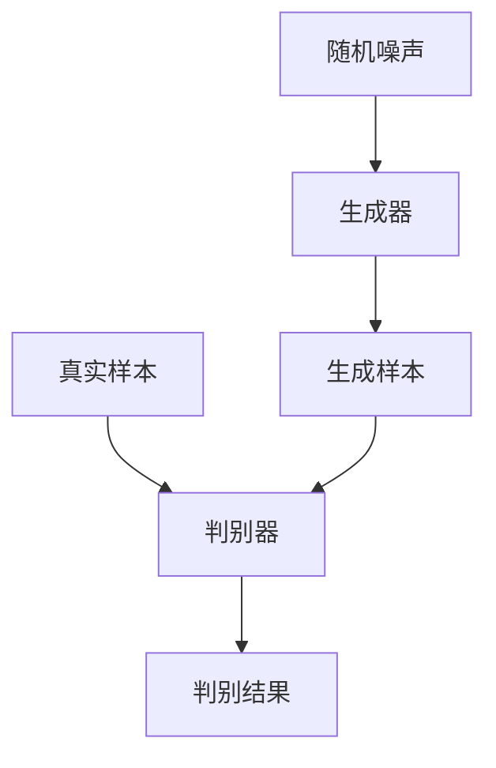

# 生成对抗网络 (Generative Adversarial Network)

## 1.背景介绍

生成对抗网络（Generative Adversarial Network，简称GAN）是由Ian Goodfellow及其同事在2014年提出的一种深度学习模型。GAN的出现为生成模型领域带来了革命性的变化，使得计算机能够生成逼真的图像、音频和文本等数据。GAN的核心思想是通过两个神经网络——生成器（Generator）和判别器（Discriminator）之间的对抗训练，使得生成器能够生成以假乱真的数据。

### 1.1 生成模型的历史

生成模型的研究可以追溯到早期的统计学方法，如高斯混合模型（GMM）和隐马尔可夫模型（HMM）。这些方法在处理简单数据时表现良好，但在面对复杂数据时显得力不从心。随着深度学习的兴起，变分自编码器（VAE）和生成对抗网络（GAN）成为了生成模型的主流方法。

### 1.2 GAN的诞生

在2014年，Ian Goodfellow等人提出了GAN，这一模型通过生成器和判别器的对抗训练，使得生成器能够生成高质量的样本。GAN的提出迅速引起了学术界和工业界的广泛关注，并在图像生成、文本生成、数据增强等多个领域取得了显著的成果。

## 2.核心概念与联系

### 2.1 生成器（Generator）

生成器是一个神经网络，其目标是从随机噪声中生成逼真的数据样本。生成器通过学习数据分布，使得生成的样本尽可能接近真实数据。

### 2.2 判别器（Discriminator）

判别器是另一个神经网络，其目标是区分真实数据和生成器生成的假数据。判别器通过不断提高其判别能力，使得生成器必须生成更逼真的数据来欺骗判别器。

### 2.3 对抗训练

对抗训练是GAN的核心思想，即生成器和判别器通过相互对抗的方式进行训练。生成器试图生成能够欺骗判别器的样本，而判别器则试图区分真实数据和生成数据。通过这种对抗训练，生成器和判别器不断提升各自的能力，最终生成器能够生成高质量的样本。

### 2.4 GAN的工作流程

以下是GAN的工作流程的Mermaid流程图：



## 3.核心算法原理具体操作步骤

### 3.1 初始化

首先，初始化生成器和判别器的参数。生成器的输入是随机噪声，输出是生成的样本。判别器的输入是样本（包括真实样本和生成样本），输出是判别结果（真实或生成）。

### 3.2 生成器训练

生成器的目标是生成能够欺骗判别器的样本。具体步骤如下：

1. 从随机噪声中生成样本。
2. 将生成样本输入判别器，得到判别结果。
3. 计算生成器的损失函数，损失函数的目标是最大化判别器认为生成样本为真实样本的概率。
4. 通过反向传播更新生成器的参数。

### 3.3 判别器训练

判别器的目标是区分真实样本和生成样本。具体步骤如下：

1. 将真实样本和生成样本分别输入判别器，得到判别结果。
2. 计算判别器的损失函数，损失函数的目标是最大化判别器正确区分真实样本和生成样本的概率。
3. 通过反向传播更新判别器的参数。

### 3.4 迭代训练

生成器和判别器的训练是交替进行的。每次迭代中，先训练生成器，再训练判别器。通过不断迭代，生成器和判别器的能力不断提升，最终生成器能够生成高质量的样本。

## 4.数学模型和公式详细讲解举例说明

### 4.1 损失函数

GAN的损失函数由生成器和判别器的损失函数组成。生成器的损失函数为：

$$
L_G = -\mathbb{E}_{z \sim p_z(z)}[\log(D(G(z)))]
$$

判别器的损失函数为：

$$
L_D = -\mathbb{E}_{x \sim p_{data}(x)}[\log(D(x))] - \mathbb{E}_{z \sim p_z(z)}[\log(1 - D(G(z)))]
$$

其中，$G(z)$表示生成器生成的样本，$D(x)$表示判别器对样本$x$的判别结果，$p_{data}(x)$表示真实数据的分布，$p_z(z)$表示随机噪声的分布。

### 4.2 优化目标

GAN的优化目标是使生成器和判别器的损失函数达到纳什均衡点，即生成器生成的样本与真实样本无法区分。具体来说，生成器的目标是最小化判别器的损失函数，而判别器的目标是最大化其自身的损失函数：

$$
\min_G \max_D L_D
$$

### 4.3 举例说明

假设我们有一个简单的二维数据集，数据分布为一个圆形。生成器的目标是从随机噪声中生成符合圆形分布的样本。判别器的目标是区分真实的圆形数据和生成器生成的数据。

1. 初始化生成器和判别器的参数。
2. 从随机噪声中生成样本，并将生成样本输入判别器，计算生成器的损失函数。
3. 更新生成器的参数，使得生成样本更接近真实数据。
4. 将真实样本和生成样本分别输入判别器，计算判别器的损失函数。
5. 更新判别器的参数，使得判别器能够更好地区分真实样本和生成样本。
6. 重复步骤2-5，直到生成器生成的样本与真实样本无法区分。

## 5.项目实践：代码实例和详细解释说明

### 5.1 环境准备

首先，我们需要安装必要的库，如TensorFlow或PyTorch。以下是使用PyTorch实现GAN的示例代码。

```python
import torch
import torch.nn as nn
import torch.optim as optim
import torchvision
import torchvision.transforms as transforms

# 定义生成器
class Generator(nn.Module):
    def __init__(self):
        super(Generator, self).__init__()
        self.main = nn.Sequential(
            nn.Linear(100, 256),
            nn.ReLU(True),
            nn.Linear(256, 512),
            nn.ReLU(True),
            nn.Linear(512, 1024),
            nn.ReLU(True),
            nn.Linear(1024, 784),
            nn.Tanh()
        )

    def forward(self, x):
        return self.main(x)

# 定义判别器
class Discriminator(nn.Module):
    def __init__(self):
        super(Discriminator, self).__init__()
        self.main = nn.Sequential(
            nn.Linear(784, 1024),
            nn.ReLU(True),
            nn.Linear(1024, 512),
            nn.ReLU(True),
            nn.Linear(512, 256),
            nn.ReLU(True),
            nn.Linear(256, 1),
            nn.Sigmoid()
        )

    def forward(self, x):
        return self.main(x)

# 初始化生成器和判别器
G = Generator()
D = Discriminator()

# 定义损失函数和优化器
criterion = nn.BCELoss()
optimizerG = optim.Adam(G.parameters(), lr=0.0002)
optimizerD = optim.Adam(D.parameters(), lr=0.0002)

# 加载数据集
transform = transforms.Compose([
    transforms.ToTensor(),
    transforms.Normalize((0.5,), (0.5,))
])
trainset = torchvision.datasets.MNIST(root='./data', train=True, download=True, transform=transform)
trainloader = torch.utils.data.DataLoader(trainset, batch_size=64, shuffle=True)

# 训练GAN
for epoch in range(25):
    for i, data in enumerate(trainloader, 0):
        # 更新判别器
        D.zero_grad()
        real, _ = data
        input = real.view(-1, 784)
        label = torch.full((input.size(0),), 1, dtype=torch.float)
        output = D(input)
        errD_real = criterion(output, label)
        errD_real.backward()
        noise = torch.randn(input.size(0), 100)
        fake = G(noise)
        label.fill_(0)
        output = D(fake.detach())
        errD_fake = criterion(output, label)
        errD_fake.backward()
        optimizerD.step()

        # 更新生成器
        G.zero_grad()
        label.fill_(1)
        output = D(fake)
        errG = criterion(output, label)
        errG.backward()
        optimizerG.step()

        if i % 100 == 0:
            print(f'Epoch [{epoch+1}/25], Step [{i+1}/{len(trainloader)}], D Loss: {errD_real+errD_fake:.4f}, G Loss: {errG:.4f}')
```

### 5.2 代码解释

1. 定义生成器和判别器的结构。生成器将随机噪声转换为图像，判别器将图像分类为真实或生成。
2. 初始化生成器和判别器，并定义损失函数和优化器。
3. 加载MNIST数据集，并将其转换为适合训练的格式。
4. 训练GAN模型。每次迭代中，先更新判别器，再更新生成器。通过不断迭代，生成器生成的图像质量逐渐提高。

## 6.实际应用场景

### 6.1 图像生成

GAN在图像生成领域取得了显著的成果。例如，StyleGAN可以生成高质量的人脸图像，CycleGAN可以实现图像风格转换，如将照片转换为油画风格。

### 6.2 数据增强

在数据不足的情况下，GAN可以用于数据增强。通过生成与真实数据相似的样本，可以提高模型的泛化能力。例如，在医学图像分析中，GAN可以生成更多的病理图像，帮助训练更准确的诊断模型。

### 6.3 文本生成

GAN也可以用于文本生成。例如，SeqGAN可以生成自然语言文本，应用于对话系统、自动写作等领域。

### 6.4 音频生成

GAN在音频生成领域也有广泛应用。例如，WaveGAN可以生成高质量的音频样本，应用于音乐创作、语音合成等领域。

## 7.工具和资源推荐

### 7.1 开源框架

- TensorFlow：谷歌开发的深度学习框架，支持GAN的实现。
- PyTorch：Facebook开发的深度学习框架，广泛应用于GAN的研究和应用。

### 7.2 数据集

- MNIST：手写数字数据集，常用于GAN的入门练习。
- CelebA：包含大量名人面部图像的数据集，常用于人脸生成任务。
- CIFAR-10：包含10类图像的数据集，常用于图像生成任务。

### 7.3 研究论文

- Ian Goodfellow等人提出的GAN原始论文：《Generative Adversarial Nets》
- 其他相关研究论文，如《Improved Training of Wasserstein GANs》、《Unsupervised Representation Learning with Deep Convolutional Generative Adversarial Networks》等。

## 8.总结：未来发展趋势与挑战

### 8.1 未来发展趋势

GAN在生成模型领域具有广阔的应用前景。未来，GAN有望在以下几个方面取得突破：

1. **生成质量提升**：通过改进生成器和判别器的结构，进一步提升生成样本的质量。
2. **多模态生成**：实现多模态数据的生成，如同时生成图像和文本。
3. **应用扩展**：在更多领域中应用GAN，如自动驾驶、虚拟现实等。

### 8.2 挑战

尽管GAN取得了显著的成果，但仍面临一些挑战：

1. **训练不稳定**：GAN的训练过程容易出现不稳定现象，如模式崩溃（Mode Collapse）。
2. **评价标准**：目前缺乏统一的评价标准来衡量生成样本的质量。
3. **计算资源**：GAN的训练过程需要大量的计算资源，限制了其在实际应用中的推广。

## 9.附录：常见问题与解答

### 9.1 什么是模式崩溃（Mode Collapse）？

模式崩溃是指生成器在训练过程中只生成有限的几种样本，导致生成样本的多样性不足。解决模式崩溃的方法包括改进生成器和判别器的结构、使用不同的损失函数等。

### 9.2 如何评价GAN生成样本的质量？

评价GAN生成样本的质量可以使用以下几种方法：

1. **视觉评估**：通过人眼观察生成样本的质量。
2. **定量指标**：如Frechet Inception Distance（FID）、Inception Score（IS）等。
3. **应用测试**：将生成样本应用于实际任务中，评估其效果。

### 9.3 GAN的训练需要多长时间？

GAN的训练时间取决于数据集的大小、模型的复杂度和计算资源的配置。一般来说，训练一个高质量的GAN模型需要数小时到数天的时间。

### 9.4 GAN可以用于监督学习吗？

GAN主要用于生成模型，但也可以用于监督学习。例如，使用GAN生成的数据增强训练集，提高监督学习模型的性能。

### 9.5 GAN的未来发展方向是什么？

GAN的未来发展方向包括生成质量提升、多模态生成、应用扩展等。通过不断改进生成器和判别器的结构，GAN有望在更多领域中取得突破。

---

作者：禅与计算机程序设计艺术 / Zen and the Art of Computer Programming