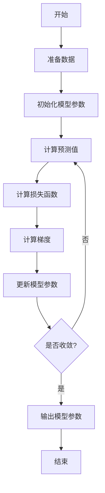

# 线性回归原理与代码实例讲解

## 1.背景介绍

线性回归是机器学习中最简单、最基础的算法之一。它旨在寻找一个最佳拟合的直线或超平面,使得数据点到该直线或超平面的距离之和最小。线性回归在许多领域都有着广泛的应用,如金融预测、销量预测、房价预测等。尽管线性回归看似简单,但其背后蕴含着丰富的数学原理和统计学概念。

## 2.核心概念与联系

线性回归的核心概念包括:

### 2.1 因变量和自变量

在线性回归中,我们试图找到自变量 (independent variable) 和因变量 (dependent variable) 之间的线性关系。自变量是可控制或输入的变量,而因变量是我们想要预测或解释的变量。

### 2.2 损失函数

损失函数 (loss function) 用于衡量预测值与实际值之间的差距。线性回归中常用的损失函数是平方损失函数,也称为最小二乘法 (Ordinary Least Squares, OLS)。

$$J(\theta) = \frac{1}{2m}\sum_{i=1}^{m}(h_\theta(x^{(i)}) - y^{(i)})^2$$

其中 $m$ 是样本数量, $x^{(i)}$ 是第 $i$ 个样本的自变量, $y^{(i)}$ 是第 $i$ 个样本的因变量, $h_\theta(x^{(i)})$ 是线性回归模型对第 $i$ 个样本的预测值。

### 2.3 梯度下降

梯度下降 (Gradient Descent) 是一种常用的优化算法,用于找到损失函数的最小值,从而获得最佳的模型参数。在线性回归中,我们使用梯度下降法来更新模型参数 $\theta$,使损失函数最小化。

## 3.核心算法原理具体操作步骤

线性回归算法的核心步骤如下:



1. **准备数据**: 将数据集划分为训练集和测试集。
2. **初始化模型参数**: 将模型参数 $\theta$ 初始化为一个随机值或全部设为 0。
3. **计算预测值**: 使用当前的模型参数 $\theta$ 和训练集的自变量 $X$,计算预测值 $h_\theta(X)$。
4. **计算损失函数**: 使用预测值 $h_\theta(X)$ 和训练集的因变量 $y$,计算损失函数 $J(\theta)$。
5. **计算梯度**: 计算损失函数 $J(\theta)$ 关于模型参数 $\theta$ 的梯度。
6. **更新模型参数**: 使用梯度下降法,根据计算出的梯度更新模型参数 $\theta$。
7. **判断是否收敛**: 检查损失函数是否已经收敛或达到预设的停止条件。如果是,则输出当前的模型参数;否则,返回步骤 3,重复上述过程。

## 4.数学模型和公式详细讲解举例说明

线性回归的数学模型可以表示为:

$$h_\theta(x) = \theta_0 + \theta_1x_1 + \theta_2x_2 + ... + \theta_nx_n$$

其中 $h_\theta(x)$ 是模型的预测值, $x = (x_1, x_2, ..., x_n)$ 是自变量, $\theta = (\theta_0, \theta_1, ..., \theta_n)$ 是待求的模型参数。

我们的目标是找到一组最优的模型参数 $\theta$,使得损失函数 $J(\theta)$ 最小化。在线性回归中,我们使用平方损失函数:

$$J(\theta) = \frac{1}{2m}\sum_{i=1}^{m}(h_\theta(x^{(i)}) - y^{(i)})^2$$

为了最小化损失函数,我们使用梯度下降法更新模型参数:

$$\theta_j := \theta_j - \alpha\frac{\partial}{\partial\theta_j}J(\theta)$$

其中 $\alpha$ 是学习率 (learning rate),决定了每次更新的步长。

对于平方损失函数,梯度可以计算为:

$$\frac{\partial}{\partial\theta_j}J(\theta) = \frac{1}{m}\sum_{i=1}^{m}(h_\theta(x^{(i)}) - y^{(i)})x_j^{(i)}$$

我们可以将上述公式矩阵化,使用向量和矩阵运算来高效计算梯度和更新模型参数。

例如,给定一个包含 3 个自变量的数据集:

| x1 | x2 | x3 | y |
|----|----|----|----|
| 1  | 2  | 3  | 4  |
| 5  | 6  | 7  | 8  |
| 9  | 10 | 11 | 12 |

假设我们初始化模型参数为 $\theta = (0, 0, 0, 0)$,学习率 $\alpha = 0.01$。那么在第一次迭代中,我们可以计算出:

$$
\begin{aligned}
h_\theta(x^{(1)}) &= 0 + 0 \cdot 1 + 0 \cdot 2 + 0 \cdot 3 = 0 \\
h_\theta(x^{(2)}) &= 0 + 0 \cdot 5 + 0 \cdot 6 + 0 \cdot 7 = 0 \\
h_\theta(x^{(3)}) &= 0 + 0 \cdot 9 + 0 \cdot 10 + 0 \cdot 11 = 0
\end{aligned}
$$

损失函数为:

$$J(\theta) = \frac{1}{2 \cdot 3}\left[(0 - 4)^2 + (0 - 8)^2 + (0 - 12)^2\right] = 48$$

梯度为:

$$
\begin{aligned}
\frac{\partial}{\partial\theta_0}J(\theta) &= \frac{1}{3}\left[(0 - 4) + (0 - 8) + (0 - 12)\right] = -8 \\
\frac{\partial}{\partial\theta_1}J(\theta) &= \frac{1}{3}\left[(0 - 4) \cdot 1 + (0 - 8) \cdot 5 + (0 - 12) \cdot 9\right] = -44 \\
\frac{\partial}{\partial\theta_2}J(\theta) &= \frac{1}{3}\left[(0 - 4) \cdot 2 + (0 - 8) \cdot 6 + (0 - 12) \cdot 10\right] = -88 \\
\frac{\partial}{\partial\theta_3}J(\theta) &= \frac{1}{3}\left[(0 - 4) \cdot 3 + (0 - 8) \cdot 7 + (0 - 12) \cdot 11\right] = -132
\end{aligned}
$$

因此,我们可以更新模型参数为:

$$
\begin{aligned}
\theta_0 &:= 0 - 0.01 \cdot (-8) = 0.08 \\
\theta_1 &:= 0 - 0.01 \cdot (-44) = 0.44 \\
\theta_2 &:= 0 - 0.01 \cdot (-88) = 0.88 \\
\theta_3 &:= 0 - 0.01 \cdot (-132) = 1.32
\end{aligned}
$$

我们继续迭代上述过程,直到损失函数收敛或达到预设的停止条件。

## 5.项目实践:代码实例和详细解释说明

以下是使用 Python 和 NumPy 库实现线性回归的代码示例:

```python
import numpy as np

# 加载数据
X = np.array([[1, 2, 3], [5, 6, 7], [9, 10, 11]])
y = np.array([4, 8, 12])

# 初始化模型参数
theta = np.zeros(4)

# 超参数设置
alpha = 0.01  # 学习率
num_iters = 1000  # 迭代次数

# 梯度下降
def gradient_descent(X, y, theta, alpha, num_iters):
    m = len(y)  # 样本数量
    J_history = np.zeros(num_iters)  # 记录损失函数历史

    for i in range(num_iters):
        h = np.dot(X, theta)  # 计算预测值
        errors = h - y  # 计算残差
        J = 1 / (2 * m) * np.dot(errors.T, errors)  # 计算损失函数
        J_history[i] = J  # 记录损失函数

        # 计算梯度
        grad = 1 / m * np.dot(X.T, errors)

        # 更新模型参数
        theta = theta - alpha * grad

    return theta, J_history

# 执行梯度下降
theta, J_history = gradient_descent(np.column_stack((np.ones(len(X)), X)), y, theta, alpha, num_iters)

# 输出结果
print(f"模型参数: {theta}")
print(f"最终损失函数值: {J_history[-1]}")
```

代码解释:

1. 首先,我们加载了一个简单的数据集,包含 3 个样本,每个样本有 3 个自变量和 1 个因变量。
2. 接下来,我们初始化了模型参数 `theta` 为全 0 向量,并设置了超参数 `alpha` (学习率) 和 `num_iters` (迭代次数)。
3. 定义了 `gradient_descent` 函数,实现了线性回归的梯度下降算法。
   - 在每次迭代中,我们首先计算预测值 `h` 和残差 `errors`。
   - 然后,根据平方损失函数计算当前的损失函数值 `J`,并记录在 `J_history` 中。
   - 接下来,我们计算损失函数关于模型参数的梯度 `grad`。
   - 最后,使用梯度下降法更新模型参数 `theta`。
4. 调用 `gradient_descent` 函数,执行梯度下降算法。我们将自变量矩阵 `X` 和常数项 `1` 合并为一个新的矩阵,作为输入。
5. 输出最终的模型参数 `theta` 和最小化的损失函数值 `J_history[-1]`。

在这个示例中,我们使用了一个非常简单的数据集进行演示。在实际应用中,您可以替换为自己的数据集,并根据需要调整超参数,以获得更好的模型性能。

## 6.实际应用场景

线性回归在许多领域都有着广泛的应用,例如:

1. **金融预测**: 预测股票价格、汇率等金融数据。
2. **销量预测**: 根据广告投入、促销活动等因素预测产品销量。
3. **房价预测**: 根据房屋面积、房龄、地理位置等因素预测房价。
4. **人口统计学**: 根据人口特征预测收入水平、教育程度等。
5. **生物医学**: 根据患者特征预测疾病风险、药物反应等。
6. **能源领域**: 预测能源需求、发电量等。

线性回归的优点在于简单易懂、计算高效,并且具有较好的解释性。但是,线性回归也有一些局限性,例如:

- 只能捕捉线性关系,对于非线性关系的拟合效果较差。
- 对异常值 (outlier) 较为敏感,可能导致模型性能下降。
- 自变量之间存在多重共线性 (multicollinearity) 时,模型参数估计可能不准确。

因此,在实际应用中,我们需要根据数据的特征和任务的要求,选择合适的机器学习算法。如果数据呈现明显的非线性关系,我们可以考虑使用更加复杂的非线性模型,如决策树、支持向量机或神经网络等。

## 7.工具和资源推荐

在学习和实践线性回归时,以下工具和资源可能会有所帮助:

1. **Python 库**:
   - NumPy: 提供高性能的数值计算功能。
   - Pandas: 提供高性能、易用的数据结构和数据分析工具。
   - Scikit-learn: 机器学习库,包含线性回归等多种算法的实现。
   - Matplotlib: 数据可视化库,用于绘制图表和图形。

2. **在线课程**:
   - Andrew Ng 的机器学习课程 (Coursera)
   - 斯