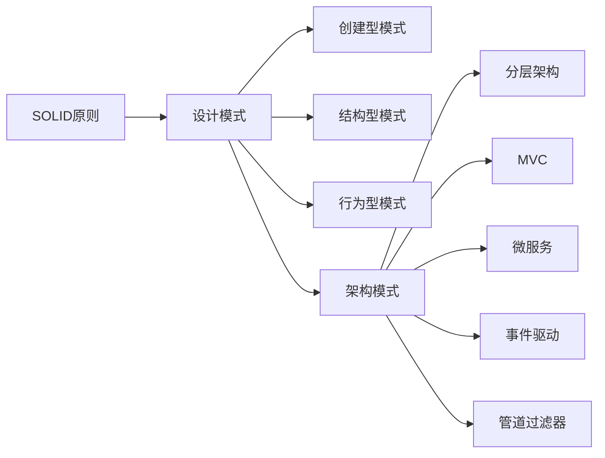

# 设计模式与软件架构原理与代码实战案例讲解

## 1. 背景介绍

### 1.1 软件设计模式的起源与发展
软件设计模式(Design Pattern)起源于建筑设计领域,后被 Erich Gamma、Richard Helm、Ralph Johnson 和 John Vlissides 四人(即著名的"四人帮Gang of Four")引入到软件工程领域。他们在1994年出版了《设计模式:可复用面向对象软件的基础》(Design Patterns: Elements of Reusable Object-Oriented Software)一书,系统地总结和提炼了23个经典的设计模式,极大地推动了设计模式在软件开发中的应用。

### 1.2 软件架构的重要性
软件架构(Software Architecture)是软件系统的顶层结构,描述了系统的组件以及组件之间的交互关系。一个好的软件架构能够满足系统的功能需求和质量属性(如性能、可靠性、安全性等),并且要易于理解、实现和维护。设计模式是构建灵活、可扩展、可维护的软件架构的重要工具。

### 1.3 设计模式与架构设计的关系
设计模式为常见的软件设计问题提供了经过验证的解决方案,而软件架构则从更高的层次上描述了系统的整体结构。二者相辅相成:
- 设计模式为架构设计提供了可复用的设计经验和最佳实践
- 在架构设计中合理运用设计模式,能够改善系统的质量属性
- 对系统的架构有整体把控,才能更好地选择和应用设计模式

因此,深入理解设计模式与架构设计原理,并且在实际项目中加以运用和实践,对于开发高质量软件系统至关重要。

## 2. 核心概念与联系

### 2.1 SOLID 原则
SOLID 是面向对象设计和编程的五大基本原则,是许多设计模式的基础:

- 单一职责原则(Single Responsibility Principle): 一个类应该只有一个引起它变化的原因
- 开闭原则(Open-Closed Principle): 对扩展开放,对修改关闭 
- 里氏替换原则(Liskov Substitution Principle): 子类可以替换基类出现在基类能够出现的任何地方
- 接口隔离原则(Interface Segregation Principle): 客户端不应该依赖它不需要的接口
- 依赖倒置原则(Dependency Inversion Principle): 高层模块不应该依赖低层模块,二者都应该依赖其抽象

### 2.2 常见的设计模式类型
根据模式的目的和作用,可以将设计模式分为三大类:

- 创建型模式: 提供创建对象的机制,增加已有代码的灵活性和可复用性。如单例、工厂方法、抽象工厂、建造者、原型等。

- 结构型模式: 介绍如何将对象和类组装成较大的结构,并同时保持结构的灵活和高效。如适配器、桥接、组合、装饰、外观、享元、代理等。

- 行为型模式: 负责对象间的高效沟通和职责委派。如责任链、命令、解释器、迭代器、中介者、备忘录、观察者、状态、策略、模板方法、访问者等。

### 2.3 架构模式
架构模式是从软件架构的角度来看待整个系统,是对设计模式的一种补充。常见的架构模式有:

- 分层架构: 将系统分为若干层,上层依赖下层,降低了层与层之间的耦合度
- MVC: 模型-视图-控制器,用于实现 UI 与业务逻辑的分离
- 微服务: 将单体应用拆分为小型服务,各服务独立开发、部署和扩展
- 事件驱动: 通过事件实现服务间的异步通信与解耦
- 管道-过滤器: 将处理过程分解为一系列独立的步骤,每个步骤对数据进行处理

下图展示了常见设计模式与架构模式之间的关系:



## 3. 核心算法原理具体操作步骤

设计模式的核心是基于面向对象的设计原则,通过类与对象之间的交互来实现灵活、可复用的设计。以下以几个常见的设计模式为例,介绍其核心实现步骤。

### 3.1 单例模式

保证一个类只有一个实例,并提供一个全局访问点。实现步骤:

1. 将构造函数声明为私有,防止外部直接创建实例
2. 声明一个静态私有的实例变量
3. 提供一个公有的静态方法用于获取唯一实例,使用延迟初始化来创建实例

### 3.2 观察者模式

定义对象间一种一对多的依赖关系,当一个对象状态发生改变时,所有依赖它的对象都会得到通知并自动更新。实现步骤:

1. 定义 Subject 接口,声明注册、移除、通知观察者的方法
2. 定义 Observer 接口,声明更新数据的方法
3. 创建具体的主题类,维护观察者列表,实现 Subject 接口中的方法
4. 创建具体的观察者类,实现 Observer 接口,在 update 方法中实现自己的更新逻辑
5. 在具体主题的状态发生变化时,调用 notifyObservers 方法通知所有观察者

### 3.3 策略模式

定义一系列算法,将每个算法都封装起来,并且使它们之间可以互换。实现步骤:

1. 定义策略接口,声明一个抽象的执行方法
2. 创建具体的策略类,实现策略接口,在 execute 方法中实现具体的算法逻辑
3. 创建环境类 Context,持有一个策略接口的引用,提供设置和执行策略的方法
4. 客户端创建具体的策略对象,并设置给 Context
5. 客户端调用 Context 的 executeStrategy 方法,执行策略中的算法

## 4. 数学模型和公式详细讲解举例说明

在设计模式中,有一些模式涉及到数学模型和公式。下面以负载均衡中的加权轮询算法为例进行说明。

加权轮询(Weighted Round Robin)是一种常用的负载均衡算法,通过给每个服务器分配一个权重,再根据权重分配请求,使得性能较高的服务器能够承担更多的请求。

### 4.1 算法原理

1. 每个服务器都赋予一个权重 $w_i$,表示该服务器的处理能力
2. 计算所有服务器权重的总和 $W=\sum_{i=1}^{n} w_i$
3. 计算当前的调度变量 $currentWeight$,初始值为0
4. 对于每一个新来的请求:
   - 遍历所有服务器,对于服务器 i,计算 $currentWeight_i = currentWeight + w_i$
   - 选择 $currentWeight_i$ 最大的服务器作为本次调度的服务器
   - 更新 $currentWeight = currentWeight_i - W$
5. 重复步骤4,直到所有请求被调度完成

### 4.2 示例说明

假设有三个服务器 A、B、C,权重分别为 4、3、2。

- 初始状态:
  - $currentWeight = 0$
  - $W = 4 + 3 + 2 = 9$

- 第一个请求:
  - A: $currentWeight_A = 0 + 4 = 4$
  - B: $currentWeight_B = 0 + 3 = 3$
  - C: $currentWeight_C = 0 + 2 = 2$
  - 选择 A 服务器处理请求
  - 更新 $currentWeight = 4 - 9 = -5$

- 第二个请求:
  - A: $currentWeight_A = -5 + 4 = -1$  
  - B: $currentWeight_B = -5 + 3 = -2$
  - C: $currentWeight_C = -5 + 2 = -3$
  - 选择 A 服务器处理请求
  - 更新 $currentWeight = -1 - 9 = -10$

可以看出,权重大的服务器会被优先调度,且每个服务器能够得到与其权重成比例的请求数。

## 5. 项目实践:代码实例和详细解释说明

下面以 Java 语言为例,展示几个常见设计模式的代码实现。

### 5.1 单例模式-懒汉式

```java
public class Singleton {
    private static Singleton instance;
    
    private Singleton() {}
    
    public static Singleton getInstance() {
        if (instance == null) {
            synchronized (Singleton.class) {
                if (instance == null) {
                    instance = new Singleton();
                }
            }
        }
        return instance;
    }
}
```

要点说明:

- 构造函数声明为 private,防止外部直接创建实例
- 使用 volatile 关键字修饰 instance,保证多线程环境下的可见性
- 使用双重检查锁定(double-checked locking),保证线程安全和效率

### 5.2 观察者模式

```java
// 主题接口
public interface Subject {
    void registerObserver(Observer o);
    void removeObserver(Observer o);
    void notifyObservers();
}

// 观察者接口 
public interface Observer {
    void update(String message);
}

// 具体主题类
public class ConcreteSubject implements Subject {
    private List<Observer> observers = new ArrayList<>();
    
    @Override
    public void registerObserver(Observer o) {
        observers.add(o);
    }
    
    @Override
    public void removeObserver(Observer o) {
        observers.remove(o);
    }
    
    @Override
    public void notifyObservers() {
        for (Observer o : observers) {
            o.update("message changed");
        }
    }
}

// 具体观察者类
public class ConcreteObserver implements Observer {
    @Override
    public void update(String message) {
        System.out.println("Received message: " + message);
    }
}
```

要点说明:

- Subject 接口定义了注册、移除、通知观察者的方法
- Observer 接口定义了更新数据的方法
- 具体主题类 ConcreteSubject 内部维护了一个观察者列表,并实现了 Subject 接口中定义的方法
- 具体观察者类 ConcreteObserver 实现了 Observer 接口,在 update 方法中定义了收到消息后的处理逻辑

### 5.3 策略模式

```java
// 策略接口
public interface Strategy {
    void execute();
}

// 具体策略类A
public class ConcreteStrategyA implements Strategy {
    @Override
    public void execute() {
        System.out.println("Using strategy A");
    }
}

// 具体策略类B
public class ConcreteStrategyB implements Strategy {
    @Override
    public void execute() {
        System.out.println("Using strategy B");
    }
}

// 环境类
public class Context {
    private Strategy strategy;
    
    public void setStrategy(Strategy strategy) {
        this.strategy = strategy;
    }
    
    public void executeStrategy() {
        strategy.execute();
    }
}
```

要点说明:

- Strategy 接口定义了一个抽象的 execute 方法
- 具体策略类 ConcreteStrategyA 和 ConcreteStrategyB 实现了 Strategy 接口,在 execute 方法中实现了各自的算法逻辑
- 环境类 Context 内部持有一个 Strategy 引用,通过 setStrategy 方法可以动态地设置具体的策略对象
- 调用 Context 的 executeStrategy 方法,会将请求委托给当前设置的具体策略对象来执行

## 6. 实际应用场景

设计模式在实际软件开发中有广泛的应用,下面列举一些常见的应用场景。

### 6.1 单例模式
- 配置管理类的设计,保证系统中只存在一份配置信息
- 数据库连接池的设计,避免频繁地创建和销毁数据库连接
- 日志管理器的设计,保证日志的一致性和完整性

### 6.2 观察者模式
- 订阅-发布系统的设计,如消息队列、事件总线
- GUI 编程中,当一个控件的状态发生变化时,自动通知其他关联的控件
- 股票价格变动时,自动通知股民

### 6.3 策略模式
- 电商系统中,根据不同的促销策略计算优惠价格
- 游戏中,不同类型的角色采取不同的