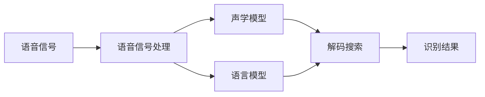

# 语音识别原理与代码实战案例讲解

## 1. 背景介绍

语音识别是人工智能领域的一个重要分支,旨在让计算机能够理解和识别人类的语音指令。随着智能设备的普及和语音交互需求的增长,语音识别技术在各个领域得到了广泛的应用,如智能音箱、车载系统、客服机器人等。本文将深入探讨语音识别的原理,并通过实战案例讲解如何使用代码实现语音识别功能。

### 1.1 语音识别的发展历程
#### 1.1.1 早期的模式匹配方法
#### 1.1.2 基于HMM的统计学习方法  
#### 1.1.3 深度学习的崛起

### 1.2 语音识别的应用场景
#### 1.2.1 智能音箱和语音助手
#### 1.2.2 车载系统和导航
#### 1.2.3 客服机器人和语音交互

## 2. 核心概念与联系

要理解语音识别的原理,需要先了解几个核心概念:

### 2.1 语音信号处理
#### 2.1.1 语音信号的数字化
#### 2.1.2 语音信号的预处理
#### 2.1.3 语音特征提取

### 2.2 声学模型
#### 2.2.1 隐马尔可夫模型(HMM)
#### 2.2.2 高斯混合模型(GMM)  
#### 2.2.3 深度神经网络(DNN)

### 2.3 语言模型
#### 2.3.1 N-gram模型
#### 2.3.2 RNN语言模型
#### 2.3.3 Transformer语言模型

### 2.4 解码搜索
#### 2.4.1 Viterbi算法
#### 2.4.2 Beam Search算法
#### 2.4.3 WFST解码框架

这些概念之间的联系可以用下面的Mermaid流程图表示:



## 3. 核心算法原理具体操作步骤

### 3.1 MFCC特征提取
#### 3.1.1 预加重
#### 3.1.2 分帧和加窗
#### 3.1.3 FFT变换
#### 3.1.4 Mel滤波器组
#### 3.1.5 对数运算
#### 3.1.6 DCT变换

### 3.2 HMM-GMM声学模型训练
#### 3.2.1 前向-后向算法
#### 3.2.2 Baum-Welch算法
#### 3.2.3 Viterbi训练

### 3.3 WFST解码搜索
#### 3.3.1 WFST的构建
#### 3.3.2 Token Passing算法
#### 3.3.3 On-the-fly Composition

## 4. 数学模型和公式详细讲解举例说明

### 4.1 隐马尔可夫模型(HMM)
HMM是一种统计学模型,用于描述一个隐含的马尔可夫过程。在语音识别中,HMM被用来建模语音单元(如音素)的生成过程。
设隐状态序列为$Q={q_1,q_2,...,q_T}$,观测序列为$O={o_1,o_2,...,o_T}$,HMM可以用三元组$\lambda=(A,B,\pi)$表示:
- 状态转移概率矩阵: $A={a_{ij}}$,其中$a_{ij}=P(q_{t+1}=j|q_t=i)$
- 观测概率矩阵: $B={b_j(o_t)}$,其中$b_j(o_t)=P(o_t|q_t=j)$ 
- 初始状态概率向量: $\pi={\pi_i}$,其中$\pi_i=P(q_1=i)$

HMM的三个基本问题:
1. 评估观测序列概率:前向算法
$$\alpha_t(i)=P(o_1,o_2,...,o_t,q_t=i|\lambda)$$
2. 寻找最佳状态序列:Viterbi算法
$$\delta_t(i)=\max_{q_1,q_2,...,q_{t-1}}P(q_1,q_2,...,q_{t-1},q_t=i,o_1,o_2,...,o_t|\lambda)$$  
3. 参数估计:Baum-Welch算法(EM算法)
$$\xi_t(i,j)=P(q_t=i,q_{t+1}=j|O,\lambda)$$

### 4.2 WFST解码搜索
WFST是一种加权有限状态转录器,可以将HMM声学模型、发音词典和语言模型整合到一个统一的搜索网络中。
设有$L$个WFST:$T_1,T_2,...,T_L$,每个WFST都是一个五元组$T=(Q,\Sigma,\Delta,I,F)$:
- 状态集合: $Q$
- 输入字母表: $\Sigma$ 
- 状态转移函数: $\Delta:Q\times(\Sigma\cup\{\epsilon\})\rightarrow Q\times(\Delta\cup\{\epsilon\})\times R$
- 初始状态: $I\subseteq Q$
- 终止状态: $F\subseteq Q$

WFST的基本操作:
1. 字母表投影:$\pi_i(T)$
2. 确定化:$det(T)$
3. 最小化:$min(T)$
4. 权重推动:$push(T)$ 
5. 组合:$T_1\circ T_2\circ...\circ T_L$

## 5. 项目实践：代码实例和详细解释说明

下面我们用Python代码实现一个基于MFCC特征和HMM-GMM声学模型的孤立词语音识别系统。

### 5.1 环境准备
```python
import numpy as np
import scipy.io.wavfile as wav
from python_speech_features import mfcc
from hmmlearn import hmm
```

### 5.2 数据准备
```python
# 训练数据
digits = ["one", "two", "three", "four", "five"]
X_train = []
y_train = []
for digit in digits:
    for i in range(10):
        fs, audio = wav.read(f"data/{digit}_{i}.wav")
        mfcc_feat = mfcc(audio, samplerate=fs)
        X_train.append(mfcc_feat)
        y_train.append(digit)

# 测试数据        
X_test = []
y_test = []        
for digit in digits:
    fs, audio = wav.read(f"data/{digit}_test.wav")
    mfcc_feat = mfcc(audio, samplerate=fs)
    X_test.append(mfcc_feat) 
    y_test.append(digit)
```

### 5.3 模型训练
```python
# 初始化HMM-GMM模型
models = {}
for digit in digits:
    model = hmm.GMMHMM(n_components=5, n_mix=3, covariance_type="diag")
    models[digit] = model
    
# 训练模型    
for digit in digits:
    X = [x for x, y in zip(X_train, y_train) if y == digit]
    models[digit].fit(X)    
```

### 5.4 模型评估
```python 
# 评估模型
n_correct = 0
for X, y in zip(X_test, y_test):
    best_score = -np.inf
    best_digit = None
    for digit, model in models.items():
        score = model.score(X)
        if score > best_score:
            best_score = score
            best_digit = digit
    if best_digit == y:
        n_correct += 1

accuracy = n_correct / len(y_test)
print(f"Accuracy: {accuracy:.2%}")        
```

## 6. 实际应用场景

### 6.1 智能音箱的语音控制
用户可以通过语音指令控制智能音箱播放音乐、设置闹钟、查询天气等。

### 6.2 车载系统的语音交互
驾驶员可以使用语音命令控制导航、拨打电话、调节空调等,提高驾驶安全性和便利性。

### 6.3 医疗领域的语音病历
医生可以通过语音输入快速记录病历,提高工作效率,减少手写病历的错误率。

## 7. 工具和资源推荐

### 7.1 开源工具包
- Kaldi: 一个功能强大的语音识别工具包,支持HMM-GMM和DNN-HMM等主流模型
- ESPnet: 一个端到端的语音处理工具包,支持语音识别、语音合成、语音翻译等任务
- DeepSpeech: 基于深度学习的开源语音识别引擎,由Mozilla开发

### 7.2 语音数据集 
- LibriSpeech: 来自LibriVox录音的大规模英文语音数据集
- AISHELL: 由北京智源人工智能研究院发布的中文语音数据集
- Common Voice: 由Mozilla发起的开源多语种语音数据集项目

### 7.3 相关书籍
- 《语音信号处理》 - 杨毅等 
- 《统计学习方法》 - 李航
- 《深度学习》 - Ian Goodfellow等

## 8. 总结：未来发展趋势与挑战

### 8.1 端到端的语音识别模型
传统的语音识别系统需要分别训练声学模型、发音词典和语言模型,而端到端模型可以直接将语音信号映射到文本,简化了系统的复杂度。

### 8.2 自监督学习与迁移学习
利用大规模无标注数据进行预训练,再在小规模标注数据上进行微调,可以显著提升模型的泛化能力。

### 8.3 多语种与方言识别
如何利用高资源语言的数据和模型来改善低资源语言的识别效果,是一个值得研究的问题。同时,方言识别也面临着方言资源匮乏、方言变异大等挑战。

### 8.4 语音识别的隐私与安全
如何在保护用户隐私的前提下进行语音数据的收集和模型训练,以及如何防范语音识别系统被恶意攻击,是亟待解决的问题。

## 9. 附录：常见问题与解答

### 9.1 语音识别的准确率能达到多少?
目前在资源充足的场景下,语音识别的准确率可以达到95%以上。但在嘈杂环境、口音变异等复杂场景下,准确率还有待提高。

### 9.2 语音识别需要多大的训练数据量?
训练数据量因任务复杂度而异。一般来说,孤立词识别需要每个词几十到几百条语音,连续语音识别则需要几十到几百小时的语料。

### 9.3 语音识别可以应用于哪些领域?
语音识别在智能家居、车载系统、客服机器人、医疗、教育等领域都有广泛应用。未来随着技术的发展,语音交互将成为人机交互的主要方式之一。

### 9.4 语音识别的延迟如何?
语音识别的延迟主要取决于模型大小和计算资源。目前在手机等终端设备上,通过模型压缩和计算优化,已经可以实现亚秒级的识别延迟。

### 9.5 语音识别需要哪些硬件设备?
语音识别需要麦克风进行语音采集,以及 CPU、GPU 等计算设备进行模型推理。在云端识别的场景下,还需要稳定的网络传输。

作者：禅与计算机程序设计艺术 / Zen and the Art of Computer Programming