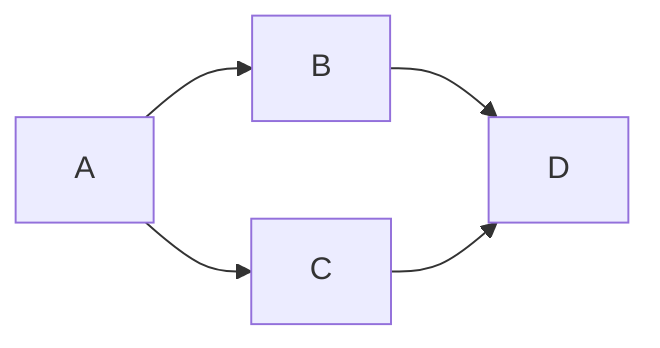

# 贝叶斯网络 (Bayesian Networks) 原理与代码实例讲解

## 1. 背景介绍

### 1.1 什么是贝叶斯网络?

贝叶斯网络(Bayesian Networks)是一种基于概率论的图形模型,用于表示多个随机变量之间的条件独立性关系。它由一组节点(表示随机变量)和有向边(表示变量之间的条件依赖关系)组成。贝叶斯网络通过利用贝叶斯定理,能够对复杂的联合概率分布进行有效的建模和推理。

### 1.2 贝叶斯网络的应用

贝叶斯网络广泛应用于多个领域,包括:

- 机器学习和模式识别
- 信息检索和数据挖掘
- 决策支持系统
- 生物信息学
- 图像处理和计算机视觉
- 自然语言处理

它们能够处理不确定性和复杂的因果关系,从而在诸多领域发挥重要作用。

### 1.3 贝叶斯网络的优势

相比其他概率模型,贝叶斯网络具有以下优势:

- 直观的图形表示,易于理解和解释
- 能够处理不完全或不确定的信息
- 支持因果推理和诊断推理
- 模块化结构,易于扩展和维护
- 结合领域知识和数据进行学习和推理

## 2. 核心概念与联系

### 2.1 有向无环图 (DAG)

贝叶斯网络的基础是有向无环图(Directed Acyclic Graph, DAG)。DAG由节点和有向边组成,表示变量之间的条件独立性关系。每个节点代表一个随机变量,有向边表示变量之间的依赖关系。



### 2.2 条件独立性

在贝叶斯网络中,如果两个节点之间没有直接或间接的路径相连,那么它们就是条件独立的。条件独立性是贝叶斯网络的核心概念,它允许我们将复杂的联合概率分布分解为更简单的条件概率分布,从而降低计算复杂度。

### 2.3 贝叶斯定理

贝叶斯定理是贝叶斯网络推理的基础。它描述了在给定证据的情况下,如何更新先验概率以获得后验概率。贝叶斯定理可以表示为:

$$P(A|B) = \frac{P(B|A)P(A)}{P(B)}$$

其中,P(A|B)是在给定证据B的情况下,事件A发生的后验概率;P(A)是A的先验概率;P(B|A)是在给定A的情况下,证据B发生的条件概率;P(B)是证据B的边际概率。

### 2.4 d-分离(d-separation)

d-分离是一个重要的概念,用于确定在给定证据的情况下,哪些变量是条件独立的。如果两个节点之间的所有路径都被给定的证据节点阻塞,那么这两个节点就是d-分离的,因此是条件独立的。

## 3. 核心算法原理具体操作步骤

### 3.1 贝叶斯网络的表示

贝叶斯网络由两个部分组成:

1. 结构(有向无环图)
2. 参数(每个节点的条件概率分布)

结构可以通过专家知识或数据学习获得,参数则通常从数据中学习。

### 3.2 结构学习算法

结构学习算法旨在从数据中自动学习贝叶斯网络的结构。常用的算法包括:

1. 约束基算法
    - 基于条件独立性测试
    - 例如:PC算法、IC算法
2. 搜索与评分算法
    - 使用评分函数评估网络结构
    - 例如:Hill-Climbing算法、K2算法

### 3.3 参数学习算法

参数学习算法旨在从数据中估计每个节点的条件概率分布。常用的算法包括:

1. 最大似然估计(MLE)
2. 贝叶斯估计
3. 期望最大化算法(EM算法,用于处理缺失数据)

### 3.4 推理算法

推理算法用于计算给定证据下,目标变量的后验概率分布。常用的推理算法包括:

1. 枚举算法(适用于小型网络)
2. 变量消除算法
3. 信念传播算法
    - 例如:Pearl's信念传播算法

## 4. 数学模型和公式详细讲解举例说明

### 4.1 联合概率分布

贝叶斯网络旨在表示一组随机变量的联合概率分布。对于一个包含n个变量的贝叶斯网络,其联合概率分布可以表示为:

$$P(X_1, X_2, \dots, X_n) = \prod_{i=1}^n P(X_i | \text{Parents}(X_i))$$

其中,Parents(Xi)表示节点Xi的父节点集合。

### 4.2 条件概率表(CPT)

每个节点的条件概率分布通常用条件概率表(Conditional Probability Table, CPT)表示。CPT包含了节点在给定父节点取值的情况下,取不同值的概率。

例如,对于一个二值节点X,其父节点为Y和Z,CPT可以表示为:

| Y | Z | P(X=0|Y,Z) | P(X=1|Y,Z) |
|---|---|------------|------------|
| 0 | 0 |     0.9    |     0.1    |
| 0 | 1 |     0.7    |     0.3    |
| 1 | 0 |     0.4    |     0.6    |
| 1 | 1 |     0.2    |     0.8    |

### 4.3 信念传播算法

信念传播算法是一种常用的推理算法,用于计算给定证据下,目标变量的后验概率分布。它基于以下思想:每个节点将其"信念"(概率分布)传播给其邻居节点,直到所有节点的信念收敛为目标后验概率分布。

算法步骤如下:

1. 初始化每个节点的信念为其先验概率分布
2. 对于每个证据节点,将其信念设置为观测值
3. 重复以下步骤,直到收敛:
    - 每个节点将其信念传播给其邻居节点
    - 每个节点根据来自邻居的信念,更新自身的信念
4. 目标节点的信念即为所求的后验概率分布

## 5. 项目实践: 代码实例和详细解释说明

以下是使用Python和pgmpy库实现贝叶斯网络的示例代码:

```python
import numpy as np
import pandas as pd
from pgmpy.models import BayesianModel
from pgmpy.estimators import MaximumLikelihoodEstimator

# 数据加载
data = pd.read_csv('data.csv')

# 构建网络结构
model = BayesianModel([('Cloudy', 'Sprinkler'), ('Cloudy', 'Rain'),
                       ('Sprinkler', 'WetGrass'), ('Rain', 'WetGrass')])

# 学习参数
model.fit(data, estimator=MaximumLikelihoodEstimator)

# 推理
from pgmpy.inference import VariableElimination
infer = VariableElimination(model)

# 计算后验概率
post_prob = infer.query(['Rain'], evidence={'Sprinkler': 1, 'WetGrass': 1})
print(post_prob)
```

代码解释:

1. 导入所需的库和数据集
2. 使用`BayesianModel`类定义网络结构,每个元组表示一个有向边
3. 使用`MaximumLikelihoodEstimator`从数据中学习网络参数
4. 创建`VariableElimination`推理对象
5. 使用`query`方法计算给定证据下,目标变量的后验概率分布

## 6. 实际应用场景

贝叶斯网络在以下领域有广泛的应用:

1. **医疗诊断**: 通过建模症状和疾病之间的关系,支持医疗诊断和决策。
2. **故障诊断**: 在制造业和航空航天领域,用于诊断复杂系统的故障原因。
3. **风险分析**: 在金融和保险领域,用于评估风险和做出决策。
4. **语音识别**: 在语音识别系统中,用于建模语音特征和词汇之间的关系。
5. **基因调控网络**: 在生物信息学中,用于模拟基因调控网络和蛋白质相互作用。
6. **社交网络分析**: 用于分析社交网络中个体之间的影响和关系。

## 7. 工具和资源推荐

以下是一些常用的贝叶斯网络工具和资源:

1. **pgmpy**: 一个Python库,提供贝叶斯网络和其他概率图形模型的建模、学习和推理功能。
2. **Hugin**: 一个商业软件,支持贝叶斯网络和影响图的建模、学习和推理。
3. **GeNIe**: 一个开源工具,提供图形界面和API,用于构建和分析贝叶斯网络。
4. **Netica**: 一个商业软件,支持贝叶斯网络的构建、学习和推理。
5. **Bayes Server**: 一个基于Web的贝叶斯网络工具,提供图形界面和API。
6. **Bayesian Network Repository**: 一个包含各种贝叶斯网络示例的在线资源库。

## 8. 总结: 未来发展趋势与挑战

### 8.1 发展趋势

1. **动态贝叶斯网络**: 用于建模时间序列数据和动态系统。
2. **连续贝叶斯网络**: 用于处理连续变量,而不仅限于离散变量。
3. **高斯过程贝叶斯网络**: 将高斯过程与贝叶斯网络相结合,用于非参数建模。
4. **深度贝叶斯网络**: 将深度学习与贝叶斯网络相结合,用于自动结构学习和参数估计。

### 8.2 挑战

1. **高维数据**: 随着数据维度的增加,贝叶斯网络的学习和推理变得更加困难。
2. **缺失数据**: 现实数据中常存在缺失值,需要有效的处理方法。
3. **非平稳性**: 许多现实系统是非平稳的,需要更复杂的动态模型。
4. **可解释性**: 随着模型复杂度的增加,保持模型的可解释性变得更加困难。
5. **计算效率**: 对于大型网络,推理过程可能会变得非常耗时。

## 9. 附录: 常见问题与解答

### 9.1 什么时候应该使用贝叶斯网络?

当您需要处理不确定性和复杂的因果关系时,贝叶斯网络是一个很好的选择。它们特别适用于以下情况:

- 需要从不完全或不确定的数据中进行推理
- 需要结合专家知识和数据进行建模
- 需要进行因果推理或诊断推理
- 需要处理高维数据,但变量之间存在条件独立性

### 9.2 如何选择合适的结构学习算法?

选择结构学习算法时,需要考虑以下因素:

- 数据集的大小
- 是否有先验知识可用
- 计算资源的限制
- 是否需要精确结构还是近似结构

通常,对于小型数据集,约束基算法可能更合适;对于大型数据集,搜索与评分算法可能更高效。如果有先验知识可用,可以将其纳入结构学习过程。

### 9.3 如何处理缺失数据?

有几种常用的方法可以处理缺失数据:

1. **数据删除**: 删除包含缺失值的实例或特征。这种方法简单,但可能会导致信息丢失。
2. **数据插补**: 使用特定的插补方法(如均值插补、最近邻插补等)来填充缺失值。
3. **期望最大化算法(EM算法)**: 一种迭代算法,可以同时估计参数和缺失数据。
4. **多重插补**: 使用多种插补方法,并将结果进行集成。

选择合适的方法取决于缺失数据的模式和比例。

### 9.4 如何评估贝叶斯网络的性能?

评估贝叶斯网络性能的常用指标包括:

1. **对数似然**: 衡量网络对数据的拟合程度。
2. **预测准确度**: 对于分类或