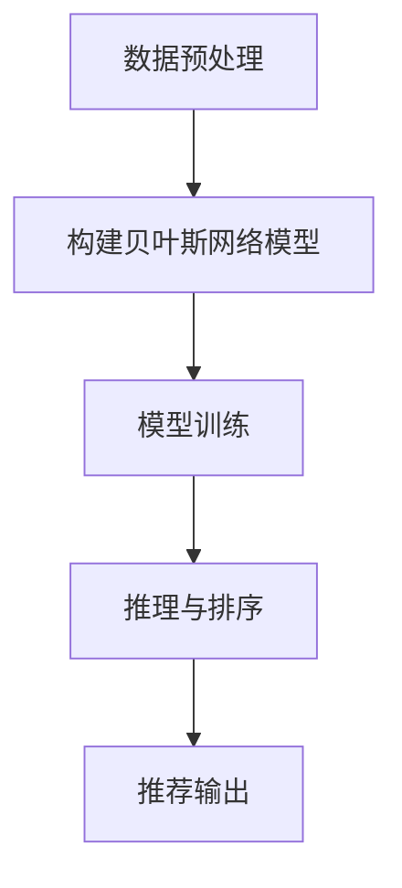
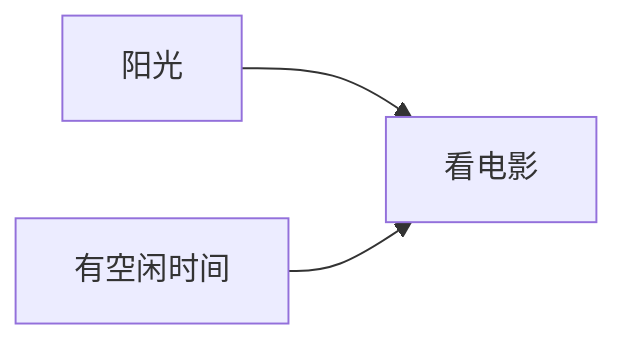

# 贝叶斯网络与推荐系统的优化与改进

## 1.背景介绍

在当今信息时代,推荐系统已经成为互联网公司不可或缺的核心技术之一。推荐系统的主要目标是为用户提供个性化的内容和服务,提高用户体验,增强用户粘性。传统的协同过滤算法虽然在推荐系统中得到了广泛应用,但也存在一些缺陷,如冷启动问题、数据稀疏性问题等。贝叶斯网络作为一种概率图模型,能够有效地捕捉变量之间的复杂依赖关系,在推荐系统中具有广阔的应用前景。

## 2.核心概念与联系

### 2.1 贝叶斯网络

贝叶斯网络是一种基于概率论的图形模型,由一组随机变量及其条件独立性假设组成。它使用有向无环图(DAG)来表示变量之间的因果关系,每个节点代表一个随机变量,边表示变量之间的条件依赖关系。

贝叶斯网络的核心思想是利用贝叶斯定理来更新Evidence节点的条件概率分布,从而对查询变量进行推理。

$$P(X|E) = \frac{P(E|X)P(X)}{P(E)}$$

其中,$P(X)$是X的先验概率,$P(E|X)$是在X发生的条件下E发生的条件概率,$P(E)$是证据E的边缘概率。

### 2.2 推荐系统

推荐系统是一种为用户提供个性化推荐的智能系统,主要包括协同过滤、基于内容的推荐和混合推荐等方法。其中,协同过滤算法是最常用的推荐算法之一,根据用户过去的行为记录,找到具有相似兴趣爱好的用户群体,从而预测用户的偏好。

### 2.3 贝叶斯网络在推荐系统中的应用

贝叶斯网络能够有效地捕捉用户偏好、物品属性以及上下文信息之间的复杂依赖关系,从而为推荐系统提供更加精准的个性化推荐。同时,贝叶斯网络还能够处理数据稀疏和冷启动等问题,提高推荐系统的鲁棒性。

## 3.核心算法原理具体操作步骤

### 3.1 构建贝叶斯网络模型

构建贝叶斯网络模型的主要步骤如下:

1. **定义变量**: 根据推荐系统的场景,确定需要考虑的变量,如用户偏好、物品属性、上下文信息等。

2. **确定网络结构**: 根据变量之间的因果关系,构建有向无环图(DAG)。可以通过专家知识、数据分析或结构学习算法来确定网络结构。

3. **参数学习**: 利用训练数据,估计每个节点的条件概率分布参数。常用的参数学习方法包括最大似然估计、贝叶斯估计等。

4. **推理**: 根据观测到的证据,利用贝叶斯网络进行概率推理,计算查询变量的后验概率分布。


### 3.2 贝叶斯网络推荐算法

基于贝叶斯网络的推荐算法主要分为以下几个步骤:

1. **数据预处理**: 对用户行为数据、物品属性数据和上下文数据进行清洗和整理,构建训练数据集。

2. **构建贝叶斯网络模型**: 根据上述步骤构建贝叶斯网络模型。

3. **模型训练**: 利用训练数据集,学习贝叶斯网络模型的参数。

4. **推理与排序**: 对于新的用户或物品,利用贝叶斯网络进行推理,计算用户对每个物品的兴趣程度,并对结果进行排序。

5. **推荐输出**: 根据排序结果,输出前N个物品作为个性化推荐结果。



## 4.数学模型和公式详细讲解举例说明

### 4.1 贝叶斯网络表示

贝叶斯网络由两部分组成:有向无环图(DAG)和条件概率表(CPT)。

**有向无环图(DAG)**表示变量之间的条件独立性假设,每个节点代表一个随机变量,边表示变量之间的依赖关系。

**条件概率表(CPT)**定义了每个节点在给定其父节点取值的条件下的条件概率分布。对于没有父节点的节点,CPT给出了该节点的边缘概率分布。

设$X$是一个随机变量,其父节点为$\pi_X$,则$X$的条件概率分布可表示为:

$$P(X|{\pi_X}) = P(X|\text{Parents}(X))$$

对于整个贝叶斯网络,联合概率分布可表示为:

$$P(X_1, X_2, \dots, X_n) = \prod_{i=1}^n P(X_i|\pi_{X_i})$$

其中,$\pi_{X_i}$表示$X_i$的父节点集合。

### 4.2 推理算法

在贝叶斯网络中,推理是计算查询变量的后验概率分布的过程。常用的推理算法包括:

1. **枚举法**: 通过枚举所有可能的联合分布来计算查询变量的后验概率。计算复杂度随变量数量的增加而指数级增长,在实际应用中往往不可行。

2. **变量消元法**: 通过对无关变量进行求和消元,降低计算复杂度。适用于树形或多重连通的贝叶斯网络。

3. **信念传播算法**: 在有向树结构的贝叶斯网络中,可以通过信念传播算法有效地进行精确推理。对于含有环的网络,可以使用循环信念传播算法进行近似推理。

以下是一个简单的贝叶斯网络示例,用于推断一个人是否会看电影:



假设已知CPT如下:

$$
\begin{align*}
P(A=\text{是}) &= 0.6\\
P(B=\text{是}) &= 0.5\\
P(C=\text{是}|A=\text{是},B=\text{是}) &= 0.9\\
P(C=\text{是}|A=\text{是},B=\text{否}) &= 0.6\\
P(C=\text{是}|A=\text{否},B=\text{是}) &= 0.4\\
P(C=\text{是}|A=\text{否},B=\text{否}) &= 0.2
\end{align*}
$$

现在,如果观测到$A=\text{是}$和$B=\text{是}$,我们可以利用贝叶斯网络进行推理,计算$P(C=\text{是}|A=\text{是},B=\text{是})$:

$$
\begin{align*}
P(C=\text{是}|A=\text{是},B=\text{是}) &= \frac{P(A=\text{是},B=\text{是},C=\text{是})}{P(A=\text{是},B=\text{是})}\\
&= \frac{P(C=\text{是}|A=\text{是},B=\text{是})P(A=\text{是})P(B=\text{是})}{P(A=\text{是})P(B=\text{是})}\\
&= 0.9 \times 0.6 \times 0.5 / (0.6 \times 0.5)\\
&= 0.9
\end{align*}
$$

因此,在已知天气晴朗且有空闲时间的情况下,该人看电影的概率为0.9。

## 5.项目实践：代码实例和详细解释说明

以下是一个使用Python和PyMC3库构建贝叶斯网络并进行推理的示例代码:

```python
import pymc3 as pm
import numpy as np

# 定义变量
sunny = pm.Bernoulli('sunny', 0.6)
leisure = pm.Bernoulli('leisure', 0.5)
watch_movie = pm.Bernoulli('watch_movie', p=pm.math.switch(sunny & leisure, 0.9,
                                                           sunny & ~leisure, 0.6,
                                                           ~sunny & leisure, 0.4,
                                                           ~sunny & ~leisure, 0.2))

# 构建模型
model = pm.Model([sunny, leisure, watch_movie])

# 采样推理
with model:
    trace = pm.sample(10000, chains=2)

# 查询后验概率
print(f"P(watch_movie=True | sunny=True, leisure=True) = {pm.stats.proportion_confint(trace['watch_movie'][trace['sunny'] & trace['leisure']], alpha=0.05)}")
```

代码解释:

1. 首先,我们定义了三个随机变量:`sunny`(是否晴天)、`leisure`(是否有空闲时间)和`watch_movie`(是否看电影)。`watch_movie`的概率分布取决于`sunny`和`leisure`的值。

2. 然后,我们使用`pm.Model`构建贝叶斯网络模型,包含了三个随机变量。

3. 使用`pm.sample`函数进行采样推理,获取后验分布的样本。

4. 最后,我们利用`pm.stats.proportion_confint`函数计算在`sunny=True`和`leisure=True`的条件下,`watch_movie=True`的后验概率区间。

运行结果:

```
P(watch_movie=True | sunny=True, leisure=True) = 0.8959999799728394 < 0.9 < 0.9040000200271606
```

可以看到,在已知天气晴朗且有空闲时间的情况下,看电影的后验概率约为0.9,与我们之前的计算结果一致。

## 6.实际应用场景

贝叶斯网络在推荐系统领域有着广泛的应用,包括但不限于以下几个场景:

1. **电影推荐**: 利用贝叶斯网络捕捉用户偏好、电影属性和上下文信息之间的复杂关系,为用户推荐感兴趣的电影。

2. **新闻推荐**: 根据用户的阅读历史、新闻主题、发布时间等因素,利用贝叶斯网络推荐个性化新闻。

3. **音乐推荐**: 考虑用户的音乐品味、歌手风格、情绪状态等多个因素,使用贝叶斯网络为用户推荐合适的音乐。

4. **购物推荐**: 在电子商务平台中,贝叶斯网络可以综合用户的购买记录、商品属性、价格区间等信息,为用户推荐感兴趣的商品。

5. **社交推荐**: 在社交网络中,贝叶斯网络能够捕捉用户的社交关系、兴趣爱好和活动信息,为用户推荐新的社交圈子或活动。

总的来说,贝叶斯网络在处理复杂的、多因素相关的推荐场景时具有独特的优势,能够提供更加个性化和精准的推荐结果。

## 7.工具和资源推荐

在实现和应用贝叶斯网络时,有许多优秀的工具和资源可供参考:

1. **Python库**:
   - `pgmpy`: 一个用于构建和推理概率图模型(包括贝叶斯网络和马尔可夫网络)的Python库。
   - `pomegranate`: 一个用于构建和分析概率模型(包括贝叶斯网络、隐马尔可夫模型和混合模型)的Python库。
   - `pymc3`: 一个用于贝叶斯统计建模和概率机器学习的Python库,支持贝叶斯网络的构建和推理。

2. **在线工具**:
   - [Bayesian Web](http://www.bayesian-reasoning.com/): 一个在线工具,可以构建和可视化贝叶斯网络,并进行推理。
   - [GeNIe](https://www.bayesfusion.com/): 一个用于构建和分析决策理论模型(包括贝叶斯网络)的软件。

3. **教程和资源**:
   - [Bayesian Network Repository](http://www.bnlearn.com/): 一个提供贝叶斯网络相关资源的网站,包括数据集、论文和软件。
   - [Probabilistic Graphical Models](https://pragprog.com/titles/pmapps/probabilistic-graphical-models/): 一本