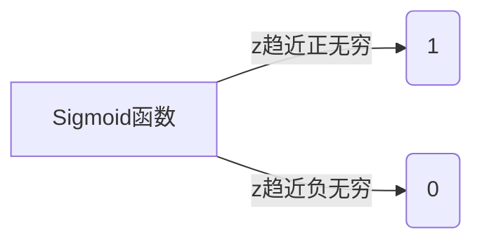

# 逻辑回归(Logistic Regression) - 原理与代码实例讲解

## 1.背景介绍

### 1.1 什么是逻辑回归

逻辑回归(Logistic Regression)是一种经典的机器学习算法,广泛应用于分类问题。它的本质是一种基于概率的监督学习算法,用于估计一个事件发生的概率。虽然名字中含有"回归"一词,但逻辑回归实际上是一种分类模型,用于预测二元或多元离散值的输出。

### 1.2 逻辑回归的应用场景

逻辑回归可以应用于各种场景,例如:

- 医疗诊断(患病/未患病)
- 信用评分(违约/未违约)
- 垃圾邮件检测(垃圾邮件/非垃圾邮件)
- 网络入侵检测(恶意/良性)
- 社交网络分析(喜欢/不喜欢)
- 自然语言处理(正面/负面情感)

任何需要对事物进行二元或多元分类的场景,都可以考虑使用逻辑回归模型。

## 2.核心概念与联系

### 2.1 逻辑回归与线性回归的区别

线性回归用于解决回归问题,即预测一个连续的数值输出。而逻辑回归则用于解决分类问题,预测一个离散的类别输出。

线性回归对自变量的线性组合进行建模,而逻辑回归则对自变量的线性组合进行logit变换,将其映射到(0,1)范围内,从而可以表示概率值。

### 2.2 Sigmoid函数

Sigmoid函数是逻辑回归中的核心,它将任意实数值映射到(0,1)范围内,可以很好地表示概率。Sigmoid函数的公式如下:

$$
\sigma(z) = \frac{1}{1 + e^{-z}}
$$

其中,z是自变量的线性组合,即:

$$
z = \theta_0 + \theta_1x_1 + \theta_2x_2 + ... + \theta_nx_n
$$

Sigmoid函数的图像如下:



可以看出,当z趋近正无穷时,Sigmoid函数值趋近于1;当z趋近负无穷时,Sigmoid函数值趋近于0。这符合概率的定义,使得Sigmoid函数非常适合作为逻辑回归的核心。

### 2.3 决策边界

在二元逻辑回归中,决策边界是一条将样本空间划分为两个区域的曲线。对于给定的输入x,如果Sigmoid函数值大于0.5,则预测为正例;否则预测为负例。

决策边界的方程为:

$$
\theta_0 + \theta_1x_1 + \theta_2x_2 + ... + \theta_nx_n = 0
$$

这是一个超平面方程,在二维空间中就是一条直线。

## 3.核心算法原理具体操作步骤

### 3.1 假设函数

逻辑回归的假设函数是:

$$
h_\theta(x) = \sigma(\theta^Tx) = \frac{1}{1 + e^{-\theta^Tx}}
$$

其中,x是输入特征向量,θ是模型参数向量。

我们的目标是找到最优参数θ,使得对于每个训练样本(x,y),当y=1时,h(x)接近1;当y=0时,h(x)接近0。

### 3.2 代价函数

为了找到最优参数θ,我们需要定义一个代价函数(Cost Function),用于衡量模型的拟合程度。逻辑回归的代价函数为:

$$
J(\theta) = -\frac{1}{m}\sum_{i=1}^m[y^{(i)}\log(h_\theta(x^{(i)})) + (1-y^{(i)})\log(1-h_\theta(x^{(i)}))]
$$

其中,m是训练样本的数量。

我们的目标是找到使代价函数J(θ)最小的参数θ。

### 3.3 梯度下降

为了找到最小化代价函数的参数θ,我们可以使用梯度下降算法。梯度下降的迭代公式为:

$$
\theta_j := \theta_j - \alpha\frac{\partial}{\partial\theta_j}J(\theta)
$$

其中,α是学习率,控制每次迭代的步长。

对于逻辑回归的代价函数,其偏导数为:

$$
\frac{\partial}{\partial\theta_j}J(\theta) = \frac{1}{m}\sum_{i=1}^m(h_\theta(x^{(i)}) - y^{(i)})x_j^{(i)}
$$

通过不断迭代,我们可以找到使代价函数最小的参数θ。

### 3.4 算法步骤

逻辑回归算法的步骤如下:

1. 初始化参数向量θ
2. 计算代价函数J(θ)
3. 计算代价函数的偏导数
4. 使用梯度下降公式更新参数θ
5. 重复步骤2-4,直到收敛或达到最大迭代次数

通过上述步骤,我们可以得到最优的参数θ,从而构建逻辑回归模型。

## 4.数学模型和公式详细讲解举例说明

### 4.1 二元逻辑回归

在二元逻辑回归中,我们的目标是预测一个二元输出y,即y∈{0,1}。

假设我们有一个训练数据集D={(x^(1),y^(1)),(x^(2),y^(2)),...,(x^(m),y^(m))}。其中,x^(i)是第i个训练样本的特征向量,y^(i)是对应的二元标签。

我们的假设函数为:

$$
h_\theta(x) = \sigma(\theta^Tx) = \frac{1}{1 + e^{-\theta^Tx}}
$$

其中,θ是需要学习的参数向量。

我们的目标是找到使代价函数J(θ)最小的参数θ:

$$
J(\theta) = -\frac{1}{m}\sum_{i=1}^m[y^{(i)}\log(h_\theta(x^{(i)})) + (1-y^{(i)})\log(1-h_\theta(x^{(i)}))]
$$

通过梯度下降算法,我们可以不断迭代更新参数θ,直到收敛。

例如,假设我们有一个二元分类问题,需要根据一个人的年龄(x)来预测他/她是否患有某种疾病(y)。我们可以使用逻辑回归模型来解决这个问题。

首先,我们需要收集一些训练数据,包括每个人的年龄和是否患病的标签。然后,我们可以使用逻辑回归算法来训练模型,得到最优参数θ。

在预测新样本时,我们只需要将新样本的特征(年龄)代入模型,计算h(x),如果h(x)>0.5,则预测为患病;否则预测为未患病。

### 4.2 多元逻辑回归

在多元逻辑回归中,我们的目标是预测一个多元输出y,即y∈{1,2,...,k}。这可以看作是k个二元逻辑回归的组合。

假设我们有一个训练数据集D={(x^(1),y^(1)),(x^(2),y^(2)),...,(x^(m),y^(m))}。其中,x^(i)是第i个训练样本的特征向量,y^(i)是对应的多元标签。

我们可以将多元逻辑回归问题转化为k个二元逻辑回归问题,对于每一个类别j,我们定义:

$$
h_\theta^{(j)}(x) = P(y=j|x;\theta) = \frac{e^{\theta_j^Tx}}{\sum_{l=1}^k e^{\theta_l^Tx}}
$$

其中,θ_j是第j个类别对应的参数向量。

我们的目标是找到使代价函数J(θ)最小的参数θ:

$$
J(\theta) = -\frac{1}{m}\sum_{i=1}^m\sum_{j=1}^k1\{y^{(i)}=j\}\log\frac{e^{\theta_j^Tx^{(i)}}}{\sum_{l=1}^k e^{\theta_l^Tx^{(i)}}}
$$

同样,我们可以使用梯度下降算法来优化参数θ。

例如,假设我们有一个多元分类问题,需要根据一个人的年龄(x1)、收入(x2)和教育程度(x3)来预测他/她的职业类别(y)。我们可以使用多元逻辑回归模型来解决这个问题。

首先,我们需要收集一些训练数据,包括每个人的年龄、收入、教育程度和职业类别。然后,我们可以使用多元逻辑回归算法来训练模型,得到最优参数θ。

在预测新样本时,我们只需要将新样本的特征(年龄、收入、教育程度)代入模型,计算每个类别的概率h(x),选择概率最大的类别作为预测结果。

## 5.项目实践:代码实例和详细解释说明

在本节中,我们将使用Python中的scikit-learn库来实现逻辑回归模型,并在一个实际数据集上进行训练和预测。

### 5.1 加载数据集

我们将使用scikit-learn内置的iris数据集,这是一个经典的多元分类问题。iris数据集包含150个样本,每个样本有4个特征(花萼长度、花萼宽度、花瓣长度、花瓣宽度),标签为3种鸢尾花品种(setosa,versicolor,virginica)。

```python
from sklearn import datasets
iris = datasets.load_iris()
X = iris.data
y = iris.target
```

### 5.2 数据预处理

在训练模型之前,我们需要对数据进行预处理,包括特征缩放和分割训练集/测试集。

```python
from sklearn.model_selection import train_test_split
from sklearn.preprocessing import StandardScaler

# 特征缩放
scaler = StandardScaler()
X_scaled = scaler.fit_transform(X)

# 分割训练集/测试集
X_train, X_test, y_train, y_test = train_test_split(X_scaled, y, test_size=0.2, random_state=42)
```

### 5.3 训练逻辑回归模型

接下来,我们将使用scikit-learn中的LogisticRegression类来训练逻辑回归模型。

```python
from sklearn.linear_model import LogisticRegression

# 创建逻辑回归模型实例
logreg = LogisticRegression()

# 训练模型
logreg.fit(X_train, y_train)
```

### 5.4 模型评估

我们可以使用模型在测试集上进行预测,并计算准确率等指标来评估模型的性能。

```python
# 预测
y_pred = logreg.predict(X_test)

# 计算准确率
from sklearn.metrics import accuracy_score
accuracy = accuracy_score(y_test, y_pred)
print("Accuracy: {:.2f}".format(accuracy))
```

### 5.5 可视化决策边界

为了更好地理解逻辑回归模型,我们可以可视化决策边界。由于iris数据集是一个多元分类问题,我们只能可视化两个特征的决策边界。

```python
import matplotlib.pyplot as plt
import numpy as np

# 绘制决策边界
def plot_decision_boundary(X, y, model):
    x_min, x_max = X[:, 0].min() - 1, X[:, 0].max() + 1
    y_min, y_max = X[:, 1].min() - 1, X[:, 1].max() + 1
    xx, yy = np.meshgrid(np.arange(x_min, x_max, 0.1),
                         np.arange(y_min, y_max, 0.1))
    Z = model.predict(np.c_[xx.ravel(), yy.ravel()])
    Z = Z.reshape(xx.shape)
    plt.contourf(xx, yy, Z, alpha=0.4)
    plt.scatter(X[:, 0], X[:, 1], c=y, s=20, edgecolor='k')
    plt.xlabel('Sepal length')
    plt.ylabel('Sepal width')
    plt.show()

# 可视化决策边界
plot_decision_boundary(X_scaled, y, logreg)
```

这段代码将绘制iris数据集中花萼长度和花萼宽度的决策边界。

通过上述代码示例,我们可以清楚地看到如何使用scikit-learn库来实现逻辑回归模型,并在实际数据集上进行训练、预测和评估。

## 6.实际应用场景

逻辑回归模型在现实世界中有着广泛的应用,下面是一些典型的应用场景:

### 6.1 医