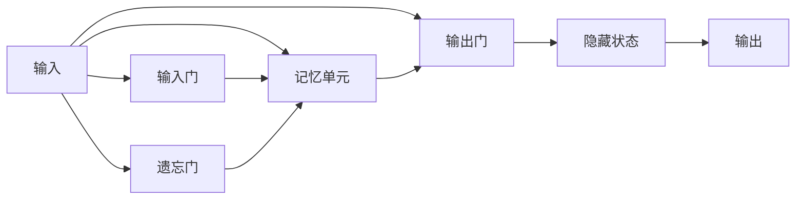

# 长短期记忆网络(Long Short-Term Memory) - 原理与代码实例讲解

## 1. 背景介绍
### 1.1 循环神经网络的局限性
循环神经网络(RNN)是一种用于处理序列数据的神经网络模型。然而,传统的RNN在处理长序列时存在梯度消失和梯度爆炸的问题,导致其难以捕捉长期依赖关系。

### 1.2 LSTM的提出
为了解决RNN的局限性,Hochreiter和Schmidhuber在1997年提出了长短期记忆网络(LSTM)。LSTM通过引入门控机制和显式的记忆单元,能够有效地学习长期依赖关系,成为处理序列数据的重要工具。

## 2. 核心概念与联系
### 2.1 门控机制
- 输入门(Input Gate):控制新信息进入记忆单元的程度
- 遗忘门(Forget Gate):控制旧信息被遗忘的程度  
- 输出门(Output Gate):控制记忆单元中的信息输出到隐藏状态的程度

### 2.2 记忆单元
记忆单元(Memory Cell)是LSTM的核心组件,用于存储长期信息。通过门控机制的调节,记忆单元可以选择性地保留或更新信息。

### 2.3 隐藏状态
隐藏状态(Hidden State)表示LSTM在当前时间步的输出。它融合了当前输入和先前的记忆,并通过输出门控制信息的输出。

### 2.4 概念联系
下图展示了LSTM中各个概念之间的联系:



## 3. 核心算法原理具体操作步骤
### 3.1 遗忘门
- 将先前隐藏状态$h_{t-1}$和当前输入$x_t$拼接
- 通过sigmoid激活函数计算遗忘门$f_t$
$$f_t = \sigma(W_f \cdot [h_{t-1}, x_t] + b_f)$$

### 3.2 输入门和候选记忆单元
- 计算输入门$i_t$
$$i_t = \sigma(W_i \cdot [h_{t-1}, x_t] + b_i)$$
- 计算候选记忆单元$\tilde{C}_t$ 
$$\tilde{C}_t = tanh(W_C \cdot [h_{t-1}, x_t] + b_C)$$

### 3.3 更新记忆单元
- 遗忘旧信息,加入新信息,更新记忆单元$C_t$
$$C_t = f_t * C_{t-1} + i_t * \tilde{C}_t$$

### 3.4 输出门和隐藏状态
- 计算输出门$o_t$
$$o_t = \sigma(W_o \cdot [h_{t-1}, x_t] + b_o)$$
- 计算新的隐藏状态$h_t$
$$h_t = o_t * tanh(C_t)$$

## 4. 数学模型和公式详细讲解举例说明
LSTM的数学模型可以用以下公式表示:

- 遗忘门: $f_t = \sigma(W_f \cdot [h_{t-1}, x_t] + b_f)$
- 输入门: $i_t = \sigma(W_i \cdot [h_{t-1}, x_t] + b_i)$  
- 候选记忆: $\tilde{C}_t = tanh(W_C \cdot [h_{t-1}, x_t] + b_C)$
- 记忆单元更新: $C_t = f_t * C_{t-1} + i_t * \tilde{C}_t$
- 输出门: $o_t = \sigma(W_o \cdot [h_{t-1}, x_t] + b_o)$
- 隐藏状态: $h_t = o_t * tanh(C_t)$

其中,$\sigma$表示sigmoid激活函数,$tanh$表示双曲正切激活函数,$W$和$b$分别表示权重矩阵和偏置项。

举例说明:
假设在时间步$t$,输入为$x_t$,先前隐藏状态为$h_{t-1}$,先前记忆单元为$C_{t-1}$。

1. 通过遗忘门$f_t$决定遗忘多少先前记忆
2. 通过输入门$i_t$决定接收多少新信息 
3. 生成候选记忆$\tilde{C}_t$
4. 遗忘旧记忆并加入新信息,更新记忆单元为$C_t$
5. 通过输出门$o_t$决定输出多少记忆信息
6. 输出门和更新后的记忆单元共同决定新的隐藏状态$h_t$

通过门控机制的调节,LSTM能够动态地决定遗忘、更新和输出信息,从而有效地捕捉序列数据中的长期依赖关系。

## 5. 项目实践：代码实例和详细解释说明
下面是使用PyTorch实现LSTM的示例代码:

```python
import torch
import torch.nn as nn

class LSTMModel(nn.Module):
    def __init__(self, input_size, hidden_size, num_layers, output_size):
        super(LSTMModel, self).__init__()
        self.hidden_size = hidden_size
        self.num_layers = num_layers
        self.lstm = nn.LSTM(input_size, hidden_size, num_layers, batch_first=True)
        self.fc = nn.Linear(hidden_size, output_size)

    def forward(self, x):
        h0 = torch.zeros(self.num_layers, x.size(0), self.hidden_size).to(device) 
        c0 = torch.zeros(self.num_layers, x.size(0), self.hidden_size).to(device)
        
        out, _ = self.lstm(x, (h0, c0))
        out = self.fc(out[:, -1, :])
        return out

# 超参数
input_size = 10
hidden_size = 20 
num_layers = 2
output_size = 1
num_epochs = 100
batch_size = 32
learning_rate = 0.01

# 实例化模型
model = LSTMModel(input_size, hidden_size, num_layers, output_size).to(device)

# 定义损失函数和优化器
criterion = nn.MSELoss()
optimizer = torch.optim.Adam(model.parameters(), lr=learning_rate)

# 训练模型
for epoch in range(num_epochs):
    for i, (inputs, labels) in enumerate(train_loader):
        inputs = inputs.reshape(-1, sequence_length, input_size).to(device)
        labels = labels.to(device)
        
        outputs = model(inputs)
        loss = criterion(outputs, labels)
        
        optimizer.zero_grad()
        loss.backward()
        optimizer.step()
```

代码解释:
1. 定义LSTM模型类`LSTMModel`,包含一个LSTM层和一个全连接层。
2. 在`forward`方法中,初始化隐藏状态和记忆单元,然后将输入数据传递给LSTM层。
3. LSTM层的输出通过全连接层得到最终输出。
4. 设置超参数,如输入大小、隐藏单元数、层数、输出大小、训练轮数、批大小和学习率。
5. 实例化LSTM模型,定义损失函数(均方误差)和优化器(Adam)。
6. 在训练循环中,将输入数据重塑为(batch_size, sequence_length, input_size)的形状,并将其传递给模型。
7. 计算模型输出与标签之间的损失,然后进行反向传播和参数更新。

通过以上步骤,即可使用PyTorch训练LSTM模型。在实际应用中,还需要对模型进行评估和调优,以达到最佳性能。

## 6. 实际应用场景
LSTM在许多领域都有广泛的应用,包括:

1. 自然语言处理:语言模型、情感分析、机器翻译等
2. 语音识别:将语音信号转换为文本
3. 时间序列预测:股票价格预测、销量预测等
4. 异常检测:识别时间序列数据中的异常模式
5. 手写识别:识别手写字符和数字
6. 视频分析:行为识别、动作分割等

LSTM能够有效地捕捉序列数据中的长期依赖关系,使其成为处理上述任务的强大工具。

## 7. 工具和资源推荐
以下是一些有助于学习和应用LSTM的工具和资源:

1. 深度学习框架:
   - PyTorch: https://pytorch.org/
   - TensorFlow: https://www.tensorflow.org/
   - Keras: https://keras.io/
2. 在线课程:
   - Coursera深度学习专项课程:https://www.coursera.org/specializations/deep-learning
   - 斯坦福CS231n课程:http://cs231n.stanford.edu/
3. 博客和教程:
   - Understanding LSTM Networks: https://colah.github.io/posts/2015-08-Understanding-LSTMs/
   - LSTM by Example using Pytorch: https://towardsdatascience.com/lstm-by-example-using-tensorflow-feb0c1968537
4. 论文:
   - Long Short-Term Memory(原始LSTM论文): https://www.bioinf.jku.at/publications/older/2604.pdf
   - LSTM: A Search Space Odyssey: https://ieeexplore.ieee.org/document/7508408

这些资源可以帮助你深入理解LSTM的原理,并提供实践指导和示例代码。

## 8. 总结：未来发展趋势与挑战
LSTM作为处理序列数据的强大工具,在过去几十年中取得了显著的进展。未来,LSTM及其变体可能会在以下方面继续发展:

1. 模型架构改进:研究者不断探索新的LSTM变体,如GRU、Peephole LSTM等,以进一步提高模型性能。
2. 与其他模型的结合:将LSTM与其他模型(如注意力机制、卷积神经网络)相结合,以处理更复杂的任务。
3. 模型压缩和加速:开发更高效的LSTM模型,减少参数量和计算开销,以满足实时应用的需求。
4. 可解释性:提高LSTM模型的可解释性,使其决策过程更加透明和可理解。

尽管LSTM取得了巨大成功,但仍然存在一些挑战:

1. 计算开销大:LSTM的训练和推理过程计算量大,对计算资源要求较高。
2. 难以捕捉超长期依赖:对于极长的序列,LSTM可能仍然难以有效地捕捉依赖关系。
3. 数据标注成本高:许多任务需要大量标注数据来训练LSTM模型,标注成本较高。

未来,研究者和工程师将继续致力于解决这些挑战,推动LSTM及其变体的发展和应用。

## 9. 附录：常见问题与解答
1. LSTM与传统RNN的区别是什么?
   答:LSTM通过引入门控机制和显式记忆单元,能够更好地捕捉长期依赖关系,解决了传统RNN的梯度消失和梯度爆炸问题。

2. LSTM能处理多长的序列?
   答:LSTM理论上可以处理任意长度的序列,但在实践中,序列长度受限于计算资源和训练数据的限制。通常,LSTM可以很好地处理几十到几百个时间步的序列。

3. LSTM的训练需要多少数据?
   答:LSTM的训练数据量需求取决于任务的复杂性。一般来说,复杂的任务需要更多的训练数据。在实践中,通常需要至少几千到几万个样本来训练LSTM模型。

4. LSTM的训练时间如何?
   答:LSTM的训练时间取决于多个因素,如模型大小、序列长度、训练样本数量、硬件配置等。在GPU上训练LSTM模型通常需要几个小时到几天的时间,具体取决于任务和数据规模。

5. 如何选择LSTM的超参数?
   答:选择LSTM的超参数需要根据任务和数据集进行调整。常见的超参数包括隐藏单元数、层数、批大小、学习率等。可以通过网格搜索、随机搜索或贝叶斯优化等方法来寻找最佳超参数组合。

通过以上常见问题的解答,相信你对LSTM的应用和实践有了更全面的了解。在实际项目中,需要根据具体任务和数据集来设计和优化LSTM模型。

作者：禅与计算机程序设计艺术 / Zen and the Art of Computer Programming