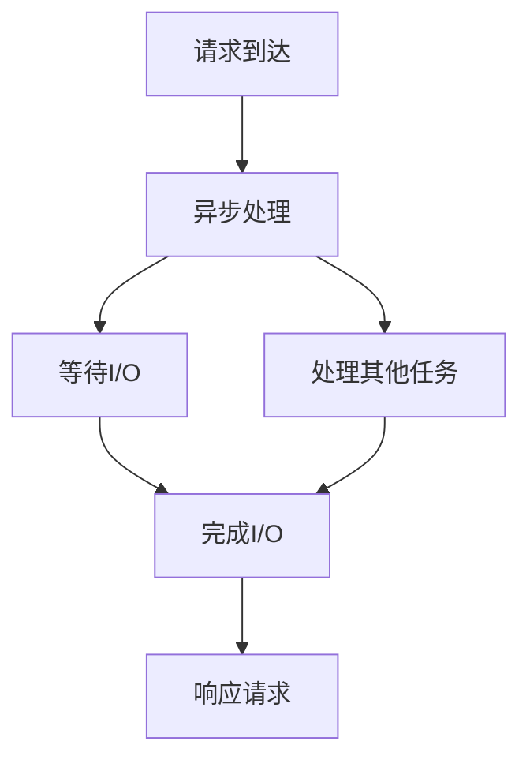
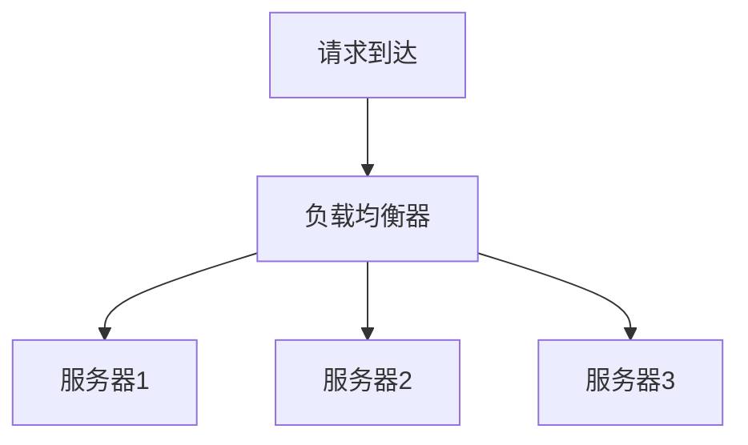
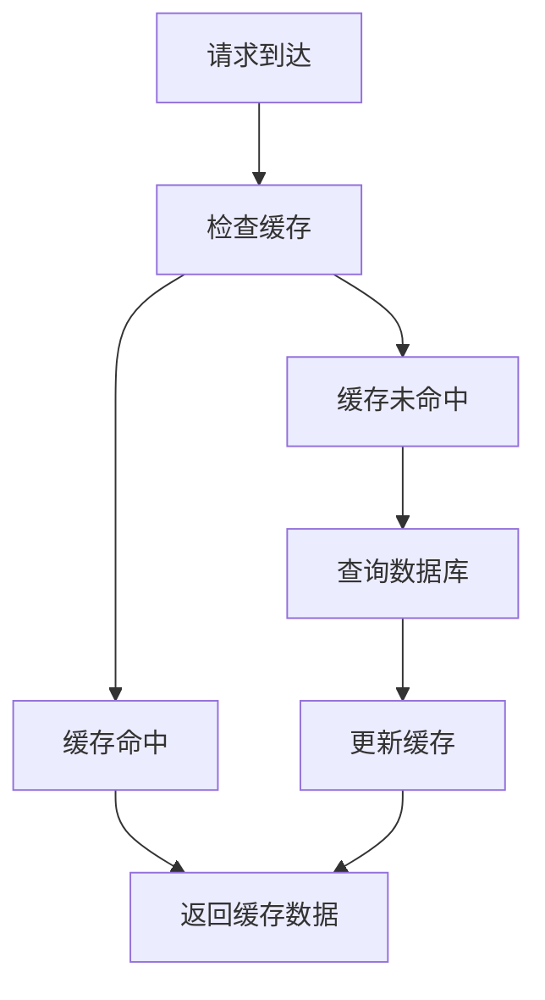
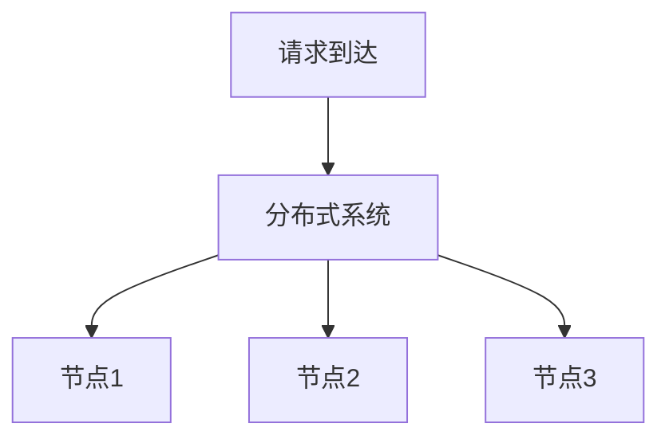

# 高并发服务、微服务架构设计和实现

## 1.背景介绍

在当今互联网时代，用户对应用程序的响应速度和可靠性要求越来越高。高并发服务和微服务架构成为解决这些问题的关键技术。高并发服务旨在处理大量同时到来的请求，而微服务架构则通过将应用程序拆分为多个独立的服务来提高系统的可扩展性和维护性。

## 2.核心概念与联系

### 2.1 高并发服务

高并发服务是指系统能够同时处理大量请求的能力。其核心目标是通过优化资源利用率和减少响应时间来提高系统的吞吐量。常见的高并发技术包括异步编程、负载均衡、缓存和分布式系统。

### 2.2 微服务架构

微服务架构是一种软件设计模式，将单一应用程序拆分为多个小型、独立的服务。每个服务都可以独立部署和扩展，并通过轻量级的通信机制（如HTTP/REST、消息队列）进行交互。微服务架构的优点包括提高系统的可扩展性、灵活性和容错性。

### 2.3 高并发服务与微服务架构的联系

高并发服务和微服务架构在设计目标上有很大的重叠。微服务架构通过将应用程序拆分为多个独立的服务，可以更容易地实现高并发服务。每个微服务可以独立扩展，从而提高系统的整体并发处理能力。

## 3.核心算法原理具体操作步骤

### 3.1 异步编程

异步编程是实现高并发服务的关键技术之一。通过异步编程，系统可以在等待I/O操作完成时继续处理其他任务，从而提高资源利用率。



### 3.2 负载均衡

负载均衡是将请求分配到多个服务器上的技术，以提高系统的吞吐量和可靠性。常见的负载均衡算法包括轮询、最小连接数和一致性哈希。



### 3.3 缓存

缓存是通过存储频繁访问的数据来减少数据库查询次数和响应时间的技术。常见的缓存策略包括LRU（最近最少使用）和LFU（最不常用）。



### 3.4 分布式系统

分布式系统通过将任务分配到多个节点上来提高系统的并发处理能力和容错性。常见的分布式系统技术包括分布式数据库、分布式文件系统和分布式计算框架。



## 4.数学模型和公式详细讲解举例说明

### 4.1 高并发服务的数学模型

高并发服务的性能可以通过以下公式来描述：

$$
T = \frac{N}{C}
$$

其中，$T$ 是系统的响应时间，$N$ 是并发请求数，$C$ 是系统的处理能力（每秒处理的请求数）。

### 4.2 负载均衡算法

#### 4.2.1 轮询算法

轮询算法将请求依次分配到每个服务器上。假设有 $n$ 台服务器，第 $i$ 个请求将分配到第 $(i \mod n)$ 台服务器。

#### 4.2.2 最小连接数算法

最小连接数算法将请求分配到当前连接数最少的服务器上。假设有 $n$ 台服务器，$L_i$ 表示第 $i$ 台服务器的当前连接数，则请求将分配到满足以下条件的服务器上：

$$
i = \arg\min_{j} L_j
$$

#### 4.2.3 一致性哈希算法

一致性哈希算法通过哈希函数将请求分配到特定的服务器上。假设有 $n$ 台服务器，$H$ 表示哈希函数，$K$ 表示请求的键，则请求将分配到满足以下条件的服务器上：

$$
i = H(K) \mod n
$$

### 4.3 缓存策略

#### 4.3.1 LRU（最近最少使用）算法

LRU算法将最近最少使用的数据从缓存中移除。假设缓存容量为 $C$，当前缓存中的数据为 $D$，则当缓存满时，将移除满足以下条件的数据：

$$
d = \arg\min_{x \in D} \text{last\_access\_time}(x)
$$

#### 4.3.2 LFU（最不常用）算法

LFU算法将最不常用的数据从缓存中移除。假设缓存容量为 $C$，当前缓存中的数据为 $D$，则当缓存满时，将移除满足以下条件的数据：

$$
d = \arg\min_{x \in D} \text{access\_count}(x)
$$

## 5.项目实践：代码实例和详细解释说明

### 5.1 异步编程示例

以下是一个使用Python的异步编程示例，展示了如何处理高并发请求：

```python
import asyncio

async def handle_request(request):
    await asyncio.sleep(1)  # 模拟I/O操作
    return f"Response for {request}"

async def main():
    requests = [f"Request {i}" for i in range(10)]
    tasks = [handle_request(request) for request in requests]
    responses = await asyncio.gather(*tasks)
    for response in responses:
        print(response)

asyncio.run(main())
```

### 5.2 负载均衡示例

以下是一个使用Nginx配置负载均衡的示例：

```nginx
http {
    upstream backend {
        server backend1.example.com;
        server backend2.example.com;
        server backend3.example.com;
    }

    server {
        listen 80;
        location / {
            proxy_pass http://backend;
        }
    }
}
```

### 5.3 缓存示例

以下是一个使用Redis实现缓存的示例：

```python
import redis

cache = redis.StrictRedis(host='localhost', port=6379, db=0)

def get_data(key):
    data = cache.get(key)
    if data is None:
        data = query_database(key)  # 模拟数据库查询
        cache.set(key, data)
    return data
```

### 5.4 分布式系统示例

以下是一个使用Apache Kafka实现分布式消息队列的示例：

```python
from kafka import KafkaProducer, KafkaConsumer

producer = KafkaProducer(bootstrap_servers='localhost:9092')
consumer = KafkaConsumer('my_topic', bootstrap_servers='localhost:9092')

# 生产消息
producer.send('my_topic', b'Hello, Kafka!')

# 消费消息
for message in consumer:
    print(message.value)
```

## 6.实际应用场景

### 6.1 电商平台

电商平台需要处理大量的用户请求和交易操作。通过使用高并发服务和微服务架构，可以提高系统的响应速度和可靠性。例如，用户请求可以通过负载均衡分配到多个服务器上，商品信息可以通过缓存加速访问，订单处理可以通过异步编程提高效率。

### 6.2 社交媒体

社交媒体平台需要处理大量的用户互动和内容发布。通过使用高并发服务和微服务架构，可以提高系统的可扩展性和容错性。例如，用户发布的内容可以通过分布式系统进行存储和处理，用户请求可以通过负载均衡分配到多个服务器上。

### 6.3 在线游戏

在线游戏需要处理大量的玩家请求和实时互动。通过使用高并发服务和微服务架构，可以提高系统的响应速度和可靠性。例如，游戏服务器可以通过负载均衡分配玩家请求，游戏数据可以通过缓存加速访问，游戏逻辑可以通过异步编程提高效率。

## 7.工具和资源推荐

### 7.1 异步编程工具

- Python asyncio
- Node.js
- Java CompletableFuture

### 7.2 负载均衡工具

- Nginx
- HAProxy
- AWS Elastic Load Balancing

### 7.3 缓存工具

- Redis
- Memcached
- Apache Ignite

### 7.4 分布式系统工具

- Apache Kafka
- Apache Zookeeper
- Apache Hadoop

## 8.总结：未来发展趋势与挑战

高并发服务和微服务架构在现代软件开发中扮演着重要角色。随着技术的不断发展，未来的趋势包括：

- **无服务器架构**：通过无服务器架构，可以进一步简化微服务的部署和管理，提高系统的可扩展性和灵活性。
- **边缘计算**：通过边缘计算，可以将计算资源分布到更接近用户的位置，从而提高系统的响应速度和可靠性。
- **人工智能和机器学习**：通过人工智能和机器学习，可以进一步优化高并发服务和微服务架构的性能和可靠性。

然而，随着技术的不断发展，也面临着一些挑战：

- **复杂性管理**：随着系统规模的扩大，管理和维护高并发服务和微服务架构的复杂性也在增加。
- **安全性**：高并发服务和微服务架构需要处理大量的用户数据，如何保证数据的安全性和隐私性是一个重要的挑战。
- **性能优化**：随着用户需求的不断增加，如何进一步优化高并发服务和微服务架构的性能是一个持续的挑战。

## 9.附录：常见问题与解答

### 9.1 高并发服务和微服务架构的区别是什么？

高并发服务关注的是系统在处理大量请求时的性能和可靠性，而微服务架构关注的是系统的可扩展性和灵活性。两者可以结合使用，通过将应用程序拆分为多个独立的服务来实现高并发处理。

### 9.2 如何选择合适的负载均衡算法？

选择负载均衡算法需要根据具体的应用场景和需求来决定。轮询算法适用于请求量较均匀的场景，最小连接数算法适用于请求量不均匀的场景，一致性哈希算法适用于需要持久连接的场景。

### 9.3 如何优化缓存策略？

优化缓存策略需要根据具体的应用场景和数据访问模式来决定。LRU算法适用于数据访问频率较高的场景，LFU算法适用于数据访问频率较低的场景。此外，可以结合使用多级缓存和分布式缓存来进一步提高缓存的命中率和性能。

### 9.4 如何处理分布式系统中的数据一致性问题？

处理分布式系统中的数据一致性问题可以通过使用分布式事务、数据复制和一致性算法（如Paxos、Raft）来实现。此外，可以根据具体的应用场景选择合适的一致性模型（如强一致性、最终一致性）来平衡数据一致性和系统性能。

### 9.5 如何监控和调试高并发服务和微服务架构？

监控和调试高并发服务和微服务架构可以通过使用分布式追踪、日志分析和性能监控工具来实现。常见的工具包括Prometheus、Grafana、Jaeger和ELK（Elasticsearch、Logstash、Kibana）等。

---

作者：禅与计算机程序设计艺术 / Zen and the Art of Computer Programming