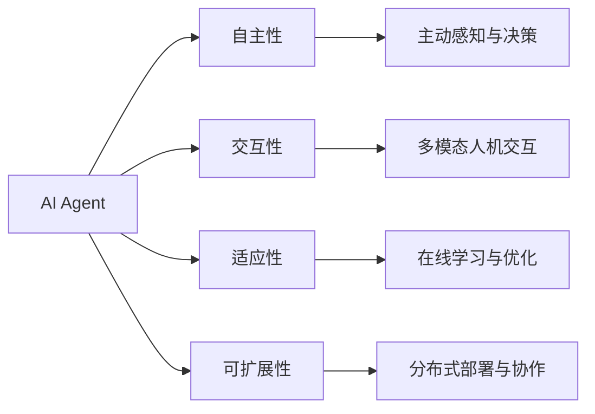

# AI Agent: AI的下一个风口 从软件到硬件的进化

## 1. 背景介绍
### 1.1 人工智能的发展历程
#### 1.1.1 人工智能的起源与早期发展
#### 1.1.2 人工智能的三次浪潮
#### 1.1.3 当前人工智能的现状与局限

### 1.2 AI Agent的概念与兴起
#### 1.2.1 AI Agent的定义与特点  
#### 1.2.2 AI Agent的发展背景
#### 1.2.3 AI Agent的潜在价值与应用前景

## 2. 核心概念与联系
### 2.1 AI Agent的核心概念
#### 2.1.1 自主性(Autonomy)
#### 2.1.2 交互性(Interactivity)
#### 2.1.3 适应性(Adaptability)
#### 2.1.4 可扩展性(Scalability)

### 2.2 AI Agent与传统AI系统的区别
#### 2.2.1 从被动响应到主动交互
#### 2.2.2 从特定领域到通用智能
#### 2.2.3 从软件系统到硬件实体

### 2.3 AI Agent与其他相关概念的联系
#### 2.3.1 AI Agent与机器人的关系
#### 2.3.2 AI Agent与物联网的融合
#### 2.3.3 AI Agent在元宇宙中的角色

## 3. 核心算法原理具体操作步骤
### 3.1 强化学习(Reinforcement Learning)
#### 3.1.1 马尔可夫决策过程(Markov Decision Process)
#### 3.1.2 Q-Learning算法
#### 3.1.3 策略梯度(Policy Gradient)算法

### 3.2 多智能体系统(Multi-Agent System) 
#### 3.2.1 博弈论基础
#### 3.2.2 合作与竞争机制
#### 3.2.3 分布式决策与协调

### 3.3 迁移学习(Transfer Learning)
#### 3.3.1 域自适应(Domain Adaptation) 
#### 3.3.2 元学习(Meta Learning)
#### 3.3.3 零样本学习(Zero-Shot Learning)

## 4. 数学模型和公式详细讲解举例说明
### 4.1 强化学习中的贝尔曼方程(Bellman Equation)
$$V(s)=\max _{a} \sum_{s^{\prime}, r} p\left(s^{\prime}, r \mid s, a\right)\left[r+\gamma V\left(s^{\prime}\right)\right]$$

### 4.2 策略梯度定理(Policy Gradient Theorem)  
$$\nabla_{\theta} J(\theta)=\mathbb{E}_{\tau \sim p_{\theta}(\tau)}\left[\sum_{t=0}^{T} \nabla_{\theta} \log \pi_{\theta}\left(a_{t} \mid s_{t}\right) Q^{\pi_{\theta}}\left(s_{t}, a_{t}\right)\right]$$

### 4.3 元学习中的MAML算法(Model-Agnostic Meta-Learning)
$$\theta^{\prime}=\theta-\alpha \nabla_{\theta} \mathcal{L}_{\mathcal{T}_{i}}\left(f_{\theta}\right)$$

## 5. 项目实践：代码实例和详细解释说明
### 5.1 使用PyTorch实现DQN算法
```python
import torch
import torch.nn as nn
import torch.optim as optim

class DQN(nn.Module):
    def __init__(self, state_dim, action_dim):
        super(DQN, self).__init__()
        self.fc1 = nn.Linear(state_dim, 64)
        self.fc2 = nn.Linear(64, 64)
        self.fc3 = nn.Linear(64, action_dim)

    def forward(self, x):
        x = torch.relu(self.fc1(x))
        x = torch.relu(self.fc2(x)) 
        x = self.fc3(x)
        return x
```

### 5.2 使用TensorFlow实现MADDPG算法
```python
import tensorflow as tf

class Actor(tf.keras.Model):
    def __init__(self, state_dim, action_dim):
        super(Actor, self).__init__()
        self.fc1 = tf.keras.layers.Dense(64, activation='relu')
        self.fc2 = tf.keras.layers.Dense(64, activation='relu')
        self.fc3 = tf.keras.layers.Dense(action_dim, activation='tanh')

    def call(self, x):
        x = self.fc1(x)
        x = self.fc2(x)
        x = self.fc3(x)
        return x

class Critic(tf.keras.Model):
    def __init__(self, state_dim, action_dim):
        super(Critic, self).__init__()
        self.fc1 = tf.keras.layers.Dense(64, activation='relu')
        self.fc2 = tf.keras.layers.Dense(64, activation='relu')
        self.fc3 = tf.keras.layers.Dense(1, activation='linear')

    def call(self, x, a):
        x = tf.concat([x, a], axis=-1)
        x = self.fc1(x)
        x = self.fc2(x)
        x = self.fc3(x)
        return x  
```

## 6. 实际应用场景
### 6.1 智能客服与个人助理
#### 6.1.1 自然语言理解与生成
#### 6.1.2 个性化推荐与服务
#### 6.1.3 情感计算与共情交互

### 6.2 自动驾驶与智能交通
#### 6.2.1 环境感知与决策规划
#### 6.2.2 车路协同与车联网
#### 6.2.3 交通流预测与优化调度

### 6.3 智慧城市与智能建筑
#### 6.3.1 城市数据融合与分析
#### 6.3.2 智能设备管理与节能优化
#### 6.3.3 应急响应与公共安全  

## 7. 工具和资源推荐
### 7.1 主流深度学习框架
#### 7.1.1 TensorFlow
#### 7.1.2 PyTorch
#### 7.1.3 MindSpore

### 7.2 强化学习平台
#### 7.2.1 OpenAI Gym
#### 7.2.2 DeepMind Lab
#### 7.2.3 MuJoCo

### 7.3 开源项目与学习资源
#### 7.3.1 Stable Baselines
#### 7.3.2 RLlib
#### 7.3.3 Spinning Up in Deep RL

## 8. 总结：未来发展趋势与挑战
### 8.1 AI Agent的发展趋势
#### 8.1.1 多模态感知与交互
#### 8.1.2 大规模分布式协作
#### 8.1.3 人机混合增强智能

### 8.2 AI Agent面临的挑战
#### 8.2.1 算法的可解释性与可信性
#### 8.2.2 数据隐私与安全
#### 8.2.3 伦理与法律问题

### 8.3 AI Agent的未来展望
#### 8.3.1 赋能传统行业转型升级
#### 8.3.2 催生新业态与商业模式
#### 8.3.3 重塑人机关系与社会形态

## 9. 附录：常见问题与解答
### 9.1 如何平衡AI Agent的自主性与可控性？
### 9.2 多个AI Agent之间如何实现高效协作？
### 9.3 如何评估AI Agent的性能与安全性？



AI Agent作为人工智能领域的新兴方向，代表了未来AI从单纯的软件系统向具备感知、交互、决策能力的智能硬件载体进化的趋势。通过融合强化学习、多智能体系统、迁移学习等前沿算法，AI Agent能够在复杂多变的现实环境中展现出色的自主学习与适应能力，在智能客服、自动驾驶、智慧城市等诸多场景中得到广泛应用。

然而，AI Agent的发展仍面临诸多挑战，如算法的可解释性、数据安全与隐私保护、伦理与法律问题等。这需要产学研各界通力合作，在不断突破技术瓶颈的同时，也要审慎评估其潜在风险，制定相应的标准规范，确保AI Agent技术造福人类社会。

展望未来，AI Agent有望成为人工智能商业化落地的关键抓手，赋能传统行业数字化转型升级，催生出更多创新业态与应用场景。同时，AI Agent也将深刻影响甚至重塑人机关系与社会形态，开启人类社会的全新篇章。让我们拭目以待，共同见证这场从软件到硬件的AI进化之旅。

作者：禅与计算机程序设计艺术 / Zen and the Art of Computer Programming