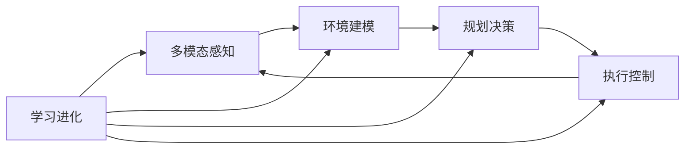

# AI Agent: AI的下一个风口 具身智能的核心与未来

## 1. 背景介绍
### 1.1 人工智能发展历程回顾
#### 1.1.1 早期人工智能的探索
#### 1.1.2 机器学习的崛起 
#### 1.1.3 深度学习的突破

### 1.2 人工智能的局限性
#### 1.2.1 缺乏常识推理能力
#### 1.2.2 缺乏环境感知交互能力
#### 1.2.3 缺乏自主学习能力

### 1.3 具身智能的提出
#### 1.3.1 具身智能的定义
#### 1.3.2 具身智能的研究意义
#### 1.3.3 具身智能的发展现状

## 2. 核心概念与联系
### 2.1 具身智能的核心概念
#### 2.1.1 感知-行动循环
#### 2.1.2 环境交互学习
#### 2.1.3 多模态信息融合

### 2.2 具身智能与其他AI技术的联系
#### 2.2.1 与深度学习的结合
#### 2.2.2 与强化学习的结合
#### 2.2.3 与计算机视觉、自然语言处理等技术的结合

### 2.3 具身智能的关键技术
#### 2.3.1 环境建模与仿真
#### 2.3.2 多模态感知与融合
#### 2.3.3 行动规划与控制

## 3. 核心算法原理具体操作步骤
### 3.1 深度强化学习算法
#### 3.1.1 Q-Learning
#### 3.1.2 Deep Q-Network (DQN)
#### 3.1.3 Policy Gradient 

### 3.2 多模态信息融合算法
#### 3.2.1 注意力机制
#### 3.2.2 多模态自编码器
#### 3.2.3 多模态对抗学习

### 3.3 环境交互学习算法
#### 3.3.1 模仿学习
#### 3.3.2 元学习
#### 3.3.3 主动学习

## 4. 数学模型和公式详细讲解举例说明
### 4.1 马尔可夫决策过程(MDP)
MDP是强化学习的数学基础,由状态集合S,行动集合A,状态转移概率P,奖励函数R和折扣因子γ组成。
$$MDP=\langle S,A,P,R,\gamma \rangle$$

### 4.2 Bellman方程
Bellman方程是求解MDP的核心,表示当前状态的最优价值等于立即奖励和下一状态最优价值的折现和。
$$V^*(s)=\max\limits_{a \in A} \left\{ R(s,a)+\gamma \sum_{s'\in S}P(s'|s,a)V^*(s') \right\}$$

### 4.3 策略梯度定理
策略梯度定理给出了如何沿着策略梯度方向更新策略参数θ,以最大化期望回报。
$$\nabla_\theta J(\theta) = \mathbb{E}_{\tau \sim p_\theta(\tau)}\left[\sum_{t=0}^{T}\nabla_\theta \log \pi_\theta(a_t|s_t)Q^{\pi_\theta}(s_t,a_t)\right]$$

## 5. 项目实践：代码实例和详细解释说明
### 5.1 基于OpenAI Gym的强化学习代码实例
```python
import gym
import numpy as np

env = gym.make('CartPole-v0')

def q_learning(env, num_episodes, discount_factor=1.0, alpha=0.5, epsilon=0.1):
    Q = np.zeros((env.observation_space.n, env.action_space.n))
    
    for i in range(num_episodes):
        state = env.reset()
        done = False
        
        while not done:
            if np.random.rand() < epsilon:
                action = env.action_space.sample()  
            else:
                action = np.argmax(Q[state])
            
            next_state, reward, done, _ = env.step(action)
            
            Q[state, action] += alpha * (reward + discount_factor * np.max(Q[next_state]) - Q[state, action])
            
            state = next_state
        
    return Q

Q = q_learning(env, 5000)
```

代码解释:
1. 创建一个CartPole环境实例env。
2. 定义q_learning函数,输入为环境env,训练轮数num_episodes,折扣因子discount_factor,学习率alpha和探索率epsilon。
3. 初始化Q表为全0矩阵,大小为状态空间乘以动作空间。
4. 循环num_episodes轮,每轮重置环境,获得初始状态state。
5. 在每个episode内,根据epsilon-greedy策略选择动作action,执行动作得到下一状态next_state和奖励reward。
6. 根据Q-Learning的更新公式更新Q表,将当前状态-动作对的Q值朝着TD目标(reward+discount_factor*max(Q(next_state))的方向更新。
7. 更新当前状态为next_state,直到episode结束。
8. 返回学到的最优Q表。

### 5.2 基于PyTorch的多模态融合代码实例
```python
import torch
import torch.nn as nn

class MultimodalAutoencoder(nn.Module):
    def __init__(self, input_size, hidden_size, latent_size):
        super(MultimodalAutoencoder, self).__init__()
        
        self.encoder = nn.Sequential(
            nn.Linear(input_size, hidden_size),
            nn.ReLU(),
            nn.Linear(hidden_size, latent_size)
        )
        
        self.decoder = nn.Sequential(
            nn.Linear(latent_size, hidden_size),
            nn.ReLU(),
            nn.Linear(hidden_size, input_size)
        )

    def forward(self, x):
        z = self.encoder(x)
        x_recon = self.decoder(z)
        return x_recon, z
        
model = MultimodalAutoencoder(1000, 500, 100)
criterion = nn.MSELoss()
optimizer = torch.optim.Adam(model.parameters())

for epoch in range(num_epochs):
    for batch in dataloader:
        img, text = batch
        img = img.view(img.size(0), -1)
        text = text.view(text.size(0), -1)
        x = torch.cat((img, text), dim=1)
        
        x_recon, z = model(x)
        
        loss = criterion(x_recon, x)
        
        optimizer.zero_grad()
        loss.backward()
        optimizer.step()
```

代码解释:
1. 定义了一个MultimodalAutoencoder类,包含编码器和解码器两部分,可以将多模态数据编码到共同的隐空间并重构。
2. 编码器由两个全连接层和ReLU激活函数组成,将输入数据映射到隐空间。 
3. 解码器也由两个全连接层和ReLU组成,将隐向量解码为重构的输入数据。
4. 在forward方法中,输入数据x经过编码器得到隐向量z,再通过解码器重构为x_recon。
5. 实例化一个模型,定义重构误差loss为MSE,优化器为Adam。
6. 在每个epoch中,遍历dataloader中的每个batch,将图像和文本数据拼接为一个向量x。
7. 将x输入到模型中,得到重构数据x_recon和隐向量z。
8. 计算重构误差loss,反向传播梯度并更新模型参数。

## 6. 实际应用场景
### 6.1 智能机器人
#### 6.1.1 家用服务机器人
#### 6.1.2 工业机器人
#### 6.1.3 医疗康复机器人

### 6.2 自动驾驶
#### 6.2.1 环境感知与建模
#### 6.2.2 路径规划与决策
#### 6.2.3 车辆控制

### 6.3 智能助理
#### 6.3.1 智能音箱
#### 6.3.2 智能客服
#### 6.3.3 智能教育助手

## 7. 工具和资源推荐
### 7.1 开发平台与框架
#### 7.1.1 OpenAI Gym
#### 7.1.2 Unity ML-Agents
#### 7.1.3 PyTorch
#### 7.1.4 TensorFlow

### 7.2 开源项目与数据集
#### 7.2.1 DeepMind Control Suite
#### 7.2.2 Robotics Datasets
#### 7.2.3 Mujoco
#### 7.2.4 Habitat

### 7.3 学习资源
#### 7.3.1 Reinforcement Learning: An Introduction
#### 7.3.2 Deep Reinforcement Learning Hands-On
#### 7.3.3 Multimodal Machine Learning
#### 7.3.4 CS294-112 Deep Reinforcement Learning

## 8. 总结：未来发展趋势与挑战
### 8.1 具身智能的发展趋势
#### 8.1.1 多模态感知与决策的深度融合
#### 8.1.2 持续学习与自主探索能力的提升
#### 8.1.3 仿生机理与认知科学的结合

### 8.2 具身智能面临的挑战
#### 8.2.1 样本效率与泛化能力
#### 8.2.2 安全性与可解释性
#### 8.2.3 伦理与法律问题

### 8.3 展望
#### 8.3.1 人机协作与共生
#### 8.3.2 类人认知与智能
#### 8.3.3 具身智能的产业化应用

## 9. 附录：常见问题与解答
### 9.1 什么是具身智能?与传统人工智能有何不同?
具身智能是指赋予人工智能系统以物理实体,使其能够通过自主地感知、交互、学习来提升智能的一种范式。与传统人工智能相比,具身智能更加强调感知-行动的循环,通过与物理环境的实时交互来学习和进化,具有更强的适应性和鲁棒性。

### 9.2 具身智能需要哪些关键技术?
具身智能需要机器人技术、深度学习、强化学习、计算机视觉、自然语言处理等多个领域的交叉融合。其中,多模态感知、环境建模、运动规划与控制、持续学习是其核心关键技术。

### 9.3 具身智能能够达到什么样的智能水平?是否会取代人类?
具身智能的目标是使机器在感知、认知、决策、执行等方面达到甚至超越人类的水平,但这是一个长期的过程。具身智能是为了扩展和增强人类智能,与人类协同共生,而非取代人类。我们要发挥人机互补的优势,让具身智能成为人类的得力助手。



以上是对具身智能的核心概念原理和架构的一个总结性的流程图。具身智能agent通过多模态感知获取环境信息,在内部建立起环境模型,并基于环境模型进行规划决策,生成行动指令去控制执行器与环境交互。同时,整个系统在这个感知-建模-决策-控制的闭环中不断学习和进化,以提升感知、建模、决策、控制的性能,实现持续学习和自主探索。这是一个动态循环迭代的过程,使得具身智能agent能够在开放环境中自适应地完成复杂任务。

具身智能作为人工智能的下一个重要方向和突破口,融合了多个领域的前沿技术,具有广阔的研究前景和应用潜力。它不仅能大幅提升机器人等智能系统的感知、认知、决策与控制能力,实现更加智能、自主、鲁棒的行为,还将深刻影响和改变生产生活的诸多方面,推动人机协同、万物智联的智能社会的形成。但同时具身智能也面临诸多挑战,如样本效率、安全性、可解释性等,需要学界和业界的共同努力。展望未来,具身智能将引领新一轮人工智能革命,驱动颠覆性创新,让机器成为人类智慧的延伸和拓展,共创人机共生的美好世界。

作者：禅与计算机程序设计艺术 / Zen and the Art of Computer Programming