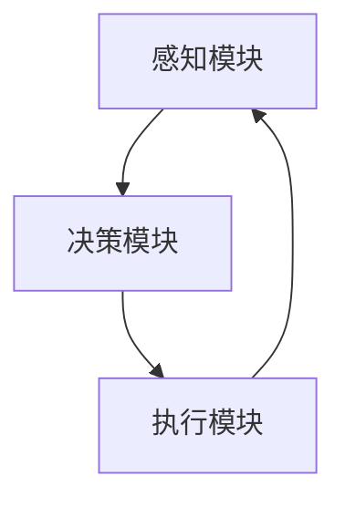

# AI Agent: AI的下一个风口 智能体与未来的关系

## 1.背景介绍

### 1.1 人工智能的演变

人工智能（AI）自诞生以来，经历了多次技术革新和应用场景的扩展。从最初的规则系统到如今的深度学习，AI技术已经在多个领域取得了显著的进展。随着计算能力的提升和数据量的爆炸性增长，AI的应用范围不断扩大，涵盖了从图像识别、自然语言处理到自动驾驶等多个领域。

### 1.2 智能体的概念

智能体（AI Agent）是AI技术的一个重要分支，指的是能够自主感知环境、做出决策并执行行动的系统。智能体不仅仅是被动的工具，而是具有一定自主性的“智能实体”。它们可以在复杂的环境中进行学习和适应，从而完成特定的任务。

### 1.3 智能体的兴起

随着AI技术的不断进步，智能体的应用前景变得越来越广阔。无论是在工业自动化、智能家居，还是在金融、医疗等领域，智能体都展现出了巨大的潜力。智能体的兴起标志着AI技术从单一任务的解决方案向多任务、多场景的综合解决方案的转变。

## 2.核心概念与联系

### 2.1 智能体的定义

智能体是一个能够感知其环境并采取行动以实现特定目标的系统。它通常由感知模块、决策模块和执行模块组成。感知模块负责收集环境信息，决策模块根据收集的信息做出决策，执行模块则负责执行决策。

### 2.2 智能体与传统AI的区别

传统AI系统通常是为特定任务设计的，缺乏自主性和适应性。而智能体则具有更高的自主性和适应性，能够在动态环境中进行学习和调整。智能体不仅能够完成特定任务，还能够在任务执行过程中不断优化自身的行为策略。

### 2.3 智能体的分类

智能体可以根据其自主性和复杂性进行分类。简单的智能体通常只具备基本的感知和执行能力，而复杂的智能体则能够进行高级的决策和学习。例如，基于规则的智能体、基于机器学习的智能体和基于强化学习的智能体等。

### 2.4 智能体的架构

智能体的架构通常包括感知模块、决策模块和执行模块。以下是一个典型的智能体架构的Mermaid流程图：



## 3.核心算法原理具体操作步骤

### 3.1 感知模块

感知模块负责收集环境信息，通常包括传感器数据、用户输入等。感知模块的核心算法包括数据预处理、特征提取和数据融合等。

### 3.2 决策模块

决策模块是智能体的核心，负责根据感知模块收集的信息做出决策。决策模块的核心算法包括规则引擎、机器学习算法和强化学习算法等。

### 3.3 执行模块

执行模块负责执行决策模块的决策，通常包括控制指令的生成和执行。执行模块的核心算法包括运动控制、任务调度和资源管理等。

### 3.4 强化学习算法

强化学习是智能体决策模块中常用的一种算法。其核心思想是通过与环境的交互，不断优化策略以最大化累积奖励。以下是强化学习算法的具体操作步骤：

1. 初始化策略和价值函数。
2. 在环境中执行动作，观察结果和奖励。
3. 更新策略和价值函数。
4. 重复步骤2和3，直到策略收敛。

## 4.数学模型和公式详细讲解举例说明

### 4.1 强化学习的数学模型

强化学习的数学模型通常包括状态空间、动作空间、奖励函数和策略函数。以下是强化学习的基本公式：

$$
Q(s, a) = \mathbb{E}[r + \gamma \max_{a'} Q(s', a')]
$$

其中，$Q(s, a)$ 表示在状态 $s$ 执行动作 $a$ 的价值，$r$ 表示即时奖励，$\gamma$ 表示折扣因子，$s'$ 表示下一状态，$a'$ 表示下一动作。

### 4.2 策略梯度算法

策略梯度算法是一种优化策略的算法，其核心思想是通过梯度上升法优化策略参数。以下是策略梯度算法的基本公式：

$$
\nabla J(\theta) = \mathbb{E}[\nabla \log \pi_\theta(a|s) Q(s, a)]
$$

其中，$J(\theta)$ 表示策略的期望回报，$\pi_\theta(a|s)$ 表示在状态 $s$ 下选择动作 $a$ 的概率，$Q(s, a)$ 表示动作 $a$ 在状态 $s$ 下的价值。

### 4.3 实例说明

假设我们有一个简单的迷宫问题，智能体需要找到从起点到终点的最短路径。我们可以使用强化学习算法来解决这个问题。首先，我们定义状态空间为迷宫的每一个位置，动作空间为上下左右四个方向，奖励函数为到达终点时的奖励为1，其余为0。然后，我们使用Q-learning算法来优化策略，最终智能体能够找到最短路径。

## 5.项目实践：代码实例和详细解释说明

### 5.1 环境搭建

首先，我们需要搭建一个强化学习的环境。可以使用Python和OpenAI Gym库来实现。以下是环境搭建的代码示例：

```python
import gym

# 创建迷宫环境
env = gym.make('FrozenLake-v0')

# 初始化环境
state = env.reset()
```

### 5.2 Q-learning算法实现

接下来，我们实现Q-learning算法。以下是Q-learning算法的代码示例：

```python
import numpy as np

# 初始化Q表
Q = np.zeros([env.observation_space.n, env.action_space.n])

# 设置参数
alpha = 0.1
gamma = 0.99
epsilon = 0.1

# 训练智能体
for episode in range(1000):
    state = env.reset()
    done = False
    while not done:
        if np.random.rand() < epsilon:
            action = env.action_space.sample()
        else:
            action = np.argmax(Q[state])
        next_state, reward, done, _ = env.step(action)
        Q[state, action] = Q[state, action] + alpha * (reward + gamma * np.max(Q[next_state]) - Q[state, action])
        state = next_state
```

### 5.3 结果分析

训练完成后，我们可以测试智能体的表现。以下是测试代码示例：

```python
state = env.reset()
done = False
while not done:
    action = np.argmax(Q[state])
    state, reward, done, _ = env.step(action)
    env.render()
```

通过上述代码，我们可以看到智能体在迷宫中找到最短路径的过程。

## 6.实际应用场景

### 6.1 工业自动化

在工业自动化领域，智能体可以用于自动化生产线的控制和优化。通过感知生产线的状态，智能体可以实时调整生产参数，提高生产效率和产品质量。

### 6.2 智能家居

在智能家居领域，智能体可以用于家庭设备的自动化控制。例如，智能体可以根据用户的习惯和环境条件，自动调节空调、照明和安防系统，提供更加舒适和安全的居住环境。

### 6.3 金融领域

在金融领域，智能体可以用于自动化交易和风险管理。通过分析市场数据和交易历史，智能体可以实时做出交易决策，优化投资组合，降低投资风险。

### 6.4 医疗领域

在医疗领域，智能体可以用于疾病诊断和治疗方案的推荐。通过分析患者的病历和医疗数据，智能体可以提供个性化的诊断和治疗建议，提高医疗服务的质量和效率。

## 7.工具和资源推荐

### 7.1 开发工具

- **Python**：Python是实现智能体的常用编程语言，具有丰富的库和工具支持。
- **OpenAI Gym**：OpenAI Gym是一个用于开发和比较强化学习算法的工具包，提供了多种环境和接口。
- **TensorFlow**：TensorFlow是一个开源的机器学习框架，支持多种机器学习和深度学习算法。

### 7.2 学习资源

- **《强化学习：原理与实践》**：这本书详细介绍了强化学习的基本原理和算法，适合初学者和进阶学习者。
- **Coursera上的强化学习课程**：Coursera提供了多门关于强化学习的在线课程，涵盖了从基础到高级的内容。
- **OpenAI的博客和文档**：OpenAI的博客和文档提供了丰富的强化学习资源和实践案例。

## 8.总结：未来发展趋势与挑战

### 8.1 未来发展趋势

随着AI技术的不断进步，智能体的应用前景将更加广阔。未来，智能体将更加智能和自主，能够在更加复杂和动态的环境中进行学习和适应。智能体的应用将不仅限于工业自动化、智能家居、金融和医疗等领域，还将扩展到更多的领域，如教育、娱乐和公共服务等。

### 8.2 面临的挑战

尽管智能体具有广阔的应用前景，但其发展也面临着诸多挑战。首先，智能体的自主性和适应性需要进一步提高，以应对更加复杂和动态的环境。其次，智能体的安全性和可靠性需要得到保障，避免在关键任务中出现失误。最后，智能体的伦理和法律问题也需要得到重视，确保其应用符合社会的道德和法律规范。

## 9.附录：常见问题与解答

### 9.1 智能体与机器人有什么区别？

智能体和机器人虽然在某些方面有相似之处，但它们并不完全相同。智能体通常是指具有自主性和适应性的智能系统，可以是软件系统或硬件系统。而机器人通常是指具有物理实体的硬件系统，通常包括机械结构、传感器和控制系统。智能体可以嵌入到机器人中，为其提供智能决策和控制能力。

### 9.2 如何选择合适的智能体算法？

选择合适的智能体算法需要考虑多个因素，包括任务的复杂性、环境的动态性和计算资源的限制。对于简单的任务和静态环境，可以选择基于规则的算法。对于复杂的任务和动态环境，可以选择基于机器学习或强化学习的算法。此外，还需要考虑算法的可解释性和可扩展性。

### 9.3 智能体的训练需要多长时间？

智能体的训练时间取决于多个因素，包括任务的复杂性、环境的动态性和计算资源的限制。对于简单的任务和静态环境，训练时间可能较短，通常在几分钟到几小时之间。对于复杂的任务和动态环境，训练时间可能较长，通常在几天到几周之间。使用高性能计算资源和优化算法可以加速训练过程。

### 9.4 智能体的应用是否会取代人类工作？

智能体的应用可能会取代某些重复性和低技能的工作，但也会创造新的工作机会。智能体可以提高生产效率和服务质量，解放人类从事更加创造性和高价值的工作。关键在于如何合理利用智能体技术，促进社会的可持续发展和人类的全面发展。

---

作者：禅与计算机程序设计艺术 / Zen and the Art of Computer Programming