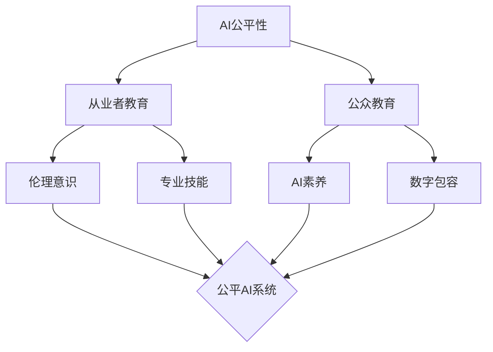

# AIFairness:教育与培训

## 1.背景介绍

### 1.1 人工智能公平性的重要性

人工智能(AI)技术在各个领域得到广泛应用,给社会生活带来巨大便利的同时,也引发了一系列伦理和公平性问题。AI系统可能会放大或perpetuate现有的社会偏见和不公平现象,导致某些群体受到歧视。因此,在开发和部署AI系统时,必须考虑公平性,确保每个人都能公平对待,不分种族、性别、年龄等因素。

### 1.2 教育在提高AI公平性中的作用

提高AI系统的公平性,需要多方努力。其中,教育和培训发挥着至关重要的作用。通过教育,我们可以提高AI从业者对伦理和公平性问题的认识,培养负责任的AI开发和使用习惯。同时,面向公众的AI素养教育,可以帮助大家了解AI的运作原理、局限性和潜在风险,成为AI时代的明白人。只有教育跟上,AI的发展才能更加包容、可持续。

## 2.核心概念与联系

### 2.1 AI公平性的内涵

AI公平性是指AI系统能够公平对待不同群体,避免基于敏感属性(如种族、性别)产生歧视,给每个个体提供平等的机会。它包含多个维度:
- **个体公平性**:类似情况下的个体应该得到类似的对待
- **群体公平性**:AI系统的决策结果在不同群体中的分布应当一致
- **结果公平性**:AI系统产生的影响和后果在不同群体中应当一致

### 2.2 教育与AI公平性的关系

教育是提高AI公平性不可或缺的手段。具体而言:
- 通过教育,可以提高AI从业者的伦理意识,使其在开发过程中更加重视公平性 
- 通过培训,可以传授AI从业者各种提高公平性的技术和方法
- 通过教育,可以提高全社会对AI的认知,营造有利于公平AI发展的环境
- 教育有助于缩小数字鸿沟,让每个人都有机会公平参与到AI时代中来

下图展示了教育在AI公平性生态系统中的重要地位:



## 3.核心算法原理具体操作步骤

为了让教育更好地服务于AI公平性事业,我们需要开发一系列教学算法和策略。下面以"基于群体公平性的纠偏算法"为例,介绍其原理和步骤。

### 3.1 基于群体公平性的纠偏算法原理

该算法旨在缓解AI系统中的群体不公平现象。其基本思路是:对不同群体的样本赋予不同的权重,对高风险群体进行过采样,从而使得模型对各个群体的预测结果分布一致。

### 3.2 算法步骤

1. 识别敏感属性:找出数据集中反映群体划分的敏感属性A
2. 评估群体公平性:计算模型在不同A取值下的预测结果分布差异
3. 确定权重:根据群体公平性评估结果,对每个样本赋予权重W,W与该样本所在群体的预测结果成反比
4. 重采样:根据权重W对原始数据集进行重采样,生成新的训练集
5. 训练模型:用重采样后的数据集重新训练模型
6. 评估:评估新模型的群体公平性和整体性能,必要时返回步骤3迭代

## 4.数学模型和公式详细讲解举例说明

### 4.1 数学模型

令D为原始数据集,A为敏感属性,Y为模型预测目标,$f_\theta$为模型。我们的目标是最小化重采样后的加权损失函数:

$$\mathop{\arg\min}_{\theta} \mathbb{E}_{(x,a,y)\sim D}[W(a)l(f_\theta(x), y)]$$

其中$W(a)$为样本权重,与a所在群体的风险成反比:

$$W(a)=\frac{1}{P(\hat{Y}=1|A=a)}$$

### 4.2 公式讲解

- $\mathbb{E}_{(x,a,y)\sim D}$表示对数据集D中的样本$(x,a,y)$取期望
- $l(f_\theta(x), y)$是模型$f_\theta$在样本x上的预测值与真实值y的损失
- $P(\hat{Y}=1|A=a)$表示模型在敏感属性A=a的群体中,预测结果为1的概率
- 样本权重$W(a)$与所在群体的风险预测概率成反比,风险高的群体样本将获得更大的权重

### 4.3 举例说明

假设有一个二元分类任务,敏感属性A有两个取值:a1和a2,模型$f_\theta$对两个群体的风险预测概率分别为0.8和0.4。则两个群体的样本权重分别为:

$$W(a1)=\frac{1}{0.8}=1.25$$
$$W(a2)=\frac{1}{0.4}=2.5$$

可见,风险更高的a2群体样本的权重是a1群体的2倍。以这种方式重采样,可以缓解模型的群体不公平性。

## 5.项目实践:代码实例和详细解释说明

下面用Python实现上述基于群体公平性的纠偏算法。

### 5.1 导入依赖包

```python
import numpy as np
from sklearn.datasets import load_iris
from sklearn.model_selection import train_test_split
from sklearn.metrics import accuracy_score
from sklearn.svm import SVC
```

### 5.2 加载数据集并划分敏感属性

```python
# 加载Iris数据集
X, y = load_iris(return_X_y=True)
# 将前两个特征作为敏感属性 
A = X[:, :2] > 0.5
```

### 5.3 定义权重函数

```python
def sample_weight(y, a):
    weight = np.zeros_like(y, dtype=float) 
    
    # 计算敏感属性取值组合的权重
    for a_val in np.unique(a, axis=0):
        mask = np.all(a==a_val, axis=1)
        weight[mask] = 1/y[mask].mean()
        
    return weight
```

### 5.4 训练和评估模型

```python
# 划分训练集和测试集
X_train, X_test, y_train, y_test, A_train, A_test = train_test_split(X, y, A)

# 计算训练集样本权重  
sw_train = sample_weight(y_train, A_train)

# 训练SVM模型
svc = SVC(kernel='linear')
svc.fit(X_train, y_train, sample_weight=sw_train) 

# 评估准确率
y_pred = svc.predict(X_test)
print("Test Accuracy: ", accuracy_score(y_test, y_pred))
```

### 5.5 代码解释

- 第1步:加载Iris数据集,并将前两个特征设为敏感属性A(二值化)
- 第2步:定义样本权重函数。对每种A的取值组合,根据对应的标签y均值计算权重
- 第3步:划分训练集和测试集,并计算训练样本权重
- 第4步:用样本权重训练SVM模型
- 第5步:在测试集上评估模型准确率

以上就是基于群体公平性纠偏的完整流程。实践中,还需要评估各群体的预测结果分布,以验证是否达到公平性要求。

## 6.实际应用场景

AI公平性教育可以应用于多个场景,例如:

### 6.1 高校教育

在计算机、数据科学等相关专业中开设AI伦理与公平性课程,培养学生的伦理意识和技术素养。课程内容可包括:
- AI伦理原则和框架
- 衡量和评估AI系统公平性的方法
- 提高AI公平性的技术和实践
- AI公平性的法律法规和标准

### 6.2 企业培训

对从事AI开发和应用的企业员工,定期开展AI公平性培训。培训可采取讲座、研讨会、在线课程等多种形式,内容侧重实操性和可落地性,如:
- 在实际项目中应用公平性评估和改进方法
- 建立有利于公平AI开发的流程和机制
- 学习业界最佳实践和经验教训

### 6.3 公众教育

面向普通大众,开展AI素养教育和宣传活动。目的是提高公众对AI的认知和判断力,营造有利于公平AI发展的社会环境。活动形式可包括:
- 科普讲座:用通俗易懂的方式介绍AI技术和公平性问题
- 体验活动:让公众亲身体验AI应用,感受其便利和局限 
- 公众参与:鼓励公众参与AI治理的讨论和决策过程

### 6.4 政策制定

为政策制定者提供AI公平性教育支持,提高其制定相关政策的能力。可采取的措施有:
- 举办AI公平性研讨会,邀请专家学者与政策制定者深入交流
- 成立AI公平性智库,为政策制定提供知识支持
- 开发AI公平性评估工具,帮助政策制定者审查拟出台政策的影响

## 7.工具和资源推荐

对于有志于投身AI公平性教育事业的人士,这里推荐一些有用的工具和资源:

### 7.1 学习资源
- 《公平感知的机器学习》(Fairness-Aware Machine Learning):[综述性学习材料](https://fairmlbook.org/)
- 《面向负责任的AI从业者的伦理课程》:[Google开设的免费在线课程](https://www.tensorflow.org/responsible_ai)
- FAT/ML:[一个致力于公平、问责、透明的ML的多学科研讨会](https://www.fatml.org/)

### 7.2 评估工具
- Aequitas:[开源的偏差和公平性审计工具](http://aequitas.dssg.io/)
- AI Fairness 360:[一个综合的AI公平性算法工具集](https://aif360.mybluemix.net/)
- Fairlearn:[基于Python的AI公平性评估和改进工具包](https://fairlearn.org/)

### 7.3 教学案例
- 芝加哥大学的[《机器学习公平性》课程](https://fairmlclass.github.io/)
- 加州大学伯克利分校的[《满足道德的机器学习》课程](https://c4e.berkeley.edu/)
- 麻省理工学院的[《负责任的计算》课程](https://mit-serc.pubpub.org/pub/responsible-computing/release/1)

希望这些资源能为您的AI公平性教育工作提供助力。让我们携手,共建一个更加公平的AI未来。

## 8.总结:未来发展趋势与挑战

AI公平性教育正在蓬勃发展,但仍面临诸多挑战。展望未来,我们既要看到光明的前景,也要直面现实的难题。

### 8.1 发展趋势

- 与STEM教育深度融合:AI伦理与公平将成为计算机、数据科学等专业教育的重要内容
- 教学方法创新:探索案例教学、体验式学习等新颖教学形式,提高教学效果  
- 多学科交叉:伦理学、社会学、法学等领域将更多参与到AI公平性教育中来
- 国际交流合作:不同国家和地区将加强AI公平性教育领域的对话与协作
- 终身教育:AI公平性教育将贯穿从业者职业生涯的全过程

### 8.2 面临的挑战

- 课程体系有待完善:如何设计系统、科学的AI公平性课程体系,尚无定论
- 师资力量亟需加强:既精通AI技术又具备伦理学素养的复合型师资十分稀缺
- 教学资源匮乏:缺乏权威的教材、案例库等教学资源,制约了教学质量的提升 
- 评估标准不明确:AI公平性教育成效的评估标准还不够清晰和量化
- 与实践脱节:教学内容如何紧密结合AI系统开发和应用的实际,是一大难题

### 8.3 未来展望

尽管困难重重,但我对AI公平性教育的未来充满信心。随着社会各界对AI公平性的日益重视,在