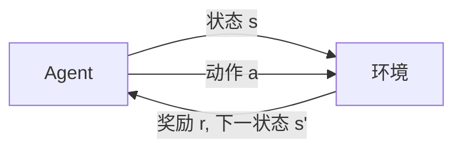

# AI人工智能 Agent：利用强化学习进行决策优化

## 1. 背景介绍
### 1.1 人工智能的发展历程
#### 1.1.1 早期人工智能
#### 1.1.2 专家系统时代  
#### 1.1.3 机器学习与深度学习崛起

### 1.2 强化学习的起源与发展
#### 1.2.1 马尔可夫决策过程
#### 1.2.2 时间差分学习
#### 1.2.3 深度强化学习的突破

### 1.3 强化学习在AI Agent中的应用价值
#### 1.3.1 自主学习与环境适应
#### 1.3.2 复杂决策问题的求解
#### 1.3.3 多Agent协作与竞争

## 2. 核心概念与联系
### 2.1 Agent与环境
#### 2.1.1 Agent的定义与属性
#### 2.1.2 环境的状态、动作与奖励
#### 2.1.3 Agent-环境交互循环

### 2.2 马尔可夫决策过程（MDP）
#### 2.2.1 MDP的数学定义 
#### 2.2.2 状态转移概率与奖励函数
#### 2.2.3 最优策略与值函数

### 2.3 探索与利用的平衡
#### 2.3.1 探索的必要性
#### 2.3.2 ε-贪婪策略
#### 2.3.3 上置信区间算法（UCB）

### 2.4 值函数近似
#### 2.4.1 值函数的作用
#### 2.4.2 线性值函数近似
#### 2.4.3 非线性值函数近似（神经网络）



## 3. 核心算法原理具体操作步骤
### 3.1 Q-Learning算法
#### 3.1.1 Q值的定义与更新
#### 3.1.2 Q-Learning的伪代码
#### 3.1.3 Q-Learning的收敛性证明

### 3.2 SARSA算法
#### 3.2.1 SARSA与Q-Learning的区别
#### 3.2.2 SARSA的伪代码
#### 3.2.3 SARSA的优缺点分析

### 3.3 Deep Q-Network（DQN）
#### 3.3.1 DQN的网络结构
#### 3.3.2 经验回放（Experience Replay）
#### 3.3.3 目标网络（Target Network）
#### 3.3.4 Double DQN

### 3.4 Policy Gradient算法
#### 3.4.1 策略梯度定理
#### 3.4.2 REINFORCE算法
#### 3.4.3 Actor-Critic算法

## 4. 数学模型和公式详细讲解举例说明
### 4.1 贝尔曼方程
#### 4.1.1 状态值函数的贝尔曼方程
$$V^{\pi}(s)=\sum_{a} \pi(a|s) \sum_{s',r}p(s',r|s,a)[r+\gamma V^{\pi}(s')]$$
#### 4.1.2 动作值函数的贝尔曼方程
$$Q^{\pi}(s,a)=\sum_{s',r}p(s',r|s,a)[r+\gamma \sum_{a'} \pi(a'|s') Q^{\pi}(s',a')]$$
#### 4.1.3 最优值函数的贝尔曼方程
$$V^{*}(s)=\max_{a} \sum_{s',r}p(s',r|s,a)[r+\gamma V^{*}(s')]$$
$$Q^{*}(s,a)=\sum_{s',r}p(s',r|s,a)[r+\gamma \max_{a'} Q^{*}(s',a')]$$

### 4.2 策略梯度定理
#### 4.2.1 期望累积奖励的梯度
$$\nabla_{\theta} J(\theta) = \mathbb{E}_{\tau \sim p_{\theta}(\tau)}[\sum_{t=0}^{T} \nabla_{\theta} \log \pi_{\theta}(a_t|s_t) R(\tau)]$$
其中，$\tau$ 表示一条轨迹，$R(\tau)$表示轨迹的累积奖励。
#### 4.2.2 策略梯度算法的更新规则
$$\theta \leftarrow \theta + \alpha \nabla_{\theta} J(\theta)$$

### 4.3 时序差分（TD）误差
#### 4.3.1 TD误差的定义
$$\delta_t = r_{t+1} + \gamma V(s_{t+1}) - V(s_t)$$
#### 4.3.2 TD学习的更新规则
$$V(s_t) \leftarrow V(s_t) + \alpha \delta_t$$

## 5. 项目实践：代码实例和详细解释说明
### 5.1 基于OpenAI Gym的强化学习环境
#### 5.1.1 安装与导入必要的库
```python
import gym
import numpy as np
```
#### 5.1.2 创建与重置环境
```python
env = gym.make('CartPole-v1')
state = env.reset()
```

### 5.2 Q-Learning算法实现
#### 5.2.1 初始化Q表
```python
Q = np.zeros((env.observation_space.n, env.action_space.n))
```
#### 5.2.2 Q-Learning主循环
```python
for episode in range(num_episodes):
    state = env.reset()
    done = False
    while not done:
        action = epsilon_greedy_policy(Q, state, epsilon)
        next_state, reward, done, _ = env.step(action)
        Q[state, action] += alpha * (reward + gamma * np.max(Q[next_state, :]) - Q[state, action])
        state = next_state
```

### 5.3 DQN算法实现
#### 5.3.1 定义DQN网络结构
```python
class DQN(nn.Module):
    def __init__(self, state_dim, action_dim):
        super(DQN, self).__init__()
        self.fc1 = nn.Linear(state_dim, 64)
        self.fc2 = nn.Linear(64, 64)
        self.fc3 = nn.Linear(64, action_dim)
        
    def forward(self, x):
        x = F.relu(self.fc1(x))
        x = F.relu(self.fc2(x))
        x = self.fc3(x)
        return x
```
#### 5.3.2 经验回放与目标网络更新
```python
replay_buffer = ReplayBuffer(buffer_size)
target_net = DQN(state_dim, action_dim)
target_net.load_state_dict(policy_net.state_dict())

for episode in range(num_episodes):
    state = env.reset()
    done = False
    while not done:
        action = epsilon_greedy_policy(policy_net, state, epsilon)
        next_state, reward, done, _ = env.step(action)
        replay_buffer.push(state, action, reward, next_state, done)
        
        if len(replay_buffer) >= batch_size:
            batch = replay_buffer.sample(batch_size)
            loss = compute_td_loss(batch, policy_net, target_net, gamma)
            optimizer.zero_grad()
            loss.backward()
            optimizer.step()
            
        state = next_state
        
    if episode % target_update_freq == 0:
        target_net.load_state_dict(policy_net.state_dict())
```

## 6. 实际应用场景
### 6.1 自动驾驶中的决策控制
#### 6.1.1 状态空间与动作空间设计
#### 6.1.2 奖励函数设计
#### 6.1.3 仿真环境搭建

### 6.2 智能推荐系统
#### 6.2.1 推荐列表作为动作空间
#### 6.2.2 用户反馈作为奖励信号
#### 6.2.3 状态表示的特征工程

### 6.3 游戏AI的对战策略学习
#### 6.3.1 自我对弈生成训练数据
#### 6.3.2 多智能体强化学习
#### 6.3.3 AlphaGo与AlphaZero的突破

## 7. 工具和资源推荐
### 7.1 强化学习框架
- OpenAI Gym
- DeepMind Control Suite 
- Microsoft TextWorld

### 7.2 深度学习库
- TensorFlow
- PyTorch
- MXNet

### 7.3 学习资源
- 《Reinforcement Learning: An Introduction》by Richard S. Sutton and Andrew G. Barto
- David Silver's Reinforcement Learning Course
- OpenAI Spinning Up in Deep RL
- DeepMind's Deep Learning Lecture Series

## 8. 总结：未来发展趋势与挑战
### 8.1 基于模型的强化学习
#### 8.1.1 环境模型学习
#### 8.1.2 模型预测控制
#### 8.1.3 模型不确定性估计

### 8.2 元强化学习（Meta-RL）
#### 8.2.1 快速适应新环境
#### 8.2.2 学习如何学习
#### 8.2.3 元策略梯度算法

### 8.3 多智能体强化学习
#### 8.3.1 智能体间通信协作
#### 8.3.2 信用分配问题
#### 8.3.3 纳什均衡的收敛性

### 8.4 安全与鲁棒的强化学习
#### 8.4.1 避免灾难性失败
#### 8.4.2 对抗性攻击的防御
#### 8.4.3 安全约束下的策略优化

## 9. 附录：常见问题与解答
### 9.1 强化学习与监督学习、非监督学习的区别？
强化学习通过与环境的交互来学习最优策略，而监督学习是从标注数据中学习映射关系，非监督学习则是从无标注数据中发掘潜在模式。

### 9.2 探索与利用的权衡有哪些常用方法？
常见的方法包括ε-贪婪策略、上置信区间算法（UCB）、汤普森采样等。通过在探索新动作和利用已知最优动作之间进行平衡，可以提高策略学习的效率。

### 9.3 深度强化学习相比传统强化学习有何优势？
深度强化学习利用深度神经网络来表示值函数或策略，可以处理高维状态空间，具有更强的泛化能力。同时，深度神经网络还可以从原始感知数据中自动提取特征表示。

### 9.4 如何评估一个强化学习算法的性能？
常用的评估指标包括累积奖励、平均回合长度、成功率等。此外，还可以通过与人类专家或其他算法的对比来评估算法的表现。为了确保评估的可靠性，通常需要在多个不同的环境和随机种子下进行多次试验。

### 9.5 强化学习在实际应用中可能面临哪些挑战？
实际应用中的挑战包括奖励函数的设计、样本效率问题、安全性与鲁棒性保障等。此外，如何将强化学习算法部署到实际系统中，并与其他模块进行集成，也是一大挑战。

作者：禅与计算机程序设计艺术 / Zen and the Art of Computer Programming