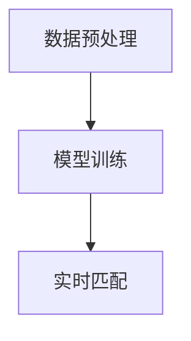
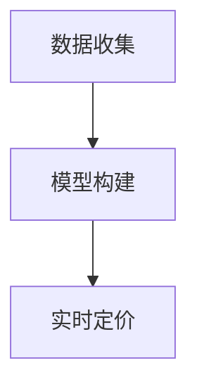
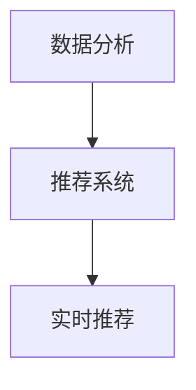

# AI人工智能 Agent：在分享经济中的应用

## 1.背景介绍

分享经济（Sharing Economy）是近年来迅速崛起的一种经济模式，通过互联网平台将闲置资源进行共享，从而提高资源利用率，降低成本。典型的分享经济平台包括Uber、Airbnb等，它们通过连接供需双方，实现了资源的高效配置。然而，随着分享经济的快速发展，如何进一步提升平台的智能化和自动化水平，成为了一个亟待解决的问题。AI人工智能 Agent（智能代理）作为一种能够自主学习和决策的技术，正逐渐成为解决这一问题的关键。

## 2.核心概念与联系

### 2.1 AI人工智能 Agent

AI人工智能 Agent是一种能够感知环境、进行决策并采取行动的智能系统。它通常由感知模块、决策模块和执行模块组成，通过不断地与环境交互，优化自身的行为策略。

### 2.2 分享经济

分享经济是一种基于互联网平台的经济模式，通过将闲置资源进行共享，实现资源的高效利用。分享经济的核心在于平台的中介作用，通过连接供需双方，实现资源的匹配和交易。

### 2.3 AI Agent与分享经济的联系

AI Agent在分享经济中的应用主要体现在以下几个方面：

1. **智能匹配**：通过AI Agent的智能算法，实现供需双方的高效匹配，提高资源利用率。
2. **动态定价**：利用AI Agent的预测能力，根据市场供需情况动态调整价格，优化收益。
3. **用户体验优化**：通过AI Agent的个性化推荐和服务，提高用户满意度。

## 3.核心算法原理具体操作步骤

### 3.1 智能匹配算法

智能匹配算法是AI Agent在分享经济中的核心应用之一。其基本原理是通过机器学习算法，分析用户的需求和资源的特性，实现供需双方的高效匹配。

#### 3.1.1 数据预处理

首先，需要对平台上的用户数据和资源数据进行预处理，包括数据清洗、特征提取和归一化处理。

#### 3.1.2 模型训练

接下来，使用预处理后的数据训练机器学习模型。常用的模型包括决策树、随机森林和神经网络等。

#### 3.1.3 实时匹配

在实际应用中，利用训练好的模型对新用户的需求进行预测，并根据预测结果进行资源匹配。



### 3.2 动态定价算法

动态定价算法是通过AI Agent的预测能力，根据市场供需情况动态调整价格，优化收益。

#### 3.2.1 数据收集

首先，收集平台上的历史交易数据，包括价格、供需情况和用户行为等。

#### 3.2.2 模型构建

使用收集到的数据构建预测模型，常用的方法包括时间序列分析和回归分析等。

#### 3.2.3 实时定价

在实际应用中，根据实时的供需情况和预测模型，动态调整价格。



### 3.3 用户体验优化算法

用户体验优化算法通过AI Agent的个性化推荐和服务，提高用户满意度。

#### 3.3.1 数据分析

首先，分析用户的历史行为数据，提取用户的偏好和需求。

#### 3.3.2 推荐系统

使用协同过滤、内容推荐等算法，构建个性化推荐系统。

#### 3.3.3 实时推荐

在实际应用中，根据用户的实时行为和推荐系统，提供个性化的推荐和服务。



## 4.数学模型和公式详细讲解举例说明

### 4.1 智能匹配算法的数学模型

智能匹配算法可以通过优化问题来描述。假设有 $n$ 个用户和 $m$ 个资源，用户 $i$ 的需求为 $d_i$，资源 $j$ 的特性为 $r_j$，匹配的目标是最大化用户满意度 $S$，可以表示为：

$$
S = \sum_{i=1}^{n} \sum_{j=1}^{m} w_{ij} \cdot f(d_i, r_j)
$$

其中，$w_{ij}$ 表示用户 $i$ 和资源 $j$ 的匹配权重，$f(d_i, r_j)$ 表示用户 $i$ 对资源 $j$ 的满意度函数。

### 4.2 动态定价算法的数学模型

动态定价算法可以通过时间序列模型来描述。假设价格 $P_t$ 在时间 $t$ 的变化可以表示为：

$$
P_t = \alpha + \beta \cdot D_t + \gamma \cdot S_t + \epsilon_t
$$

其中，$D_t$ 表示时间 $t$ 的需求量，$S_t$ 表示时间 $t$ 的供给量，$\alpha$、$\beta$ 和 $\gamma$ 是模型参数，$\epsilon_t$ 是误差项。

### 4.3 用户体验优化算法的数学模型

用户体验优化算法可以通过推荐系统模型来描述。假设用户 $i$ 对物品 $j$ 的评分为 $r_{ij}$，推荐系统的目标是预测用户 $i$ 对未评分物品 $j$ 的评分 $\hat{r}_{ij}$，可以表示为：

$$
\hat{r}_{ij} = \mu + b_i + b_j + q_i^T p_j
$$

其中，$\mu$ 是全局平均评分，$b_i$ 和 $b_j$ 分别是用户 $i$ 和物品 $j$ 的偏差，$q_i$ 和 $p_j$ 分别是用户 $i$ 和物品 $j$ 的特征向量。

## 5.项目实践：代码实例和详细解释说明

### 5.1 智能匹配算法的代码实例

以下是一个使用Python实现的智能匹配算法的示例代码：

```python
import numpy as np
from sklearn.ensemble import RandomForestClassifier

# 数据预处理
def preprocess_data(user_data, resource_data):
    # 数据清洗和特征提取
    # ...
    return processed_user_data, processed_resource_data

# 模型训练
def train_model(user_data, resource_data):
    X = np.concatenate((user_data, resource_data), axis=1)
    y = np.array([1 if user['match'] == resource['id'] else 0 for user, resource in zip(user_data, resource_data)])
    model = RandomForestClassifier()
    model.fit(X, y)
    return model

# 实时匹配
def match_resources(model, new_user_data, resource_data):
    X_new = np.concatenate((new_user_data, resource_data), axis=1)
    predictions = model.predict(X_new)
    matched_resources = [resource for resource, pred in zip(resource_data, predictions) if pred == 1]
    return matched_resources

# 示例数据
user_data = ...
resource_data = ...

# 数据预处理
processed_user_data, processed_resource_data = preprocess_data(user_data, resource_data)

# 模型训练
model = train_model(processed_user_data, processed_resource_data)

# 实时匹配
new_user_data = ...
matched_resources = match_resources(model, new_user_data, resource_data)
print(matched_resources)
```

### 5.2 动态定价算法的代码实例

以下是一个使用Python实现的动态定价算法的示例代码：

```python
import pandas as pd
from statsmodels.tsa.arima_model import ARIMA

# 数据收集
def collect_data():
    # 收集历史交易数据
    # ...
    return data

# 模型构建
def build_model(data):
    model = ARIMA(data['price'], order=(5, 1, 0))
    model_fit = model.fit(disp=0)
    return model_fit

# 实时定价
def dynamic_pricing(model, current_demand, current_supply):
    forecast = model.forecast(steps=1)[0]
    price = forecast[0] + 0.1 * current_demand - 0.1 * current_supply
    return price

# 示例数据
data = collect_data()

# 模型构建
model = build_model(data)

# 实时定价
current_demand = ...
current_supply = ...
price = dynamic_pricing(model, current_demand, current_supply)
print(price)
```

### 5.3 用户体验优化算法的代码实例

以下是一个使用Python实现的用户体验优化算法的示例代码：

```python
import numpy as np
from sklearn.decomposition import TruncatedSVD

# 数据分析
def analyze_data(user_behavior_data):
    # 提取用户偏好和需求
    # ...
    return user_preferences

# 推荐系统
def build_recommendation_system(user_preferences, item_data):
    svd = TruncatedSVD(n_components=20)
    user_factors = svd.fit_transform(user_preferences)
    item_factors = svd.fit_transform(item_data)
    return user_factors, item_factors

# 实时推荐
def recommend_items(user_factors, item_factors, user_id):
    user_vector = user_factors[user_id]
    scores = np.dot(item_factors, user_vector)
    recommended_items = np.argsort(scores)[::-1]
    return recommended_items

# 示例数据
user_behavior_data = ...
item_data = ...

# 数据分析
user_preferences = analyze_data(user_behavior_data)

# 推荐系统
user_factors, item_factors = build_recommendation_system(user_preferences, item_data)

# 实时推荐
user_id = ...
recommended_items = recommend_items(user_factors, item_factors, user_id)
print(recommended_items)
```

## 6.实际应用场景

### 6.1 共享出行

在共享出行领域，AI Agent可以通过智能匹配算法实现乘客和司机的高效匹配，提高出行效率。同时，动态定价算法可以根据实时的供需情况调整价格，优化平台收益。

### 6.2 短租平台

在短租平台上，AI Agent可以通过用户体验优化算法提供个性化的房源推荐，提高用户满意度。此外，动态定价算法可以根据市场供需情况调整房源价格，提升房东收益。

### 6.3 共享办公

在共享办公领域，AI Agent可以通过智能匹配算法实现办公空间和用户需求的高效匹配，提高资源利用率。同时，动态定价算法可以根据实时的供需情况调整价格，优化平台收益。

## 7.工具和资源推荐

### 7.1 开发工具

1. **Python**：Python是一种广泛使用的编程语言，拥有丰富的机器学习和数据分析库，如scikit-learn、pandas和numpy等。
2. **Jupyter Notebook**：Jupyter Notebook是一种交互式的开发工具，适用于数据分析和机器学习模型的开发和调试。

### 7.2 资源推荐

1. **机器学习课程**：推荐Coursera上的《机器学习》课程，由斯坦福大学的Andrew Ng教授讲授，内容涵盖了机器学习的基本原理和应用。
2. **数据集**：推荐使用Kaggle上的公开数据集进行模型训练和测试，如共享出行数据集、短租平台数据集等。

## 8.总结：未来发展趋势与挑战

### 8.1 未来发展趋势

1. **智能化水平提升**：随着AI技术的不断发展，分享经济平台的智能化水平将进一步提升，实现更高效的资源匹配和动态定价。
2. **个性化服务**：AI Agent将能够提供更加个性化的服务，提高用户满意度和平台粘性。
3. **跨领域应用**：AI Agent在分享经济中的应用将不仅限于共享出行和短租平台，还将扩展到更多领域，如共享办公、共享医疗等。

### 8.2 挑战

1. **数据隐私和安全**：在分享经济平台上，用户数据的隐私和安全问题将成为一个重要的挑战，需要通过技术手段和法律法规加以保护。
2. **算法公平性**：AI Agent的算法需要保证公平性，避免对某些用户或资源的偏见和歧视。
3. **技术复杂性**：AI Agent的开发和部署需要较高的技术水平和资源投入，对于中小型企业来说可能存在一定的挑战。

## 9.附录：常见问题与解答

### 9.1 什么是AI人工智能 Agent？

AI人工智能 Agent是一种能够感知环境、进行决策并采取行动的智能系统，通常由感知模块、决策模块和执行模块组成。

### 9.2 AI Agent在分享经济中的主要应用有哪些？

AI Agent在分享经济中的主要应用包括智能匹配、动态定价和用户体验优化等。

### 9.3 如何实现智能匹配算法？

智能匹配算法可以通过机器学习算法实现，具体步骤包括数据预处理、模型训练和实时匹配。

### 9.4 动态定价算法的基本原理是什么？

动态定价算法通过时间序列模型，根据市场供需情况动态调整价格，优化平台收益。

### 9.5 用户体验优化算法如何提高用户满意度？

用户体验优化算法通过分析用户的历史行为数据，提取用户的偏好和需求，使用推荐系统提供个性化的推荐和服务，提高用户满意度。

---

作者：禅与计算机程序设计艺术 / Zen and the Art of Computer Programming