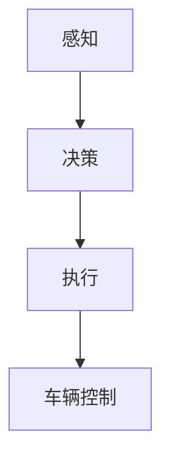

# AI人工智能 Agent：在无人驾驶中的应用

## 1.背景介绍

无人驾驶技术，作为人工智能和自动化领域的前沿技术，正在迅速改变我们的生活方式。无人驾驶汽车不仅能够提高交通效率，减少交通事故，还能为那些无法驾驶的人群提供便利。AI人工智能 Agent 在无人驾驶中的应用是这一技术的核心，它通过感知、决策和执行来实现车辆的自主驾驶。

无人驾驶技术的发展经历了多个阶段，从最初的简单辅助驾驶系统到如今的完全自动驾驶，每一步都离不开AI技术的进步。本文将深入探讨AI人工智能 Agent 在无人驾驶中的应用，涵盖核心概念、算法原理、数学模型、项目实践、实际应用场景、工具和资源推荐等多个方面。

## 2.核心概念与联系

### 2.1 AI人工智能 Agent

AI人工智能 Agent 是指能够自主感知环境、做出决策并执行行动的智能系统。在无人驾驶中，AI Agent 需要处理大量的传感器数据，进行实时决策，并控制车辆的运动。

### 2.2 无人驾驶的层次

无人驾驶技术通常分为五个层次，从L0到L5：
- **L0**：无自动化，完全由人类驾驶。
- **L1**：驾驶辅助，系统可以控制方向或速度，但不能同时控制两者。
- **L2**：部分自动化，系统可以同时控制方向和速度，但需要人类监控。
- **L3**：有条件自动化，系统可以在特定条件下完全控制车辆，但需要人类随时接管。
- **L4**：高度自动化，系统可以在大多数条件下完全控制车辆，但在极端情况下需要人类接管。
- **L5**：完全自动化，系统可以在所有条件下完全控制车辆，无需人类干预。

### 2.3 感知、决策与执行

无人驾驶系统的核心功能可以分为三个部分：
- **感知**：通过摄像头、雷达、激光雷达等传感器获取环境信息。
- **决策**：基于感知数据，使用AI算法进行路径规划和决策。
- **执行**：控制车辆的转向、加速和制动等操作。

## 3.核心算法原理具体操作步骤

### 3.1 感知算法

感知算法主要包括物体检测、物体跟踪和环境建模等。常用的算法有：
- **卷积神经网络（CNN）**：用于图像处理和物体检测。
- **激光雷达点云处理**：用于三维环境建模。

### 3.2 决策算法

决策算法包括路径规划和行为决策。常用的算法有：
- **A*算法**：用于路径规划。
- **强化学习**：用于复杂环境下的行为决策。

### 3.3 执行算法

执行算法主要包括车辆控制和运动规划。常用的算法有：
- **PID控制器**：用于速度和方向控制。
- **模型预测控制（MPC）**：用于复杂运动规划。

### 3.4 流程图

以下是无人驾驶系统的基本流程图：



## 4.数学模型和公式详细讲解举例说明

### 4.1 感知模型

感知模型通常使用卷积神经网络（CNN）来处理图像数据。CNN的基本公式如下：

$$
y = f(W \cdot x + b)
$$

其中，$y$ 是输出，$W$ 是权重矩阵，$x$ 是输入，$b$ 是偏置，$f$ 是激活函数。

### 4.2 路径规划模型

路径规划常用A*算法，其基本思想是通过启发式函数 $h(n)$ 估计从节点 $n$ 到目标节点的代价。A*算法的公式如下：

$$
f(n) = g(n) + h(n)
$$

其中，$f(n)$ 是节点 $n$ 的总代价，$g(n)$ 是从起点到节点 $n$ 的实际代价，$h(n)$ 是从节点 $n$ 到目标节点的估计代价。

### 4.3 强化学习模型

强化学习模型通过奖励函数 $R(s, a)$ 来优化策略 $\pi(a|s)$。其基本公式如下：

$$
Q(s, a) = R(s, a) + \gamma \sum_{s'} P(s'|s, a) \max_{a'} Q(s', a')
$$

其中，$Q(s, a)$ 是状态 $s$ 下采取动作 $a$ 的价值，$\gamma$ 是折扣因子，$P(s'|s, a)$ 是状态转移概率。

## 5.项目实践：代码实例和详细解释说明

### 5.1 感知模块代码示例

以下是一个使用卷积神经网络进行物体检测的代码示例：

```python
import tensorflow as tf
from tensorflow.keras import layers, models

# 构建卷积神经网络模型
model = models.Sequential()
model.add(layers.Conv2D(32, (3, 3), activation='relu', input_shape=(64, 64, 3)))
model.add(layers.MaxPooling2D((2, 2)))
model.add(layers.Conv2D(64, (3, 3), activation='relu'))
model.add(layers.MaxPooling2D((2, 2)))
model.add(layers.Conv2D(64, (3, 3), activation='relu'))

# 添加全连接层
model.add(layers.Flatten())
model.add(layers.Dense(64, activation='relu'))
model.add(layers.Dense(10, activation='softmax'))

# 编译模型
model.compile(optimizer='adam',
              loss='sparse_categorical_crossentropy',
              metrics=['accuracy'])

# 打印模型摘要
model.summary()
```

### 5.2 决策模块代码示例

以下是一个使用A*算法进行路径规划的代码示例：

```python
import heapq

def a_star(start, goal, h):
    open_list = []
    heapq.heappush(open_list, (0, start))
    came_from = {}
    g_score = {start: 0}
    f_score = {start: h(start)}

    while open_list:
        _, current = heapq.heappop(open_list)

        if current == goal:
            return reconstruct_path(came_from, current)

        for neighbor in get_neighbors(current):
            tentative_g_score = g_score[current] + dist_between(current, neighbor)
            if neighbor not in g_score or tentative_g_score < g_score[neighbor]:
                came_from[neighbor] = current
                g_score[neighbor] = tentative_g_score
                f_score[neighbor] = g_score[neighbor] + h(neighbor)
                heapq.heappush(open_list, (f_score[neighbor], neighbor))

    return None

def reconstruct_path(came_from, current):
    total_path = [current]
    while current in came_from:
        current = came_from[current]
        total_path.append(current)
    return total_path[::-1]
```

### 5.3 执行模块代码示例

以下是一个使用PID控制器进行速度控制的代码示例：

```python
class PIDController:
    def __init__(self, kp, ki, kd):
        self.kp = kp
        self.ki = ki
        self.kd = kd
        self.prev_error = 0
        self.integral = 0

    def control(self, setpoint, measured_value):
        error = setpoint - measured_value
        self.integral += error
        derivative = error - self.prev_error
        output = self.kp * error + self.ki * self.integral + self.kd * derivative
        self.prev_error = error
        return output

# 使用PID控制器
pid = PIDController(kp=1.0, ki=0.1, kd=0.01)
setpoint = 100  # 目标速度
measured_value = 90  # 当前速度
control_signal = pid.control(setpoint, measured_value)
print(f"控制信号: {control_signal}")
```

## 6.实际应用场景

### 6.1 城市交通

无人驾驶技术在城市交通中的应用可以显著提高交通效率，减少交通拥堵。例如，Waymo和百度Apollo等公司已经在多个城市进行了无人驾驶出租车的试点。

### 6.2 物流运输

无人驾驶卡车在物流运输中的应用可以降低运输成本，提高运输效率。特斯拉和图森未来等公司已经在这一领域取得了显著进展。

### 6.3 智能停车

无人驾驶技术还可以应用于智能停车系统，通过自动寻找停车位和泊车，提高停车场的利用率和用户体验。

## 7.工具和资源推荐

### 7.1 开发工具

- **TensorFlow**：用于构建和训练深度学习模型。
- **ROS（Robot Operating System）**：用于机器人和无人驾驶系统的开发。
- **OpenCV**：用于图像处理和计算机视觉。

### 7.2 数据集

- **KITTI**：用于自动驾驶的多模态数据集。
- **Cityscapes**：用于语义分割的城市街景数据集。
- **Waymo Open Dataset**：Waymo公司提供的自动驾驶数据集。

### 7.3 学习资源

- **Coursera**：提供无人驾驶和深度学习相关的在线课程。
- **arXiv**：最新的人工智能和无人驾驶研究论文。
- **GitHub**：开源项目和代码库。

## 8.总结：未来发展趋势与挑战

### 8.1 未来发展趋势

无人驾驶技术的未来发展趋势包括：
- **更高的自动化等级**：从L4向L5发展，实现完全自动驾驶。
- **更智能的决策系统**：通过强化学习和深度学习，提升决策系统的智能化水平。
- **更安全的系统设计**：通过多传感器融合和冗余设计，提高系统的安全性和可靠性。

### 8.2 挑战

无人驾驶技术面临的主要挑战包括：
- **技术复杂性**：无人驾驶系统需要处理大量的传感器数据，进行实时决策，技术复杂性高。
- **法律法规**：无人驾驶技术的推广需要法律法规的支持，目前各国的法律法规尚不完善。
- **社会接受度**：无人驾驶技术的普及还需要社会的广泛接受和认可。

## 9.附录：常见问题与解答

### 9.1 无人驾驶技术是否安全？

无人驾驶技术的安全性是一个复杂的问题，涉及技术、法律和社会多个方面。目前的无人驾驶系统在特定条件下已经表现出较高的安全性，但在极端情况下仍需要人类干预。

### 9.2 无人驾驶技术何时能够普及？

无人驾驶技术的普及需要技术、法律和社会多个方面的共同努力。预计在未来10-20年内，无人驾驶技术将在特定场景下得到广泛应用。

### 9.3 无人驾驶技术是否会取代人类驾驶？

无人驾驶技术的目标是提高交通效率和安全性，而不是完全取代人类驾驶。在未来的很长一段时间内，人类驾驶和无人驾驶将共存。

---

作者：禅与计算机程序设计艺术 / Zen and the Art of Computer Programming