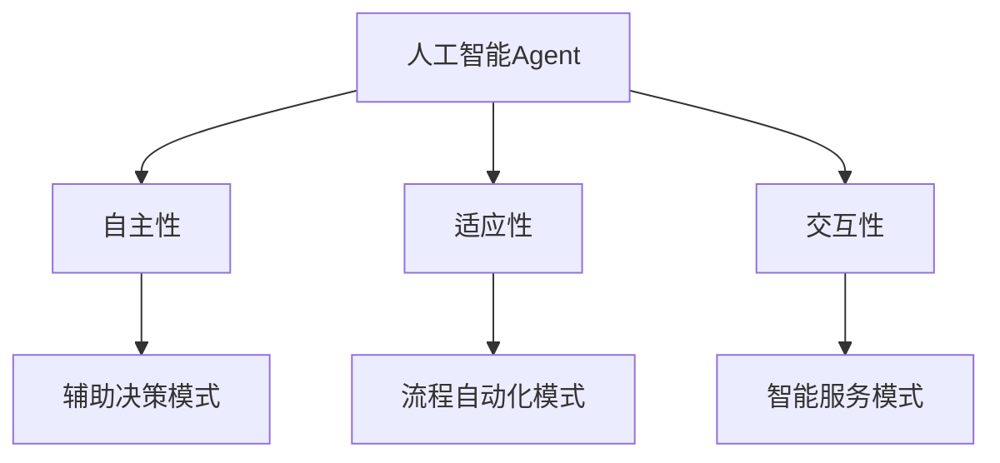

# AI人工智能 Agent：在赋能传统行业中的应用

## 1. 背景介绍

### 1.1 人工智能的发展历程
#### 1.1.1 人工智能的起源与发展
#### 1.1.2 人工智能的三次浪潮
#### 1.1.3 人工智能的现状与挑战

### 1.2 传统行业面临的困境
#### 1.2.1 效率低下
#### 1.2.2 成本高企
#### 1.2.3 决策滞后

### 1.3 人工智能赋能传统行业的必要性
#### 1.3.1 提高效率
#### 1.3.2 降低成本
#### 1.3.3 优化决策

## 2. 核心概念与联系

### 2.1 人工智能Agent的定义
#### 2.1.1 Agent的概念
#### 2.1.2 人工智能Agent的特点
#### 2.1.3 人工智能Agent的分类

### 2.2 人工智能Agent与传统系统的区别
#### 2.2.1 自主性
#### 2.2.2 适应性
#### 2.2.3 交互性

### 2.3 人工智能Agent在传统行业中的应用模式
#### 2.3.1 辅助决策模式
#### 2.3.2 流程自动化模式
#### 2.3.3 智能服务模式



## 3. 核心算法原理具体操作步骤

### 3.1 强化学习算法
#### 3.1.1 马尔可夫决策过程
#### 3.1.2 Q-learning算法
#### 3.1.3 深度强化学习算法

### 3.2 深度学习算法
#### 3.2.1 卷积神经网络
#### 3.2.2 循环神经网络
#### 3.2.3 生成对抗网络

### 3.3 自然语言处理算法
#### 3.3.1 词向量表示
#### 3.3.2 注意力机制
#### 3.3.3 Transformer模型

## 4. 数学模型和公式详细讲解举例说明

### 4.1 马尔可夫决策过程
马尔可夫决策过程（Markov Decision Process，MDP）是强化学习的基础。它由状态集合 $S$，动作集合 $A$，转移概率 $P$，奖励函数 $R$ 和折扣因子 $\gamma$ 组成。
$$MDP = \langle S, A, P, R, \gamma \rangle$$

### 4.2 Q-learning算法
Q-learning是一种无模型的强化学习算法，通过不断更新状态-动作值函数 $Q(s,a)$ 来寻找最优策略。
$$Q(s_t,a_t) \leftarrow Q(s_t,a_t) + \alpha [r_{t+1} + \gamma \max_a Q(s_{t+1},a) - Q(s_t,a_t)]$$

### 4.3 卷积神经网络
卷积神经网络（Convolutional Neural Network，CNN）是一种常用的深度学习模型，特别适用于图像识别等任务。它由卷积层、池化层和全连接层组成。
$$h_{i,j} = \sigma(\sum_{m=0}^{M-1} \sum_{n=0}^{N-1} w_{m,n} x_{i+m,j+n} + b)$$

## 5. 项目实践：代码实例和详细解释说明

### 5.1 强化学习在智能调度中的应用
```python
import numpy as np

class QLearningAgent:
    def __init__(self, state_size, action_size, learning_rate, discount_factor, epsilon):
        self.state_size = state_size
        self.action_size = action_size
        self.learning_rate = learning_rate
        self.discount_factor = discount_factor
        self.epsilon = epsilon
        self.q_table = np.zeros((state_size, action_size))

    def choose_action(self, state):
        if np.random.uniform() < self.epsilon:
            action = np.random.choice(self.action_size)
        else:
            action = np.argmax(self.q_table[state])
        return action

    def learn(self, state, action, reward, next_state):
        old_value = self.q_table[state, action]
        next_max = np.max(self.q_table[next_state])
        new_value = (1 - self.learning_rate) * old_value + self.learning_rate * (reward + self.discount_factor * next_max)
        self.q_table[state, action] = new_value
```
以上代码实现了一个简单的Q-learning智能调度Agent。通过不断与环境交互，更新Q值表，Agent可以学习到最优的调度策略。

### 5.2 卷积神经网络在工业质检中的应用
```python
import tensorflow as tf

model = tf.keras.models.Sequential([
    tf.keras.layers.Conv2D(32, (3,3), activation='relu', input_shape=(28, 28, 1)),
    tf.keras.layers.MaxPooling2D((2, 2)),
    tf.keras.layers.Conv2D(64, (3,3), activation='relu'),
    tf.keras.layers.MaxPooling2D((2, 2)),
    tf.keras.layers.Conv2D(64, (3,3), activation='relu'),
    tf.keras.layers.Flatten(),
    tf.keras.layers.Dense(64, activation='relu'),
    tf.keras.layers.Dense(10, activation='softmax')
])

model.compile(optimizer='adam',
              loss='sparse_categorical_crossentropy',
              metrics=['accuracy'])

model.fit(train_images, train_labels, epochs=5)
```
以上代码使用TensorFlow框架构建了一个卷积神经网络模型，用于工业产品质量检测。通过对大量样本数据的训练，模型可以学习到产品缺陷的特征，从而实现自动化质检。

## 6. 实际应用场景

### 6.1 智能制造
#### 6.1.1 设备预测性维护
#### 6.1.2 产品质量检测
#### 6.1.3 生产排程优化

### 6.2 智慧物流
#### 6.2.1 仓储优化
#### 6.2.2 运输路径规划
#### 6.2.3 需求预测

### 6.3 智能客服
#### 6.3.1 客户意图识别
#### 6.3.2 个性化推荐
#### 6.3.3 自动问答

## 7. 工具和资源推荐

### 7.1 开源框架
#### 7.1.1 TensorFlow
#### 7.1.2 PyTorch
#### 7.1.3 Keras

### 7.2 数据集
#### 7.2.1 ImageNet
#### 7.2.2 COCO
#### 7.2.3 WordNet

### 7.3 学习资源
#### 7.3.1 Coursera深度学习专项课程
#### 7.3.2 《深度学习》图书
#### 7.3.3 Papers with Code网站

## 8. 总结：未来发展趋势与挑战

### 8.1 人工智能Agent的发展趋势
#### 8.1.1 多Agent协作
#### 8.1.2 人机混合增强智能
#### 8.1.3 可解释性与可信赖性

### 8.2 人工智能赋能传统行业面临的挑战
#### 8.2.1 数据质量与安全
#### 8.2.2 算法偏差与公平性
#### 8.2.3 人才缺口与技能转型

### 8.3 展望
人工智能Agent技术在未来必将得到更广泛的应用，与传统行业深度融合，催生出更多新业态、新模式。同时也要正视其面临的挑战，加强行业自律，注重人才培养，促进人工智能健康有序发展。

## 9. 附录：常见问题与解答

### 9.1 人工智能会取代人类吗？
人工智能是人类智慧的延伸和拓展，其目的是增强人类能力而非取代。在可预见的未来，人工智能将与人类协同工作，发挥各自所长。

### 9.2 中小企业如何应用人工智能Agent技术？
中小企业可以根据自身需求和资源状况，选择成熟的人工智能解决方案或服务。同时要注重人才培养，提升员工数字化技能，推动企业数字化转型。

### 9.3 人工智能Agent的应用是否有行业限制？
人工智能Agent技术具有通用性，可以应用于各个行业领域。但不同行业在应用的场景、难度和效果上会有所差异，需要因地制宜，循序渐进。

作者：禅与计算机程序设计艺术 / Zen and the Art of Computer Programming