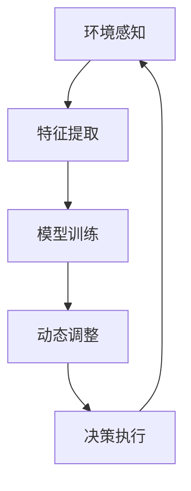

# AI人工智能深度学习算法：智能深度学习代理的动态调整与情境智能

## 1.背景介绍

在过去的十年中，人工智能（AI）和深度学习（DL）技术取得了显著的进展。深度学习算法已经在图像识别、自然语言处理、语音识别等领域取得了突破性成果。然而，随着应用场景的复杂化和多样化，传统的深度学习模型在应对动态环境和情境变化时显得力不从心。智能深度学习代理的动态调整与情境智能成为了当前研究的热点。

### 1.1 深度学习的演变

深度学习起源于神经网络的研究，通过多层神经网络的训练，能够从大量数据中提取特征并进行预测。随着计算能力和数据量的增加，深度学习模型的复杂度和性能也不断提升。

### 1.2 动态调整与情境智能的需求

在实际应用中，环境和情境是动态变化的。例如，自动驾驶汽车需要在不同的天气、道路条件下做出实时决策；智能客服系统需要根据用户的情绪和需求调整回答策略。因此，深度学习模型需要具备动态调整和情境智能的能力，以适应不同的应用场景。

## 2.核心概念与联系

在探讨智能深度学习代理的动态调整与情境智能之前，我们需要理解一些核心概念及其相互联系。

### 2.1 智能代理

智能代理是能够感知环境并采取行动以实现特定目标的计算系统。智能代理通常具备感知、决策和执行三个基本功能。

### 2.2 动态调整

动态调整是指系统能够根据环境和情境的变化，实时调整自身的参数和策略，以保持最佳性能。对于深度学习模型，动态调整通常涉及模型参数的在线更新和策略的自适应调整。

### 2.3 情境智能

情境智能是指系统能够理解和利用当前情境信息，以做出更为准确和有效的决策。情境信息可以包括时间、地点、用户状态、环境状态等。

### 2.4 核心联系

智能代理、动态调整和情境智能三者之间存在紧密联系。智能代理通过感知环境获取情境信息，并通过动态调整机制实时优化决策策略，从而实现情境智能。

## 3.核心算法原理具体操作步骤

在实现智能深度学习代理的动态调整与情境智能时，我们需要设计和实现一系列核心算法。以下是具体的操作步骤。

### 3.1 环境感知

智能代理首先需要感知环境，获取情境信息。常用的感知技术包括传感器数据采集、图像处理、语音识别等。

### 3.2 特征提取

从感知数据中提取有用的特征是深度学习模型的关键步骤。常用的特征提取方法包括卷积神经网络（CNN）、循环神经网络（RNN）等。

### 3.3 模型训练

使用提取的特征训练深度学习模型。模型训练通常采用监督学习、无监督学习或强化学习的方法。

### 3.4 动态调整机制

设计动态调整机制，使模型能够根据情境信息实时调整参数和策略。常用的动态调整方法包括在线学习、自适应优化等。

### 3.5 决策执行

智能代理根据调整后的模型做出决策，并执行相应的动作。决策执行需要考虑实时性和准确性。

以下是一个简单的Mermaid流程图，展示了智能深度学习代理的工作流程：



## 4.数学模型和公式详细讲解举例说明

在智能深度学习代理的实现过程中，数学模型和公式是不可或缺的工具。以下是一些关键的数学模型和公式。

### 4.1 神经网络模型

神经网络是深度学习的基础模型。一个简单的神经网络可以表示为：

$$
y = f(Wx + b)
$$

其中，$x$ 是输入向量，$W$ 是权重矩阵，$b$ 是偏置向量，$f$ 是激活函数，$y$ 是输出向量。

### 4.2 卷积神经网络（CNN）

卷积神经网络在图像处理中的应用非常广泛。CNN的核心操作是卷积运算，其数学表达式为：

$$
y_{i,j} = \sum_{m,n} x_{i+m,j+n} \cdot w_{m,n}
$$

其中，$x$ 是输入图像，$w$ 是卷积核，$y$ 是输出特征图。

### 4.3 强化学习

强化学习是实现动态调整和情境智能的重要方法。强化学习的核心是策略优化，其目标是最大化累积奖励。策略优化的数学表达式为：

$$
\pi^* = \arg\max_{\pi} \mathbb{E}\left[\sum_{t=0}^{\infty} \gamma^t r_t \mid \pi\right]
$$

其中，$\pi$ 是策略，$r_t$ 是时间步$t$的奖励，$\gamma$ 是折扣因子。

### 4.4 自适应优化

自适应优化算法能够根据梯度信息动态调整学习率。常用的自适应优化算法包括Adam，其更新公式为：

$$
m_t = \beta_1 m_{t-1} + (1 - \beta_1) g_t
$$

$$
v_t = \beta_2 v_{t-1} + (1 - \beta_2) g_t^2
$$

$$
\hat{m}_t = \frac{m_t}{1 - \beta_1^t}
$$

$$
\hat{v}_t = \frac{v_t}{1 - \beta_2^t}
$$

$$
\theta_{t+1} = \theta_t - \alpha \frac{\hat{m}_t}{\sqrt{\hat{v}_t} + \epsilon}
$$

其中，$g_t$ 是梯度，$m_t$ 和 $v_t$ 分别是梯度的一阶和二阶动量，$\alpha$ 是学习率，$\epsilon$ 是一个小常数。

## 5.项目实践：代码实例和详细解释说明

为了更好地理解智能深度学习代理的动态调整与情境智能，我们通过一个具体的项目实例来进行说明。以下是一个基于Python和TensorFlow的代码示例。

### 5.1 环境感知与特征提取

首先，我们使用传感器数据进行环境感知，并提取特征。

```python
import tensorflow as tf
from tensorflow.keras.layers import Conv2D, MaxPooling2D, Flatten, Dense

# 假设我们有一个传感器数据集
sensor_data = ...

# 定义卷积神经网络模型
model = tf.keras.Sequential([
    Conv2D(32, (3, 3), activation='relu', input_shape=(64, 64, 3)),
    MaxPooling2D((2, 2)),
    Conv2D(64, (3, 3), activation='relu'),
    MaxPooling2D((2, 2)),
    Flatten(),
    Dense(128, activation='relu'),
    Dense(10, activation='softmax')
])

# 编译模型
model.compile(optimizer='adam', loss='sparse_categorical_crossentropy', metrics=['accuracy'])

# 训练模型
model.fit(sensor_data, labels, epochs=10)
```

### 5.2 动态调整机制

接下来，我们实现一个简单的动态调整机制，使模型能够根据情境信息实时调整参数。

```python
class DynamicAdjuster(tf.keras.callbacks.Callback):
    def on_epoch_end(self, epoch, logs=None):
        # 根据情境信息调整学习率
        if logs['accuracy'] < 0.8:
            new_lr = self.model.optimizer.lr * 0.9
            self.model.optimizer.lr.assign(new_lr)
            print(f"Epoch {epoch}: Adjusting learning rate to {new_lr}")

# 使用动态调整机制训练模型
model.fit(sensor_data, labels, epochs=10, callbacks=[DynamicAdjuster()])
```

### 5.3 决策执行

最后，我们使用训练好的模型进行决策，并执行相应的动作。

```python
# 假设我们有一个新的传感器数据
new_sensor_data = ...

# 使用模型进行预测
predictions = model.predict(new_sensor_data)

# 根据预测结果执行相应的动作
for prediction in predictions:
    action = np.argmax(prediction)
    execute_action(action)
```

## 6.实际应用场景

智能深度学习代理的动态调整与情境智能在多个领域具有广泛的应用前景。以下是一些典型的应用场景。

### 6.1 自动驾驶

在自动驾驶领域，车辆需要根据实时的道路和交通状况做出决策。智能深度学习代理可以通过动态调整和情境智能，提高自动驾驶系统的安全性和可靠性。

### 6.2 智能客服

智能客服系统需要根据用户的情绪和需求调整回答策略。通过情境智能，智能客服系统可以提供更为个性化和高效的服务。

### 6.3 医疗诊断

在医疗诊断中，医生需要根据患者的病情和历史数据做出诊断决策。智能深度学习代理可以通过动态调整和情境智能，辅助医生进行更为准确的诊断。

### 6.4 金融交易

在金融交易中，市场环境和情境是动态变化的。智能深度学习代理可以通过实时调整交易策略，提高交易的收益和稳定性。

## 7.工具和资源推荐

在实现智能深度学习代理的动态调整与情境智能时，以下工具和资源可以提供帮助。

### 7.1 深度学习框架

- TensorFlow：谷歌开发的开源深度学习框架，支持多种深度学习模型的构建和训练。
- PyTorch：Facebook开发的开源深度学习框架，具有灵活的动态计算图和强大的社区支持。

### 7.2 数据集

- ImageNet：一个大规模的图像数据集，广泛用于图像分类和目标检测任务。
- COCO：一个大规模的图像数据集，包含丰富的图像标注信息，广泛用于图像分割和目标检测任务。

### 7.3 在线学习资源

- Coursera：提供多种深度学习和人工智能相关的在线课程。
- edX：提供多种深度学习和人工智能相关的在线课程。

## 8.总结：未来发展趋势与挑战

智能深度学习代理的动态调整与情境智能是人工智能领域的重要研究方向。未来，随着计算能力和数据量的进一步提升，智能深度学习代理将在更多领域得到应用。然而，智能深度学习代理的实现仍面临诸多挑战。

### 8.1 计算资源

智能深度学习代理的训练和推理需要大量的计算资源。如何高效利用计算资源，降低计算成本，是一个重要的研究方向。

### 8.2 数据隐私

在实际应用中，智能深度学习代理需要处理大量的用户数据。如何保护用户数据隐私，确保数据安全，是一个重要的挑战。

### 8.3 模型解释性

深度学习模型通常是黑箱模型，缺乏解释性。如何提高模型的解释性，使其决策过程透明化，是一个重要的研究方向。

## 9.附录：常见问题与解答

### 9.1 什么是智能深度学习代理？

智能深度学习代理是能够感知环境并采取行动以实现特定目标的计算系统。它通过深度学习算法，从大量数据中提取特征并进行预测。

### 9.2 什么是动态调整？

动态调整是指系统能够根据环境和情境的变化，实时调整自身的参数和策略，以保持最佳性能。

### 9.3 什么是情境智能？

情境智能是指系统能够理解和利用当前情境信息，以做出更为准确和有效的决策。

### 9.4 如何实现智能深度学习代理的动态调整与情境智能？

实现智能深度学习代理的动态调整与情境智能需要设计和实现一系列核心算法，包括环境感知、特征提取、模型训练、动态调整机制和决策执行。

### 9.5 智能深度学习代理的应用场景有哪些？

智能深度学习代理在多个领域具有广泛的应用前景，包括自动驾驶、智能客服、医疗诊断和金融交易等。

---

作者：禅与计算机程序设计艺术 / Zen and the Art of Computer Programming