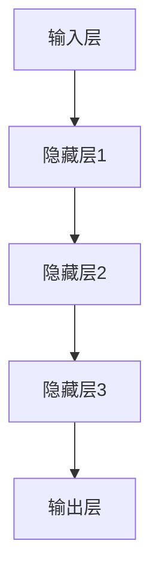
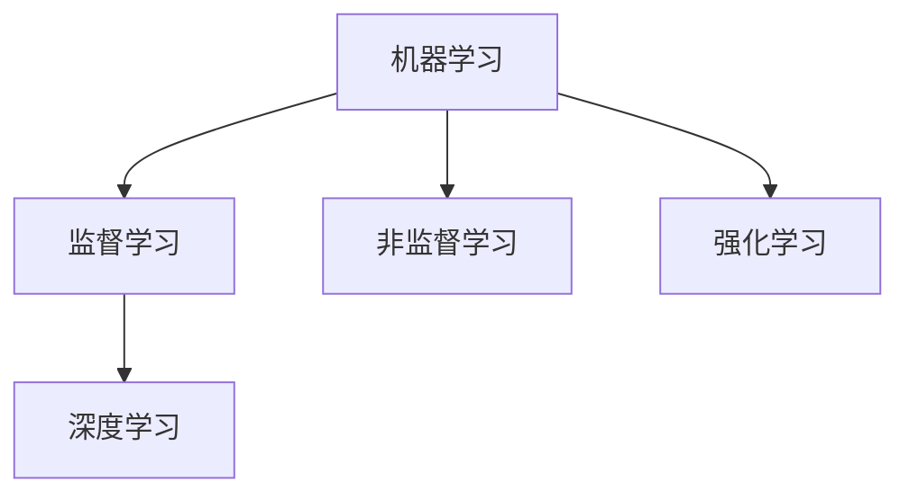
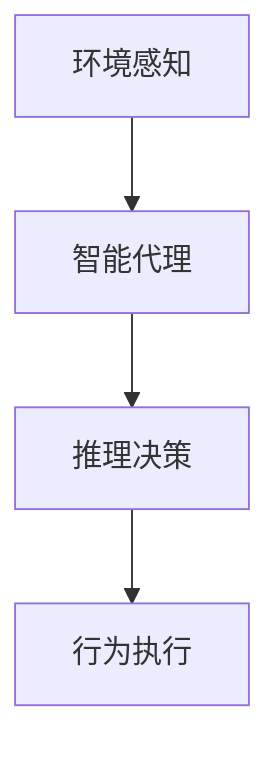
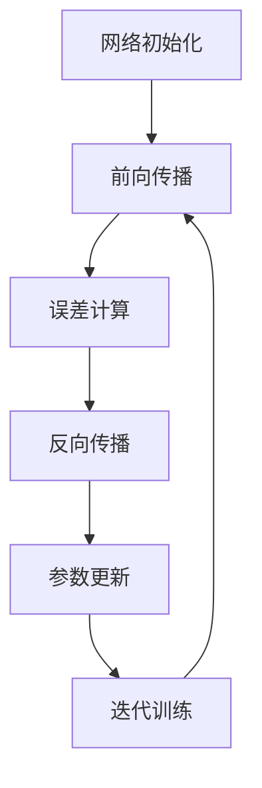
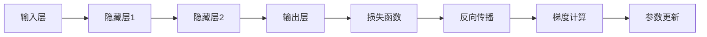

# AI人工智能深度学习算法：智能深度学习代理的推理机制

## 1.背景介绍

### 1.1 人工智能的发展历程

人工智能(Artificial Intelligence, AI)是当代最具颠覆性和革命性的技术之一,它的发展经历了几个阶段:

- 早期阶段(1950s-1960s):人工智能理论的奠基时期,专家系统、启发式搜索等算法问世。
- 知识驱动阶段(1970s-1980s):知识表示、机器学习、自然语言处理等技术取得突破。
- 统计学习阶段(1990s-2000s):贝叶斯网络、支持向量机、决策树等统计学习方法兴起。
- 深度学习时代(2010s-至今):深度神经网络、大数据与GPU并行计算促进了AI的飞速发展。

### 1.2 深度学习的重要意义

深度学习(Deep Learning)作为人工智能的核心驱动力,正在推动着各行业的智能化革新。它能从大量数据中自主学习特征表示,在计算机视觉、自然语言处理、决策控制等领域展现出超人的能力,为解决复杂问题提供了有力工具。

### 1.3 智能代理与推理

在人工智能系统中,智能代理(Intelligent Agent)扮演着感知环境、决策行为的重要角色。推理(Reasoning)是智能代理的核心能力,包括归纳推理、演绎推理和因果推理等,赋予了代理以认知和决策的能力。

## 2.核心概念与联系

### 2.1 深度神经网络

深度神经网络(Deep Neural Network, DNN)是深度学习的核心模型,它通过多层非线性变换来拟合输入和输出之间的复杂映射函数。常见的网络结构包括:

- 前馈神经网络(Feedforward Neural Network)
- 卷积神经网络(Convolutional Neural Network, CNN) 
- 循环神经网络(Recurrent Neural Network, RNN)



### 2.2 机器学习与深度学习

机器学习(Machine Learning)是使计算机具备学习能力的技术,包括监督学习、非监督学习和强化学习等范式。深度学习则是机器学习中的一个分支,专注于基于数据构建多层次的分层表示学习模型。



### 2.3 智能代理与推理

智能代理是人工智能系统中具备感知、决策和行动能力的虚拟实体。推理是智能代理的核心认知过程,包括:

- 归纳推理:从特例推广到一般规律
- 演绎推理:从一般规律推导出特定结论 
- 因果推理:识别事物之间的因果关系



## 3.核心算法原理具体操作步骤

### 3.1 深度神经网络的工作原理

深度神经网络通过以下步骤对输入数据进行建模和推理:

1. 网络初始化:根据设计确定网络结构,随机初始化网络参数。
2. 前向传播:输入数据经过层层非线性变换,计算输出结果。
3. 误差计算:将输出结果与标准答案计算误差(损失函数)。
4. 反向传播:利用链式法则,计算每层参数的梯度。
5. 参数更新:根据梯度下降算法,更新网络参数。
6. 迭代训练:重复2-5步,直至收敛或满足停止条件。



### 3.2 梯度下降算法

梯度下降(Gradient Descent)是深度学习中最常用的优化算法,用于最小化损失函数,更新网络参数。算法步骤如下:

1. 计算损失函数关于参数的梯度:$\nabla_\theta J(\theta)$
2. 更新参数:$\theta \leftarrow \theta - \eta \nabla_\theta J(\theta)$,其中$\eta$为学习率。

常见的梯度下降变种包括:

- 批量梯度下降(Batch Gradient Descent)
- 随机梯度下降(Stochastic Gradient Descent)
- 小批量梯度下降(Mini-batch Gradient Descent)

### 3.3 反向传播算法

反向传播(Backpropagation)是训练深度神经网络的核心算法,通过链式法则计算网络参数的梯度。具体步骤如下:

1. 前向传播,计算每层输出。
2. 输出层误差计算:$\delta^L = \nabla_a C \odot \sigma'(z^L)$
3. 反向传播误差项:$\delta^{l} = ((W^{l+1})^T \delta^{l+1}) \odot \sigma'(z^l)$
4. 计算梯度:$\nabla_W C = \delta^l(a^{l-1})^T, \nabla_b C = \delta^l$

其中$C$为损失函数,$\sigma'$为激活函数导数,$\odot$为元素wise乘积。



## 4.数学模型和公式详细讲解举例说明

### 4.1 神经网络模型

神经网络将输入$\mathbf{x}$映射到输出$\mathbf{y}$的过程可以表示为:

$$\mathbf{y} = f(\mathbf{x}; \theta)$$

其中$f$为网络模型,$\theta$为可训练参数。对于单层神经网络:

$$f(\mathbf{x}) = \sigma(\mathbf{W}\mathbf{x} + \mathbf{b})$$

$\mathbf{W}$为权重矩阵,$\mathbf{b}$为偏置向量,$\sigma$为非线性激活函数。

对于多层神经网络,输出为:

$$\mathbf{y} = f^{(N_L)}(f^{(N_L-1)}(...f^{(2)}(f^{(1)}(\mathbf{x}))))$$

其中$N_L$为网络层数。

### 4.2 损失函数

损失函数(Loss Function)用于衡量模型输出与真实标签之间的差异,是优化的目标函数。常用的损失函数包括:

- 均方误差(Mean Squared Error):
  $$J(\theta) = \frac{1}{2m}\sum_{i=1}^m\|\mathbf{y}^{(i)} - \hat{\mathbf{y}}^{(i)}\|_2^2$$

- 交叉熵(Cross Entropy):
  $$J(\theta) = -\frac{1}{m}\sum_{i=1}^m\sum_{j=1}^c y_j^{(i)}\log\hat{y}_j^{(i)}$$

其中$m$为样本数,$c$为类别数,$\mathbf{y}$为真实标签,$\hat{\mathbf{y}}$为模型输出。

### 4.3 正则化

为防止过拟合,常在损失函数中加入正则化项,例如L2正则化:

$$J(\theta) = J_0(\theta) + \frac{\lambda}{2}\sum_l\sum_k\sum_j(W_{jk}^{(l)})^2$$

其中$J_0$为原始损失函数,$\lambda$为正则化系数。

### 4.4 示例:线性回归

给定数据集$\{\mathbf{x}^{(i)}, y^{(i)}\}_{i=1}^m$,线性回归模型为:

$$\hat{y} = \theta_0 + \theta_1x_1 + ... + \theta_nx_n$$

目标是最小化均方误差损失函数:

$$J(\theta) = \frac{1}{2m}\sum_{i=1}^m(y^{(i)} - \hat{y}^{(i)})^2$$

利用梯度下降算法可以求解最优参数$\theta$:

$$\theta_j \leftarrow \theta_j - \alpha\frac{1}{m}\sum_{i=1}^m(y^{(i)} - \hat{y}^{(i)})x_j^{(i)}$$

其中$\alpha$为学习率。

## 5.项目实践:代码实例和详细解释说明

以下是使用Python和PyTorch实现的一个简单的前馈神经网络示例:

```python
import torch
import torch.nn as nn

# 定义网络结构
class FeedforwardNeuralNet(nn.Module):
    def __init__(self, input_size, hidden_size, output_size):
        super(FeedforwardNeuralNet, self).__init__()
        self.fc1 = nn.Linear(input_size, hidden_size) 
        self.relu = nn.ReLU()
        self.fc2 = nn.Linear(hidden_size, output_size)  
    
    def forward(self, x):
        out = self.fc1(x)
        out = self.relu(out)
        out = self.fc2(out)
        return out

# 实例化网络
net = FeedforwardNeuralNet(input_size=10, hidden_size=20, output_size=5)

# 定义损失函数和优化器
criterion = nn.CrossEntropyLoss()  
optimizer = torch.optim.SGD(net.parameters(), lr=0.01)  

# 训练循环
for epoch in range(100):
    inputs = torch.randn(64, 10) # 批量输入
    targets = torch.randint(5, (64,)) # 随机目标

    outputs = net(inputs) # 前向传播
    loss = criterion(outputs, targets) # 计算损失
    
    optimizer.zero_grad() # 梯度清零
    loss.backward() # 反向传播
    optimizer.step() # 更新参数
```

上述代码定义了一个两层的前馈神经网络,包含一个隐藏层。在训练过程中,我们使用随机输入和目标进行监督学习,采用交叉熵损失函数和随机梯度下降优化器。每个epoch进行一次前向传播、反向传播和参数更新。

## 6.实际应用场景

深度学习在诸多领域展现出优异的性能,已广泛应用于:

1. **计算机视觉**:图像分类、目标检测、图像分割等,如自动驾驶、医疗影像等。
2. **自然语言处理**:机器翻译、文本生成、情感分析等,如智能助手、聊天机器人等。
3. **语音识别**:自动语音识别、语音合成等,如智能音箱、语音助手等。
4. **推荐系统**:个性化推荐、内容推荐等,如电商、视频网站等。
5. **金融**:信用评分、欺诈检测、量化交易等。
6. **医疗健康**:疾病诊断、药物发现、医疗影像分析等。
7. **游戏AI**:下棋AI、游戏AI等。

## 7.工具和资源推荐

深度学习的发展离不开优秀的工具和资源,以下是一些推荐:

- **深度学习框架**:PyTorch、TensorFlow、MXNet等。
- **GPU加速**:CUDA、cuDNN等,提高训练速度。
- **开源模型库**:Hugging Face、TensorFlow Hub等。
- **数据集**:ImageNet、COCO、GLUE等公开数据集。
- **在线课程**:吴恩达《深度学习》、fast.ai等。
- **书籍**:《深度学习》(Ian Goodfellow等)、《模式识别与机器学习》等。
- **论文阅读**:arXiv、IEEE等顶级会议期刊论文。

## 8.总结:未来发展趋势与挑战

### 8.1 发展趋势

深度学习仍在快速发展,未来可期的趋势包括:

1. **模型规模持续增长**:大模型(如GPT-3)展现出惊人的能力。
2. **多模态学习**:融合视觉、语音、文本等多种模态信息。
3. **少样本学习**:减少对大量标注数据的依赖。
4. **可解释AI**:提高模型透明度和可解释性。
5. **联邦学习**:保护隐私的分布式学习范式。
6. **生成式AI**:图像/视频/音频/文本生成等。
7. **AI硬件