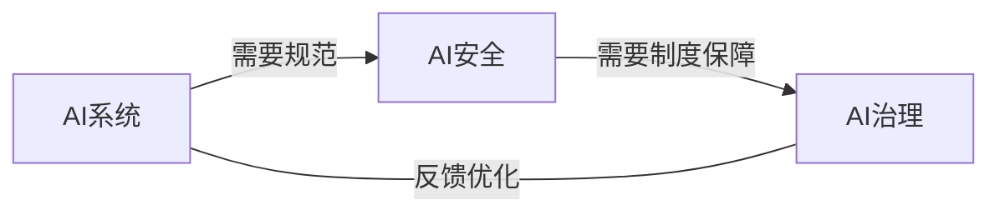

# AI相关法律法规原理与代码实战案例讲解

## 1.背景介绍
### 1.1 人工智能的迅速发展
人工智能(Artificial Intelligence,AI)在近年来取得了突飞猛进的发展。从自然语言处理、计算机视觉到机器学习等领域,AI技术正在深刻影响和改变着我们的生活。然而,AI技术的发展也带来了一系列法律和伦理方面的挑战。

### 1.2 AI带来的法律和伦理挑战
AI系统在决策和行为方面可能产生偏见、歧视和隐私侵犯等问题。例如,面部识别系统可能存在种族和性别偏见;自动化决策系统可能加剧社会不平等;智能系统收集和使用个人数据可能侵犯隐私权。这些问题凸显了制定AI相关法律法规的迫切需求。

### 1.3 AI相关法律法规的重要意义
AI相关法律法规对于规范AI技术的发展、保护个人权益、促进创新和产业发展具有重要意义。本文将从AI相关法律法规的核心概念出发,结合法律条文和案例,深入剖析AI相关法律问题,并给出AI系统开发和应用的合规建议。

## 2.核心概念与联系
### 2.1 AI相关法律的核心概念
#### 2.1.1 AI系统
AI系统泛指利用人工智能算法和技术,执行特定任务或做出决策的计算机程序和系统。其核心是通过数据和算法模拟人类智能。

#### 2.1.2 AI安全
AI安全是指AI系统在设计、开发、测试和部署全生命周期中,不产生危害或负面影响,保障利益相关方合法权益的属性。其核心在于AI系统的可控性、可解释性、稳定性和公平性。

#### 2.1.3 AI治理
AI治理是指政府、企业、学术界等利益相关方,在法律、伦理和技术层面对AI进行规范、引导和管理,促进AI健康可持续发展的过程。其核心是权衡创新与监管、效率与安全、便利与隐私的平衡。

### 2.2 核心概念之间的关系

AI系统的安全问题需要通过技术和制度两个层面的措施来保障。技术层面需要研发安全可控的AI算法;制度层面则需要建立健全的法律法规体系。二者相辅相成,共同推动AI的健康发展。

## 3.核心算法原理具体操作步骤
### 3.1 AI偏见检测算法
AI系统,尤其是机器学习模型,可能由于训练数据的局限性或算法的缺陷而产生偏见。下面给出一个简单的偏见检测算法:

#### 3.1.1 收集数据
收集模型的输入和输出数据,构建测试数据集。要尽可能覆盖不同的人口统计学特征(如性别、种族等)。

#### 3.1.2 评估模型
使用测试数据评估模型在不同人口统计学群体上的性能,可以使用准确率、召回率、F1值等指标。

#### 3.1.3 分析差异
比较模型在不同群体上的性能差异。如果差异显著,则可能存在偏见。常见的差异度量包括:
- 统计学检验:如t检验、卡方检验等
- 公平性指标:如人口均等性、机会均等性等

#### 3.1.4 定位原因
如果发现偏见,则需要进一步定位原因,是数据收集问题还是算法问题。
- 数据问题:样本不均衡、标签噪声、历史偏见等
- 算法问题:特征选择偏差、模型过拟合等

#### 3.1.5 消除偏见
根据偏见产生的原因,采取相应的策略消除或缓解偏见:
- 数据层面:扩大数据收集、平衡数据分布、清洗噪声数据
- 算法层面:去除敏感属性、正则化、对抗学习等

### 3.2 AI可解释性算法
AI系统,尤其是深度学习模型,常常被视为"黑盒",决策过程难以解释。这不仅影响用户信任,也不利于问题排查和法律责任认定。下面介绍一种简单的可解释性算法LIME。

#### 3.2.1 定义可解释模型
定义一个可解释的模型类,如线性模型、决策树等,用于近似黑盒模型在局部的行为。

#### 3.2.2 生成扰动样本
在待解释样本附近,生成一批扰动样本,通过随机遮盖部分特征生成。

#### 3.2.3 预测扰动样本
使用黑盒模型对所有扰动样本进行预测。

#### 3.2.4 训练可解释模型
基于扰动样本的特征和黑盒预测,训练一个可解释模型,使其近似黑盒模型在局部的行为。

#### 3.2.5 提取解释
从可解释模型中提取特征的权重,作为黑盒模型预测结果的解释。权重越大,表示该特征对预测结果的影响越大。

通过这些步骤,LIME 可以给出黑盒模型局部的可解释性说明,帮助理解模型的决策依据。

## 4.数学模型和公式详细讲解举例说明
### 4.1 偏见度量之人口均等性
人口均等性(Demographic Parity)是一种常见的偏见度量指标。其要求模型对不同人口统计学群体的预测结果分布相同。以二分类问题为例,假设敏感属性为性别(男性和女性),模型预测结果为正例(1)和负例(0)。则人口均等性要求:

$P(\hat{Y}=1|Gender=Male) = P(\hat{Y}=1|Gender=Female)$

其中$\hat{Y}$表示模型的预测结果。这个公式表示,模型预测为正例的概率在男性和女性群体中应该相等。如果不相等,则意味着模型可能存在性别偏见。

举例来说,假设一个贷款审批模型,在男性群体中预测通过的概率为0.8,在女性群体中预测通过的概率为0.5。则该模型不满足人口均等性,可能存在性别歧视。

为了量化偏见的程度,可以计算人口均等性差异(Demographic Parity Difference,DPD):

$DPD = |P(\hat{Y}=1|Gender=Male) - P(\hat{Y}=1|Gender=Female)|$

DPD越大,表示模型偏见越严重。在上例中,DPD=0.8-0.5=0.3,偏见较为显著。

### 4.2 LIME模型局部线性近似
LIME(Local Interpretable Model-agnostic Explanations)通过训练一个局部线性模型来近似黑盒模型的决策边界,从而实现可解释性。假设黑盒模型为$f$,待解释样本为$x$,可解释模型为$g$。LIME的优化目标为:

$$g^* = \arg\min_{g} L(f, g, \pi_{x}) + \Omega(g)$$

其中$L$为局部拟合损失,$\pi_{x}$为样本$x$附近的扰动分布,$\Omega$为可解释模型的复杂度。这个公式表示,LIME在样本$x$附近找到一个复杂度较低的可解释模型$g$,使其与黑盒模型$f$的预测尽可能接近。

以线性模型为例,假设可解释模型$g$的形式为:

$$g(z) = w_0 + \sum_{i=1}^{d} w_i z_i$$

其中$z$为扰动样本,$w$为特征权重。则LIME的优化问题可以转化为:

$$\min_{w} \sum_{z, z' \in \pi_{x}} \exp(-D(x,z)) \cdot (f(z) - g(z'))^2 + \lambda ||w||_2^2$$

其中$D$为样本距离函数(如欧氏距离),$\lambda$为正则化系数。这个公式表示,LIME在$x$附近的扰动样本$z$上最小化黑盒模型$f$与可解释模型$g$的预测差异,同时对特征权重$w$进行L2正则化,得到尽可能简单的解释。

求解这个优化问题,可以得到特征权重$w^*$。权重越大的特征,对黑盒模型的预测结果影响越大,从而实现局部的可解释性。

## 5.项目实践：代码实例和详细解释说明
下面给出使用Python和相关库实现AI偏见检测和LIME可解释性的代码示例。
### 5.1 AI偏见检测
```python
import numpy as np
from sklearn.metrics import accuracy_score, recall_score, f1_score
from scipy.stats import ttest_ind

# 假设测试数据集为test_data,包含特征、标签和敏感属性
features, labels, sensitive = test_data

# 使用训练好的模型model进行预测
preds = model.predict(features)

# 计算模型在整体人群上的性能
acc = accuracy_score(labels, preds) 
rec = recall_score(labels, preds)
f1 = f1_score(labels, preds)

print(f'Overall accuracy: {acc}, recall: {rec}, F1: {f1}')

# 计算模型在不同敏感属性群体上的性能
sensitive_values = np.unique(sensitive)

for value in sensitive_values:
    mask = (sensitive == value)
    sub_preds = preds[mask]
    sub_labels = labels[mask]
    sub_acc = accuracy_score(sub_labels, sub_preds)
    sub_rec = recall_score(sub_labels, sub_preds) 
    sub_f1 =f1_score(sub_labels, sub_preds)
    print(f'Accuracy on {value}: {sub_acc}, recall: {sub_rec}, F1: {sub_f1}')

# 使用t检验比较敏感属性子群体之间的性能差异
for i in range(len(sensitive_values)):
    for j in range(i+1, len(sensitive_values)):
        value1 = sensitive_values[i]
        value2 = sensitive_values[j]
        mask1 = (sensitive == value1)
        mask2 = (sensitive == value2)
        preds1 = preds[mask1]
        preds2 = preds[mask2]
        _, p = ttest_ind(preds1, preds2)
        print(f't-test p-value between {value1} and {value2}: {p}')
```

这段代码首先在整体人群上评估模型性能,然后分别在敏感属性的每个子群体上评估性能。最后,使用t检验比较不同子群体预测结果的差异,p值越小表示差异越显著,偏见可能越严重。

### 5.2 LIME可解释性
```python
import lime
import lime.lime_tabular

# 假设黑盒模型为model,待解释样本为instance
explainer = lime.lime_tabular.LimeTabularExplainer(
    training_data=train_data, 
    feature_names=feature_names, 
    class_names=class_names
)

exp = explainer.explain_instance(
    instance, 
    model.predict_proba, 
    num_features=10
)

# 可视化解释结果
exp.show_in_notebook(show_table=True)

# 提取特征权重
print(exp.as_list())
```

这段代码使用LIME库,针对表格数据训练一个局部可解释模型。`explain_instance`方法为待解释样本生成LIME解释,参数`num_features`指定要展示的最重要的特征数量。`show_in_notebook`方法可视化解释结果,`as_list`方法以列表形式返回特征权重。正权重表示该特征拉高了预测概率,负权重表示该特征拉低了预测概率。

## 6.实际应用场景
### 6.1 金融领域
在贷款审批、信用评分等场景中,AI模型可能因为历史数据中的人为偏见,对某些群体(如女性、少数族裔)产生歧视。金融机构需要使用偏见检测方法持续评估模型公平性,并采取数据纠偏、算法优化等措施消除歧视。同时,利用可解释性技术增强模型透明度,保障用户的知情权和申诉权。

### 6.2 人力资源管理
在招聘、绩效评估等场景中,AI模型可能因为训练数据的局限性,对求职者或员工的性别、年龄、种族等属性产生偏见。HR部门需要使用偏见检测方法审核模型公平性,确保平等就业机会。同时,利用可解释性技术说明决策依据,接受申诉和复议。